# Class: Container 


_Rotklasse for DCAT-AP-NO-datafiler. Held flate lister av alle instansierbare klassar; referansar mellom objekta brukar URI-lenking._


URI: [https://data.norge.no/linkml/dcat-ap-no/Container](https://data.norge.no/linkml/dcat-ap-no/Container)

```mermaid
 classDiagram
    class Container
    click Container href "../Container/"
      Container : aktorar
        
          
    
        
        
        Container --> "*" Aktor : aktorar
        click Aktor href "../Aktor/"
    

        
      Container : datasett
        
          
    
        
        
        Container --> "*" Datasett : datasett
        click Datasett href "../Datasett/"
    

        
      Container : datasettprofil
        
          
    
        
        
        Container --> "*" Datasettserie : datasettprofil
        click Datasettserie href "../Datasettserie/"
    

        
      Container : datatenestar
        
          
    
        
        
        Container --> "*" Datatjeneste : datatenestar
        click Datatjeneste href "../Datatjeneste/"
    

        
      Container : distribusjonar
        
          
    
        
        
        Container --> "*" Distribusjon : distribusjonar
        click Distribusjon href "../Distribusjon/"
    

        
      Container : gebyr
        
          
    
        
        
        Container --> "*" Gebyr : gebyr
        click Gebyr href "../Gebyr/"
    

        
      Container : identifikatorar
        
          
    
        
        
        Container --> "*" Identifikator : identifikatorar
        click Identifikator href "../Identifikator/"
    

        
      Container : katalogar
        
          
    
        
        
        Container --> "*" Katalog : katalogar
        click Katalog href "../Katalog/"
    

        
      Container : katalogpostar
        
          
    
        
        
        Container --> "*" Katalogpost : katalogpostar
        click Katalogpost href "../Katalogpost/"
    

        
      Container : kontaktopplysningar
        
          
    
        
        
        Container --> "*" Kontaktopplysning : kontaktopplysningar
        click Kontaktopplysning href "../Kontaktopplysning/"
    

        
      Container : regulativeRessursar
        
          
    
        
        
        Container --> "*" RegulativRessurs : regulativeRessursar
        click RegulativRessurs href "../RegulativRessurs/"
    

        
      Container : relasjonar
        
          
    
        
        
        Container --> "*" Relasjon : relasjonar
        click Relasjon href "../Relasjon/"
    

        
      Container : rettigheitserklaringar
        
          
    
        
        
        Container --> "*" Rettighetserklaring : rettigheitserklaringar
        click Rettighetserklaring href "../Rettighetserklaring/"
    

        
      Container : sjekksumar
        
          
    
        
        
        Container --> "*" Sjekksum : sjekksumar
        click Sjekksum href "../Sjekksum/"
    

        
      Container : standardar
        
          
    
        
        
        Container --> "*" Standard : standardar
        click Standard href "../Standard/"
    

        
      Container : tidsrom
        
          
    
        
        
        Container --> "*" Tidsrom : tidsrom
        click Tidsrom href "../Tidsrom/"
    

        
      
```





<!-- no inheritance hierarchy -->

## Class Properties

| Property | Value |
| --- | --- |
| Tree Root | Yes |


## Slots

| Name | Cardinality and Range | Description | Inheritance |
| ---  | --- | --- | --- |
| [katalogar](katalogar.md) | * <br/> [Katalog](Katalog.md) |  | direct |
| [datasett](datasett.md) | * <br/> [Datasett](Datasett.md) |  | direct |
| [datasettprofil](datasettprofil.md) | * <br/> [Datasettserie](Datasettserie.md) |  | direct |
| [datatenestar](datatenestar.md) | * <br/> [Datatjeneste](Datatjeneste.md) |  | direct |
| [distribusjonar](distribusjonar.md) | * <br/> [Distribusjon](Distribusjon.md) |  | direct |
| [aktorar](aktorar.md) | * <br/> [Aktor](Aktor.md) |  | direct |
| [kontaktopplysningar](kontaktopplysningar.md) | * <br/> [Kontaktopplysning](Kontaktopplysning.md) |  | direct |
| [tidsrom](tidsrom.md) | * <br/> [Tidsrom](Tidsrom.md) |  | direct |
| [standardar](standardar.md) | * <br/> [Standard](Standard.md) |  | direct |
| [regulativeRessursar](regulativeRessursar.md) | * <br/> [RegulativRessurs](RegulativRessurs.md) |  | direct |
| [rettigheitserklaringar](rettigheitserklaringar.md) | * <br/> [Rettighetserklaring](Rettighetserklaring.md) |  | direct |
| [sjekksumar](sjekksumar.md) | * <br/> [Sjekksum](Sjekksum.md) |  | direct |
| [gebyr](gebyr.md) | * <br/> [Gebyr](Gebyr.md) |  | direct |
| [relasjonar](relasjonar.md) | * <br/> [Relasjon](Relasjon.md) |  | direct |
| [identifikatorar](identifikatorar.md) | * <br/> [Identifikator](Identifikator.md) |  | direct |
| [katalogpostar](katalogpostar.md) | * <br/> [Katalogpost](Katalogpost.md) |  | direct |


## Identifier and Mapping Information


### Schema Source


* from schema: https://data.norge.no/linkml/dcat-ap-no


## Mappings

| Mapping Type | Mapped Value |
| ---  | ---  |
| self | https://data.norge.no/linkml/dcat-ap-no/Container |
| native | https://data.norge.no/linkml/dcat-ap-no/Container |


## LinkML Source

<!-- TODO: investigate https://stackoverflow.com/questions/37606292/how-to-create-tabbed-code-blocks-in-mkdocs-or-sphinx -->

### Direct

<details>
```yaml
name: Container
description: Rotklasse for DCAT-AP-NO-datafiler. Held flate lister av alle instansierbare
  klassar; referansar mellom objekta brukar URI-lenking.
from_schema: https://data.norge.no/linkml/dcat-ap-no
attributes:
  katalogar:
    name: katalogar
    from_schema: https://data.norge.no/linkml/dcat-ap-no
    rank: 1000
    domain_of:
    - Container
    range: Katalog
    multivalued: true
    inlined: true
    inlined_as_list: true
  datasett:
    name: datasett
    from_schema: https://data.norge.no/linkml/dcat-ap-no
    domain_of:
    - Container
    - Katalog
    range: Datasett
    multivalued: true
    inlined: true
    inlined_as_list: true
  datasettprofil:
    name: datasettprofil
    from_schema: https://data.norge.no/linkml/dcat-ap-no
    rank: 1000
    domain_of:
    - Container
    range: Datasettserie
    multivalued: true
    inlined: true
    inlined_as_list: true
  datatenestar:
    name: datatenestar
    from_schema: https://data.norge.no/linkml/dcat-ap-no
    rank: 1000
    domain_of:
    - Container
    range: Datatjeneste
    multivalued: true
    inlined: true
    inlined_as_list: true
  distribusjonar:
    name: distribusjonar
    from_schema: https://data.norge.no/linkml/dcat-ap-no
    rank: 1000
    domain_of:
    - Container
    range: Distribusjon
    multivalued: true
    inlined: true
    inlined_as_list: true
  aktorar:
    name: aktorar
    from_schema: https://data.norge.no/linkml/dcat-ap-no
    rank: 1000
    domain_of:
    - Container
    range: Aktor
    multivalued: true
    inlined: true
    inlined_as_list: true
  kontaktopplysningar:
    name: kontaktopplysningar
    from_schema: https://data.norge.no/linkml/dcat-ap-no
    rank: 1000
    domain_of:
    - Container
    range: Kontaktopplysning
    multivalued: true
    inlined: true
    inlined_as_list: true
  tidsrom:
    name: tidsrom
    from_schema: https://data.norge.no/linkml/dcat-ap-no
    domain_of:
    - Container
    - Datasett
    - Datasettserie
    - Katalog
    range: Tidsrom
    multivalued: true
    inlined: true
    inlined_as_list: true
  standardar:
    name: standardar
    from_schema: https://data.norge.no/linkml/dcat-ap-no
    rank: 1000
    domain_of:
    - Container
    range: Standard
    multivalued: true
    inlined: true
    inlined_as_list: true
  regulativeRessursar:
    name: regulativeRessursar
    from_schema: https://data.norge.no/linkml/dcat-ap-no
    rank: 1000
    domain_of:
    - Container
    range: RegulativRessurs
    multivalued: true
    inlined: true
    inlined_as_list: true
  rettigheitserklaringar:
    name: rettigheitserklaringar
    from_schema: https://data.norge.no/linkml/dcat-ap-no
    rank: 1000
    domain_of:
    - Container
    range: Rettighetserklaring
    multivalued: true
    inlined: true
    inlined_as_list: true
  sjekksumar:
    name: sjekksumar
    from_schema: https://data.norge.no/linkml/dcat-ap-no
    rank: 1000
    domain_of:
    - Container
    range: Sjekksum
    multivalued: true
    inlined: true
    inlined_as_list: true
  gebyr:
    name: gebyr
    from_schema: https://data.norge.no/linkml/dcat-ap-no
    rank: 1000
    domain_of:
    - Container
    range: Gebyr
    multivalued: true
    inlined: true
    inlined_as_list: true
  relasjonar:
    name: relasjonar
    from_schema: https://data.norge.no/linkml/dcat-ap-no
    rank: 1000
    domain_of:
    - Container
    range: Relasjon
    multivalued: true
    inlined: true
    inlined_as_list: true
  identifikatorar:
    name: identifikatorar
    from_schema: https://data.norge.no/linkml/dcat-ap-no
    rank: 1000
    domain_of:
    - Container
    range: Identifikator
    multivalued: true
    inlined: true
    inlined_as_list: true
  katalogpostar:
    name: katalogpostar
    from_schema: https://data.norge.no/linkml/dcat-ap-no
    rank: 1000
    domain_of:
    - Container
    range: Katalogpost
    multivalued: true
    inlined: true
    inlined_as_list: true
tree_root: true

```
</details>

### Induced

<details>
```yaml
name: Container
description: Rotklasse for DCAT-AP-NO-datafiler. Held flate lister av alle instansierbare
  klassar; referansar mellom objekta brukar URI-lenking.
from_schema: https://data.norge.no/linkml/dcat-ap-no
attributes:
  katalogar:
    name: katalogar
    from_schema: https://data.norge.no/linkml/dcat-ap-no
    rank: 1000
    alias: katalogar
    owner: Container
    domain_of:
    - Container
    range: Katalog
    multivalued: true
    inlined_as_list: true
  datasett:
    name: datasett
    from_schema: https://data.norge.no/linkml/dcat-ap-no
    alias: datasett
    owner: Container
    domain_of:
    - Container
    - Katalog
    range: Datasett
    multivalued: true
    inlined_as_list: true
  datasettprofil:
    name: datasettprofil
    from_schema: https://data.norge.no/linkml/dcat-ap-no
    rank: 1000
    alias: datasettprofil
    owner: Container
    domain_of:
    - Container
    range: Datasettserie
    multivalued: true
    inlined_as_list: true
  datatenestar:
    name: datatenestar
    from_schema: https://data.norge.no/linkml/dcat-ap-no
    rank: 1000
    alias: datatenestar
    owner: Container
    domain_of:
    - Container
    range: Datatjeneste
    multivalued: true
    inlined_as_list: true
  distribusjonar:
    name: distribusjonar
    from_schema: https://data.norge.no/linkml/dcat-ap-no
    rank: 1000
    alias: distribusjonar
    owner: Container
    domain_of:
    - Container
    range: Distribusjon
    multivalued: true
    inlined_as_list: true
  aktorar:
    name: aktorar
    from_schema: https://data.norge.no/linkml/dcat-ap-no
    rank: 1000
    alias: aktorar
    owner: Container
    domain_of:
    - Container
    range: Aktor
    multivalued: true
    inlined_as_list: true
  kontaktopplysningar:
    name: kontaktopplysningar
    from_schema: https://data.norge.no/linkml/dcat-ap-no
    rank: 1000
    alias: kontaktopplysningar
    owner: Container
    domain_of:
    - Container
    range: Kontaktopplysning
    multivalued: true
    inlined_as_list: true
  tidsrom:
    name: tidsrom
    from_schema: https://data.norge.no/linkml/dcat-ap-no
    alias: tidsrom
    owner: Container
    domain_of:
    - Container
    - Datasett
    - Datasettserie
    - Katalog
    range: Tidsrom
    multivalued: true
    inlined_as_list: true
  standardar:
    name: standardar
    from_schema: https://data.norge.no/linkml/dcat-ap-no
    rank: 1000
    alias: standardar
    owner: Container
    domain_of:
    - Container
    range: Standard
    multivalued: true
    inlined_as_list: true
  regulativeRessursar:
    name: regulativeRessursar
    from_schema: https://data.norge.no/linkml/dcat-ap-no
    rank: 1000
    alias: regulativeRessursar
    owner: Container
    domain_of:
    - Container
    range: RegulativRessurs
    multivalued: true
    inlined_as_list: true
  rettigheitserklaringar:
    name: rettigheitserklaringar
    from_schema: https://data.norge.no/linkml/dcat-ap-no
    rank: 1000
    alias: rettigheitserklaringar
    owner: Container
    domain_of:
    - Container
    range: Rettighetserklaring
    multivalued: true
    inlined_as_list: true
  sjekksumar:
    name: sjekksumar
    from_schema: https://data.norge.no/linkml/dcat-ap-no
    rank: 1000
    alias: sjekksumar
    owner: Container
    domain_of:
    - Container
    range: Sjekksum
    multivalued: true
    inlined_as_list: true
  gebyr:
    name: gebyr
    from_schema: https://data.norge.no/linkml/dcat-ap-no
    rank: 1000
    alias: gebyr
    owner: Container
    domain_of:
    - Container
    range: Gebyr
    multivalued: true
    inlined_as_list: true
  relasjonar:
    name: relasjonar
    from_schema: https://data.norge.no/linkml/dcat-ap-no
    rank: 1000
    alias: relasjonar
    owner: Container
    domain_of:
    - Container
    range: Relasjon
    multivalued: true
    inlined_as_list: true
  identifikatorar:
    name: identifikatorar
    from_schema: https://data.norge.no/linkml/dcat-ap-no
    rank: 1000
    alias: identifikatorar
    owner: Container
    domain_of:
    - Container
    range: Identifikator
    multivalued: true
    inlined_as_list: true
  katalogpostar:
    name: katalogpostar
    from_schema: https://data.norge.no/linkml/dcat-ap-no
    rank: 1000
    alias: katalogpostar
    owner: Container
    domain_of:
    - Container
    range: Katalogpost
    multivalued: true
    inlined_as_list: true
tree_root: true

```
</details>