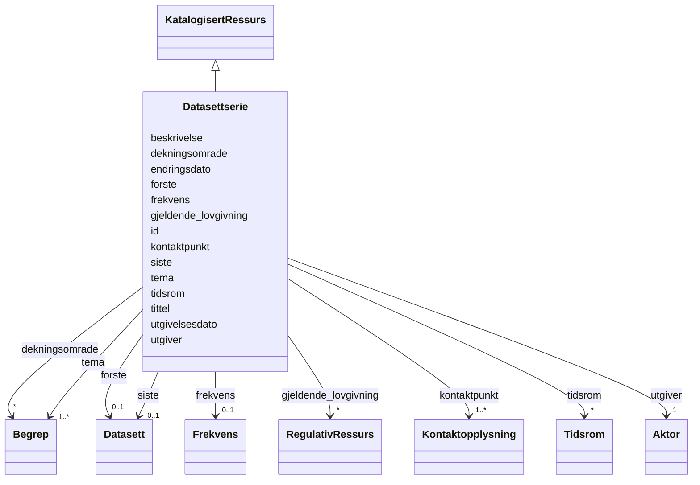

# Class: Datasettserie 


_En serie av relaterte datasett publisert separat men med felles metadata._


URI: [dcat:DatasetSeries](http://www.w3.org/ns/dcat#DatasetSeries)





## Inheritance
* [KatalogisertRessurs](KatalogisertRessurs.md)
    * **Datasettserie**


## Class Properties

| Property | Value |
| --- | --- |
| Class URI | [dcat:DatasetSeries](http://www.w3.org/ns/dcat#DatasetSeries) |


## Slots

| Name | Cardinality and Range | Description | Inheritance |
| ---  | --- | --- | --- |
| [beskrivelse](beskrivelse.md) | 1..* <br/> [LangString](LangString.md) | Fritekstbeskrivelse av ressursen | direct |
| [kontaktpunkt](kontaktpunkt.md) | 1..* <br/> [Kontaktopplysning](Kontaktopplysning.md) | Kontaktinformasjon for henvendelser om ressursen | direct |
| [tema](tema.md) | 1..* <br/> [Begrep](Begrep.md) | Tema fra et kontrollert vokabular | direct |
| [tittel](tittel.md) | 1..* <br/> [LangString](LangString.md) | Navn/tittel på ressursen | direct |
| [utgiver](utgiver.md) | 1 <br/> [Aktor](Aktor.md) | Aktøren som er ansvarlig for å tilgjengeliggjøre ressursen | direct |
| [dekningsomrade](dekningsomrade.md) | * <br/> [Begrep](Begrep.md) | Geografisk dekningsområde | direct |
| [gjeldende_lovgivning](gjeldende_lovgivning.md) | * <br/> [RegulativRessurs](RegulativRessurs.md) | Lovgivning som gjelder for ressursen | direct |
| [siste](siste.md) | 0..1 <br/> [Datasett](Datasett.md) | Siste datasett i en datasettserie | direct |
| [tidsrom](tidsrom.md) | * <br/> [Tidsrom](Tidsrom.md) | Tidsperiode ressursen dekker | direct |
| [endringsdato](endringsdato.md) | 0..1 <br/> [Date](Date.md) | Dato for siste endring av ressursen | direct |
| [frekvens](frekvens.md) | 0..1 <br/> [Frekvens](Frekvens.md) | Oppdateringsfrekvens for datasettet | direct |
| [forste](forste.md) | 0..1 <br/> [Datasett](Datasett.md) | Første datasett i en datasettserie | direct |
| [utgivelsesdato](utgivelsesdato.md) | 0..1 <br/> [Date](Date.md) | Dato ressursen ble første gang publisert | direct |
| [id](id.md) | 1 <br/> [Uriorcurie](Uriorcurie.md) | URI-identifikator for ressursen | [KatalogisertRessurs](KatalogisertRessurs.md) |


## Usages

| used by | used in | type | used |
| ---  | --- | --- | --- |
| [Container](Container.md) | [datasettprofil](datasettprofil.md) | range | [Datasettserie](Datasettserie.md) |
| [Datasett](Datasett.md) | [i_serie](i_serie.md) | range | [Datasettserie](Datasettserie.md) |


## Identifier and Mapping Information


### Schema Source


* from schema: https://data.norge.no/linkml/dcat-ap-no


## Mappings

| Mapping Type | Mapped Value |
| ---  | ---  |
| self | dcat:DatasetSeries |
| native | https://data.norge.no/linkml/dcat-ap-no/Datasettserie |


## LinkML Source

<!-- TODO: investigate https://stackoverflow.com/questions/37606292/how-to-create-tabbed-code-blocks-in-mkdocs-or-sphinx -->

### Direct

<details>
```yaml
name: Datasettserie
description: En serie av relaterte datasett publisert separat men med felles metadata.
from_schema: https://data.norge.no/linkml/dcat-ap-no
is_a: KatalogisertRessurs
slots:
- beskrivelse
- kontaktpunkt
- tema
- tittel
- utgiver
- dekningsomrade
- gjeldende_lovgivning
- siste
- tidsrom
- endringsdato
- frekvens
- forste
- utgivelsesdato
slot_usage:
  beskrivelse:
    name: beskrivelse
    in_subset:
    - Obligatorisk
    required: true
  kontaktpunkt:
    name: kontaktpunkt
    in_subset:
    - Obligatorisk
    required: true
  tema:
    name: tema
    in_subset:
    - Obligatorisk
    required: true
  tittel:
    name: tittel
    in_subset:
    - Obligatorisk
    required: true
  utgiver:
    name: utgiver
    in_subset:
    - Obligatorisk
    required: true
  dekningsomrade:
    name: dekningsomrade
    in_subset:
    - Anbefalt
  gjeldende_lovgivning:
    name: gjeldende_lovgivning
    in_subset:
    - Anbefalt
  siste:
    name: siste
    in_subset:
    - Anbefalt
  tidsrom:
    name: tidsrom
    in_subset:
    - Anbefalt
class_uri: dcat:DatasetSeries

```
</details>

### Induced

<details>
```yaml
name: Datasettserie
description: En serie av relaterte datasett publisert separat men med felles metadata.
from_schema: https://data.norge.no/linkml/dcat-ap-no
is_a: KatalogisertRessurs
slot_usage:
  beskrivelse:
    name: beskrivelse
    in_subset:
    - Obligatorisk
    required: true
  kontaktpunkt:
    name: kontaktpunkt
    in_subset:
    - Obligatorisk
    required: true
  tema:
    name: tema
    in_subset:
    - Obligatorisk
    required: true
  tittel:
    name: tittel
    in_subset:
    - Obligatorisk
    required: true
  utgiver:
    name: utgiver
    in_subset:
    - Obligatorisk
    required: true
  dekningsomrade:
    name: dekningsomrade
    in_subset:
    - Anbefalt
  gjeldende_lovgivning:
    name: gjeldende_lovgivning
    in_subset:
    - Anbefalt
  siste:
    name: siste
    in_subset:
    - Anbefalt
  tidsrom:
    name: tidsrom
    in_subset:
    - Anbefalt
attributes:
  beskrivelse:
    name: beskrivelse
    description: Fritekstbeskrivelse av ressursen.
    in_subset:
    - Obligatorisk
    from_schema: https://data.norge.no/linkml/dcat-ap-no
    rank: 1000
    slot_uri: dct:description
    alias: beskrivelse
    owner: Datasettserie
    domain_of:
    - RegulativRessurs
    - Gebyr
    - Distribusjon
    - Datasett
    - Datasettserie
    - Datatjeneste
    - Katalogpost
    - Katalog
    range: LangString
    required: true
    multivalued: true
  kontaktpunkt:
    name: kontaktpunkt
    description: Kontaktinformasjon for henvendelser om ressursen.
    in_subset:
    - Obligatorisk
    from_schema: https://data.norge.no/linkml/dcat-ap-no
    rank: 1000
    slot_uri: dcat:contactPoint
    alias: kontaktpunkt
    owner: Datasettserie
    domain_of:
    - Datasett
    - Datasettserie
    - Datatjeneste
    - Katalog
    range: Kontaktopplysning
    required: true
    multivalued: true
  tema:
    name: tema
    description: Tema fra et kontrollert vokabular.
    in_subset:
    - Obligatorisk
    from_schema: https://data.norge.no/linkml/dcat-ap-no
    rank: 1000
    slot_uri: dcat:theme
    alias: tema
    owner: Datasettserie
    domain_of:
    - Datasett
    - Datasettserie
    - Datatjeneste
    range: Begrep
    required: true
    multivalued: true
  tittel:
    name: tittel
    description: Navn/tittel på ressursen.
    in_subset:
    - Obligatorisk
    from_schema: https://data.norge.no/linkml/dcat-ap-no
    rank: 1000
    slot_uri: dct:title
    alias: tittel
    owner: Datasettserie
    domain_of:
    - Distribusjon
    - Datasett
    - Datasettserie
    - Datatjeneste
    - Katalogpost
    - Katalog
    range: LangString
    required: true
    multivalued: true
  utgiver:
    name: utgiver
    description: Aktøren som er ansvarlig for å tilgjengeliggjøre ressursen.
    in_subset:
    - Obligatorisk
    from_schema: https://data.norge.no/linkml/dcat-ap-no
    rank: 1000
    slot_uri: dct:publisher
    alias: utgiver
    owner: Datasettserie
    domain_of:
    - Datasett
    - Datasettserie
    - Datatjeneste
    - Katalog
    range: Aktor
    required: true
  dekningsomrade:
    name: dekningsomrade
    description: Geografisk dekningsområde.
    in_subset:
    - Anbefalt
    from_schema: https://data.norge.no/linkml/dcat-ap-no
    rank: 1000
    slot_uri: dct:spatial
    alias: dekningsomrade
    owner: Datasettserie
    domain_of:
    - Datasett
    - Datasettserie
    - Katalog
    range: Begrep
    multivalued: true
  gjeldende_lovgivning:
    name: gjeldende_lovgivning
    description: Lovgivning som gjelder for ressursen.
    in_subset:
    - Anbefalt
    from_schema: https://data.norge.no/linkml/dcat-ap-no
    rank: 1000
    slot_uri: dcatap:applicableLegislation
    alias: gjeldende_lovgivning
    owner: Datasettserie
    domain_of:
    - Distribusjon
    - Datasett
    - Datasettserie
    - Datatjeneste
    - Katalog
    range: RegulativRessurs
    multivalued: true
  siste:
    name: siste
    description: Siste datasett i en datasettserie.
    in_subset:
    - Anbefalt
    from_schema: https://data.norge.no/linkml/dcat-ap-no
    rank: 1000
    slot_uri: dcat:last
    alias: siste
    owner: Datasettserie
    domain_of:
    - Datasettserie
    range: Datasett
  tidsrom:
    name: tidsrom
    description: Tidsperiode ressursen dekker.
    in_subset:
    - Anbefalt
    from_schema: https://data.norge.no/linkml/dcat-ap-no
    rank: 1000
    slot_uri: dct:temporal
    alias: tidsrom
    owner: Datasettserie
    domain_of:
    - Container
    - Datasett
    - Datasettserie
    - Katalog
    range: Tidsrom
    multivalued: true
  endringsdato:
    name: endringsdato
    description: Dato for siste endring av ressursen.
    from_schema: https://data.norge.no/linkml/dcat-ap-no
    rank: 1000
    slot_uri: dct:modified
    alias: endringsdato
    owner: Datasettserie
    domain_of:
    - Distribusjon
    - Datasett
    - Datasettserie
    - Katalogpost
    - Katalog
    range: date
  frekvens:
    name: frekvens
    description: Oppdateringsfrekvens for datasettet.
    from_schema: https://data.norge.no/linkml/dcat-ap-no
    rank: 1000
    slot_uri: dct:accrualPeriodicity
    alias: frekvens
    owner: Datasettserie
    domain_of:
    - Datasettserie
    range: Frekvens
  forste:
    name: forste
    description: Første datasett i en datasettserie.
    from_schema: https://data.norge.no/linkml/dcat-ap-no
    rank: 1000
    slot_uri: dcat:first
    alias: forste
    owner: Datasettserie
    domain_of:
    - Datasettserie
    range: Datasett
  utgivelsesdato:
    name: utgivelsesdato
    description: Dato ressursen ble første gang publisert.
    from_schema: https://data.norge.no/linkml/dcat-ap-no
    rank: 1000
    slot_uri: dct:issued
    alias: utgivelsesdato
    owner: Datasettserie
    domain_of:
    - Distribusjon
    - Datasett
    - Datasettserie
    - Katalogpost
    - Katalog
    range: date
  id:
    name: id
    description: URI-identifikator for ressursen.
    from_schema: https://data.norge.no/linkml/dcat-ap-no
    rank: 1000
    identifier: true
    alias: id
    owner: Datasettserie
    domain_of:
    - Begrep
    - Begrepssamling
    - Spraak
    - Mediatype
    - Frekvens
    - ProvenanceStatement
    - OdrlPolicy
    - ProvAktivitet
    - ProvAttributering
    - Tidsinstant
    - KatalogisertRessurs
    - Aktor
    - Kontaktopplysning
    - Tidsrom
    - Standard
    - RegulativRessurs
    - Identifikator
    - Rettighetserklaring
    - Sjekksum
    - Gebyr
    - Relasjon
    - Distribusjon
    - Katalogpost
    range: uriorcurie
    required: true
class_uri: dcat:DatasetSeries

```
</details>