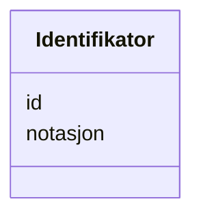

# Class: Identifikator 


_Ein alternativ identifikator for ein ressurs._


URI: [adms:Identifier](http://www.w3.org/ns/adms#Identifier)





<!-- no inheritance hierarchy -->

## Class Properties

| Property | Value |
| --- | --- |
| Class URI | [adms:Identifier](http://www.w3.org/ns/adms#Identifier) |


## Slots

| Name | Cardinality and Range | Description | Inheritance |
| ---  | --- | --- | --- |
| [id](id.md) | 1 <br/> [Uriorcurie](Uriorcurie.md) | URI-identifikator for ressursen | direct |
| [notasjon](notasjon.md) | 1 <br/> [String](String.md) | Notasjon/kode for identifikatoren | direct |


## Usages

| used by | used in | type | used |
| ---  | --- | --- | --- |
| [Container](Container.md) | [identifikatorar](identifikatorar.md) | range | [Identifikator](Identifikator.md) |
| [Datasett](Datasett.md) | [annen_identifikator](annen_identifikator.md) | range | [Identifikator](Identifikator.md) |


## Identifier and Mapping Information


### Schema Source


* from schema: https://data.norge.no/linkml/dcat-ap-no


## Mappings

| Mapping Type | Mapped Value |
| ---  | ---  |
| self | adms:Identifier |
| native | https://data.norge.no/linkml/dcat-ap-no/Identifikator |


## LinkML Source

<!-- TODO: investigate https://stackoverflow.com/questions/37606292/how-to-create-tabbed-code-blocks-in-mkdocs-or-sphinx -->

### Direct

<details>
```yaml
name: Identifikator
description: Ein alternativ identifikator for ein ressurs.
from_schema: https://data.norge.no/linkml/dcat-ap-no
slots:
- id
- notasjon
slot_usage:
  notasjon:
    name: notasjon
    in_subset:
    - Obligatorisk
    required: true
class_uri: adms:Identifier

```
</details>

### Induced

<details>
```yaml
name: Identifikator
description: Ein alternativ identifikator for ein ressurs.
from_schema: https://data.norge.no/linkml/dcat-ap-no
slot_usage:
  notasjon:
    name: notasjon
    in_subset:
    - Obligatorisk
    required: true
attributes:
  id:
    name: id
    description: URI-identifikator for ressursen.
    from_schema: https://data.norge.no/linkml/dcat-ap-no
    rank: 1000
    identifier: true
    alias: id
    owner: Identifikator
    domain_of:
    - Frekvens
    - ProvenanceStatement
    - OdrlPolicy
    - ProvAktivitet
    - ProvAttributering
    - Tidsinstant
    - KatalogisertRessurs
    - Aktor
    - Kontaktopplysning
    - Tidsrom
    - Standard
    - RegulativRessurs
    - Identifikator
    - Rettighetserklaring
    - Sjekksum
    - Gebyr
    - Relasjon
    - Distribusjon
    - Katalogpost
    - Spraak
    - Mediatype
    - Begrep
    - Begrepssamling
    range: uriorcurie
    required: true
  notasjon:
    name: notasjon
    description: Notasjon/kode for identifikatoren.
    in_subset:
    - Obligatorisk
    from_schema: https://data.norge.no/linkml/dcat-ap-no
    rank: 1000
    slot_uri: skos:notation
    alias: notasjon
    owner: Identifikator
    domain_of:
    - Identifikator
    range: string
    required: true
class_uri: adms:Identifier

```
</details>