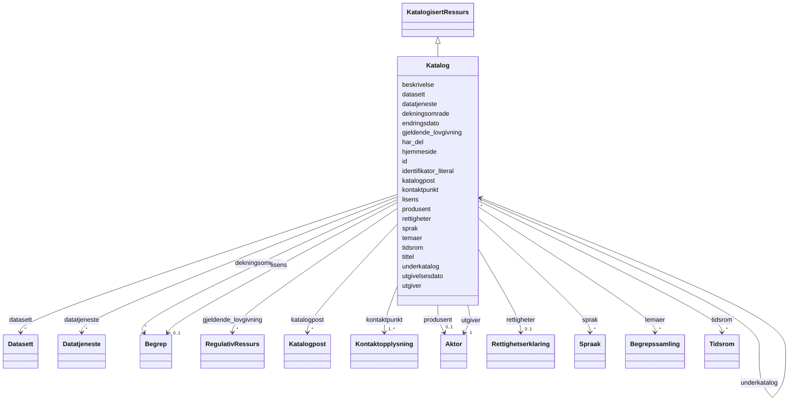

# Class: Katalog 


_En kuratert samling av metadata om datasett, datatjenester og/eller andre kataloger._


URI: [dcat:Catalog](http://www.w3.org/ns/dcat#Catalog)





## Inheritance
* [KatalogisertRessurs](KatalogisertRessurs.md)
    * **Katalog**


## Class Properties

| Property | Value |
| --- | --- |
| Class URI | [dcat:Catalog](http://www.w3.org/ns/dcat#Catalog) |


## Slots

| Name | Cardinality and Range | Description | Inheritance |
| ---  | --- | --- | --- |
| [beskrivelse](beskrivelse.md) | 1..* <br/> [LangString](LangString.md) | Fritekstbeskrivelse av ressursen | direct |
| [kontaktpunkt](kontaktpunkt.md) | 1..* <br/> [Kontaktopplysning](Kontaktopplysning.md) | Kontaktinformasjon for henvendelser om ressursen | direct |
| [tittel](tittel.md) | 1..* <br/> [LangString](LangString.md) | Navn/tittel på ressursen | direct |
| [utgiver](utgiver.md) | 1 <br/> [Aktor](Aktor.md) | Aktøren som er ansvarlig for å tilgjengeliggjøre ressursen | direct |
| [datasett](datasett.md) | * <br/> [Datasett](Datasett.md) | Datasett som er del av katalogen | direct |
| [datatjeneste](datatjeneste.md) | * <br/> [Datatjeneste](Datatjeneste.md) | Datatjeneste som er del av katalogen | direct |
| [dekningsomrade](dekningsomrade.md) | * <br/> [Begrep](Begrep.md) | Geografisk dekningsområde | direct |
| [endringsdato](endringsdato.md) | 0..1 <br/> [Date](Date.md) | Dato for siste endring av ressursen | direct |
| [hjemmeside](hjemmeside.md) | 0..1 <br/> [Uri](Uri.md) | Katalogenes hjemmeside | direct |
| [lisens](lisens.md) | 0..1 <br/> [Begrep](Begrep.md) | Lisens for bruk av ressursen | direct |
| [sprak](sprak.md) | * <br/> [Spraak](Spraak.md) | Språk brukt i ressursen | direct |
| [temaer](temaer.md) | * <br/> [Begrepssamling](Begrepssamling.md) | Temavokabular som brukes i katalogen | direct |
| [utgivelsesdato](utgivelsesdato.md) | 0..1 <br/> [Date](Date.md) | Dato ressursen ble første gang publisert | direct |
| [gjeldende_lovgivning](gjeldende_lovgivning.md) | * <br/> [RegulativRessurs](RegulativRessurs.md) | Lovgivning som gjelder for ressursen | direct |
| [har_del](har_del.md) | * <br/> [Katalog](Katalog.md) | Delkatalog inkludert i denne katalogen | direct |
| [identifikator_literal](identifikator_literal.md) | 0..1 <br/> [String](String.md) | Tekstlig identifikator for ressursen | direct |
| [underkatalog](underkatalog.md) | * <br/> [Katalog](Katalog.md) | Katalog som er en del av denne katalogen | direct |
| [katalogpost](katalogpost.md) | * <br/> [Katalogpost](Katalogpost.md) | Katalogposter i katalogen | direct |
| [produsent](produsent.md) | 0..1 <br/> [Aktor](Aktor.md) | Aktøren som primært har skapt ressursen | direct |
| [rettigheter](rettigheter.md) | 0..1 <br/> [Rettighetserklaring](Rettighetserklaring.md) | Rettigheter knyttet til ressursen | direct |
| [tidsrom](tidsrom.md) | * <br/> [Tidsrom](Tidsrom.md) | Tidsperiode ressursen dekker | direct |
| [id](id.md) | 1 <br/> [Uriorcurie](Uriorcurie.md) | URI-identifikator for ressursen | [KatalogisertRessurs](KatalogisertRessurs.md) |


## Usages

| used by | used in | type | used |
| ---  | --- | --- | --- |
| [Container](Container.md) | [katalogar](katalogar.md) | range | [Katalog](Katalog.md) |
| [Katalog](Katalog.md) | [har_del](har_del.md) | range | [Katalog](Katalog.md) |
| [Katalog](Katalog.md) | [underkatalog](underkatalog.md) | range | [Katalog](Katalog.md) |


## Identifier and Mapping Information


### Schema Source


* from schema: https://data.norge.no/linkml/dcat-ap-no


## Mappings

| Mapping Type | Mapped Value |
| ---  | ---  |
| self | dcat:Catalog |
| native | https://data.norge.no/linkml/dcat-ap-no/Katalog |


## LinkML Source

<!-- TODO: investigate https://stackoverflow.com/questions/37606292/how-to-create-tabbed-code-blocks-in-mkdocs-or-sphinx -->

### Direct

<details>
```yaml
name: Katalog
description: En kuratert samling av metadata om datasett, datatjenester og/eller andre
  kataloger.
from_schema: https://data.norge.no/linkml/dcat-ap-no
is_a: KatalogisertRessurs
slots:
- beskrivelse
- kontaktpunkt
- tittel
- utgiver
- datasett
- datatjeneste
- dekningsomrade
- endringsdato
- hjemmeside
- lisens
- sprak
- temaer
- utgivelsesdato
- gjeldende_lovgivning
- har_del
- identifikator_literal
- underkatalog
- katalogpost
- produsent
- rettigheter
- tidsrom
slot_usage:
  beskrivelse:
    name: beskrivelse
    in_subset:
    - Obligatorisk
    required: true
  kontaktpunkt:
    name: kontaktpunkt
    in_subset:
    - Obligatorisk
    required: true
  tittel:
    name: tittel
    in_subset:
    - Obligatorisk
    required: true
  utgiver:
    name: utgiver
    in_subset:
    - Obligatorisk
    required: true
  datasett:
    name: datasett
    in_subset:
    - Anbefalt
  datatjeneste:
    name: datatjeneste
    in_subset:
    - Anbefalt
  dekningsomrade:
    name: dekningsomrade
    in_subset:
    - Anbefalt
  endringsdato:
    name: endringsdato
    in_subset:
    - Anbefalt
  hjemmeside:
    name: hjemmeside
    in_subset:
    - Anbefalt
  lisens:
    name: lisens
    in_subset:
    - Anbefalt
  sprak:
    name: sprak
    in_subset:
    - Anbefalt
  temaer:
    name: temaer
    in_subset:
    - Anbefalt
  utgivelsesdato:
    name: utgivelsesdato
    in_subset:
    - Anbefalt
class_uri: dcat:Catalog

```
</details>

### Induced

<details>
```yaml
name: Katalog
description: En kuratert samling av metadata om datasett, datatjenester og/eller andre
  kataloger.
from_schema: https://data.norge.no/linkml/dcat-ap-no
is_a: KatalogisertRessurs
slot_usage:
  beskrivelse:
    name: beskrivelse
    in_subset:
    - Obligatorisk
    required: true
  kontaktpunkt:
    name: kontaktpunkt
    in_subset:
    - Obligatorisk
    required: true
  tittel:
    name: tittel
    in_subset:
    - Obligatorisk
    required: true
  utgiver:
    name: utgiver
    in_subset:
    - Obligatorisk
    required: true
  datasett:
    name: datasett
    in_subset:
    - Anbefalt
  datatjeneste:
    name: datatjeneste
    in_subset:
    - Anbefalt
  dekningsomrade:
    name: dekningsomrade
    in_subset:
    - Anbefalt
  endringsdato:
    name: endringsdato
    in_subset:
    - Anbefalt
  hjemmeside:
    name: hjemmeside
    in_subset:
    - Anbefalt
  lisens:
    name: lisens
    in_subset:
    - Anbefalt
  sprak:
    name: sprak
    in_subset:
    - Anbefalt
  temaer:
    name: temaer
    in_subset:
    - Anbefalt
  utgivelsesdato:
    name: utgivelsesdato
    in_subset:
    - Anbefalt
attributes:
  beskrivelse:
    name: beskrivelse
    description: Fritekstbeskrivelse av ressursen.
    in_subset:
    - Obligatorisk
    from_schema: https://data.norge.no/linkml/dcat-ap-no
    rank: 1000
    slot_uri: dct:description
    alias: beskrivelse
    owner: Katalog
    domain_of:
    - RegulativRessurs
    - Gebyr
    - Distribusjon
    - Datasett
    - Datasettserie
    - Datatjeneste
    - Katalogpost
    - Katalog
    range: LangString
    required: true
    multivalued: true
  kontaktpunkt:
    name: kontaktpunkt
    description: Kontaktinformasjon for henvendelser om ressursen.
    in_subset:
    - Obligatorisk
    from_schema: https://data.norge.no/linkml/dcat-ap-no
    rank: 1000
    slot_uri: dcat:contactPoint
    alias: kontaktpunkt
    owner: Katalog
    domain_of:
    - Datasett
    - Datasettserie
    - Datatjeneste
    - Katalog
    range: Kontaktopplysning
    required: true
    multivalued: true
  tittel:
    name: tittel
    description: Navn/tittel på ressursen.
    in_subset:
    - Obligatorisk
    from_schema: https://data.norge.no/linkml/dcat-ap-no
    rank: 1000
    slot_uri: dct:title
    alias: tittel
    owner: Katalog
    domain_of:
    - Distribusjon
    - Datasett
    - Datasettserie
    - Datatjeneste
    - Katalogpost
    - Katalog
    range: LangString
    required: true
    multivalued: true
  utgiver:
    name: utgiver
    description: Aktøren som er ansvarlig for å tilgjengeliggjøre ressursen.
    in_subset:
    - Obligatorisk
    from_schema: https://data.norge.no/linkml/dcat-ap-no
    rank: 1000
    slot_uri: dct:publisher
    alias: utgiver
    owner: Katalog
    domain_of:
    - Datasett
    - Datasettserie
    - Datatjeneste
    - Katalog
    range: Aktor
    required: true
  datasett:
    name: datasett
    description: Datasett som er del av katalogen.
    in_subset:
    - Anbefalt
    from_schema: https://data.norge.no/linkml/dcat-ap-no
    rank: 1000
    slot_uri: dcat:dataset
    alias: datasett
    owner: Katalog
    domain_of:
    - Container
    - Katalog
    range: Datasett
    multivalued: true
  datatjeneste:
    name: datatjeneste
    description: Datatjeneste som er del av katalogen.
    in_subset:
    - Anbefalt
    from_schema: https://data.norge.no/linkml/dcat-ap-no
    rank: 1000
    slot_uri: dcat:service
    alias: datatjeneste
    owner: Katalog
    domain_of:
    - Katalog
    range: Datatjeneste
    multivalued: true
  dekningsomrade:
    name: dekningsomrade
    description: Geografisk dekningsområde.
    in_subset:
    - Anbefalt
    from_schema: https://data.norge.no/linkml/dcat-ap-no
    rank: 1000
    slot_uri: dct:spatial
    alias: dekningsomrade
    owner: Katalog
    domain_of:
    - Datasett
    - Datasettserie
    - Katalog
    range: Begrep
    multivalued: true
  endringsdato:
    name: endringsdato
    description: Dato for siste endring av ressursen.
    in_subset:
    - Anbefalt
    from_schema: https://data.norge.no/linkml/dcat-ap-no
    rank: 1000
    slot_uri: dct:modified
    alias: endringsdato
    owner: Katalog
    domain_of:
    - Distribusjon
    - Datasett
    - Datasettserie
    - Katalogpost
    - Katalog
    range: date
  hjemmeside:
    name: hjemmeside
    description: Katalogenes hjemmeside.
    in_subset:
    - Anbefalt
    from_schema: https://data.norge.no/linkml/dcat-ap-no
    rank: 1000
    slot_uri: foaf:homepage
    alias: hjemmeside
    owner: Katalog
    domain_of:
    - Katalog
    range: uri
  lisens:
    name: lisens
    description: Lisens for bruk av ressursen.
    in_subset:
    - Anbefalt
    from_schema: https://data.norge.no/linkml/dcat-ap-no
    rank: 1000
    slot_uri: dct:license
    alias: lisens
    owner: Katalog
    domain_of:
    - Distribusjon
    - Datatjeneste
    - Katalog
    range: Begrep
  sprak:
    name: sprak
    description: Språk brukt i ressursen.
    in_subset:
    - Anbefalt
    from_schema: https://data.norge.no/linkml/dcat-ap-no
    rank: 1000
    slot_uri: dct:language
    alias: sprak
    owner: Katalog
    domain_of:
    - RegulativRessurs
    - Distribusjon
    - Datasett
    - Katalogpost
    - Katalog
    range: Spraak
    multivalued: true
  temaer:
    name: temaer
    description: Temavokabular som brukes i katalogen.
    in_subset:
    - Anbefalt
    from_schema: https://data.norge.no/linkml/dcat-ap-no
    rank: 1000
    slot_uri: dcat:themeTaxonomy
    alias: temaer
    owner: Katalog
    domain_of:
    - Katalog
    range: Begrepssamling
    multivalued: true
  utgivelsesdato:
    name: utgivelsesdato
    description: Dato ressursen ble første gang publisert.
    in_subset:
    - Anbefalt
    from_schema: https://data.norge.no/linkml/dcat-ap-no
    rank: 1000
    slot_uri: dct:issued
    alias: utgivelsesdato
    owner: Katalog
    domain_of:
    - Distribusjon
    - Datasett
    - Datasettserie
    - Katalogpost
    - Katalog
    range: date
  gjeldende_lovgivning:
    name: gjeldende_lovgivning
    description: Lovgivning som gjelder for ressursen.
    from_schema: https://data.norge.no/linkml/dcat-ap-no
    rank: 1000
    slot_uri: dcatap:applicableLegislation
    alias: gjeldende_lovgivning
    owner: Katalog
    domain_of:
    - Distribusjon
    - Datasett
    - Datasettserie
    - Datatjeneste
    - Katalog
    range: RegulativRessurs
    multivalued: true
  har_del:
    name: har_del
    description: Delkatalog inkludert i denne katalogen.
    from_schema: https://data.norge.no/linkml/dcat-ap-no
    rank: 1000
    slot_uri: dct:hasPart
    alias: har_del
    owner: Katalog
    domain_of:
    - Katalog
    range: Katalog
    multivalued: true
  identifikator_literal:
    name: identifikator_literal
    description: Tekstlig identifikator for ressursen.
    from_schema: https://data.norge.no/linkml/dcat-ap-no
    rank: 1000
    slot_uri: dct:identifier
    alias: identifikator_literal
    owner: Katalog
    domain_of:
    - Aktor
    - RegulativRessurs
    - Datasett
    - Datatjeneste
    - Katalog
    range: string
  underkatalog:
    name: underkatalog
    description: Katalog som er en del av denne katalogen.
    from_schema: https://data.norge.no/linkml/dcat-ap-no
    rank: 1000
    slot_uri: dcat:catalog
    alias: underkatalog
    owner: Katalog
    domain_of:
    - Katalog
    range: Katalog
    multivalued: true
  katalogpost:
    name: katalogpost
    description: Katalogposter i katalogen.
    from_schema: https://data.norge.no/linkml/dcat-ap-no
    rank: 1000
    slot_uri: dcat:record
    alias: katalogpost
    owner: Katalog
    domain_of:
    - Katalog
    range: Katalogpost
    multivalued: true
  produsent:
    name: produsent
    description: Aktøren som primært har skapt ressursen.
    from_schema: https://data.norge.no/linkml/dcat-ap-no
    rank: 1000
    slot_uri: dct:creator
    alias: produsent
    owner: Katalog
    domain_of:
    - Datasett
    - Katalog
    range: Aktor
  rettigheter:
    name: rettigheter
    description: Rettigheter knyttet til ressursen.
    from_schema: https://data.norge.no/linkml/dcat-ap-no
    rank: 1000
    slot_uri: dct:rights
    alias: rettigheter
    owner: Katalog
    domain_of:
    - Distribusjon
    - Datatjeneste
    - Katalog
    range: Rettighetserklaring
  tidsrom:
    name: tidsrom
    description: Tidsperiode ressursen dekker.
    from_schema: https://data.norge.no/linkml/dcat-ap-no
    rank: 1000
    slot_uri: dct:temporal
    alias: tidsrom
    owner: Katalog
    domain_of:
    - Container
    - Datasett
    - Datasettserie
    - Katalog
    range: Tidsrom
    multivalued: true
  id:
    name: id
    description: URI-identifikator for ressursen.
    from_schema: https://data.norge.no/linkml/dcat-ap-no
    rank: 1000
    identifier: true
    alias: id
    owner: Katalog
    domain_of:
    - Begrep
    - Begrepssamling
    - Spraak
    - Mediatype
    - Frekvens
    - ProvenanceStatement
    - OdrlPolicy
    - ProvAktivitet
    - ProvAttributering
    - Tidsinstant
    - KatalogisertRessurs
    - Aktor
    - Kontaktopplysning
    - Tidsrom
    - Standard
    - RegulativRessurs
    - Identifikator
    - Rettighetserklaring
    - Sjekksum
    - Gebyr
    - Relasjon
    - Distribusjon
    - Katalogpost
    range: uriorcurie
    required: true
class_uri: dcat:Catalog

```
</details>