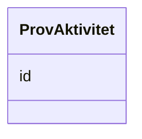

# Class: ProvAktivitet 


_En PROV-aktivitet._


URI: [prov:Activity](http://www.w3.org/ns/prov#Activity)





<!-- no inheritance hierarchy -->

## Class Properties

| Property | Value |
| --- | --- |
| Class URI | [prov:Activity](http://www.w3.org/ns/prov#Activity) |


## Slots

| Name | Cardinality and Range | Description | Inheritance |
| ---  | --- | --- | --- |
| [id](id.md) | 1 <br/> [Uriorcurie](Uriorcurie.md) | URI-identifikator for ressursen | direct |


## Usages

| used by | used in | type | used |
| ---  | --- | --- | --- |
| [Datasett](Datasett.md) | [ble_generert_ved](ble_generert_ved.md) | range | [ProvAktivitet](ProvAktivitet.md) |


## Identifier and Mapping Information


### Schema Source


* from schema: https://data.norge.no/linkml/dcat-ap-no


## Mappings

| Mapping Type | Mapped Value |
| ---  | ---  |
| self | prov:Activity |
| native | https://data.norge.no/linkml/dcat-ap-no/ProvAktivitet |


## LinkML Source

<!-- TODO: investigate https://stackoverflow.com/questions/37606292/how-to-create-tabbed-code-blocks-in-mkdocs-or-sphinx -->

### Direct

<details>
```yaml
name: ProvAktivitet
description: En PROV-aktivitet.
from_schema: https://data.norge.no/linkml/dcat-ap-no
slots:
- id
class_uri: prov:Activity

```
</details>

### Induced

<details>
```yaml
name: ProvAktivitet
description: En PROV-aktivitet.
from_schema: https://data.norge.no/linkml/dcat-ap-no
attributes:
  id:
    name: id
    description: URI-identifikator for ressursen.
    from_schema: https://data.norge.no/linkml/dcat-ap-no
    rank: 1000
    identifier: true
    alias: id
    owner: ProvAktivitet
    domain_of:
    - Begrep
    - Begrepssamling
    - Spraak
    - Mediatype
    - Frekvens
    - ProvenanceStatement
    - OdrlPolicy
    - ProvAktivitet
    - ProvAttributering
    - Tidsinstant
    - KatalogisertRessurs
    - Aktor
    - Kontaktopplysning
    - Tidsrom
    - Standard
    - RegulativRessurs
    - Identifikator
    - Rettighetserklaring
    - Sjekksum
    - Gebyr
    - Relasjon
    - Distribusjon
    - Katalogpost
    range: uriorcurie
    required: true
class_uri: prov:Activity

```
</details>