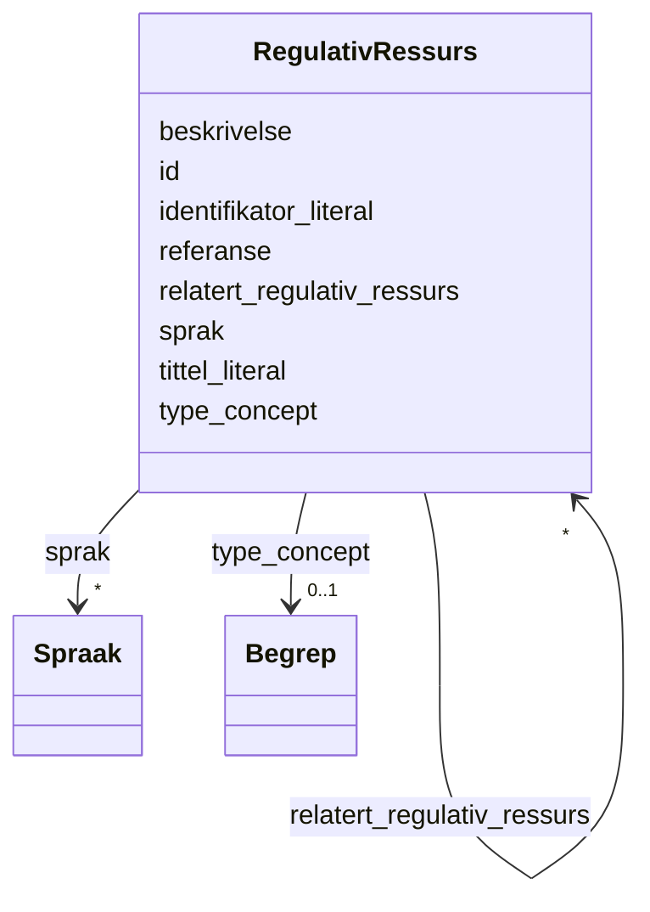

# Class: RegulativRessurs 


_En regulativ ressurs (lov, forskrift e.l.) som gjelder for en ressurs._


URI: [eli:LegalResource](http://data.europa.eu/eli/ontology#LegalResource)





<!-- no inheritance hierarchy -->

## Class Properties

| Property | Value |
| --- | --- |
| Class URI | [eli:LegalResource](http://data.europa.eu/eli/ontology#LegalResource) |


## Slots

| Name | Cardinality and Range | Description | Inheritance |
| ---  | --- | --- | --- |
| [id](id.md) | 1 <br/> [Uriorcurie](Uriorcurie.md) | URI-identifikator for ressursen | direct |
| [beskrivelse](beskrivelse.md) | * <br/> [LangString](LangString.md) | Fritekstbeskrivelse av ressursen | direct |
| [identifikator_literal](identifikator_literal.md) | 0..1 <br/> [String](String.md) | Tekstlig identifikator for ressursen | direct |
| [referanse](referanse.md) | * <br/> [Uri](Uri.md) | Referanse til ekstern ressurs | direct |
| [sprak](sprak.md) | * <br/> [Spraak](Spraak.md) | Språk brukt i ressursen | direct |
| [tittel_literal](tittel_literal.md) | * <br/> [String](String.md) | Navn/tittel uten språktag | direct |
| [type_concept](type_concept.md) | 0..1 <br/> [Begrep](Begrep.md) | Type ressurs fra et kontrollert vokabular | direct |
| [relatert_regulativ_ressurs](relatert_regulativ_ressurs.md) | * <br/> [RegulativRessurs](RegulativRessurs.md) | Relatert regulativ ressurs | direct |


## Usages

| used by | used in | type | used |
| ---  | --- | --- | --- |
| [Container](Container.md) | [regulativeRessursar](regulativeRessursar.md) | range | [RegulativRessurs](RegulativRessurs.md) |
| [RegulativRessurs](RegulativRessurs.md) | [relatert_regulativ_ressurs](relatert_regulativ_ressurs.md) | range | [RegulativRessurs](RegulativRessurs.md) |
| [Distribusjon](Distribusjon.md) | [gjeldende_lovgivning](gjeldende_lovgivning.md) | range | [RegulativRessurs](RegulativRessurs.md) |
| [Datasett](Datasett.md) | [gjeldende_lovgivning](gjeldende_lovgivning.md) | range | [RegulativRessurs](RegulativRessurs.md) |
| [Datasettserie](Datasettserie.md) | [gjeldende_lovgivning](gjeldende_lovgivning.md) | range | [RegulativRessurs](RegulativRessurs.md) |
| [Datatjeneste](Datatjeneste.md) | [gjeldende_lovgivning](gjeldende_lovgivning.md) | range | [RegulativRessurs](RegulativRessurs.md) |
| [Katalog](Katalog.md) | [gjeldende_lovgivning](gjeldende_lovgivning.md) | range | [RegulativRessurs](RegulativRessurs.md) |


## Identifier and Mapping Information


### Schema Source


* from schema: https://data.norge.no/linkml/dcat-ap-no


## Mappings

| Mapping Type | Mapped Value |
| ---  | ---  |
| self | eli:LegalResource |
| native | https://data.norge.no/linkml/dcat-ap-no/RegulativRessurs |


## LinkML Source

<!-- TODO: investigate https://stackoverflow.com/questions/37606292/how-to-create-tabbed-code-blocks-in-mkdocs-or-sphinx -->

### Direct

<details>
```yaml
name: RegulativRessurs
description: En regulativ ressurs (lov, forskrift e.l.) som gjelder for en ressurs.
from_schema: https://data.norge.no/linkml/dcat-ap-no
slots:
- id
- beskrivelse
- identifikator_literal
- referanse
- sprak
- tittel_literal
- type_concept
- relatert_regulativ_ressurs
class_uri: eli:LegalResource

```
</details>

### Induced

<details>
```yaml
name: RegulativRessurs
description: En regulativ ressurs (lov, forskrift e.l.) som gjelder for en ressurs.
from_schema: https://data.norge.no/linkml/dcat-ap-no
attributes:
  id:
    name: id
    description: URI-identifikator for ressursen.
    from_schema: https://data.norge.no/linkml/dcat-ap-no
    rank: 1000
    identifier: true
    alias: id
    owner: RegulativRessurs
    domain_of:
    - Begrep
    - Begrepssamling
    - Spraak
    - Mediatype
    - Frekvens
    - ProvenanceStatement
    - OdrlPolicy
    - ProvAktivitet
    - ProvAttributering
    - Tidsinstant
    - KatalogisertRessurs
    - Aktor
    - Kontaktopplysning
    - Tidsrom
    - Standard
    - RegulativRessurs
    - Identifikator
    - Rettighetserklaring
    - Sjekksum
    - Gebyr
    - Relasjon
    - Distribusjon
    - Katalogpost
    range: uriorcurie
    required: true
  beskrivelse:
    name: beskrivelse
    description: Fritekstbeskrivelse av ressursen.
    from_schema: https://data.norge.no/linkml/dcat-ap-no
    rank: 1000
    slot_uri: dct:description
    alias: beskrivelse
    owner: RegulativRessurs
    domain_of:
    - RegulativRessurs
    - Gebyr
    - Distribusjon
    - Datasett
    - Datasettserie
    - Datatjeneste
    - Katalogpost
    - Katalog
    range: LangString
    multivalued: true
  identifikator_literal:
    name: identifikator_literal
    description: Tekstlig identifikator for ressursen.
    from_schema: https://data.norge.no/linkml/dcat-ap-no
    rank: 1000
    slot_uri: dct:identifier
    alias: identifikator_literal
    owner: RegulativRessurs
    domain_of:
    - Aktor
    - RegulativRessurs
    - Datasett
    - Datatjeneste
    - Katalog
    range: string
  referanse:
    name: referanse
    description: Referanse til ekstern ressurs.
    from_schema: https://data.norge.no/linkml/dcat-ap-no
    rank: 1000
    slot_uri: rdfs:seeAlso
    alias: referanse
    owner: RegulativRessurs
    domain_of:
    - RegulativRessurs
    range: uri
    multivalued: true
  sprak:
    name: sprak
    description: Språk brukt i ressursen.
    from_schema: https://data.norge.no/linkml/dcat-ap-no
    rank: 1000
    slot_uri: dct:language
    alias: sprak
    owner: RegulativRessurs
    domain_of:
    - RegulativRessurs
    - Distribusjon
    - Datasett
    - Katalogpost
    - Katalog
    range: Spraak
    multivalued: true
  tittel_literal:
    name: tittel_literal
    description: Navn/tittel uten språktag.
    from_schema: https://data.norge.no/linkml/dcat-ap-no
    rank: 1000
    slot_uri: dct:title
    alias: tittel_literal
    owner: RegulativRessurs
    domain_of:
    - Standard
    - RegulativRessurs
    range: string
    multivalued: true
  type_concept:
    name: type_concept
    description: Type ressurs fra et kontrollert vokabular.
    from_schema: https://data.norge.no/linkml/dcat-ap-no
    rank: 1000
    slot_uri: dct:type
    alias: type_concept
    owner: RegulativRessurs
    domain_of:
    - Aktor
    - RegulativRessurs
    - Datasett
    range: Begrep
  relatert_regulativ_ressurs:
    name: relatert_regulativ_ressurs
    description: Relatert regulativ ressurs.
    from_schema: https://data.norge.no/linkml/dcat-ap-no
    rank: 1000
    slot_uri: dct:relation
    alias: relatert_regulativ_ressurs
    owner: RegulativRessurs
    domain_of:
    - RegulativRessurs
    range: RegulativRessurs
    multivalued: true
class_uri: eli:LegalResource

```
</details>