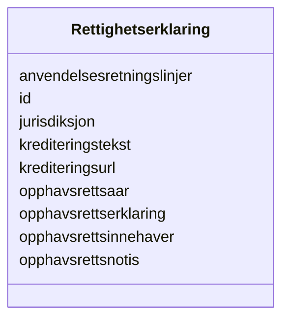

# Class: Rettighetserklaring 


_Ei erklæring om rettar til ein ressurs (ODRS)._


URI: [dct:RightsStatement](http://purl.org/dc/terms/RightsStatement)





<!-- no inheritance hierarchy -->

## Class Properties

| Property | Value |
| --- | --- |
| Class URI | [dct:RightsStatement](http://purl.org/dc/terms/RightsStatement) |


## Slots

| Name | Cardinality and Range | Description | Inheritance |
| ---  | --- | --- | --- |
| [id](id.md) | 1 <br/> [Uriorcurie](Uriorcurie.md) | URI-identifikator for ressursen | direct |
| [anvendelsesretningslinjer](anvendelsesretningslinjer.md) | 0..1 <br/> [String](String.md) | Retningslinjer for gjenbruk av data | direct |
| [jurisdiksjon](jurisdiksjon.md) | 0..1 <br/> [String](String.md) | Jurisdiksjon for rettigheitserklæringa | direct |
| [krediteringstekst](krediteringstekst.md) | 0..1 <br/> [String](String.md) | Tekst som skal brukast ved kreditering | direct |
| [krediteringsurl](krediteringsurl.md) | 0..1 <br/> [Uri](Uri.md) | URL for kreditering av rettshavar | direct |
| [opphavsrettserklaring](opphavsrettserklaring.md) | 0..1 <br/> [String](String.md) | Opphavsrettserklæring | direct |
| [opphavsrettsinnehaver](opphavsrettsinnehaver.md) | 0..1 <br/> [String](String.md) | Namn på opphavsrettsinnehavar | direct |
| [opphavsrettsnotis](opphavsrettsnotis.md) | 0..1 <br/> [String](String.md) | Opphavsrettsnotis | direct |
| [opphavsrettsaar](opphavsrettsaar.md) | 0..1 <br/> [GYear](GYear.md) | Årstal for opphavsrett | direct |


## Usages

| used by | used in | type | used |
| ---  | --- | --- | --- |
| [Container](Container.md) | [rettigheitserklaringar](rettigheitserklaringar.md) | range | [Rettighetserklaring](Rettighetserklaring.md) |
| [Distribusjon](Distribusjon.md) | [rettigheter](rettigheter.md) | range | [Rettighetserklaring](Rettighetserklaring.md) |
| [Datasett](Datasett.md) | [tilgangsrettigheter](tilgangsrettigheter.md) | range | [Rettighetserklaring](Rettighetserklaring.md) |
| [Datatjeneste](Datatjeneste.md) | [rettigheter](rettigheter.md) | range | [Rettighetserklaring](Rettighetserklaring.md) |
| [Datatjeneste](Datatjeneste.md) | [tilgangsrettigheter](tilgangsrettigheter.md) | range | [Rettighetserklaring](Rettighetserklaring.md) |
| [Katalog](Katalog.md) | [rettigheter](rettigheter.md) | range | [Rettighetserklaring](Rettighetserklaring.md) |


## Identifier and Mapping Information


### Schema Source


* from schema: https://data.norge.no/linkml/dcat-ap-no


## Mappings

| Mapping Type | Mapped Value |
| ---  | ---  |
| self | dct:RightsStatement |
| native | https://data.norge.no/linkml/dcat-ap-no/Rettighetserklaring |


## LinkML Source

<!-- TODO: investigate https://stackoverflow.com/questions/37606292/how-to-create-tabbed-code-blocks-in-mkdocs-or-sphinx -->

### Direct

<details>
```yaml
name: Rettighetserklaring
description: Ei erklæring om rettar til ein ressurs (ODRS).
from_schema: https://data.norge.no/linkml/dcat-ap-no
slots:
- id
- anvendelsesretningslinjer
- jurisdiksjon
- krediteringstekst
- krediteringsurl
- opphavsrettserklaring
- opphavsrettsinnehaver
- opphavsrettsnotis
- opphavsrettsaar
class_uri: dct:RightsStatement

```
</details>

### Induced

<details>
```yaml
name: Rettighetserklaring
description: Ei erklæring om rettar til ein ressurs (ODRS).
from_schema: https://data.norge.no/linkml/dcat-ap-no
attributes:
  id:
    name: id
    description: URI-identifikator for ressursen.
    from_schema: https://data.norge.no/linkml/dcat-ap-no
    rank: 1000
    identifier: true
    alias: id
    owner: Rettighetserklaring
    domain_of:
    - Frekvens
    - ProvenanceStatement
    - OdrlPolicy
    - ProvAktivitet
    - ProvAttributering
    - Tidsinstant
    - KatalogisertRessurs
    - Aktor
    - Kontaktopplysning
    - Tidsrom
    - Standard
    - RegulativRessurs
    - Identifikator
    - Rettighetserklaring
    - Sjekksum
    - Gebyr
    - Relasjon
    - Distribusjon
    - Katalogpost
    - Spraak
    - Mediatype
    - Begrep
    - Begrepssamling
    range: uriorcurie
    required: true
  anvendelsesretningslinjer:
    name: anvendelsesretningslinjer
    description: Retningslinjer for gjenbruk av data.
    from_schema: https://data.norge.no/linkml/dcat-ap-no
    rank: 1000
    slot_uri: odrs:reuserGuidelines
    alias: anvendelsesretningslinjer
    owner: Rettighetserklaring
    domain_of:
    - Rettighetserklaring
    range: string
  jurisdiksjon:
    name: jurisdiksjon
    description: Jurisdiksjon for rettigheitserklæringa.
    from_schema: https://data.norge.no/linkml/dcat-ap-no
    rank: 1000
    slot_uri: odrs:jurisdiction
    alias: jurisdiksjon
    owner: Rettighetserklaring
    domain_of:
    - Rettighetserklaring
    range: string
  krediteringstekst:
    name: krediteringstekst
    description: Tekst som skal brukast ved kreditering.
    from_schema: https://data.norge.no/linkml/dcat-ap-no
    rank: 1000
    slot_uri: odrs:attributionText
    alias: krediteringstekst
    owner: Rettighetserklaring
    domain_of:
    - Rettighetserklaring
    range: string
  krediteringsurl:
    name: krediteringsurl
    description: URL for kreditering av rettshavar.
    from_schema: https://data.norge.no/linkml/dcat-ap-no
    rank: 1000
    slot_uri: odrs:attributionURL
    alias: krediteringsurl
    owner: Rettighetserklaring
    domain_of:
    - Rettighetserklaring
    range: uri
  opphavsrettserklaring:
    name: opphavsrettserklaring
    description: Opphavsrettserklæring.
    from_schema: https://data.norge.no/linkml/dcat-ap-no
    rank: 1000
    slot_uri: odrs:copyrightStatement
    alias: opphavsrettserklaring
    owner: Rettighetserklaring
    domain_of:
    - Rettighetserklaring
    range: string
  opphavsrettsinnehaver:
    name: opphavsrettsinnehaver
    description: Namn på opphavsrettsinnehavar.
    from_schema: https://data.norge.no/linkml/dcat-ap-no
    rank: 1000
    slot_uri: odrs:copyrightHolder
    alias: opphavsrettsinnehaver
    owner: Rettighetserklaring
    domain_of:
    - Rettighetserklaring
    range: string
  opphavsrettsnotis:
    name: opphavsrettsnotis
    description: Opphavsrettsnotis.
    from_schema: https://data.norge.no/linkml/dcat-ap-no
    rank: 1000
    slot_uri: odrs:copyrightNotice
    alias: opphavsrettsnotis
    owner: Rettighetserklaring
    domain_of:
    - Rettighetserklaring
    range: string
  opphavsrettsaar:
    name: opphavsrettsaar
    description: Årstal for opphavsrett.
    from_schema: https://data.norge.no/linkml/dcat-ap-no
    rank: 1000
    slot_uri: odrs:copyrightYear
    alias: opphavsrettsaar
    owner: Rettighetserklaring
    domain_of:
    - Rettighetserklaring
    range: GYear
class_uri: dct:RightsStatement

```
</details>