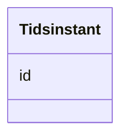

# Class: Tidsinstant 


_Et tidspunkt (OWL Time)._


URI: [time:Instant](http://www.w3.org/2006/time#Instant)





<!-- no inheritance hierarchy -->

## Class Properties

| Property | Value |
| --- | --- |
| Class URI | [time:Instant](http://www.w3.org/2006/time#Instant) |


## Slots

| Name | Cardinality and Range | Description | Inheritance |
| ---  | --- | --- | --- |
| [id](id.md) | 1 <br/> [Uriorcurie](Uriorcurie.md) | URI-identifikator for ressursen | direct |


## Usages

| used by | used in | type | used |
| ---  | --- | --- | --- |
| [Tidsrom](Tidsrom.md) | [begynnelse](begynnelse.md) | range | [Tidsinstant](Tidsinstant.md) |
| [Tidsrom](Tidsrom.md) | [slutt](slutt.md) | range | [Tidsinstant](Tidsinstant.md) |


## Identifier and Mapping Information


### Schema Source


* from schema: https://data.norge.no/linkml/dcat-ap-no


## Mappings

| Mapping Type | Mapped Value |
| ---  | ---  |
| self | time:Instant |
| native | https://data.norge.no/linkml/dcat-ap-no/Tidsinstant |


## LinkML Source

<!-- TODO: investigate https://stackoverflow.com/questions/37606292/how-to-create-tabbed-code-blocks-in-mkdocs-or-sphinx -->

### Direct

<details>
```yaml
name: Tidsinstant
description: Et tidspunkt (OWL Time).
from_schema: https://data.norge.no/linkml/dcat-ap-no
slots:
- id
class_uri: time:Instant

```
</details>

### Induced

<details>
```yaml
name: Tidsinstant
description: Et tidspunkt (OWL Time).
from_schema: https://data.norge.no/linkml/dcat-ap-no
attributes:
  id:
    name: id
    description: URI-identifikator for ressursen.
    from_schema: https://data.norge.no/linkml/dcat-ap-no
    rank: 1000
    identifier: true
    alias: id
    owner: Tidsinstant
    domain_of:
    - Begrep
    - Begrepssamling
    - Spraak
    - Mediatype
    - Frekvens
    - ProvenanceStatement
    - OdrlPolicy
    - ProvAktivitet
    - ProvAttributering
    - Tidsinstant
    - KatalogisertRessurs
    - Aktor
    - Kontaktopplysning
    - Tidsrom
    - Standard
    - RegulativRessurs
    - Identifikator
    - Rettighetserklaring
    - Sjekksum
    - Gebyr
    - Relasjon
    - Distribusjon
    - Katalogpost
    range: uriorcurie
    required: true
class_uri: time:Instant

```
</details>