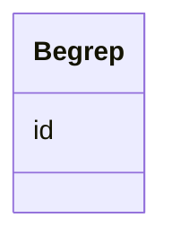

# Class: Begrep 


_Eit SKOS-omgrep frå eit kontrollert vokabular._


URI: [skos:Concept](http://www.w3.org/2004/02/skos/core#Concept)





<!-- no inheritance hierarchy -->

## Class Properties

| Property | Value |
| --- | --- |
| Class URI | [skos:Concept](http://www.w3.org/2004/02/skos/core#Concept) |


## Eigenskapar


  
  


  
  


  
  


  
  
  
  
    
  


### Andre

| Namn | Kardinalitet og domene | Beskriving |
| --- | --- | --- |
| [id](id.md) | 1 <br/> [Uriorcurie](Uriorcurie.md) | URI-identifikator for ressursen |


## Identifier and Mapping Information


### Schema Source


* from schema: https://data.norge.no/linkml/dqv-ap-no


## Mappings

| Mapping Type | Mapped Value |
| ---  | ---  |
| self | skos:Concept |
| native | https://data.norge.no/linkml/dqv-ap-no/Begrep |


## LinkML Source

<!-- TODO: investigate https://stackoverflow.com/questions/37606292/how-to-create-tabbed-code-blocks-in-mkdocs-or-sphinx -->

### Direct

<details>
```yaml
name: Begrep
description: Eit SKOS-omgrep frå eit kontrollert vokabular.
from_schema: https://data.norge.no/linkml/dqv-ap-no
slots:
- id
class_uri: skos:Concept

```
</details>

### Induced

<details>
```yaml
name: Begrep
description: Eit SKOS-omgrep frå eit kontrollert vokabular.
from_schema: https://data.norge.no/linkml/dqv-ap-no
attributes:
  id:
    name: id
    description: URI-identifikator for ressursen.
    from_schema: https://data.norge.no/linkml/dqv-ap-no
    rank: 1000
    identifier: true
    alias: id
    owner: Begrep
    domain_of:
    - DcatRessurs
    - Datasett
    - Kvalitetsdimensjon
    - Kvalitetsmaal
    - Kvalitetsmerknad
    - Kvalitetsmaaling
    - Standard
    - Tekstdel
    - Motivasjon
    - Spraak
    - Mediatype
    - Begrep
    - Begrepssamling
    range: uriorcurie
    required: true
class_uri: skos:Concept

```
</details>