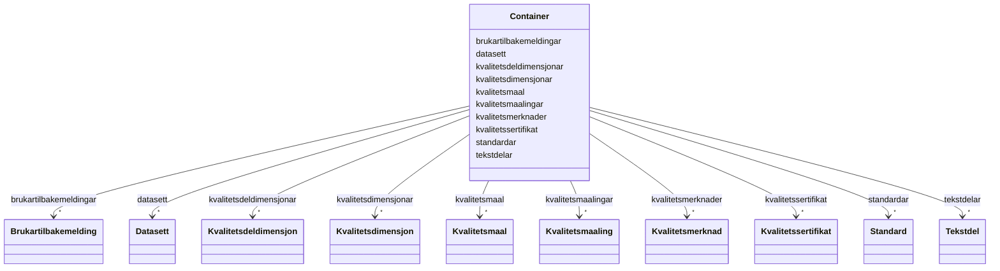

# Class: Container 


_Rotklasse for DQV-AP-NO-datafiler. Held flate lister av alle instansierbare klassar; referansar mellom objekta brukar URI-lenking._


URI: [https://data.norge.no/linkml/dqv-ap-no/Container](https://data.norge.no/linkml/dqv-ap-no/Container)





<!-- no inheritance hierarchy -->

## Class Properties

| Property | Value |
| --- | --- |
| Tree Root | Yes |


## Eigenskapar


  
  

  
  

  
  

  
  

  
  

  
  

  
  

  
  

  
  

  
  


  
  

  
  

  
  

  
  

  
  

  
  

  
  

  
  

  
  

  
  


  
  

  
  

  
  

  
  

  
  

  
  

  
  

  
  

  
  

  
  


  
  
  
  
    
  

  
  
  
  
    
  

  
  
  
  
    
  

  
  
  
  
    
  

  
  
  
  
    
  

  
  
  
  
    
  

  
  
  
  
    
  

  
  
  
  
    
  

  
  
  
  
    
  

  
  
  
  
    
  


### Andre

| Namn | Kardinalitet og domene | Beskriving |
| --- | --- | --- |
| [datasett](datasett.md) | * <br/> [Datasett](Datasett.md) |  |
| [kvalitetsdimensjonar](kvalitetsdimensjonar.md) | * <br/> [Kvalitetsdimensjon](Kvalitetsdimensjon.md) |  |
| [kvalitetsdeldimensjonar](kvalitetsdeldimensjonar.md) | * <br/> [Kvalitetsdeldimensjon](Kvalitetsdeldimensjon.md) |  |
| [kvalitetsmaal](kvalitetsmaal.md) | * <br/> [Kvalitetsmaal](Kvalitetsmaal.md) |  |
| [kvalitetsmerknader](kvalitetsmerknader.md) | * <br/> [Kvalitetsmerknad](Kvalitetsmerknad.md) |  |
| [brukartilbakemeldingar](brukartilbakemeldingar.md) | * <br/> [Brukartilbakemelding](Brukartilbakemelding.md) |  |
| [kvalitetssertifikat](kvalitetssertifikat.md) | * <br/> [Kvalitetssertifikat](Kvalitetssertifikat.md) |  |
| [kvalitetsmaalingar](kvalitetsmaalingar.md) | * <br/> [Kvalitetsmaaling](Kvalitetsmaaling.md) |  |
| [standardar](standardar.md) | * <br/> [Standard](Standard.md) |  |
| [tekstdelar](tekstdelar.md) | * <br/> [Tekstdel](Tekstdel.md) |  |


## Identifier and Mapping Information


### Schema Source


* from schema: https://data.norge.no/linkml/dqv-ap-no


## Mappings

| Mapping Type | Mapped Value |
| ---  | ---  |
| self | https://data.norge.no/linkml/dqv-ap-no/Container |
| native | https://data.norge.no/linkml/dqv-ap-no/Container |


## LinkML Source

<!-- TODO: investigate https://stackoverflow.com/questions/37606292/how-to-create-tabbed-code-blocks-in-mkdocs-or-sphinx -->

### Direct

<details>
```yaml
name: Container
description: Rotklasse for DQV-AP-NO-datafiler. Held flate lister av alle instansierbare
  klassar; referansar mellom objekta brukar URI-lenking.
from_schema: https://data.norge.no/linkml/dqv-ap-no
attributes:
  datasett:
    name: datasett
    from_schema: https://data.norge.no/linkml/dqv-ap-no
    rank: 1000
    domain_of:
    - Container
    range: Datasett
    multivalued: true
    inlined: true
    inlined_as_list: true
  kvalitetsdimensjonar:
    name: kvalitetsdimensjonar
    from_schema: https://data.norge.no/linkml/dqv-ap-no
    rank: 1000
    domain_of:
    - Container
    range: Kvalitetsdimensjon
    multivalued: true
    inlined: true
    inlined_as_list: true
  kvalitetsdeldimensjonar:
    name: kvalitetsdeldimensjonar
    from_schema: https://data.norge.no/linkml/dqv-ap-no
    rank: 1000
    domain_of:
    - Container
    range: Kvalitetsdeldimensjon
    multivalued: true
    inlined: true
    inlined_as_list: true
  kvalitetsmaal:
    name: kvalitetsmaal
    from_schema: https://data.norge.no/linkml/dqv-ap-no
    rank: 1000
    domain_of:
    - Container
    range: Kvalitetsmaal
    multivalued: true
    inlined: true
    inlined_as_list: true
  kvalitetsmerknader:
    name: kvalitetsmerknader
    from_schema: https://data.norge.no/linkml/dqv-ap-no
    rank: 1000
    domain_of:
    - Container
    range: Kvalitetsmerknad
    multivalued: true
    inlined: true
    inlined_as_list: true
  brukartilbakemeldingar:
    name: brukartilbakemeldingar
    from_schema: https://data.norge.no/linkml/dqv-ap-no
    rank: 1000
    domain_of:
    - Container
    range: Brukartilbakemelding
    multivalued: true
    inlined: true
    inlined_as_list: true
  kvalitetssertifikat:
    name: kvalitetssertifikat
    from_schema: https://data.norge.no/linkml/dqv-ap-no
    rank: 1000
    domain_of:
    - Container
    range: Kvalitetssertifikat
    multivalued: true
    inlined: true
    inlined_as_list: true
  kvalitetsmaalingar:
    name: kvalitetsmaalingar
    from_schema: https://data.norge.no/linkml/dqv-ap-no
    rank: 1000
    domain_of:
    - Container
    range: Kvalitetsmaaling
    multivalued: true
    inlined: true
    inlined_as_list: true
  standardar:
    name: standardar
    from_schema: https://data.norge.no/linkml/dqv-ap-no
    rank: 1000
    domain_of:
    - Container
    range: Standard
    multivalued: true
    inlined: true
    inlined_as_list: true
  tekstdelar:
    name: tekstdelar
    from_schema: https://data.norge.no/linkml/dqv-ap-no
    rank: 1000
    domain_of:
    - Container
    range: Tekstdel
    multivalued: true
    inlined: true
    inlined_as_list: true
tree_root: true

```
</details>

### Induced

<details>
```yaml
name: Container
description: Rotklasse for DQV-AP-NO-datafiler. Held flate lister av alle instansierbare
  klassar; referansar mellom objekta brukar URI-lenking.
from_schema: https://data.norge.no/linkml/dqv-ap-no
attributes:
  datasett:
    name: datasett
    from_schema: https://data.norge.no/linkml/dqv-ap-no
    rank: 1000
    alias: datasett
    owner: Container
    domain_of:
    - Container
    range: Datasett
    multivalued: true
    inlined_as_list: true
  kvalitetsdimensjonar:
    name: kvalitetsdimensjonar
    from_schema: https://data.norge.no/linkml/dqv-ap-no
    rank: 1000
    alias: kvalitetsdimensjonar
    owner: Container
    domain_of:
    - Container
    range: Kvalitetsdimensjon
    multivalued: true
    inlined_as_list: true
  kvalitetsdeldimensjonar:
    name: kvalitetsdeldimensjonar
    from_schema: https://data.norge.no/linkml/dqv-ap-no
    rank: 1000
    alias: kvalitetsdeldimensjonar
    owner: Container
    domain_of:
    - Container
    range: Kvalitetsdeldimensjon
    multivalued: true
    inlined_as_list: true
  kvalitetsmaal:
    name: kvalitetsmaal
    from_schema: https://data.norge.no/linkml/dqv-ap-no
    rank: 1000
    alias: kvalitetsmaal
    owner: Container
    domain_of:
    - Container
    range: Kvalitetsmaal
    multivalued: true
    inlined_as_list: true
  kvalitetsmerknader:
    name: kvalitetsmerknader
    from_schema: https://data.norge.no/linkml/dqv-ap-no
    rank: 1000
    alias: kvalitetsmerknader
    owner: Container
    domain_of:
    - Container
    range: Kvalitetsmerknad
    multivalued: true
    inlined_as_list: true
  brukartilbakemeldingar:
    name: brukartilbakemeldingar
    from_schema: https://data.norge.no/linkml/dqv-ap-no
    rank: 1000
    alias: brukartilbakemeldingar
    owner: Container
    domain_of:
    - Container
    range: Brukartilbakemelding
    multivalued: true
    inlined_as_list: true
  kvalitetssertifikat:
    name: kvalitetssertifikat
    from_schema: https://data.norge.no/linkml/dqv-ap-no
    rank: 1000
    alias: kvalitetssertifikat
    owner: Container
    domain_of:
    - Container
    range: Kvalitetssertifikat
    multivalued: true
    inlined_as_list: true
  kvalitetsmaalingar:
    name: kvalitetsmaalingar
    from_schema: https://data.norge.no/linkml/dqv-ap-no
    rank: 1000
    alias: kvalitetsmaalingar
    owner: Container
    domain_of:
    - Container
    range: Kvalitetsmaaling
    multivalued: true
    inlined_as_list: true
  standardar:
    name: standardar
    from_schema: https://data.norge.no/linkml/dqv-ap-no
    rank: 1000
    alias: standardar
    owner: Container
    domain_of:
    - Container
    range: Standard
    multivalued: true
    inlined_as_list: true
  tekstdelar:
    name: tekstdelar
    from_schema: https://data.norge.no/linkml/dqv-ap-no
    rank: 1000
    alias: tekstdelar
    owner: Container
    domain_of:
    - Container
    range: Tekstdel
    multivalued: true
    inlined_as_list: true
tree_root: true

```
</details>