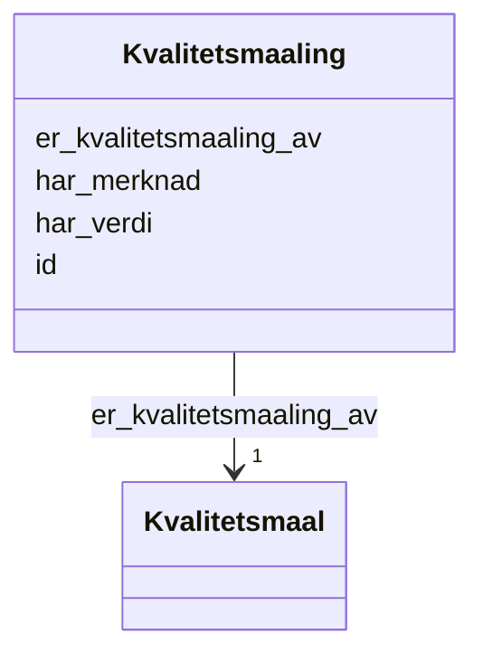

# Class: Kvalitetsmaaling 


_Ei konkret måling av eit kvalitetsmål for eit datasett._


URI: [dqv:QualityMeasurement](http://www.w3.org/ns/dqv#QualityMeasurement)





<!-- no inheritance hierarchy -->

## Class Properties

| Property | Value |
| --- | --- |
| Class URI | [dqv:QualityMeasurement](http://www.w3.org/ns/dqv#QualityMeasurement) |


## Eigenskapar


  
  

  
  
    
  

  
  

  
  


### Obligatorisk

| Namn | Kardinalitet og domene | Beskriving |
| --- | --- | --- |
| [er_kvalitetsmaaling_av](er_kvalitetsmaaling_av.md) | 1 <br/> [Kvalitetsmaal](Kvalitetsmaal.md) | Kvalitetsmålet denne målinga er ei måling av |


  
  

  
  

  
  
    
  

  
  


### Anbefalt

| Namn | Kardinalitet og domene | Beskriving |
| --- | --- | --- |
| [har_verdi](har_verdi.md) | 0..1 <br/> [String](String.md) | Målt verdi (xsd:boolean, xsd:double, xsd:nonNegativeInteger eller rdfs:Litera... |


  
  

  
  

  
  

  
  
    
  


### Valgfri

| Namn | Kardinalitet og domene | Beskriving |
| --- | --- | --- |
| [har_merknad](har_merknad.md) | * <br/> [LangString](LangString.md) | Fritekstmerknad (rdfs:comment) |


  
  
  
  
    
  

  
  
  
    
      
    
      
    
      
    
  
  

  
  
  
    
      
    
      
    
      
    
  
  

  
  
  
    
      
    
      
    
      
    
  
  


### Andre

| Namn | Kardinalitet og domene | Beskriving |
| --- | --- | --- |
| [id](id.md) | 1 <br/> [Uriorcurie](Uriorcurie.md) | URI-identifikator for ressursen |


## Usages

| used by | used in | type | used |
| ---  | --- | --- | --- |
| [Container](Container.md) | [kvalitetsmaalingar](kvalitetsmaalingar.md) | range | [Kvalitetsmaaling](Kvalitetsmaaling.md) |
| [Datasett](Datasett.md) | [har_kvalitetsmaaling](har_kvalitetsmaaling.md) | range | [Kvalitetsmaaling](Kvalitetsmaaling.md) |


## Identifier and Mapping Information


### Schema Source


* from schema: https://data.norge.no/linkml/dqv-ap-no


## Mappings

| Mapping Type | Mapped Value |
| ---  | ---  |
| self | dqv:QualityMeasurement |
| native | https://data.norge.no/linkml/dqv-ap-no/Kvalitetsmaaling |


## LinkML Source

<!-- TODO: investigate https://stackoverflow.com/questions/37606292/how-to-create-tabbed-code-blocks-in-mkdocs-or-sphinx -->

### Direct

<details>
```yaml
name: Kvalitetsmaaling
description: Ei konkret måling av eit kvalitetsmål for eit datasett.
from_schema: https://data.norge.no/linkml/dqv-ap-no
slots:
- id
- er_kvalitetsmaaling_av
- har_verdi
- har_merknad
slot_usage:
  er_kvalitetsmaaling_av:
    name: er_kvalitetsmaaling_av
    in_subset:
    - Obligatorisk
    required: true
  har_verdi:
    name: har_verdi
    in_subset:
    - Anbefalt
  har_merknad:
    name: har_merknad
    in_subset:
    - Valgfri
class_uri: dqv:QualityMeasurement

```
</details>

### Induced

<details>
```yaml
name: Kvalitetsmaaling
description: Ei konkret måling av eit kvalitetsmål for eit datasett.
from_schema: https://data.norge.no/linkml/dqv-ap-no
slot_usage:
  er_kvalitetsmaaling_av:
    name: er_kvalitetsmaaling_av
    in_subset:
    - Obligatorisk
    required: true
  har_verdi:
    name: har_verdi
    in_subset:
    - Anbefalt
  har_merknad:
    name: har_merknad
    in_subset:
    - Valgfri
attributes:
  id:
    name: id
    description: URI-identifikator for ressursen.
    from_schema: https://data.norge.no/linkml/dqv-ap-no
    rank: 1000
    identifier: true
    alias: id
    owner: Kvalitetsmaaling
    domain_of:
    - DcatRessurs
    - Datasett
    - Kvalitetsdimensjon
    - Kvalitetsmaal
    - Kvalitetsmerknad
    - Kvalitetsmaaling
    - Standard
    - Tekstdel
    - Motivasjon
    - Spraak
    - Mediatype
    - Begrep
    - Begrepssamling
    range: uriorcurie
    required: true
  er_kvalitetsmaaling_av:
    name: er_kvalitetsmaaling_av
    description: Kvalitetsmålet denne målinga er ei måling av.
    in_subset:
    - Obligatorisk
    from_schema: https://data.norge.no/linkml/dqv-ap-no
    rank: 1000
    slot_uri: dqv:isMeasurementOf
    alias: er_kvalitetsmaaling_av
    owner: Kvalitetsmaaling
    domain_of:
    - Kvalitetsmaaling
    range: Kvalitetsmaal
    required: true
  har_verdi:
    name: har_verdi
    description: Målt verdi (xsd:boolean, xsd:double, xsd:nonNegativeInteger eller
      rdfs:Literal avhengig av kvalitetsmålet).
    in_subset:
    - Anbefalt
    from_schema: https://data.norge.no/linkml/dqv-ap-no
    rank: 1000
    slot_uri: dqv:value
    alias: har_verdi
    owner: Kvalitetsmaaling
    domain_of:
    - Kvalitetsmaaling
    range: string
  har_merknad:
    name: har_merknad
    description: Fritekstmerknad (rdfs:comment).
    in_subset:
    - Valgfri
    from_schema: https://data.norge.no/linkml/dqv-ap-no
    rank: 1000
    slot_uri: rdfs:comment
    alias: har_merknad
    owner: Kvalitetsmaaling
    domain_of:
    - Kvalitetsmerknad
    - Kvalitetsmaaling
    - Standard
    range: LangString
    multivalued: true
class_uri: dqv:QualityMeasurement

```
</details>