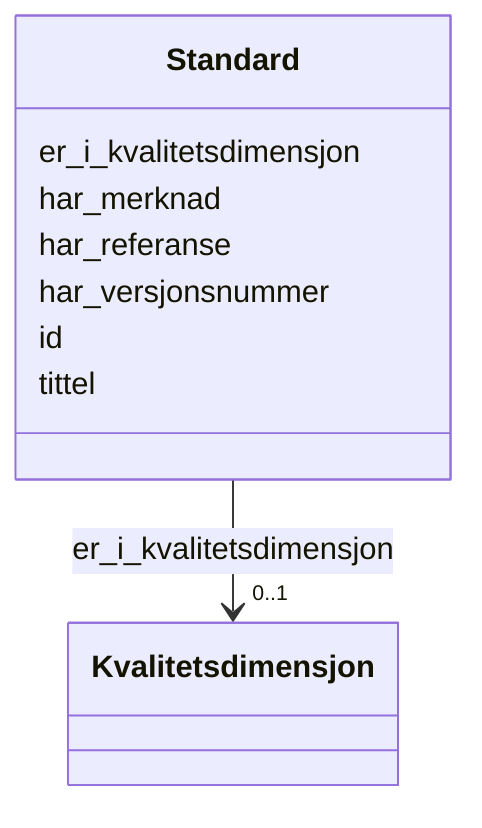

# Class: Standard 


_Ein standard eller spesifikasjon som eit datasett er i samsvar med._


URI: [dct:Standard](http://purl.org/dc/terms/Standard)





<!-- no inheritance hierarchy -->

## Class Properties

| Property | Value |
| --- | --- |
| Class URI | [dct:Standard](http://purl.org/dc/terms/Standard) |


## Eigenskapar


  
  

  
  
    
  

  
  

  
  

  
  

  
  


### Obligatorisk

| Namn | Kardinalitet og domene | Beskriving |
| --- | --- | --- |
| [tittel](tittel.md) | 1..* <br/> [LangString](LangString.md) | Namn/tittel på ressursen (dct:title) |


  
  

  
  

  
  
    
  

  
  
    
  

  
  

  
  


### Anbefalt

| Namn | Kardinalitet og domene | Beskriving |
| --- | --- | --- |
| [er_i_kvalitetsdimensjon](er_i_kvalitetsdimensjon.md) | 0..1 <br/> [Kvalitetsdimensjon](Kvalitetsdimensjon.md) | Kvalitetsdimensjonen denne merknaden eller standarden gjeld |
| [har_referanse](har_referanse.md) | * <br/> [Uri](Uri.md) | Referanse til ekstern ressurs (rdfs:seeAlso) |


  
  

  
  

  
  

  
  

  
  
    
  

  
  
    
  


### Valgfri

| Namn | Kardinalitet og domene | Beskriving |
| --- | --- | --- |
| [har_merknad](har_merknad.md) | * <br/> [LangString](LangString.md) | Fritekstmerknad (rdfs:comment) |
| [har_versjonsnummer](har_versjonsnummer.md) | 0..1 <br/> [String](String.md) | Versjonsnummer for ressursen (owl:versionInfo) |


  
  
  
  
    
  

  
  
  
    
      
    
      
    
      
    
  
  

  
  
  
    
      
    
      
    
      
    
  
  

  
  
  
    
      
    
      
    
      
    
  
  

  
  
  
    
      
    
      
    
      
    
  
  

  
  
  
    
      
    
      
    
      
    
  
  


### Andre

| Namn | Kardinalitet og domene | Beskriving |
| --- | --- | --- |
| [id](id.md) | 1 <br/> [Uriorcurie](Uriorcurie.md) | URI-identifikator for ressursen |


## Usages

| used by | used in | type | used |
| ---  | --- | --- | --- |
| [Container](Container.md) | [standardar](standardar.md) | range | [Standard](Standard.md) |
| [Datasett](Datasett.md) | [er_i_samsvar_med](er_i_samsvar_med.md) | range | [Standard](Standard.md) |


## Identifier and Mapping Information


### Schema Source


* from schema: https://data.norge.no/linkml/dqv-ap-no


## Mappings

| Mapping Type | Mapped Value |
| ---  | ---  |
| self | dct:Standard |
| native | https://data.norge.no/linkml/dqv-ap-no/Standard |


## LinkML Source

<!-- TODO: investigate https://stackoverflow.com/questions/37606292/how-to-create-tabbed-code-blocks-in-mkdocs-or-sphinx -->

### Direct

<details>
```yaml
name: Standard
description: Ein standard eller spesifikasjon som eit datasett er i samsvar med.
from_schema: https://data.norge.no/linkml/dqv-ap-no
slots:
- id
- tittel
- er_i_kvalitetsdimensjon
- har_referanse
- har_merknad
- har_versjonsnummer
slot_usage:
  tittel:
    name: tittel
    in_subset:
    - Obligatorisk
    required: true
  er_i_kvalitetsdimensjon:
    name: er_i_kvalitetsdimensjon
    in_subset:
    - Anbefalt
  har_referanse:
    name: har_referanse
    in_subset:
    - Anbefalt
  har_merknad:
    name: har_merknad
    in_subset:
    - Valgfri
  har_versjonsnummer:
    name: har_versjonsnummer
    in_subset:
    - Valgfri
class_uri: dct:Standard

```
</details>

### Induced

<details>
```yaml
name: Standard
description: Ein standard eller spesifikasjon som eit datasett er i samsvar med.
from_schema: https://data.norge.no/linkml/dqv-ap-no
slot_usage:
  tittel:
    name: tittel
    in_subset:
    - Obligatorisk
    required: true
  er_i_kvalitetsdimensjon:
    name: er_i_kvalitetsdimensjon
    in_subset:
    - Anbefalt
  har_referanse:
    name: har_referanse
    in_subset:
    - Anbefalt
  har_merknad:
    name: har_merknad
    in_subset:
    - Valgfri
  har_versjonsnummer:
    name: har_versjonsnummer
    in_subset:
    - Valgfri
attributes:
  id:
    name: id
    description: URI-identifikator for ressursen.
    from_schema: https://data.norge.no/linkml/dqv-ap-no
    rank: 1000
    identifier: true
    alias: id
    owner: Standard
    domain_of:
    - DcatRessurs
    - Datasett
    - Kvalitetsdimensjon
    - Kvalitetsmaal
    - Kvalitetsmerknad
    - Kvalitetsmaaling
    - Standard
    - Tekstdel
    - Motivasjon
    - Spraak
    - Mediatype
    - Begrep
    - Begrepssamling
    range: uriorcurie
    required: true
  tittel:
    name: tittel
    description: Namn/tittel på ressursen (dct:title).
    in_subset:
    - Obligatorisk
    from_schema: https://data.norge.no/linkml/dqv-ap-no
    rank: 1000
    slot_uri: dct:title
    alias: tittel
    owner: Standard
    domain_of:
    - Standard
    range: LangString
    required: true
    multivalued: true
  er_i_kvalitetsdimensjon:
    name: er_i_kvalitetsdimensjon
    description: Kvalitetsdimensjonen denne merknaden eller standarden gjeld.
    in_subset:
    - Anbefalt
    from_schema: https://data.norge.no/linkml/dqv-ap-no
    rank: 1000
    slot_uri: dqv:inDimension
    alias: er_i_kvalitetsdimensjon
    owner: Standard
    domain_of:
    - Kvalitetsmerknad
    - Standard
    range: Kvalitetsdimensjon
  har_referanse:
    name: har_referanse
    description: Referanse til ekstern ressurs (rdfs:seeAlso).
    in_subset:
    - Anbefalt
    from_schema: https://data.norge.no/linkml/dqv-ap-no
    rank: 1000
    slot_uri: rdfs:seeAlso
    alias: har_referanse
    owner: Standard
    domain_of:
    - Standard
    range: uri
    multivalued: true
  har_merknad:
    name: har_merknad
    description: Fritekstmerknad (rdfs:comment).
    in_subset:
    - Valgfri
    from_schema: https://data.norge.no/linkml/dqv-ap-no
    rank: 1000
    slot_uri: rdfs:comment
    alias: har_merknad
    owner: Standard
    domain_of:
    - Kvalitetsmerknad
    - Kvalitetsmaaling
    - Standard
    range: LangString
    multivalued: true
  har_versjonsnummer:
    name: har_versjonsnummer
    description: Versjonsnummer for ressursen (owl:versionInfo).
    in_subset:
    - Valgfri
    from_schema: https://data.norge.no/linkml/dqv-ap-no
    rank: 1000
    slot_uri: owl:versionInfo
    alias: har_versjonsnummer
    owner: Standard
    domain_of:
    - Standard
    range: string
class_uri: dct:Standard

```
</details>