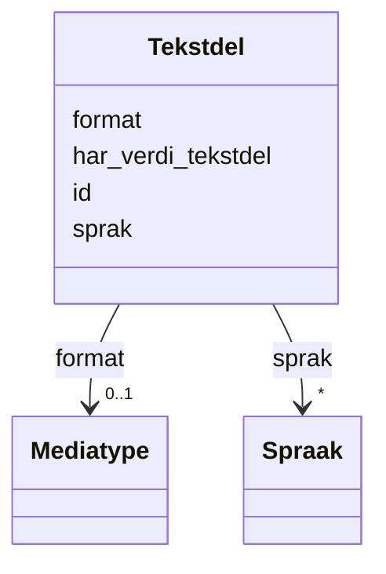

# Class: Tekstdel 


_Ein tekstleg del av ein kvalitetsmerknad (Web Annotation)._


URI: [oa:TextualBody](http://www.w3.org/ns/oa#TextualBody)





<!-- no inheritance hierarchy -->

## Class Properties

| Property | Value |
| --- | --- |
| Class URI | [oa:TextualBody](http://www.w3.org/ns/oa#TextualBody) |


## Slots

| Name | Cardinality and Range | Description | Inheritance |
| ---  | --- | --- | --- |
| [id](id.md) | 1 <br/> [Uriorcurie](Uriorcurie.md) | URI-identifikator for ressursen | direct |
| [har_verdi_tekstdel](har_verdi_tekstdel.md) | 1 <br/> [String](String.md) | Tekstinnhaldet i tekstdelen | direct |
| [format](format.md) | 0..1 <br/> [Mediatype](Mediatype.md) | Filformat eller medietype (dct:format) | direct |
| [sprak](sprak.md) | * <br/> [Spraak](Spraak.md) | Språk brukt i ressursen (dct:language) | direct |


## Usages

| used by | used in | type | used |
| ---  | --- | --- | --- |
| [Container](Container.md) | [tekstdelar](tekstdelar.md) | range | [Tekstdel](Tekstdel.md) |
| [Kvalitetsmerknad](Kvalitetsmerknad.md) | [har_tekstdel](har_tekstdel.md) | range | [Tekstdel](Tekstdel.md) |
| [Brukartilbakemelding](Brukartilbakemelding.md) | [har_tekstdel](har_tekstdel.md) | range | [Tekstdel](Tekstdel.md) |
| [Kvalitetssertifikat](Kvalitetssertifikat.md) | [har_tekstdel](har_tekstdel.md) | range | [Tekstdel](Tekstdel.md) |


## Identifier and Mapping Information


### Schema Source


* from schema: https://data.norge.no/linkml/dqv-ap-no


## Mappings

| Mapping Type | Mapped Value |
| ---  | ---  |
| self | oa:TextualBody |
| native | https://data.norge.no/linkml/dqv-ap-no/Tekstdel |


## LinkML Source

<!-- TODO: investigate https://stackoverflow.com/questions/37606292/how-to-create-tabbed-code-blocks-in-mkdocs-or-sphinx -->

### Direct

<details>
```yaml
name: Tekstdel
description: Ein tekstleg del av ein kvalitetsmerknad (Web Annotation).
from_schema: https://data.norge.no/linkml/dqv-ap-no
slots:
- id
- har_verdi_tekstdel
- format
- sprak
slot_usage:
  har_verdi_tekstdel:
    name: har_verdi_tekstdel
    in_subset:
    - Obligatorisk
    required: true
  format:
    name: format
    in_subset:
    - Anbefalt
  sprak:
    name: sprak
    in_subset:
    - Anbefalt
class_uri: oa:TextualBody

```
</details>

### Induced

<details>
```yaml
name: Tekstdel
description: Ein tekstleg del av ein kvalitetsmerknad (Web Annotation).
from_schema: https://data.norge.no/linkml/dqv-ap-no
slot_usage:
  har_verdi_tekstdel:
    name: har_verdi_tekstdel
    in_subset:
    - Obligatorisk
    required: true
  format:
    name: format
    in_subset:
    - Anbefalt
  sprak:
    name: sprak
    in_subset:
    - Anbefalt
attributes:
  id:
    name: id
    description: URI-identifikator for ressursen.
    from_schema: https://data.norge.no/linkml/dqv-ap-no
    rank: 1000
    identifier: true
    alias: id
    owner: Tekstdel
    domain_of:
    - DcatRessurs
    - Datasett
    - Kvalitetsdimensjon
    - Kvalitetsmaal
    - Kvalitetsmerknad
    - Kvalitetsmaaling
    - Standard
    - Tekstdel
    - Motivasjon
    - Spraak
    - Mediatype
    - Begrep
    - Begrepssamling
    range: uriorcurie
    required: true
  har_verdi_tekstdel:
    name: har_verdi_tekstdel
    description: Tekstinnhaldet i tekstdelen.
    in_subset:
    - Obligatorisk
    from_schema: https://data.norge.no/linkml/dqv-ap-no
    rank: 1000
    slot_uri: rdfs:value
    alias: har_verdi_tekstdel
    owner: Tekstdel
    domain_of:
    - Tekstdel
    range: string
    required: true
  format:
    name: format
    description: Filformat eller medietype (dct:format).
    in_subset:
    - Anbefalt
    from_schema: https://data.norge.no/linkml/dqv-ap-no
    rank: 1000
    slot_uri: dct:format
    alias: format
    owner: Tekstdel
    domain_of:
    - Tekstdel
    range: Mediatype
  sprak:
    name: sprak
    description: Språk brukt i ressursen (dct:language).
    in_subset:
    - Anbefalt
    from_schema: https://data.norge.no/linkml/dqv-ap-no
    rank: 1000
    slot_uri: dct:language
    alias: sprak
    owner: Tekstdel
    domain_of:
    - Tekstdel
    range: Spraak
    multivalued: true
class_uri: oa:TextualBody

```
</details>