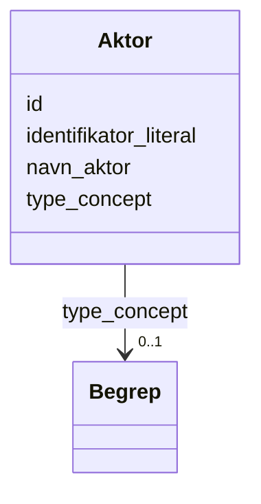

# Class: Aktor 


_Ein aktør (person, organisasjon eller system) med ansvar for ein ressurs._


URI: [foaf:Agent](http://xmlns.com/foaf/0.1/Agent)





<!-- no inheritance hierarchy -->

## Class Properties

| Property | Value |
| --- | --- |
| Class URI | [foaf:Agent](http://xmlns.com/foaf/0.1/Agent) |


## Eigenskapar


  
  

  
  
    
  

  
  

  
  


### Obligatorisk

| Namn | Kardinalitet og domene | Beskriving |
| --- | --- | --- |
| [navn_aktor](navn_aktor.md) | 1..* <br/> [LangString](LangString.md) | Namn på aktøren |


  
  

  
  

  
  

  
  


  
  

  
  

  
  

  
  


  
  
  
  
    
  

  
  
  
    
      
    
      
    
      
    
  
  

  
  
  
  
    
  

  
  
  
  
    
  


### Andre

| Namn | Kardinalitet og domene | Beskriving |
| --- | --- | --- |
| [id](id.md) | 1 <br/> [Uriorcurie](Uriorcurie.md) | URI-identifikator for ressursen |
| [identifikator_literal](identifikator_literal.md) | 0..1 <br/> [String](String.md) | Tekstleg identifikator for ressursen (dct:identifier) |
| [type_concept](type_concept.md) | 0..1 <br/> [Begrep](Begrep.md) | Type ressurs frå eit kontrollert vokabular (dct:type) |


## Usages

| used by | used in | type | used |
| ---  | --- | --- | --- |
| [Container](Container.md) | [aktorar](aktorar.md) | range | [Aktor](Aktor.md) |
| [Datasett](Datasett.md) | [utgiver](utgiver.md) | range | [Aktor](Aktor.md) |
| [Datasett](Datasett.md) | [produsent](produsent.md) | range | [Aktor](Aktor.md) |
| [Datasettserie](Datasettserie.md) | [utgiver](utgiver.md) | range | [Aktor](Aktor.md) |
| [Datatjeneste](Datatjeneste.md) | [utgiver](utgiver.md) | range | [Aktor](Aktor.md) |
| [Katalog](Katalog.md) | [utgiver](utgiver.md) | range | [Aktor](Aktor.md) |
| [Katalog](Katalog.md) | [produsent](produsent.md) | range | [Aktor](Aktor.md) |


## Identifier and Mapping Information


### Schema Source


* from schema: https://data.norge.no/linkml/dcat-ap-no


## Mappings

| Mapping Type | Mapped Value |
| ---  | ---  |
| self | foaf:Agent |
| native | https://data.norge.no/linkml/dcat-ap-no/Aktor |


## LinkML Source

<!-- TODO: investigate https://stackoverflow.com/questions/37606292/how-to-create-tabbed-code-blocks-in-mkdocs-or-sphinx -->

### Direct

<details>
```yaml
name: Aktor
description: Ein aktør (person, organisasjon eller system) med ansvar for ein ressurs.
from_schema: https://data.norge.no/linkml/dcat-ap-no
slots:
- id
- navn_aktor
- identifikator_literal
- type_concept
slot_usage:
  navn_aktor:
    name: navn_aktor
    in_subset:
    - Obligatorisk
    required: true
class_uri: foaf:Agent

```
</details>

### Induced

<details>
```yaml
name: Aktor
description: Ein aktør (person, organisasjon eller system) med ansvar for ein ressurs.
from_schema: https://data.norge.no/linkml/dcat-ap-no
slot_usage:
  navn_aktor:
    name: navn_aktor
    in_subset:
    - Obligatorisk
    required: true
attributes:
  id:
    name: id
    description: URI-identifikator for ressursen.
    from_schema: https://data.norge.no/linkml/dcat-ap-no
    rank: 1000
    identifier: true
    alias: id
    owner: Aktor
    domain_of:
    - Frekvens
    - ProvenanceStatement
    - OdrlPolicy
    - ProvAktivitet
    - ProvAttributering
    - Tidsinstant
    - KatalogisertRessurs
    - Aktor
    - Kontaktopplysning
    - Tidsrom
    - Standard
    - RegulativRessurs
    - Identifikator
    - Rettighetserklaring
    - Sjekksum
    - Gebyr
    - Relasjon
    - Distribusjon
    - Katalogpost
    - Spraak
    - Mediatype
    - Begrep
    - Begrepssamling
    range: uriorcurie
    required: true
  navn_aktor:
    name: navn_aktor
    description: Namn på aktøren.
    in_subset:
    - Obligatorisk
    from_schema: https://data.norge.no/linkml/dcat-ap-no
    rank: 1000
    slot_uri: foaf:name
    alias: navn_aktor
    owner: Aktor
    domain_of:
    - Aktor
    range: LangString
    required: true
    multivalued: true
  identifikator_literal:
    name: identifikator_literal
    description: Tekstleg identifikator for ressursen (dct:identifier).
    from_schema: https://data.norge.no/linkml/dcat-ap-no
    rank: 1000
    slot_uri: dct:identifier
    alias: identifikator_literal
    owner: Aktor
    domain_of:
    - Aktor
    - RegulativRessurs
    - Datasett
    - Datatjeneste
    - Katalog
    range: string
  type_concept:
    name: type_concept
    description: Type ressurs frå eit kontrollert vokabular (dct:type).
    from_schema: https://data.norge.no/linkml/dcat-ap-no
    rank: 1000
    slot_uri: dct:type
    alias: type_concept
    owner: Aktor
    domain_of:
    - Aktor
    - RegulativRessurs
    - Datasett
    range: Begrep
class_uri: foaf:Agent

```
</details>