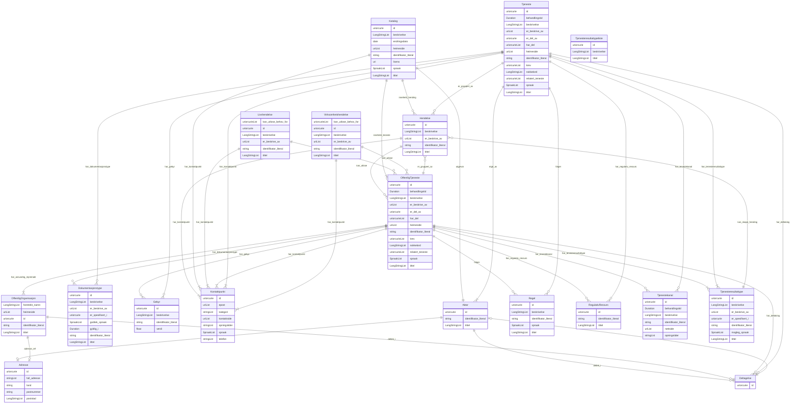

```mermaid
erDiagram
Adresse {
    uriorcurie id  
    stringList full_adresse  
    string land  
    string postnummer  
    LangStringList poststad  
}
Aktor {
    uriorcurie id  
    string identifikator_literal  
    LangStringList tittel  
}
Deltagelse {
    uriorcurie id  
}
Dokumentasjonstype {
    uriorcurie id  
    LangStringList beskrivelse  
    uriList er_beskrive_av  
    uriorcurie er_spesifisert_i  
    SpraakList godtek_spraak  
    Duration gyldig_i  
    string identifikator_literal  
    LangStringList tittel  
}
Gebyr {
    uriorcurie id  
    LangStringList beskrivelse  
    string identifikator_literal  
    float verdi  
}
Hendelse {
    uriorcurie id  
    LangStringList beskrivelse  
    uriList er_beskrive_av  
    string identifikator_literal  
    LangStringList tittel  
}
Katalog {
    uriorcurie id  
    LangStringList beskrivelse  
    date endringsdato  
    uriList heimeside  
    string identifikator_literal  
    uri lisens  
    SpraakList spraak  
    LangStringList tittel  
}
Kontaktpunkt {
    uriorcurie id  
    uriList epost  
    stringList kategori  
    uriList kontaktside  
    stringList opningstider  
    SpraakList spraak  
    stringList telefon  
}
Livshendelse {
    uriorcurieList kan_utlose_behov_for  
    uriorcurie id  
    LangStringList beskrivelse  
    uriList er_beskrive_av  
    string identifikator_literal  
    LangStringList tittel  
}
OffentligOrganisasjon {
    LangStringList foretrekt_namn  
    uriList heimeside  
    uriorcurie id  
    string identifikator_literal  
    LangStringList tittel  
}
OffentligTjeneste {
    uriorcurie id  
    Duration behandlingstid  
    LangStringList beskrivelse  
    uriList er_beskrive_av  
    uriorcurie er_del_av  
    uriorcurieList har_del  
    uriList heimeside  
    string identifikator_literal  
    uriorcurieList krev  
    LangStringList nokkelord  
    uriorcurieList relatert_teneste  
    SpraakList spraak  
    LangStringList tittel  
}
Regel {
    uriorcurie id  
    LangStringList beskrivelse  
    string identifikator_literal  
    SpraakList spraak  
    LangStringList tittel  
}
RegulativRessurs {
    uriorcurie id  
    string identifikator_literal  
    LangStringList tittel  
}
Tjeneste {
    uriorcurie id  
    Duration behandlingstid  
    LangStringList beskrivelse  
    uriList er_beskrive_av  
    uriorcurie er_del_av  
    uriorcurieList har_del  
    uriList heimeside  
    string identifikator_literal  
    uriorcurieList krev  
    LangStringList nokkelord  
    uriorcurieList relatert_teneste  
    SpraakList spraak  
    LangStringList tittel  
}
Tjenestekanal {
    uriorcurie id  
    Duration behandlingstid  
    LangStringList beskrivelse  
    string identifikator_literal  
    uriList nettside  
    stringList opningstider  
}
Tjenesteresultattype {
    uriorcurie id  
    LangStringList beskrivelse  
    uriList er_beskrive_av  
    uriorcurie er_spesifisert_i  
    string identifikator_literal  
    SpraakList mogleg_spraak  
    LangStringList tittel  
}
Tjenesteresultattypeliste {
    uriorcurie id  
    LangStringList beskrivelse  
    LangStringList tittel  
}
Virksomhetshendelse {
    uriorcurieList kan_utlose_behov_for  
    uriorcurie id  
    LangStringList beskrivelse  
    uriList er_beskrive_av  
    string identifikator_literal  
    LangStringList tittel  
}

Aktor ||--|o Adresse : "adresse_ref"
Aktor ||--}o Deltagelse : "deltek_i"
Deltagelse ||--|o Aktor : "deltakar"
Hendelse ||--}o OffentligTjeneste : "kan_utlose"
Hendelse ||--}| Kontaktpunkt : "har_kontaktpunkt"
Katalog ||--|| Aktor : "utgjevar"
Katalog ||--}o Hendelse : "inneheld_hending"
Katalog ||--}| Kontaktpunkt : "har_kontaktpunkt"
Katalog ||--}| OffentligTjeneste : "inneheld_teneste"
Livshendelse ||--}o OffentligTjeneste : "kan_utlose"
Livshendelse ||--}| Kontaktpunkt : "har_kontaktpunkt"
OffentligOrganisasjon ||--|o Adresse : "adresse_ref"
OffentligOrganisasjon ||--}o Deltagelse : "deltek_i"
OffentligTjeneste ||--}o Deltagelse : "har_deltaking"
OffentligTjeneste ||--}o Dokumentasjonstype : "har_dokumentasjonstype"
OffentligTjeneste ||--}o Gebyr : "har_gebyr"
OffentligTjeneste ||--}o Hendelse : "er_gruppert_av"
OffentligTjeneste ||--}o Regel : "folger"
OffentligTjeneste ||--}o RegulativRessurs : "har_regulativ_ressurs"
OffentligTjeneste ||--}o Tjenestekanal : "har_tenestekanal"
OffentligTjeneste ||--}| Kontaktpunkt : "har_kontaktpunkt"
OffentligTjeneste ||--}| OffentligOrganisasjon : "har_ansvarleg_styremakt"
OffentligTjeneste ||--}| Tjenesteresultattype : "har_tenesteresultattype"
Tjeneste ||--}o Deltagelse : "har_deltaking"
Tjeneste ||--}o Dokumentasjonstype : "har_dokumentasjonstype"
Tjeneste ||--}o Gebyr : "har_gebyr"
Tjeneste ||--}o Hendelse : "er_gruppert_av"
Tjeneste ||--}o Regel : "folger"
Tjeneste ||--}o RegulativRessurs : "har_regulativ_ressurs"
Tjeneste ||--}o Tjenestekanal : "har_tenestekanal"
Tjeneste ||--}| Aktor : "eigd_av"
Tjeneste ||--}| Kontaktpunkt : "har_kontaktpunkt"
Tjeneste ||--}| Tjenesteresultattype : "har_tenesteresultattype"
Tjenesteresultattype ||--}o Hendelse : "kan_skape_hending"
Virksomhetshendelse ||--}o OffentligTjeneste : "kan_utlose"
Virksomhetshendelse ||--}| Kontaktpunkt : "har_kontaktpunkt"


```
