# cpsv-ap-no

```mermaid
erDiagram
Adresse {
    uriorcurie id  
    stringList full_adresse  
    string land  
    string postnummer  
    LangStringList poststad  
}
Aktor {
    uriorcurie id  
    string identifikator_literal  
    LangStringList tittel  
}
Deltagelse {
    uriorcurie id  
}
Dokumentasjonstype {
    uriorcurie id  
    LangStringList beskrivelse  
    uriList er_beskrive_av  
    uriorcurie er_spesifisert_i  
    SpraakList godtek_spraak  
    Duration gyldig_i  
    string identifikator_literal  
    LangStringList tittel  
}
Gebyr {
    uriorcurie id  
    LangStringList beskrivelse  
    string identifikator_literal  
    float verdi  
}
Hendelse {
    uriorcurie id  
    LangStringList beskrivelse  
    uriList er_beskrive_av  
    string identifikator_literal  
    LangStringList tittel  
}
Katalog {
    uriorcurie id  
    LangStringList beskrivelse  
    date endringsdato  
    uriList heimeside  
    string identifikator_literal  
    uri lisens  
    SpraakList spraak  
    LangStringList tittel  
}
Kontaktpunkt {
    uriorcurie id  
    uriList epost  
    stringList kategori  
    uriList kontaktside  
    stringList opningstider  
    SpraakList spraak  
    stringList telefon  
}
Livshendelse {
    uriorcurieList kan_utlose_behov_for  
    uriorcurie id  
    LangStringList beskrivelse  
    uriList er_beskrive_av  
    string identifikator_literal  
    LangStringList tittel  
}
OffentligOrganisasjon {
    LangStringList foretrekt_namn  
    uriList heimeside  
    uriorcurie id  
    string identifikator_literal  
    LangStringList tittel  
}
OffentligTjeneste {
    uriorcurie id  
    Duration behandlingstid  
    LangStringList beskrivelse  
    uriList er_beskrive_av  
    uriorcurie er_del_av  
    uriorcurieList har_del  
    uriList heimeside  
    string identifikator_literal  
    uriorcurieList krev  
    LangStringList nokkelord  
    uriorcurieList relatert_teneste  
    SpraakList spraak  
    LangStringList tittel  
}
Regel {
    uriorcurie id  
    LangStringList beskrivelse  
    string identifikator_literal  
    SpraakList spraak  
    LangStringList tittel  
}
RegulativRessurs {
    uriorcurie id  
    string identifikator_literal  
    LangStringList tittel  
}
Tjeneste {
    uriorcurie id  
    Duration behandlingstid  
    LangStringList beskrivelse  
    uriList er_beskrive_av  
    uriorcurie er_del_av  
    uriorcurieList har_del  
    uriList heimeside  
    string identifikator_literal  
    uriorcurieList krev  
    LangStringList nokkelord  
    uriorcurieList relatert_teneste  
    SpraakList spraak  
    LangStringList tittel  
}
Tjenestekanal {
    uriorcurie id  
    Duration behandlingstid  
    LangStringList beskrivelse  
    string identifikator_literal  
    uriList nettside  
    stringList opningstider  
}
Tjenesteresultattype {
    uriorcurie id  
    LangStringList beskrivelse  
    uriList er_beskrive_av  
    uriorcurie er_spesifisert_i  
    string identifikator_literal  
    SpraakList mogleg_spraak  
    LangStringList tittel  
}
Tjenesteresultattypeliste {
    uriorcurie id  
    LangStringList beskrivelse  
    LangStringList tittel  
}
Virksomhetshendelse {
    uriorcurieList kan_utlose_behov_for  
    uriorcurie id  
    LangStringList beskrivelse  
    uriList er_beskrive_av  
    string identifikator_literal  
    LangStringList tittel  
}

Aktor ||--|o Adresse : "adresse_ref"
Aktor ||--}o Deltagelse : "deltek_i"
Deltagelse ||--|o Aktor : "deltakar"
Hendelse ||--}o OffentligTjeneste : "kan_utlose"
Hendelse ||--}| Kontaktpunkt : "har_kontaktpunkt"
Katalog ||--|| Aktor : "utgjevar"
Katalog ||--}o Hendelse : "inneheld_hending"
Katalog ||--}| Kontaktpunkt : "har_kontaktpunkt"
Katalog ||--}| OffentligTjeneste : "inneheld_teneste"
Livshendelse ||--}o OffentligTjeneste : "kan_utlose"
Livshendelse ||--}| Kontaktpunkt : "har_kontaktpunkt"
OffentligOrganisasjon ||--|o Adresse : "adresse_ref"
OffentligOrganisasjon ||--}o Deltagelse : "deltek_i"
OffentligTjeneste ||--}o Deltagelse : "har_deltaking"
OffentligTjeneste ||--}o Dokumentasjonstype : "har_dokumentasjonstype"
OffentligTjeneste ||--}o Gebyr : "har_gebyr"
OffentligTjeneste ||--}o Hendelse : "er_gruppert_av"
OffentligTjeneste ||--}o Regel : "folger"
OffentligTjeneste ||--}o RegulativRessurs : "har_regulativ_ressurs"
OffentligTjeneste ||--}o Tjenestekanal : "har_tenestekanal"
OffentligTjeneste ||--}| Kontaktpunkt : "har_kontaktpunkt"
OffentligTjeneste ||--}| OffentligOrganisasjon : "har_ansvarleg_styremakt"
OffentligTjeneste ||--}| Tjenesteresultattype : "har_tenesteresultattype"
Tjeneste ||--}o Deltagelse : "har_deltaking"
Tjeneste ||--}o Dokumentasjonstype : "har_dokumentasjonstype"
Tjeneste ||--}o Gebyr : "har_gebyr"
Tjeneste ||--}o Hendelse : "er_gruppert_av"
Tjeneste ||--}o Regel : "folger"
Tjeneste ||--}o RegulativRessurs : "har_regulativ_ressurs"
Tjeneste ||--}o Tjenestekanal : "har_tenestekanal"
Tjeneste ||--}| Aktor : "eigd_av"
Tjeneste ||--}| Kontaktpunkt : "har_kontaktpunkt"
Tjeneste ||--}| Tjenesteresultattype : "har_tenesteresultattype"
Tjenesteresultattype ||--}o Hendelse : "kan_skape_hending"
Virksomhetshendelse ||--}o OffentligTjeneste : "kan_utlose"
Virksomhetshendelse ||--}| Kontaktpunkt : "har_kontaktpunkt"


```

Norsk applikasjonsprofil av CPSV (Core Public Service Vocabulary), modellert i LinkML med lenking framfor inlining. Basert på https://informasjonsforvaltning.github.io/cpsv-ap-no/

URI: https://data.norge.no/ap-no/cpsv-ap-no

Name: cpsv-ap-no

## Classes

### Obligatorisk

| Class | Description |
| --- | --- |
| [Aktor](klasser/aktor.md) | Ein aktør (person eller organisasjon) relatert til ei teneste |
| [Dokumentasjonstype](klasser/dokumentasjonstype.md) | Ein type dokumentasjon som krevst for å levere ei teneste |
| [Hendelse](klasser/hendelse.md) | Ei hending som kan utløyse behov for ei offentleg teneste |
| [Katalog](klasser/katalog.md) | Ein katalog over offentlege tenester og hendingar |
| [OffentligOrganisasjon](klasser/offentligorganisasjon.md) | Ein offentleg organisasjon som er ansvarleg for ei teneste |
| [OffentligTjeneste](klasser/offentligtjeneste.md) | Ei konkret offentleg teneste levert av ein offentleg organisasjon |
| [Tjeneste](klasser/tjeneste.md) | Ei teneste levert av ein ikkje-offentleg aktør |
| [Tjenestekanal](klasser/tjenestekanal.md) | Ein kanal for å få tilgang til ei teneste (t |
| [Tjenesteresultattype](klasser/tjenesteresultattype.md) | Typen resultat som ei teneste produserer |

### Anbefalt

| Class | Description |
| --- | --- |
| [Livshendelse](klasser/livshendelse.md) | Ei livshending som kan utløyse behov for tenester (t |
| [Virksomhetshendelse](klasser/virksomhetshendelse.md) | Ei verksemdhending som kan utløyse behov for tenester (t |

### Valgfri

| Class | Description |
| --- | --- |
| [Adresse](klasser/adresse.md) | Ei postadresse knytt til ein aktør, organisasjon eller kontaktpunkt |
| [Deltagelse](klasser/deltagelse.md) | Ei rolle ein aktør har i leveringa av ei teneste |
| [Gebyr](klasser/gebyr.md) | Eit gebyr knytt til ei teneste |
| [Kontaktpunkt](klasser/kontaktpunkt.md) | Kontaktinformasjon for ei teneste eller ein organisasjon |
| [Regel](klasser/regel.md) | Eit regelverk eller retningsliner som styrer levering av ei teneste |
| [RegulativRessurs](klasser/regulativressurs.md) | Ein regulativ ressurs (lov, forskrift o |

### Andre

| Class | Description |
| --- | --- |
| [Tjenesteresultattypeliste](klasser/tjenesteresultattypeliste.md) | Ei liste over moglege tjenesteresultattypar |

## Slots

| Slot | Description |
| --- | --- |
| [adresse_ref](klasser/adresse_ref.md) | Postadresse knytt til aktøren |
| [behandlingstid](klasser/behandlingstid.md) | Forventa behandlingstid for tenesta eller kanalen (ISO 8601) |
| [deltakar](klasser/deltakar.md) | Aktøren som deltek |
| [deltek_i](klasser/deltek_i.md) | Deltakingar aktøren er del av |
| [eigd_av](klasser/eigd_av.md) | Aktør som eig eller er ansvarleg for tenesta |
| [epost](klasser/epost.md) | E-postadresse (mailto:-URI) |
| [er_beskrive_av](klasser/er_beskrive_av.md) | Datasett som beskriv ressursen |
| [er_del_av](klasser/er_del_av.md) | Tenesta er del av ei anna teneste |
| [er_gruppert_av](klasser/er_gruppert_av.md) | Hending(ar) som grupperer tenesta |
| [er_klassifisert_av](klasser/er_klassifisert_av.md) | Omgrep tenesta er klassifisert med |
| [er_spesifisert_i](klasser/er_spesifisert_i.md) | Liste eller spesifikasjon ressursen er del av |
| [folger](klasser/folger.md) | Regelverk tenesta følgjer |
| [foretrekt_namn](klasser/foretrekt_namn.md) | Føretrekt namn/term for organisasjonen |
| [full_adresse](klasser/full_adresse.md) | Full adresse som fritekst |
| [godtek_spraak](klasser/godtek_spraak.md) | Språk dokumentasjonstypen er akseptert i |
| [gyldig_i](klasser/gyldig_i.md) | Kor lenge dokumentasjonen er gyldig (ISO 8601 varigheit) |
| [har_ansvarleg_styremakt](klasser/har_ansvarleg_styremakt.md) | Offentleg organisasjon ansvarleg for tenesta |
| [har_del](klasser/har_del.md) | Deltenester som inngår i denne tenesta |
| [har_deltaking](klasser/har_deltaking.md) | Deltakarar med spesifikke roller i levering av tenesta |
| [har_dokumentasjonstype](klasser/har_dokumentasjonstype.md) | Dokumentasjon som krevst for tenesta |
| [har_gebyr](klasser/har_gebyr.md) | Gebyr knytt til tenesta |
| [har_kontaktpunkt](klasser/har_kontaktpunkt.md) | Kontaktpunkt for tenesta eller organisasjonen |
| [har_regulativ_ressurs](klasser/har_regulativ_ressurs.md) | Regulativ ressurs (lov, forskrift) knytt til tenesta |
| [har_rolle](klasser/har_rolle.md) | Rolla aktøren har i ei deltaking |
| [har_tenestekanal](klasser/har_tenestekanal.md) | Kanal for tilgang til tenesta |
| [har_tenesteresultattype](klasser/har_tenesteresultattype.md) | Typen resultat tenesta kan produsere |
| [inneheld_hending](klasser/inneheld_hending.md) | Hendingar i katalogen |
| [inneheld_teneste](klasser/inneheld_teneste.md) | Offentlege tenester i katalogen |
| [kan_skape_hending](klasser/kan_skape_hending.md) | Hending tenesteresultatet kan skape |
| [kan_utlose](klasser/kan_utlose.md) | Offentlege tenester hendinga kan utløyse |
| [kan_utlose_behov_for](klasser/kan_utlose_behov_for.md) | Tenester det kan oppstå behov for som følgje av hendinga |
| [kategori](klasser/kategori.md) | Kategori for kontaktpunktet |
| [klassifisering](klasser/klassifisering.md) | Klassifisering av dokumentasjonstypen |
| [kontaktside](klasser/kontaktside.md) | Kontaktside (nettadresse) |
| [krev](klasser/krev.md) | Teneste eller ressurs denne tenesta krev |
| [land](klasser/land.md) | Land (ISO 3166-1 alpha-2 kode) |
| [lisens](klasser/lisens.md) | Lisens for katalogen |
| [malgruppe](klasser/malgruppe.md) | Målgruppe for tenesta |
| [mogleg_spraak](klasser/mogleg_spraak.md) | Mogleg språk for tenesteresultatet |
| [nettside](klasser/nettside.md) | Nettside for tenestekanalane |
| [opningstider](klasser/opningstider.md) | Opningstider |
| [oppdateringsfrekvens](klasser/oppdateringsfrekvens.md) | Kor ofte katalogen vert oppdatert |
| [postnummer](klasser/postnummer.md) | Postnummer |
| [poststad](klasser/poststad.md) | Poststad/by |
| [relatert_teneste](klasser/relatert_teneste.md) | Relatert teneste |
| [sektor](klasser/sektor.md) | Industri/sektor tenesta tilhøyrer |
| [telefon](klasser/telefon.md) | Telefonnummer |
| [tema](klasser/tema.md) | Emne/tema tenesta handlar om |
| [temaomrade](klasser/temaomrade.md) | Tematisk område for tenesta |
| [utgjevar](klasser/utgjevar.md) | Utgjevar av katalogen |
| [utstedingsstad](klasser/utstedingsstad.md) | Stad dokumentasjonen er akseptert frå |
| [verdi](klasser/verdi.md) | Verdien av gebyret |

## Enumerations

| Enumeration | Description |
| --- | --- |

## Types

| Type | Description |
| --- | --- |

## Subsets

| Subset | Description |
| --- | --- |
| [Anbefalt](klasser/anbefalt.md) | Anbefalte eigenskapar i ein AP-NO-profil |
| [Obligatorisk](klasser/obligatorisk.md) | Obligatoriske eigenskapar i ein AP-NO-profil |
| [Valgfri](klasser/valgfri.md) | Valfrie eigenskapar i ein AP-NO-profil |

## Generated artifacts

| Artefakt | Fil |
|----------|-----|
| SHACL shapes | [cpsv-ap-no-shapes.ttl](cpsv-ap-no-shapes.ttl) |
| JSON-LD kontekst | [cpsv-ap-no-context.jsonld](cpsv-ap-no-context.jsonld) |
| JSON Schema | [cpsv-ap-no-schema.json](cpsv-ap-no-schema.json) |
| OWL ontologi | [cpsv-ap-no-ontology.ttl](cpsv-ap-no-ontology.ttl) |
| RDF/Turtle skjema | [cpsv-ap-no-schema.ttl](cpsv-ap-no-schema.ttl) |
| Python-klasser | [cpsv-ap-no-model.py](cpsv-ap-no-model.py) |
| Protobuf-skjema | [cpsv-ap-no-schema.proto](cpsv-ap-no-schema.proto) |
| ER-diagram (Mermaid) | [cpsv-ap-no-erdiagram.md](cpsv-ap-no-erdiagram.md) |
| PlantUML-diagram | [cpsv-ap-no.svg](diagrams/cpsv-ap-no.svg) · [cpsv-ap-no.puml](diagrams/cpsv-ap-no.puml) |
