# cpsv-ap-no

```mermaid
erDiagram
Adresse {
    uriorcurie id  
    stringList full_adresse  
    string land  
    string postnummer  
    LangStringList poststad  
}
Aktor {
    uriorcurie id  
    string identifikator_literal  
    LangStringList tittel  
}
Begrepssamling {
    uriorcurie id  
}
Deltagelse {
    uriorcurie id  
}
Dokumentasjonstype {
    uriorcurie id  
    LangStringList beskrivelse  
    uriList er_beskrive_av  
    uriorcurie er_spesifisert_i  
    SpraakList godtek_spraak  
    Duration gyldig_i  
    string identifikator_literal  
    LangStringList tittel  
}
Gebyr {
    uriorcurie id  
    LangStringList beskrivelse  
    string identifikator_literal  
    float verdi  
}
Hendelse {
    uriorcurie id  
    LangStringList beskrivelse  
    uriList er_beskrive_av  
    string identifikator_literal  
    LangStringList tittel  
}
Katalog {
    uriorcurie id  
    LangStringList beskrivelse  
    date endringsdato  
    uriList heimeside  
    string identifikator_literal  
    uri lisens  
    SpraakList spraak  
    LangStringList tittel  
}
Konsept {
    uriorcurie id  
}
Kontaktpunkt {
    uriorcurie id  
    uriList epost  
    stringList kategori  
    uriList kontaktside  
    stringList opningstider  
    SpraakList spraak  
    stringList telefon  
}
Livshendelse {
    uriorcurieList kan_utlose_behov_for  
    uriorcurie id  
    LangStringList beskrivelse  
    uriList er_beskrive_av  
    string identifikator_literal  
    LangStringList tittel  
}
Mediatype {
    uriorcurie id  
}
OffentligOrganisasjon {
    LangStringList foretrekt_namn  
    uriList heimeside  
    uriorcurie id  
    string identifikator_literal  
    LangStringList tittel  
}
OffentligTjeneste {
    uriorcurie id  
    Duration behandlingstid  
    LangStringList beskrivelse  
    uriList er_beskrive_av  
    uriorcurie er_del_av  
    uriorcurieList har_del  
    uriList heimeside  
    string identifikator_literal  
    uriorcurieList krev  
    LangStringList nokkelord  
    uriorcurieList relatert_teneste  
    SpraakList spraak  
    LangStringList tittel  
}
Regel {
    uriorcurie id  
    LangStringList beskrivelse  
    string identifikator_literal  
    SpraakList spraak  
    LangStringList tittel  
}
RegulativRessurs {
    uriorcurie id  
    string identifikator_literal  
    LangStringList tittel  
}
Tjeneste {
    uriorcurie id  
    Duration behandlingstid  
    LangStringList beskrivelse  
    uriList er_beskrive_av  
    uriorcurie er_del_av  
    uriorcurieList har_del  
    uriList heimeside  
    string identifikator_literal  
    uriorcurieList krev  
    LangStringList nokkelord  
    uriorcurieList relatert_teneste  
    SpraakList spraak  
    LangStringList tittel  
}
Tjenestekanal {
    uriorcurie id  
    Duration behandlingstid  
    LangStringList beskrivelse  
    string identifikator_literal  
    uriList nettside  
    stringList opningstider  
}
Tjenesteresultattype {
    uriorcurie id  
    LangStringList beskrivelse  
    uriList er_beskrive_av  
    uriorcurie er_spesifisert_i  
    string identifikator_literal  
    SpraakList mogleg_spraak  
    LangStringList tittel  
}
Tjenesteresultattypeliste {
    uriorcurie id  
    LangStringList beskrivelse  
    LangStringList tittel  
}
Virksomhetshendelse {
    uriorcurieList kan_utlose_behov_for  
    uriorcurie id  
    LangStringList beskrivelse  
    uriList er_beskrive_av  
    string identifikator_literal  
    LangStringList tittel  
}

Aktor ||--|o Adresse : "adresse_ref"
Aktor ||--}o Deltagelse : "deltek_i"
Deltagelse ||--|o Aktor : "deltakar"
Deltagelse ||--|o Konsept : "har_rolle"
Dokumentasjonstype ||--|o Konsept : "klassifisering, utstedingsstad"
Gebyr ||--|o Konsept : "valuta"
Hendelse ||--|o Konsept : "type_concept"
Hendelse ||--}o Konsept : "tema"
Hendelse ||--}o OffentligTjeneste : "kan_utlose"
Hendelse ||--}| Kontaktpunkt : "har_kontaktpunkt"
Katalog ||--|o Konsept : "oppdateringsfrekvens"
Katalog ||--|| Aktor : "utgjevar"
Katalog ||--}o Hendelse : "inneheld_hending"
Katalog ||--}o Konsept : "dekningsomraade"
Katalog ||--}| Kontaktpunkt : "har_kontaktpunkt"
Katalog ||--}| OffentligTjeneste : "inneheld_teneste"
Livshendelse ||--|o Konsept : "type_concept"
Livshendelse ||--}o Konsept : "tema"
Livshendelse ||--}o OffentligTjeneste : "kan_utlose"
Livshendelse ||--}| Kontaktpunkt : "har_kontaktpunkt"
OffentligOrganisasjon ||--|o Adresse : "adresse_ref"
OffentligOrganisasjon ||--|o Konsept : "type_concept"
OffentligOrganisasjon ||--}o Deltagelse : "deltek_i"
OffentligOrganisasjon ||--}| Konsept : "dekningsomraade"
OffentligTjeneste ||--|o Konsept : "status, type_concept"
OffentligTjeneste ||--}o Deltagelse : "har_deltaking"
OffentligTjeneste ||--}o Dokumentasjonstype : "har_dokumentasjonstype"
OffentligTjeneste ||--}o Gebyr : "har_gebyr"
OffentligTjeneste ||--}o Hendelse : "er_gruppert_av"
OffentligTjeneste ||--}o Konsept : "dekningsomraade, er_klassifisert_av, malgruppe, sektor, tema, temaomrade"
OffentligTjeneste ||--}o Regel : "folger"
OffentligTjeneste ||--}o RegulativRessurs : "har_regulativ_ressurs"
OffentligTjeneste ||--}o Tjenestekanal : "har_tenestekanal"
OffentligTjeneste ||--}| Kontaktpunkt : "har_kontaktpunkt"
OffentligTjeneste ||--}| OffentligOrganisasjon : "har_ansvarleg_styremakt"
OffentligTjeneste ||--}| Tjenesteresultattype : "har_tenesteresultattype"
Regel ||--|o Konsept : "type_concept"
RegulativRessurs ||--|o Konsept : "type_concept"
Tjeneste ||--|o Konsept : "status, type_concept"
Tjeneste ||--}o Deltagelse : "har_deltaking"
Tjeneste ||--}o Dokumentasjonstype : "har_dokumentasjonstype"
Tjeneste ||--}o Gebyr : "har_gebyr"
Tjeneste ||--}o Hendelse : "er_gruppert_av"
Tjeneste ||--}o Konsept : "dekningsomraade, er_klassifisert_av, malgruppe, sektor, tema, temaomrade"
Tjeneste ||--}o Regel : "folger"
Tjeneste ||--}o RegulativRessurs : "har_regulativ_ressurs"
Tjeneste ||--}o Tjenestekanal : "har_tenestekanal"
Tjeneste ||--}| Aktor : "eigd_av"
Tjeneste ||--}| Kontaktpunkt : "har_kontaktpunkt"
Tjeneste ||--}| Tjenesteresultattype : "har_tenesteresultattype"
Tjenestekanal ||--|o Konsept : "type_concept"
Tjenesteresultattype ||--|o Konsept : "type_concept"
Tjenesteresultattype ||--}o Hendelse : "kan_skape_hending"
Virksomhetshendelse ||--|o Konsept : "type_concept"
Virksomhetshendelse ||--}o Konsept : "tema"
Virksomhetshendelse ||--}o OffentligTjeneste : "kan_utlose"
Virksomhetshendelse ||--}| Kontaktpunkt : "har_kontaktpunkt"

```

Norsk applikasjonsprofil av CPSV (Core Public Service Vocabulary), modellert i LinkML med lenking framfor inlining. Basert på https://informasjonsforvaltning.github.io/cpsv-ap-no/

URI: https://data.norge.no/linkml/cpsv-ap-no

Name: cpsv-ap-no

## Classes

| Class | Description |
| --- | --- |
| [Adresse](klasser/adresse.md) | Ei postadresse knytt til ein aktør, organisasjon eller kontaktpunkt |
| [Aktor](klasser/aktor.md) | Ein aktør (person eller organisasjon) relatert til ei teneste |
| &nbsp;&nbsp;&nbsp;&nbsp;&nbsp;&nbsp;&nbsp;&nbsp;[OffentligOrganisasjon](klasser/offentligorganisasjon.md) | Ein offentleg organisasjon som er ansvarleg for ei teneste |
| [Begrepssamling](klasser/begrepssamling.md) | Ei SKOS-omgrepssamling (temavokabular) |
| [Deltagelse](klasser/deltagelse.md) | Ei rolle ein aktør har i leveringa av ei teneste |
| [Dokumentasjonstype](klasser/dokumentasjonstype.md) | Ein type dokumentasjon som krevst for å levere ei teneste |
| [Gebyr](klasser/gebyr.md) | Eit gebyr knytt til ei teneste |
| [Hendelse](klasser/hendelse.md) | Ei hending som kan utløyse behov for ei offentleg teneste |
| &nbsp;&nbsp;&nbsp;&nbsp;&nbsp;&nbsp;&nbsp;&nbsp;[Livshendelse](klasser/livshendelse.md) | Ei livshending som kan utløyse behov for tenester (t |
| &nbsp;&nbsp;&nbsp;&nbsp;&nbsp;&nbsp;&nbsp;&nbsp;[Virksomhetshendelse](klasser/virksomhetshendelse.md) | Ei verksemdhending som kan utløyse behov for tenester (t |
| [Katalog](klasser/katalog.md) | Ein katalog over offentlege tenester og hendingar |
| [Konsept](klasser/konsept.md) | Referanse til eit SKOS-omgrep frå eit kontrollert vokabular |
| [Kontaktpunkt](klasser/kontaktpunkt.md) | Kontaktinformasjon for ei teneste eller ein organisasjon |
| [Mediatype](klasser/mediatype.md) | Ein medietype eller filformat (dct:MediaTypeOrExtent) |
| [OffentligTjeneste](klasser/offentligtjeneste.md) | Ei konkret offentleg teneste levert av ein offentleg organisasjon |
| [Regel](klasser/regel.md) | Eit regelverk eller retningsliner som styrer levering av ei teneste |
| [RegulativRessurs](klasser/regulativressurs.md) | Ein regulativ ressurs (lov, forskrift o |
| [Tjeneste](klasser/tjeneste.md) | Ei teneste levert av ein ikkje-offentleg aktør |
| [Tjenestekanal](klasser/tjenestekanal.md) | Ein kanal for å få tilgang til ei teneste (t |
| [Tjenesteresultattype](klasser/tjenesteresultattype.md) | Typen resultat som ei teneste produserer |
| [Tjenesteresultattypeliste](klasser/tjenesteresultattypeliste.md) | Ei liste over moglege tjenesteresultattypar |

## Slots

| Slot | Description |
| --- | --- |
| [adresse_ref](klasser/adresse_ref.md) | Postadresse knytt til aktøren |
| [anbefalt_term](klasser/anbefalt_term.md) | Føretrukke term/namn for ressursen (skos:prefLabel) |
| [behandlingstid](klasser/behandlingstid.md) | Forventa behandlingstid for tenesta eller kanalen (ISO 8601) |
| [beskrivelse](klasser/beskrivelse.md) | Fritekstbeskrivelse av ressursen (dct:description) |
| [dekningsomraade](klasser/dekningsomraade.md) | Geografisk dekningsområde (dct:spatial) |
| [deltakar](klasser/deltakar.md) | Aktøren som deltek |
| [deltek_i](klasser/deltek_i.md) | Deltakingar aktøren er del av |
| [eigd_av](klasser/eigd_av.md) | Aktør som eig eller er ansvarleg for tenesta |
| [endringsdato](klasser/endringsdato.md) | Dato for siste endring av ressursen (dct:modified) |
| [epost](klasser/epost.md) | E-postadresse (mailto:-URI) |
| [er_beskrive_av](klasser/er_beskrive_av.md) | Datasett som beskriv ressursen |
| [er_del_av](klasser/er_del_av.md) | Tenesta er del av ei anna teneste |
| [er_gruppert_av](klasser/er_gruppert_av.md) | Hending(ar) som grupperer tenesta |
| [er_klassifisert_av](klasser/er_klassifisert_av.md) | Omgrep tenesta er klassifisert med |
| [er_spesifisert_i](klasser/er_spesifisert_i.md) | Liste eller spesifikasjon ressursen er del av |
| [folger](klasser/folger.md) | Regelverk tenesta følgjer |
| [foretrekt_namn](klasser/foretrekt_namn.md) | Føretrekt namn/term for organisasjonen |
| [format](klasser/format.md) | Filformat eller medietype (dct:format) |
| [full_adresse](klasser/full_adresse.md) | Full adresse som fritekst |
| [godtek_spraak](klasser/godtek_spraak.md) | Språk dokumentasjonstypen er akseptert i |
| [gyldig_i](klasser/gyldig_i.md) | Kor lenge dokumentasjonen er gyldig (ISO 8601 varigheit) |
| [har_ansvarleg_styremakt](klasser/har_ansvarleg_styremakt.md) | Offentleg organisasjon ansvarleg for tenesta |
| [har_del](klasser/har_del.md) | Deltenester som inngår i denne tenesta |
| [har_deltaking](klasser/har_deltaking.md) | Deltakarar med spesifikke roller i levering av tenesta |
| [har_dokumentasjonstype](klasser/har_dokumentasjonstype.md) | Dokumentasjon som krevst for tenesta |
| [har_gebyr](klasser/har_gebyr.md) | Gebyr knytt til tenesta |
| [har_kontaktpunkt](klasser/har_kontaktpunkt.md) | Kontaktpunkt for tenesta eller organisasjonen |
| [har_merknad](klasser/har_merknad.md) | Fritekstmerknad (rdfs:comment) |
| [har_referanse](klasser/har_referanse.md) | Referanse til ekstern ressurs (rdfs:seeAlso) |
| [har_regulativ_ressurs](klasser/har_regulativ_ressurs.md) | Regulativ ressurs (lov, forskrift) knytt til tenesta |
| [har_rolle](klasser/har_rolle.md) | Rolla aktøren har i ei deltaking |
| [har_tenestekanal](klasser/har_tenestekanal.md) | Kanal for tilgang til tenesta |
| [har_tenesteresultattype](klasser/har_tenesteresultattype.md) | Typen resultat tenesta kan produsere |
| [har_versjonsnummer](klasser/har_versjonsnummer.md) | Versjonsnummer for ressursen (owl:versionInfo) |
| [heimeside](klasser/heimeside.md) | Heimeside for ressursen eller organisasjonen (foaf:homepage) |
| [id](klasser/id.md) | URI-identifikator for ressursen |
| [identifikator_literal](klasser/identifikator_literal.md) | Tekstleg identifikator for ressursen (dct:identifier) |
| [inneheld_hending](klasser/inneheld_hending.md) | Hendingar i katalogen |
| [inneheld_teneste](klasser/inneheld_teneste.md) | Offentlege tenester i katalogen |
| [kan_skape_hending](klasser/kan_skape_hending.md) | Hending tenesteresultatet kan skape |
| [kan_utlose](klasser/kan_utlose.md) | Offentlege tenester hendinga kan utløyse |
| [kan_utlose_behov_for](klasser/kan_utlose_behov_for.md) | Tenester det kan oppstå behov for som følgje av hendinga |
| [kategori](klasser/kategori.md) | Kategori for kontaktpunktet |
| [klassifisering](klasser/klassifisering.md) | Klassifisering av dokumentasjonstypen |
| [kontaktside](klasser/kontaktside.md) | Kontaktside (nettadresse) |
| [krev](klasser/krev.md) | Teneste eller ressurs denne tenesta krev |
| [land](klasser/land.md) | Land (ISO 3166-1 alpha-2 kode) |
| [lisens](klasser/lisens.md) | Lisens for katalogen |
| [malgruppe](klasser/malgruppe.md) | Målgruppe for tenesta |
| [mogleg_spraak](klasser/mogleg_spraak.md) | Mogleg språk for tenesteresultatet |
| [nettside](klasser/nettside.md) | Nettside for tenestekanalane |
| [nokkelord](klasser/nokkelord.md) | Nøkkelord som beskriv ressursen (dcat:keyword) |
| [opningstider](klasser/opningstider.md) | Opningstider |
| [oppdateringsfrekvens](klasser/oppdateringsfrekvens.md) | Kor ofte katalogen vert oppdatert |
| [postnummer](klasser/postnummer.md) | Postnummer |
| [poststad](klasser/poststad.md) | Poststad/by |
| [relatert_teneste](klasser/relatert_teneste.md) | Relatert teneste |
| [sektor](klasser/sektor.md) | Industri/sektor tenesta tilhøyrer |
| [spraak](klasser/spraak.md) | Språk brukt i ressursen (dct:language) |
| [status](klasser/status.md) | Status for ressursen frå eit kontrollert vokabular (adms:status) |
| [telefon](klasser/telefon.md) | Telefonnummer |
| [tema](klasser/tema.md) | Emne/tema tenesta handlar om |
| [temaomrade](klasser/temaomrade.md) | Tematisk område for tenesta |
| [tittel](klasser/tittel.md) | Namn/tittel på ressursen (dct:title) |
| [type_concept](klasser/type_concept.md) | Type ressurs frå eit kontrollert vokabular (dct:type) |
| [utgivelsesdato](klasser/utgivelsesdato.md) | Dato ressursen vart første gong publisert (dct:issued) |
| [utgjevar](klasser/utgjevar.md) | Utgjevar av katalogen |
| [utstedingsstad](klasser/utstedingsstad.md) | Stad dokumentasjonen er akseptert frå |
| [valuta](klasser/valuta.md) | Valuta (cv:currency) |
| [verdi](klasser/verdi.md) | Verdien av gebyret |
| [versjonsmerknad](klasser/versjonsmerknad.md) | Merknad om endringar i denne versjonen (adms:versionNotes) |

## Enumerations

| Enumeration | Description |
| --- | --- |

## Types

| Type | Description |
| --- | --- |
| [Boolean](klasser/boolean.md) | A binary (true or false) value |
| [Curie](klasser/curie.md) | a compact URI |
| [Date](klasser/date.md) | a date (year, month and day) in an idealized calendar |
| [DateOrDatetime](klasser/dateordatetime.md) | Either a date or a datetime |
| [Datetime](klasser/datetime.md) | The combination of a date and time |
| [Decimal](klasser/decimal.md) | A real number with arbitrary precision that conforms to the xsd:decimal speci... |
| [Double](klasser/double.md) | A real number that conforms to the xsd:double specification |
| [Duration](klasser/duration.md) | ISO 8601-varigheit (xsd:duration), t |
| [Float](klasser/float.md) | A real number that conforms to the xsd:float specification |
| [GYear](klasser/gyear.md) | Gregorisk årstal (xsd:gYear), t |
| [Integer](klasser/integer.md) | An integer |
| [Jsonpath](klasser/jsonpath.md) | A string encoding a JSON Path |
| [Jsonpointer](klasser/jsonpointer.md) | A string encoding a JSON Pointer |
| [LangString](klasser/langstring.md) | Språktagget streng (rdf:langString) |
| [Ncname](klasser/ncname.md) | Prefix part of CURIE |
| [Nodeidentifier](klasser/nodeidentifier.md) | A URI, CURIE or BNODE that represents a node in a model |
| [NonNegativeInteger](klasser/nonnegativeinteger.md) | Ikkje-negativ heltalsverdi (xsd:nonNegativeInteger) |
| [Objectidentifier](klasser/objectidentifier.md) | A URI or CURIE that represents an object in the model |
| [Sparqlpath](klasser/sparqlpath.md) | A string encoding a SPARQL Property Path |
| [Spraak](klasser/spraak.md) | Språk |
| [String](klasser/string.md) | A character string |
| [Time](klasser/time.md) | A time object represents a (local) time of day, independent of any particular... |
| [Uri](klasser/uri.md) | a complete URI |
| [Uriorcurie](klasser/uriorcurie.md) | a URI or a CURIE |

## Subsets

| Subset | Description |
| --- | --- |
| [Anbefalt](klasser/anbefalt.md) | Anbefalte eigenskapar i ein AP-NO-profil |
| [Obligatorisk](klasser/obligatorisk.md) | Obligatoriske eigenskapar i ein AP-NO-profil |
| [Valgfri](klasser/valgfri.md) | Valfrie eigenskapar i ein AP-NO-profil |

## Artifacts

| Artefakt | Fil |
|----------|-----|
| SHACL shapes | [cpsv-ap-no-shapes.ttl](cpsv-ap-no-shapes.ttl) |
| JSON-LD kontekst | [cpsv-ap-no-context.jsonld](cpsv-ap-no-context.jsonld) |
| JSON Schema | [cpsv-ap-no-schema.json](cpsv-ap-no-schema.json) |
| OWL ontologi | [cpsv-ap-no-ontology.ttl](cpsv-ap-no-ontology.ttl) |
| RDF/Turtle skjema | [cpsv-ap-no-schema.ttl](cpsv-ap-no-schema.ttl) |
| Python-klasser | [cpsv-ap-no-model.py](cpsv-ap-no-model.py) |
| ER-diagram (Mermaid) | [cpsv-ap-no-erdiagram.md](cpsv-ap-no-erdiagram.md) |
| Eksempeldata (Turtle) | [cpsv-ap-no-eksempel.ttl](cpsv-ap-no-eksempel.ttl) |
