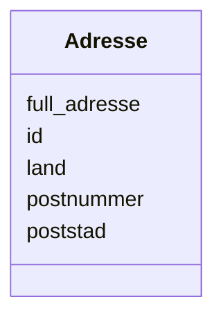

# Class: Adresse 


_Ei postadresse knytt til ein aktør, organisasjon eller kontaktpunkt._


URI: [locn:Address](http://www.w3.org/ns/locn#Address)





<!-- no inheritance hierarchy -->

## Class Properties

| Property | Value |
| --- | --- |
| Class URI | [locn:Address](http://www.w3.org/ns/locn#Address) |


## Eigenskapar


  
  

  
  

  
  

  
  

  
  


  
  

  
  

  
  

  
  

  
  


  
  

  
  
    
  

  
  
    
  

  
  
    
  

  
  
    
  


### Valgfri

| Namn | Kardinalitet og domene | Beskriving |
| --- | --- | --- |
| [full_adresse](full_adresse.md) | * <br/> [String](string.md) | Full adresse som fritekst |
| [postnummer](postnummer.md) | 0..1 <br/> [String](string.md) | Postnummer |
| [poststad](poststad.md) | * <br/> [LangString](langstring.md) | Poststad/by |
| [land](land.md) | 0..1 <br/> [String](string.md) | Land (ISO 3166-1 alpha-2 kode) |


  
  
  
  
    
  

  
  
  
    
      
    
      
    
      
    
  
  

  
  
  
    
      
    
      
    
      
    
  
  

  
  
  
    
      
    
      
    
      
    
  
  

  
  
  
    
      
    
      
    
      
    
  
  


### Andre

| Namn | Kardinalitet og domene | Beskriving |
| --- | --- | --- |
| [id](id.md) | 1 <br/> [Uriorcurie](uriorcurie.md) | URI-identifikator for ressursen |


## Usages

| used by | used in | type | used |
| ---  | --- | --- | --- |
| [Aktor](aktor.md) | [adresse_ref](adresse_ref.md) | range | [Adresse](adresse.md) |
| [OffentligOrganisasjon](offentligorganisasjon.md) | [adresse_ref](adresse_ref.md) | range | [Adresse](adresse.md) |


## Identifier and Mapping Information


### Schema Source


* from schema: https://data.norge.no/linkml/cpsv-ap-no


## Mappings

| Mapping Type | Mapped Value |
| ---  | ---  |
| self | locn:Address |
| native | https://data.norge.no/linkml/cpsv-ap-no/Adresse |


## LinkML Source

<!-- TODO: investigate https://stackoverflow.com/questions/37606292/how-to-create-tabbed-code-blocks-in-mkdocs-or-sphinx -->

### Direct

<details>
```yaml
name: Adresse
description: Ei postadresse knytt til ein aktør, organisasjon eller kontaktpunkt.
from_schema: https://data.norge.no/linkml/cpsv-ap-no
slots:
- id
- full_adresse
- postnummer
- poststad
- land
slot_usage:
  full_adresse:
    name: full_adresse
    in_subset:
    - Valgfri
  postnummer:
    name: postnummer
    in_subset:
    - Valgfri
  poststad:
    name: poststad
    in_subset:
    - Valgfri
  land:
    name: land
    in_subset:
    - Valgfri
class_uri: locn:Address

```
</details>

### Induced

<details>
```yaml
name: Adresse
description: Ei postadresse knytt til ein aktør, organisasjon eller kontaktpunkt.
from_schema: https://data.norge.no/linkml/cpsv-ap-no
slot_usage:
  full_adresse:
    name: full_adresse
    in_subset:
    - Valgfri
  postnummer:
    name: postnummer
    in_subset:
    - Valgfri
  poststad:
    name: poststad
    in_subset:
    - Valgfri
  land:
    name: land
    in_subset:
    - Valgfri
attributes:
  id:
    name: id
    description: URI-identifikator for ressursen.
    from_schema: https://data.norge.no/linkml/cpsv-ap-no
    rank: 1000
    identifier: true
    alias: id
    owner: Adresse
    domain_of:
    - OffentligTjeneste
    - Tjeneste
    - Hendelse
    - Aktor
    - Kontaktpunkt
    - Tjenestekanal
    - Dokumentasjonstype
    - Tjenesteresultattype
    - Tjenesteresultattypeliste
    - Gebyr
    - Regel
    - RegulativRessurs
    - Deltagelse
    - Adresse
    - Katalog
    - Mediatype
    - Konsept
    - Begrepssamling
    range: uriorcurie
    required: true
  full_adresse:
    name: full_adresse
    description: Full adresse som fritekst.
    in_subset:
    - Valgfri
    from_schema: https://data.norge.no/linkml/cpsv-ap-no
    rank: 1000
    slot_uri: locn:fullAddress
    alias: full_adresse
    owner: Adresse
    domain_of:
    - Adresse
    range: string
    multivalued: true
  postnummer:
    name: postnummer
    description: Postnummer.
    in_subset:
    - Valgfri
    from_schema: https://data.norge.no/linkml/cpsv-ap-no
    rank: 1000
    slot_uri: locn:postCode
    alias: postnummer
    owner: Adresse
    domain_of:
    - Adresse
    range: string
  poststad:
    name: poststad
    description: Poststad/by.
    in_subset:
    - Valgfri
    from_schema: https://data.norge.no/linkml/cpsv-ap-no
    rank: 1000
    slot_uri: locn:postName
    alias: poststad
    owner: Adresse
    domain_of:
    - Adresse
    range: LangString
    multivalued: true
  land:
    name: land
    description: Land (ISO 3166-1 alpha-2 kode).
    in_subset:
    - Valgfri
    from_schema: https://data.norge.no/linkml/cpsv-ap-no
    rank: 1000
    slot_uri: locn:adminUnitL1
    alias: land
    owner: Adresse
    domain_of:
    - Adresse
    range: string
class_uri: locn:Address

```
</details>