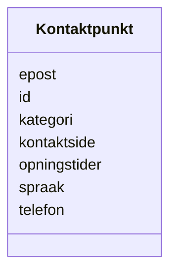

# Class: Kontaktpunkt 


_Kontaktinformasjon for ei teneste eller ein organisasjon._


URI: [cv:ContactPoint](http://data.europa.eu/m8g/ContactPoint)





<!-- no inheritance hierarchy -->

## Class Properties

| Property | Value |
| --- | --- |
| Class URI | [cv:ContactPoint](http://data.europa.eu/m8g/ContactPoint) |


## Eigenskapar


  
  

  
  

  
  

  
  

  
  

  
  

  
  


  
  

  
  

  
  

  
  

  
  

  
  

  
  


  
  

  
  
    
  

  
  
    
  

  
  
    
  

  
  
    
  

  
  
    
  

  
  
    
  


### Valgfri

| Namn | Kardinalitet og domene | Beskriving |
| --- | --- | --- |
| [epost](epost.md) | * <br/> [Uri](uri.md) | E-postadresse (mailto:-URI) |
| [telefon](telefon.md) | * <br/> [String](string.md) | Telefonnummer |
| [kontaktside](kontaktside.md) | * <br/> [Uri](uri.md) | Kontaktside (nettadresse) |
| [opningstider](opningstider.md) | * <br/> [String](string.md) | Opningstider |
| [spraak](spraak.md) | * <br/> [Spraak](spraak.md) | Språk brukt i ressursen (dct:language) |
| [kategori](kategori.md) | * <br/> [String](string.md) | Kategori for kontaktpunktet |


  
  
  
  
    
  

  
  
  
    
      
    
      
    
      
    
  
  

  
  
  
    
      
    
      
    
      
    
  
  

  
  
  
    
      
    
      
    
      
    
  
  

  
  
  
    
      
    
      
    
      
    
  
  

  
  
  
    
      
    
      
    
      
    
  
  

  
  
  
    
      
    
      
    
      
    
  
  


### Andre

| Namn | Kardinalitet og domene | Beskriving |
| --- | --- | --- |
| [id](id.md) | 1 <br/> [Uriorcurie](uriorcurie.md) | URI-identifikator for ressursen |


## Usages

| used by | used in | type | used |
| ---  | --- | --- | --- |
| [OffentligTjeneste](offentligtjeneste.md) | [har_kontaktpunkt](har_kontaktpunkt.md) | range | [Kontaktpunkt](kontaktpunkt.md) |
| [Tjeneste](tjeneste.md) | [har_kontaktpunkt](har_kontaktpunkt.md) | range | [Kontaktpunkt](kontaktpunkt.md) |
| [Hendelse](hendelse.md) | [har_kontaktpunkt](har_kontaktpunkt.md) | range | [Kontaktpunkt](kontaktpunkt.md) |
| [Livshendelse](livshendelse.md) | [har_kontaktpunkt](har_kontaktpunkt.md) | range | [Kontaktpunkt](kontaktpunkt.md) |
| [Virksomhetshendelse](virksomhetshendelse.md) | [har_kontaktpunkt](har_kontaktpunkt.md) | range | [Kontaktpunkt](kontaktpunkt.md) |
| [Katalog](katalog.md) | [har_kontaktpunkt](har_kontaktpunkt.md) | range | [Kontaktpunkt](kontaktpunkt.md) |


## Identifier and Mapping Information


### Schema Source


* from schema: https://data.norge.no/linkml/cpsv-ap-no


## Mappings

| Mapping Type | Mapped Value |
| ---  | ---  |
| self | cv:ContactPoint |
| native | https://data.norge.no/linkml/cpsv-ap-no/Kontaktpunkt |


## LinkML Source

<!-- TODO: investigate https://stackoverflow.com/questions/37606292/how-to-create-tabbed-code-blocks-in-mkdocs-or-sphinx -->

### Direct

<details>
```yaml
name: Kontaktpunkt
description: Kontaktinformasjon for ei teneste eller ein organisasjon.
from_schema: https://data.norge.no/linkml/cpsv-ap-no
slots:
- id
- epost
- telefon
- kontaktside
- opningstider
- spraak
- kategori
slot_usage:
  epost:
    name: epost
    in_subset:
    - Valgfri
  telefon:
    name: telefon
    in_subset:
    - Valgfri
  kontaktside:
    name: kontaktside
    in_subset:
    - Valgfri
  opningstider:
    name: opningstider
    in_subset:
    - Valgfri
  spraak:
    name: spraak
    in_subset:
    - Valgfri
  kategori:
    name: kategori
    in_subset:
    - Valgfri
class_uri: cv:ContactPoint

```
</details>

### Induced

<details>
```yaml
name: Kontaktpunkt
description: Kontaktinformasjon for ei teneste eller ein organisasjon.
from_schema: https://data.norge.no/linkml/cpsv-ap-no
slot_usage:
  epost:
    name: epost
    in_subset:
    - Valgfri
  telefon:
    name: telefon
    in_subset:
    - Valgfri
  kontaktside:
    name: kontaktside
    in_subset:
    - Valgfri
  opningstider:
    name: opningstider
    in_subset:
    - Valgfri
  spraak:
    name: spraak
    in_subset:
    - Valgfri
  kategori:
    name: kategori
    in_subset:
    - Valgfri
attributes:
  id:
    name: id
    description: URI-identifikator for ressursen.
    from_schema: https://data.norge.no/linkml/cpsv-ap-no
    rank: 1000
    identifier: true
    alias: id
    owner: Kontaktpunkt
    domain_of:
    - OffentligTjeneste
    - Tjeneste
    - Hendelse
    - Aktor
    - Kontaktpunkt
    - Tjenestekanal
    - Dokumentasjonstype
    - Tjenesteresultattype
    - Tjenesteresultattypeliste
    - Gebyr
    - Regel
    - RegulativRessurs
    - Deltagelse
    - Adresse
    - Katalog
    - Mediatype
    - Konsept
    - Begrepssamling
    range: uriorcurie
    required: true
  epost:
    name: epost
    description: E-postadresse (mailto:-URI).
    in_subset:
    - Valgfri
    from_schema: https://data.norge.no/linkml/cpsv-ap-no
    rank: 1000
    slot_uri: cv:email
    alias: epost
    owner: Kontaktpunkt
    domain_of:
    - Kontaktpunkt
    range: uri
    multivalued: true
  telefon:
    name: telefon
    description: Telefonnummer.
    in_subset:
    - Valgfri
    from_schema: https://data.norge.no/linkml/cpsv-ap-no
    rank: 1000
    slot_uri: cv:telephone
    alias: telefon
    owner: Kontaktpunkt
    domain_of:
    - Kontaktpunkt
    range: string
    multivalued: true
  kontaktside:
    name: kontaktside
    description: Kontaktside (nettadresse).
    in_subset:
    - Valgfri
    from_schema: https://data.norge.no/linkml/cpsv-ap-no
    rank: 1000
    slot_uri: cv:contactPage
    alias: kontaktside
    owner: Kontaktpunkt
    domain_of:
    - Kontaktpunkt
    range: uri
    multivalued: true
  opningstider:
    name: opningstider
    description: Opningstider.
    in_subset:
    - Valgfri
    from_schema: https://data.norge.no/linkml/cpsv-ap-no
    rank: 1000
    slot_uri: cv:openingHours
    alias: opningstider
    owner: Kontaktpunkt
    domain_of:
    - Kontaktpunkt
    - Tjenestekanal
    range: string
    multivalued: true
  spraak:
    name: spraak
    description: Språk brukt i ressursen (dct:language).
    in_subset:
    - Valgfri
    from_schema: https://data.norge.no/linkml/cpsv-ap-no
    rank: 1000
    slot_uri: dct:language
    alias: spraak
    owner: Kontaktpunkt
    domain_of:
    - OffentligTjeneste
    - Tjeneste
    - Kontaktpunkt
    - Regel
    - Katalog
    range: Spraak
    multivalued: true
  kategori:
    name: kategori
    description: Kategori for kontaktpunktet.
    in_subset:
    - Valgfri
    from_schema: https://data.norge.no/linkml/cpsv-ap-no
    rank: 1000
    slot_uri: vcard:category
    alias: kategori
    owner: Kontaktpunkt
    domain_of:
    - Kontaktpunkt
    range: string
    multivalued: true
class_uri: cv:ContactPoint

```
</details>