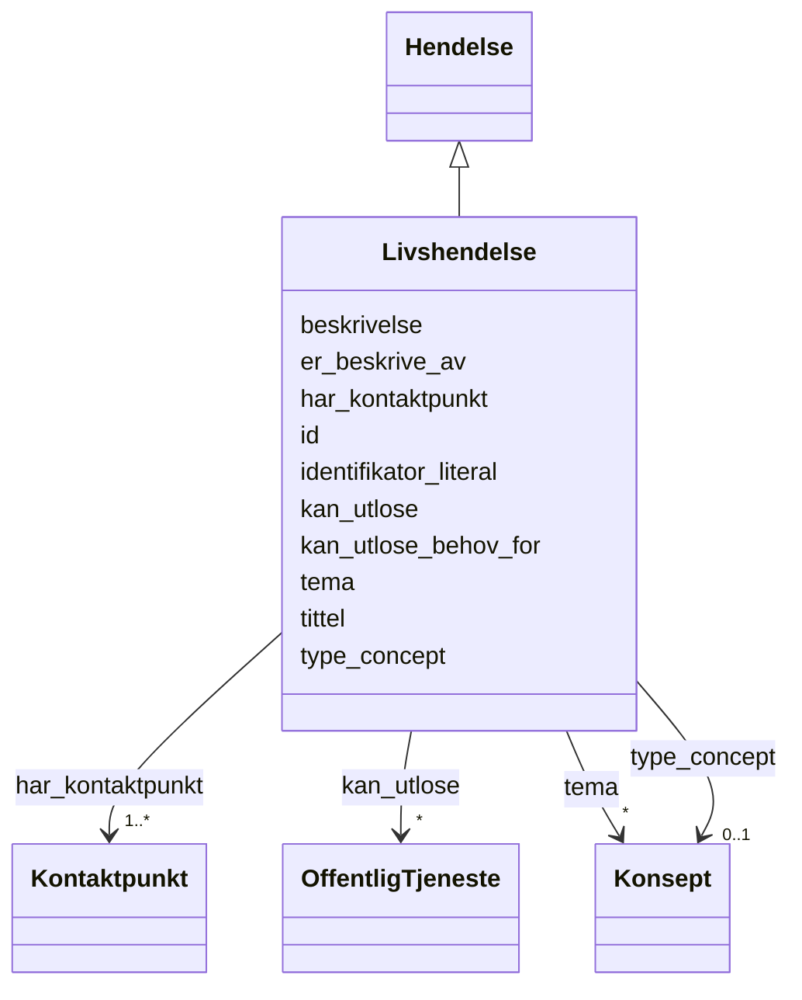

# Class: Livshendelse 


_Ei livshending som kan utløyse behov for tenester (t.d. fødsel, ekteskap)._


URI: [cv:LifeEvent](http://data.europa.eu/m8g/LifeEvent)





## Inheritance
* [Hendelse](hendelse.md)
    * **Livshendelse**


## Class Properties

| Property | Value |
| --- | --- |
| Class URI | [cv:LifeEvent](http://data.europa.eu/m8g/LifeEvent) |


## Eigenskapar


  
  


  
  
    
  


### Anbefalt

| Namn | Kardinalitet og domene | Beskriving |
| --- | --- | --- |
| [kan_utlose_behov_for](kan_utlose_behov_for.md) | * <br/> [Uriorcurie](uriorcurie.md) | Tenester det kan oppstå behov for som følgje av hendinga |


  
  


  
  
  
    
      
    
      
    
      
    
  
  


### Arva

| Namn | Kardinalitet og domene | Beskriving | Frå |
| --- | --- | --- | --- || [id](id.md) | 1 <br/> [Uriorcurie](uriorcurie.md) | URI-identifikator for ressursen | [Hendelse](hendelse.md) |
| [tittel](tittel.md) | 1..* <br/> [LangString](langstring.md) | Namn/tittel på ressursen (dct:title) | [Hendelse](hendelse.md) |
| [identifikator_literal](identifikator_literal.md) | 1 <br/> [String](string.md) | Tekstleg identifikator for ressursen (dct:identifier) | [Hendelse](hendelse.md) |
| [har_kontaktpunkt](har_kontaktpunkt.md) | 1..* <br/> [Kontaktpunkt](kontaktpunkt.md) | Kontaktpunkt for tenesta eller organisasjonen | [Hendelse](hendelse.md) |
| [beskrivelse](beskrivelse.md) | * <br/> [LangString](langstring.md) | Fritekstbeskrivelse av ressursen (dct:description) | [Hendelse](hendelse.md) |
| [kan_utlose](kan_utlose.md) | * <br/> [OffentligTjeneste](offentligtjeneste.md) | Offentlege tenester hendinga kan utløyse | [Hendelse](hendelse.md) |
| [tema](tema.md) | * <br/> [Konsept](konsept.md) | Emne/tema tenesta handlar om | [Hendelse](hendelse.md) |
| [er_beskrive_av](er_beskrive_av.md) | * <br/> [Uri](uri.md) | Datasett som beskriv ressursen | [Hendelse](hendelse.md) |
| [type_concept](type_concept.md) | 0..1 <br/> [Konsept](konsept.md) | Type ressurs frå eit kontrollert vokabular (dct:type) | [Hendelse](hendelse.md) |


## Identifier and Mapping Information


### Schema Source


* from schema: https://data.norge.no/linkml/cpsv-ap-no


## Mappings

| Mapping Type | Mapped Value |
| ---  | ---  |
| self | cv:LifeEvent |
| native | https://data.norge.no/linkml/cpsv-ap-no/Livshendelse |


## LinkML Source

<!-- TODO: investigate https://stackoverflow.com/questions/37606292/how-to-create-tabbed-code-blocks-in-mkdocs-or-sphinx -->

### Direct

<details>
```yaml
name: Livshendelse
description: Ei livshending som kan utløyse behov for tenester (t.d. fødsel, ekteskap).
from_schema: https://data.norge.no/linkml/cpsv-ap-no
is_a: Hendelse
slots:
- kan_utlose_behov_for
slot_usage:
  kan_utlose_behov_for:
    name: kan_utlose_behov_for
    in_subset:
    - Anbefalt
class_uri: cv:LifeEvent

```
</details>

### Induced

<details>
```yaml
name: Livshendelse
description: Ei livshending som kan utløyse behov for tenester (t.d. fødsel, ekteskap).
from_schema: https://data.norge.no/linkml/cpsv-ap-no
is_a: Hendelse
slot_usage:
  kan_utlose_behov_for:
    name: kan_utlose_behov_for
    in_subset:
    - Anbefalt
attributes:
  kan_utlose_behov_for:
    name: kan_utlose_behov_for
    description: Tenester det kan oppstå behov for som følgje av hendinga.
    in_subset:
    - Anbefalt
    from_schema: https://data.norge.no/linkml/cpsv-ap-no
    rank: 1000
    slot_uri: cpsvno:mayTriggerNeedFor
    alias: kan_utlose_behov_for
    owner: Livshendelse
    domain_of:
    - Livshendelse
    - Virksomhetshendelse
    range: uriorcurie
    multivalued: true
  id:
    name: id
    description: URI-identifikator for ressursen.
    from_schema: https://data.norge.no/linkml/cpsv-ap-no
    rank: 1000
    identifier: true
    alias: id
    owner: Livshendelse
    domain_of:
    - OffentligTjeneste
    - Tjeneste
    - Hendelse
    - Aktor
    - Kontaktpunkt
    - Tjenestekanal
    - Dokumentasjonstype
    - Tjenesteresultattype
    - Tjenesteresultattypeliste
    - Gebyr
    - Regel
    - RegulativRessurs
    - Deltagelse
    - Adresse
    - Katalog
    - Mediatype
    - Konsept
    - Begrepssamling
    range: uriorcurie
    required: true
  tittel:
    name: tittel
    description: Namn/tittel på ressursen (dct:title).
    in_subset:
    - Obligatorisk
    from_schema: https://data.norge.no/linkml/cpsv-ap-no
    rank: 1000
    slot_uri: dct:title
    alias: tittel
    owner: Livshendelse
    domain_of:
    - OffentligTjeneste
    - Tjeneste
    - Hendelse
    - Aktor
    - Dokumentasjonstype
    - Tjenesteresultattype
    - Tjenesteresultattypeliste
    - Regel
    - RegulativRessurs
    - Katalog
    range: LangString
    required: true
    multivalued: true
  identifikator_literal:
    name: identifikator_literal
    description: Tekstleg identifikator for ressursen (dct:identifier).
    in_subset:
    - Obligatorisk
    from_schema: https://data.norge.no/linkml/cpsv-ap-no
    rank: 1000
    slot_uri: dct:identifier
    alias: identifikator_literal
    owner: Livshendelse
    domain_of:
    - OffentligTjeneste
    - Tjeneste
    - Hendelse
    - Aktor
    - Tjenestekanal
    - Dokumentasjonstype
    - Tjenesteresultattype
    - Gebyr
    - Regel
    - RegulativRessurs
    - Katalog
    range: string
    required: true
  har_kontaktpunkt:
    name: har_kontaktpunkt
    description: Kontaktpunkt for tenesta eller organisasjonen.
    in_subset:
    - Obligatorisk
    from_schema: https://data.norge.no/linkml/cpsv-ap-no
    rank: 1000
    slot_uri: cv:contactPoint
    alias: har_kontaktpunkt
    owner: Livshendelse
    domain_of:
    - OffentligTjeneste
    - Tjeneste
    - Hendelse
    - Katalog
    range: Kontaktpunkt
    required: true
    multivalued: true
  beskrivelse:
    name: beskrivelse
    description: Fritekstbeskrivelse av ressursen (dct:description).
    in_subset:
    - Anbefalt
    from_schema: https://data.norge.no/linkml/cpsv-ap-no
    rank: 1000
    slot_uri: dct:description
    alias: beskrivelse
    owner: Livshendelse
    domain_of:
    - OffentligTjeneste
    - Tjeneste
    - Hendelse
    - Tjenestekanal
    - Dokumentasjonstype
    - Tjenesteresultattype
    - Tjenesteresultattypeliste
    - Gebyr
    - Regel
    - Katalog
    range: LangString
    multivalued: true
  kan_utlose:
    name: kan_utlose
    description: Offentlege tenester hendinga kan utløyse.
    in_subset:
    - Anbefalt
    from_schema: https://data.norge.no/linkml/cpsv-ap-no
    rank: 1000
    slot_uri: cpsvno:mayTrigger
    alias: kan_utlose
    owner: Livshendelse
    domain_of:
    - Hendelse
    range: OffentligTjeneste
    multivalued: true
  tema:
    name: tema
    description: Emne/tema tenesta handlar om.
    in_subset:
    - Valgfri
    from_schema: https://data.norge.no/linkml/cpsv-ap-no
    rank: 1000
    slot_uri: dct:subject
    alias: tema
    owner: Livshendelse
    domain_of:
    - OffentligTjeneste
    - Tjeneste
    - Hendelse
    range: Konsept
    multivalued: true
  er_beskrive_av:
    name: er_beskrive_av
    description: Datasett som beskriv ressursen.
    in_subset:
    - Valgfri
    from_schema: https://data.norge.no/linkml/cpsv-ap-no
    rank: 1000
    slot_uri: cccevno:isDescribedBy
    alias: er_beskrive_av
    owner: Livshendelse
    domain_of:
    - OffentligTjeneste
    - Tjeneste
    - Hendelse
    - Dokumentasjonstype
    - Tjenesteresultattype
    range: uri
    multivalued: true
  type_concept:
    name: type_concept
    description: Type ressurs frå eit kontrollert vokabular (dct:type).
    in_subset:
    - Valgfri
    from_schema: https://data.norge.no/linkml/cpsv-ap-no
    rank: 1000
    slot_uri: dct:type
    alias: type_concept
    owner: Livshendelse
    domain_of:
    - OffentligTjeneste
    - Tjeneste
    - Hendelse
    - OffentligOrganisasjon
    - Tjenestekanal
    - Tjenesteresultattype
    - Regel
    - RegulativRessurs
    range: Konsept
class_uri: cv:LifeEvent

```
</details>