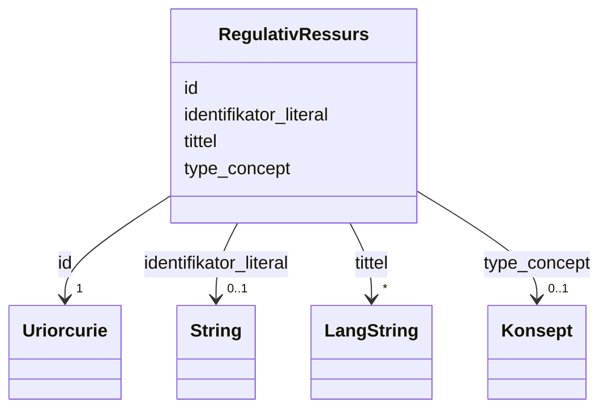

# Class: RegulativRessurs 


_Ein regulativ ressurs (lov, forskrift o.l.) knytt til ei teneste._


URI: [eli:LegalResource](http://data.europa.eu/eli/ontology#LegalResource)





<!-- no inheritance hierarchy -->

## Class Properties

| Property | Value |
| --- | --- |
| Class URI | [eli:LegalResource](http://data.europa.eu/eli/ontology#LegalResource) |


## Eigenskapar


  
  

  
  

  
  

  
  


  
  

  
  

  
  

  
  


  
  

  
  
    
  

  
  
    
  

  
  
    
  


### Valgfri

| Namn | Kardinalitet og domene | Beskriving |
| --- | --- | --- |
| [tittel](tittel.md) | * <br/> [LangString](langstring.md) | Namn/tittel på ressursen (dct:title) |
| [identifikator_literal](identifikator_literal.md) | 0..1 <br/> [xsd:string](http://www.w3.org/2001/XMLSchema#string) | Tekstleg identifikator for ressursen (dct:identifier) |
| [type_concept](type_concept.md) | 0..1 <br/> [Konsept](konsept.md) | Type ressurs frå eit kontrollert vokabular (dct:type) |


  
  
  
  
    
  

  
  
  
    
      
    
      
    
      
    
  
  

  
  
  
    
      
    
      
    
      
    
  
  

  
  
  
    
      
    
      
    
      
    
  
  


### Andre

| Namn | Kardinalitet og domene | Beskriving |
| --- | --- | --- |
| [id](id.md) | 1 <br/> [xsd:anyURI](http://www.w3.org/2001/XMLSchema#anyURI) | URI-identifikator for ressursen |


## Usages

| used by | used in | type | used |
| ---  | --- | --- | --- |
| [OffentligTjeneste](offentligtjeneste.md) | [har_regulativ_ressurs](har_regulativ_ressurs.md) | range | [RegulativRessurs](regulativressurs.md) |
| [Tjeneste](tjeneste.md) | [har_regulativ_ressurs](har_regulativ_ressurs.md) | range | [RegulativRessurs](regulativressurs.md) |


## Identifier and Mapping Information


### Schema Source


* from schema: https://data.norge.no/linkml/cpsv-ap-no


## Mappings

| Mapping Type | Mapped Value |
| ---  | ---  |
| self | eli:LegalResource |
| native | https://data.norge.no/linkml/cpsv-ap-no/RegulativRessurs |


## LinkML Source

<!-- TODO: investigate https://stackoverflow.com/questions/37606292/how-to-create-tabbed-code-blocks-in-mkdocs-or-sphinx -->

### Direct

<details>
```yaml
name: RegulativRessurs
description: Ein regulativ ressurs (lov, forskrift o.l.) knytt til ei teneste.
from_schema: https://data.norge.no/linkml/cpsv-ap-no
rank: 1000
slots:
- id
- tittel
- identifikator_literal
- type_concept
slot_usage:
  tittel:
    name: tittel
    in_subset:
    - Valgfri
  identifikator_literal:
    name: identifikator_literal
    in_subset:
    - Valgfri
  type_concept:
    name: type_concept
    in_subset:
    - Valgfri
class_uri: eli:LegalResource

```
</details>

### Induced

<details>
```yaml
name: RegulativRessurs
description: Ein regulativ ressurs (lov, forskrift o.l.) knytt til ei teneste.
from_schema: https://data.norge.no/linkml/cpsv-ap-no
rank: 1000
slot_usage:
  tittel:
    name: tittel
    in_subset:
    - Valgfri
  identifikator_literal:
    name: identifikator_literal
    in_subset:
    - Valgfri
  type_concept:
    name: type_concept
    in_subset:
    - Valgfri
attributes:
  id:
    name: id
    description: URI-identifikator for ressursen.
    from_schema: https://data.norge.no/linkml/common-ap-no
    identifier: true
    alias: id
    owner: RegulativRessurs
    domain_of:
    - Mediatype
    - Konsept
    - Begrepssamling
    - OffentligTjeneste
    - Tjeneste
    - Hendelse
    - Aktor
    - Kontaktpunkt
    - Tjenestekanal
    - Dokumentasjonstype
    - Tjenesteresultattype
    - Tjenesteresultattypeliste
    - Gebyr
    - Regel
    - RegulativRessurs
    - Deltagelse
    - Adresse
    - Katalog
    range: uriorcurie
    required: true
  tittel:
    name: tittel
    description: Namn/tittel på ressursen (dct:title).
    in_subset:
    - Valgfri
    from_schema: https://data.norge.no/linkml/common-ap-no
    slot_uri: dct:title
    alias: tittel
    owner: RegulativRessurs
    domain_of:
    - OffentligTjeneste
    - Tjeneste
    - Hendelse
    - Aktor
    - Dokumentasjonstype
    - Tjenesteresultattype
    - Tjenesteresultattypeliste
    - Regel
    - RegulativRessurs
    - Katalog
    range: LangString
    multivalued: true
  identifikator_literal:
    name: identifikator_literal
    description: Tekstleg identifikator for ressursen (dct:identifier).
    in_subset:
    - Valgfri
    from_schema: https://data.norge.no/linkml/common-ap-no
    slot_uri: dct:identifier
    alias: identifikator_literal
    owner: RegulativRessurs
    domain_of:
    - OffentligTjeneste
    - Tjeneste
    - Hendelse
    - Aktor
    - Tjenestekanal
    - Dokumentasjonstype
    - Tjenesteresultattype
    - Gebyr
    - Regel
    - RegulativRessurs
    - Katalog
    range: string
  type_concept:
    name: type_concept
    description: Type ressurs frå eit kontrollert vokabular (dct:type).
    in_subset:
    - Valgfri
    from_schema: https://data.norge.no/linkml/common-ap-no
    slot_uri: dct:type
    alias: type_concept
    owner: RegulativRessurs
    domain_of:
    - OffentligTjeneste
    - Tjeneste
    - Hendelse
    - OffentligOrganisasjon
    - Tjenestekanal
    - Tjenesteresultattype
    - Regel
    - RegulativRessurs
    range: Konsept
class_uri: eli:LegalResource

```
</details>