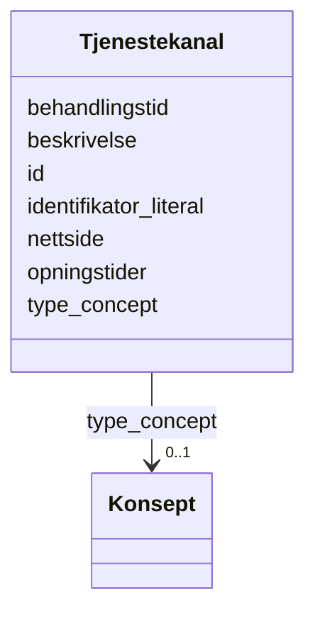

# Class: Tjenestekanal 


_Ein kanal for å få tilgang til ei teneste (t.d. nett, telefon, oppmøte)._


URI: [cv:Channel](http://data.europa.eu/m8g/Channel)





<!-- no inheritance hierarchy -->

## Class Properties

| Property | Value |
| --- | --- |
| Class URI | [cv:Channel](http://data.europa.eu/m8g/Channel) |


## Eigenskapar


  
  

  
  
    
  

  
  

  
  

  
  

  
  

  
  


### Obligatorisk

| Namn | Kardinalitet og domene | Beskriving |
| --- | --- | --- |
| [identifikator_literal](identifikator_literal.md) | 1 <br/> [String](string.md) | Tekstleg identifikator for ressursen (dct:identifier) |


  
  

  
  

  
  
    
  

  
  

  
  

  
  

  
  


### Anbefalt

| Namn | Kardinalitet og domene | Beskriving |
| --- | --- | --- |
| [type_concept](type_concept.md) | 0..1 <br/> [Konsept](konsept.md) | Type ressurs frå eit kontrollert vokabular (dct:type) |


  
  

  
  

  
  

  
  
    
  

  
  
    
  

  
  
    
  

  
  
    
  


### Valgfri

| Namn | Kardinalitet og domene | Beskriving |
| --- | --- | --- |
| [behandlingstid](behandlingstid.md) | 0..1 <br/> [Duration](duration.md) | Forventa behandlingstid for tenesta eller kanalen (ISO 8601) |
| [opningstider](opningstider.md) | * <br/> [String](string.md) | Opningstider |
| [beskrivelse](beskrivelse.md) | * <br/> [LangString](langstring.md) | Fritekstbeskrivelse av ressursen (dct:description) |
| [nettside](nettside.md) | * <br/> [Uri](uri.md) | Nettside for tenestekanalane |


  
  
  
  
    
  

  
  
  
    
      
    
      
    
      
    
  
  

  
  
  
    
      
    
      
    
      
    
  
  

  
  
  
    
      
    
      
    
      
    
  
  

  
  
  
    
      
    
      
    
      
    
  
  

  
  
  
    
      
    
      
    
      
    
  
  

  
  
  
    
      
    
      
    
      
    
  
  


### Andre

| Namn | Kardinalitet og domene | Beskriving |
| --- | --- | --- |
| [id](id.md) | 1 <br/> [Uriorcurie](uriorcurie.md) | URI-identifikator for ressursen |


## Usages

| used by | used in | type | used |
| ---  | --- | --- | --- |
| [OffentligTjeneste](offentligtjeneste.md) | [har_tenestekanal](har_tenestekanal.md) | range | [Tjenestekanal](tjenestekanal.md) |
| [Tjeneste](tjeneste.md) | [har_tenestekanal](har_tenestekanal.md) | range | [Tjenestekanal](tjenestekanal.md) |


## Identifier and Mapping Information


### Schema Source


* from schema: https://data.norge.no/linkml/cpsv-ap-no


## Mappings

| Mapping Type | Mapped Value |
| ---  | ---  |
| self | cv:Channel |
| native | https://data.norge.no/linkml/cpsv-ap-no/Tjenestekanal |


## LinkML Source

<!-- TODO: investigate https://stackoverflow.com/questions/37606292/how-to-create-tabbed-code-blocks-in-mkdocs-or-sphinx -->

### Direct

<details>
```yaml
name: Tjenestekanal
description: Ein kanal for å få tilgang til ei teneste (t.d. nett, telefon, oppmøte).
from_schema: https://data.norge.no/linkml/cpsv-ap-no
slots:
- id
- identifikator_literal
- type_concept
- behandlingstid
- opningstider
- beskrivelse
- nettside
slot_usage:
  identifikator_literal:
    name: identifikator_literal
    in_subset:
    - Obligatorisk
    required: true
  type_concept:
    name: type_concept
    in_subset:
    - Anbefalt
  behandlingstid:
    name: behandlingstid
    in_subset:
    - Valgfri
  opningstider:
    name: opningstider
    in_subset:
    - Valgfri
  beskrivelse:
    name: beskrivelse
    in_subset:
    - Valgfri
  nettside:
    name: nettside
    in_subset:
    - Valgfri
class_uri: cv:Channel

```
</details>

### Induced

<details>
```yaml
name: Tjenestekanal
description: Ein kanal for å få tilgang til ei teneste (t.d. nett, telefon, oppmøte).
from_schema: https://data.norge.no/linkml/cpsv-ap-no
slot_usage:
  identifikator_literal:
    name: identifikator_literal
    in_subset:
    - Obligatorisk
    required: true
  type_concept:
    name: type_concept
    in_subset:
    - Anbefalt
  behandlingstid:
    name: behandlingstid
    in_subset:
    - Valgfri
  opningstider:
    name: opningstider
    in_subset:
    - Valgfri
  beskrivelse:
    name: beskrivelse
    in_subset:
    - Valgfri
  nettside:
    name: nettside
    in_subset:
    - Valgfri
attributes:
  id:
    name: id
    description: URI-identifikator for ressursen.
    from_schema: https://data.norge.no/linkml/cpsv-ap-no
    rank: 1000
    identifier: true
    alias: id
    owner: Tjenestekanal
    domain_of:
    - OffentligTjeneste
    - Tjeneste
    - Hendelse
    - Aktor
    - Kontaktpunkt
    - Tjenestekanal
    - Dokumentasjonstype
    - Tjenesteresultattype
    - Tjenesteresultattypeliste
    - Gebyr
    - Regel
    - RegulativRessurs
    - Deltagelse
    - Adresse
    - Katalog
    - Mediatype
    - Konsept
    - Begrepssamling
    range: uriorcurie
    required: true
  identifikator_literal:
    name: identifikator_literal
    description: Tekstleg identifikator for ressursen (dct:identifier).
    in_subset:
    - Obligatorisk
    from_schema: https://data.norge.no/linkml/cpsv-ap-no
    rank: 1000
    slot_uri: dct:identifier
    alias: identifikator_literal
    owner: Tjenestekanal
    domain_of:
    - OffentligTjeneste
    - Tjeneste
    - Hendelse
    - Aktor
    - Tjenestekanal
    - Dokumentasjonstype
    - Tjenesteresultattype
    - Gebyr
    - Regel
    - RegulativRessurs
    - Katalog
    range: string
    required: true
  type_concept:
    name: type_concept
    description: Type ressurs frå eit kontrollert vokabular (dct:type).
    in_subset:
    - Anbefalt
    from_schema: https://data.norge.no/linkml/cpsv-ap-no
    rank: 1000
    slot_uri: dct:type
    alias: type_concept
    owner: Tjenestekanal
    domain_of:
    - OffentligTjeneste
    - Tjeneste
    - Hendelse
    - OffentligOrganisasjon
    - Tjenestekanal
    - Tjenesteresultattype
    - Regel
    - RegulativRessurs
    range: Konsept
  behandlingstid:
    name: behandlingstid
    description: Forventa behandlingstid for tenesta eller kanalen (ISO 8601).
    in_subset:
    - Valgfri
    from_schema: https://data.norge.no/linkml/cpsv-ap-no
    rank: 1000
    slot_uri: cv:processingTime
    alias: behandlingstid
    owner: Tjenestekanal
    domain_of:
    - OffentligTjeneste
    - Tjeneste
    - Tjenestekanal
    range: Duration
  opningstider:
    name: opningstider
    description: Opningstider.
    in_subset:
    - Valgfri
    from_schema: https://data.norge.no/linkml/cpsv-ap-no
    rank: 1000
    slot_uri: cv:openingHours
    alias: opningstider
    owner: Tjenestekanal
    domain_of:
    - Kontaktpunkt
    - Tjenestekanal
    range: string
    multivalued: true
  beskrivelse:
    name: beskrivelse
    description: Fritekstbeskrivelse av ressursen (dct:description).
    in_subset:
    - Valgfri
    from_schema: https://data.norge.no/linkml/cpsv-ap-no
    rank: 1000
    slot_uri: dct:description
    alias: beskrivelse
    owner: Tjenestekanal
    domain_of:
    - OffentligTjeneste
    - Tjeneste
    - Hendelse
    - Tjenestekanal
    - Dokumentasjonstype
    - Tjenesteresultattype
    - Tjenesteresultattypeliste
    - Gebyr
    - Regel
    - Katalog
    range: LangString
    multivalued: true
  nettside:
    name: nettside
    description: Nettside for tenestekanalane.
    in_subset:
    - Valgfri
    from_schema: https://data.norge.no/linkml/cpsv-ap-no
    rank: 1000
    slot_uri: vcard:hasURL
    alias: nettside
    owner: Tjenestekanal
    domain_of:
    - Tjenestekanal
    range: uri
    multivalued: true
class_uri: cv:Channel

```
</details>