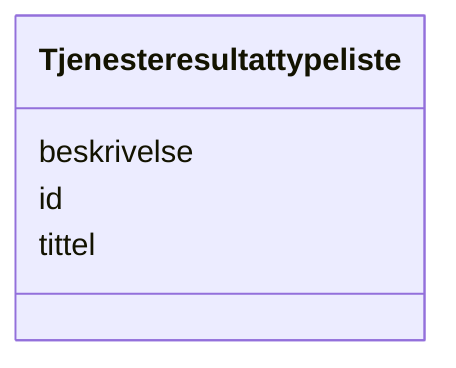

# Class: Tjenesteresultattypeliste 


_Ei liste over moglege tjenesteresultattypar._


URI: [cpsvno:OutputTypeList](https://data.norge.no/vocabulary/cpsvno#OutputTypeList)





<!-- no inheritance hierarchy -->

## Class Properties

| Property | Value |
| --- | --- |
| Class URI | [cpsvno:OutputTypeList](https://data.norge.no/vocabulary/cpsvno#OutputTypeList) |


## Eigenskapar


  
  

  
  

  
  


  
  

  
  

  
  


  
  

  
  

  
  


  
  
  
  
    
  

  
  
  
  
    
  

  
  
  
  
    
  


### Andre

| Namn | Kardinalitet og domene | Beskriving |
| --- | --- | --- |
| [id](id.md) | 1 <br/> [Uriorcurie](uriorcurie.md) | URI-identifikator for ressursen |
| [tittel](tittel.md) | * <br/> [LangString](langstring.md) | Namn/tittel på ressursen (dct:title) |
| [beskrivelse](beskrivelse.md) | * <br/> [LangString](langstring.md) | Fritekstbeskrivelse av ressursen (dct:description) |


## Identifier and Mapping Information


### Schema Source


* from schema: https://data.norge.no/linkml/cpsv-ap-no


## Mappings

| Mapping Type | Mapped Value |
| ---  | ---  |
| self | cpsvno:OutputTypeList |
| native | https://data.norge.no/linkml/cpsv-ap-no/Tjenesteresultattypeliste |


## LinkML Source

<!-- TODO: investigate https://stackoverflow.com/questions/37606292/how-to-create-tabbed-code-blocks-in-mkdocs-or-sphinx -->

### Direct

<details>
```yaml
name: Tjenesteresultattypeliste
description: Ei liste over moglege tjenesteresultattypar.
from_schema: https://data.norge.no/linkml/cpsv-ap-no
slots:
- id
- tittel
- beskrivelse
class_uri: cpsvno:OutputTypeList

```
</details>

### Induced

<details>
```yaml
name: Tjenesteresultattypeliste
description: Ei liste over moglege tjenesteresultattypar.
from_schema: https://data.norge.no/linkml/cpsv-ap-no
attributes:
  id:
    name: id
    description: URI-identifikator for ressursen.
    from_schema: https://data.norge.no/linkml/cpsv-ap-no
    rank: 1000
    identifier: true
    alias: id
    owner: Tjenesteresultattypeliste
    domain_of:
    - OffentligTjeneste
    - Tjeneste
    - Hendelse
    - Aktor
    - Kontaktpunkt
    - Tjenestekanal
    - Dokumentasjonstype
    - Tjenesteresultattype
    - Tjenesteresultattypeliste
    - Gebyr
    - Regel
    - RegulativRessurs
    - Deltagelse
    - Adresse
    - Katalog
    - Mediatype
    - Konsept
    - Begrepssamling
    range: uriorcurie
    required: true
  tittel:
    name: tittel
    description: Namn/tittel på ressursen (dct:title).
    from_schema: https://data.norge.no/linkml/cpsv-ap-no
    rank: 1000
    slot_uri: dct:title
    alias: tittel
    owner: Tjenesteresultattypeliste
    domain_of:
    - OffentligTjeneste
    - Tjeneste
    - Hendelse
    - Aktor
    - Dokumentasjonstype
    - Tjenesteresultattype
    - Tjenesteresultattypeliste
    - Regel
    - RegulativRessurs
    - Katalog
    range: LangString
    multivalued: true
  beskrivelse:
    name: beskrivelse
    description: Fritekstbeskrivelse av ressursen (dct:description).
    from_schema: https://data.norge.no/linkml/cpsv-ap-no
    rank: 1000
    slot_uri: dct:description
    alias: beskrivelse
    owner: Tjenesteresultattypeliste
    domain_of:
    - OffentligTjeneste
    - Tjeneste
    - Hendelse
    - Tjenestekanal
    - Dokumentasjonstype
    - Tjenesteresultattype
    - Tjenesteresultattypeliste
    - Gebyr
    - Regel
    - Katalog
    range: LangString
    multivalued: true
class_uri: cpsvno:OutputTypeList

```
</details>