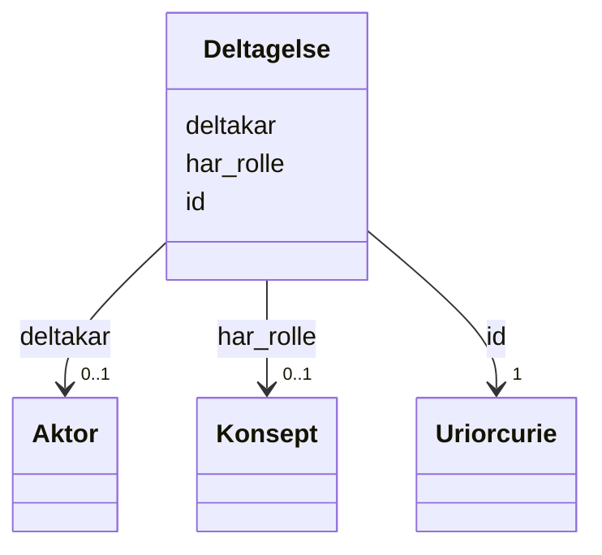

# Class: Deltagelse 


_Ei rolle ein aktør har i leveringa av ei teneste._


URI: [cv:Participation](http://data.europa.eu/m8g/Participation)





<!-- no inheritance hierarchy -->

## Class Properties

| Property | Value |
| --- | --- |
| Class URI | [cv:Participation](http://data.europa.eu/m8g/Participation) |


## Eigenskapar


  
  

  
  

  
  


  
  

  
  

  
  


  
  

  
  
    
  

  
  
    
  


### Valgfri

| Namn | Kardinalitet og domene | Beskriving |
| --- | --- | --- |
| [har_rolle](har_rolle.md) | 0..1 <br/> [Konsept](konsept.md) | Rolla aktøren har i ei deltaking |
| [deltakar](deltakar.md) | 0..1 <br/> [Aktor](aktor.md) | Aktøren som deltek |


  
  
  
  
    
  

  
  
  
    
      
    
      
    
      
    
  
  

  
  
  
    
      
    
      
    
      
    
  
  


### Andre

| Namn | Kardinalitet og domene | Beskriving |
| --- | --- | --- |
| [id](id.md) | 1 <br/> [xsd:anyURI](http://www.w3.org/2001/XMLSchema#anyURI) | URI-identifikator for ressursen |


## Usages

| used by | used in | type | used |
| ---  | --- | --- | --- |
| [OffentligTjeneste](offentligtjeneste.md) | [har_deltaking](har_deltaking.md) | range | [Deltagelse](deltagelse.md) |
| [Tjeneste](tjeneste.md) | [har_deltaking](har_deltaking.md) | range | [Deltagelse](deltagelse.md) |
| [Aktor](aktor.md) | [deltek_i](deltek_i.md) | range | [Deltagelse](deltagelse.md) |
| [OffentligOrganisasjon](offentligorganisasjon.md) | [deltek_i](deltek_i.md) | range | [Deltagelse](deltagelse.md) |


## Identifier and Mapping Information


### Schema Source


* from schema: https://data.norge.no/ap-no/cpsv-ap-no


## Mappings

| Mapping Type | Mapped Value |
| ---  | ---  |
| self | cv:Participation |
| native | https://data.norge.no/ap-no/cpsv-ap-no/Deltagelse |


## LinkML Source

<!-- TODO: investigate https://stackoverflow.com/questions/37606292/how-to-create-tabbed-code-blocks-in-mkdocs-or-sphinx -->

### Direct

<details>
```yaml
name: Deltagelse
description: Ei rolle ein aktør har i leveringa av ei teneste.
from_schema: https://data.norge.no/ap-no/cpsv-ap-no
rank: 1000
slots:
- id
- har_rolle
- deltakar
slot_usage:
  har_rolle:
    name: har_rolle
    in_subset:
    - Valgfri
  deltakar:
    name: deltakar
    in_subset:
    - Valgfri
class_uri: cv:Participation

```
</details>

### Induced

<details>
```yaml
name: Deltagelse
description: Ei rolle ein aktør har i leveringa av ei teneste.
from_schema: https://data.norge.no/ap-no/cpsv-ap-no
rank: 1000
slot_usage:
  har_rolle:
    name: har_rolle
    in_subset:
    - Valgfri
  deltakar:
    name: deltakar
    in_subset:
    - Valgfri
attributes:
  id:
    name: id
    description: URI-identifikator for ressursen.
    from_schema: https://data.norge.no/ap-no/common-ap-no
    identifier: true
    owner: Deltagelse
    domain_of:
    - Mediatype
    - Konsept
    - Begrepssamling
    - OffentligTjeneste
    - Tjeneste
    - Hendelse
    - Aktor
    - Kontaktpunkt
    - Tjenestekanal
    - Dokumentasjonstype
    - Tjenesteresultattype
    - Tjenesteresultattypeliste
    - Gebyr
    - Regel
    - RegulativRessurs
    - Deltagelse
    - Adresse
    - Katalog
    range: uriorcurie
    required: true
  har_rolle:
    name: har_rolle
    description: Rolla aktøren har i ei deltaking.
    in_subset:
    - Valgfri
    from_schema: https://data.norge.no/ap-no/cpsv-ap-no
    rank: 1000
    slot_uri: cv:role
    owner: Deltagelse
    domain_of:
    - Deltagelse
    range: Konsept
  deltakar:
    name: deltakar
    description: Aktøren som deltek.
    in_subset:
    - Valgfri
    from_schema: https://data.norge.no/ap-no/cpsv-ap-no
    rank: 1000
    slot_uri: cv:participant
    owner: Deltagelse
    domain_of:
    - Deltagelse
    range: Aktor
class_uri: cv:Participation

```
</details>