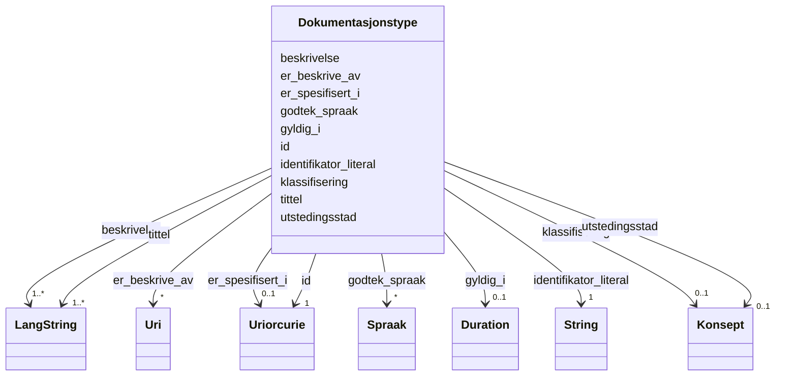

# Class: Dokumentasjonstype 


_Ein type dokumentasjon som krevst for å levere ei teneste._


URI: [cv:EvidenceType](http://data.europa.eu/m8g/EvidenceType)





<!-- no inheritance hierarchy -->

## Class Properties

| Property | Value |
| --- | --- |
| Class URI | [cv:EvidenceType](http://data.europa.eu/m8g/EvidenceType) |


## Eigenskapar


  
  

  
  
    
  

  
  
    
  

  
  
    
  

  
  

  
  

  
  

  
  

  
  

  
  


### Obligatorisk

| Namn | Kardinalitet og domene | Beskriving |
| --- | --- | --- |
| [tittel](tittel.md) | 1..* <br/> [LangString](langstring.md) | Namn/tittel på ressursen (dct:title) |
| [beskrivelse](beskrivelse.md) | 1..* <br/> [LangString](langstring.md) | Fritekstbeskrivelse av ressursen (dct:description) |
| [identifikator_literal](identifikator_literal.md) | 1 <br/> [xsd:string](http://www.w3.org/2001/XMLSchema#string) | Tekstleg identifikator for ressursen (dct:identifier) |


  
  

  
  

  
  

  
  

  
  
    
  

  
  
    
  

  
  

  
  

  
  

  
  


### Anbefalt

| Namn | Kardinalitet og domene | Beskriving |
| --- | --- | --- |
| [gyldig_i](gyldig_i.md) | 0..1 <br/> [Duration](duration.md) | Kor lenge dokumentasjonen er gyldig (ISO 8601 varigheit) |
| [godtek_spraak](godtek_spraak.md) | * <br/> [Spraak](spraak.md) | Språk dokumentasjonstypen er akseptert i |


  
  

  
  

  
  

  
  

  
  

  
  

  
  
    
  

  
  
    
  

  
  
    
  

  
  
    
  


### Valgfri

| Namn | Kardinalitet og domene | Beskriving |
| --- | --- | --- |
| [klassifisering](klassifisering.md) | 0..1 <br/> [Konsept](konsept.md) | Klassifisering av dokumentasjonstypen |
| [er_beskrive_av](er_beskrive_av.md) | * <br/> [xsd:anyURI](http://www.w3.org/2001/XMLSchema#anyURI) | Datasett som beskriv ressursen |
| [er_spesifisert_i](er_spesifisert_i.md) | 0..1 <br/> [xsd:anyURI](http://www.w3.org/2001/XMLSchema#anyURI) | Liste eller spesifikasjon ressursen er del av |
| [utstedingsstad](utstedingsstad.md) | 0..1 <br/> [Konsept](konsept.md) | Stad dokumentasjonen er akseptert frå |


  
  
  
  
    
  

  
  
  
    
      
    
      
    
      
    
  
  

  
  
  
    
      
    
      
    
      
    
  
  

  
  
  
    
      
    
      
    
      
    
  
  

  
  
  
    
      
    
      
    
      
    
  
  

  
  
  
    
      
    
      
    
      
    
  
  

  
  
  
    
      
    
      
    
      
    
  
  

  
  
  
    
      
    
      
    
      
    
  
  

  
  
  
    
      
    
      
    
      
    
  
  

  
  
  
    
      
    
      
    
      
    
  
  


### Andre

| Namn | Kardinalitet og domene | Beskriving |
| --- | --- | --- |
| [id](id.md) | 1 <br/> [xsd:anyURI](http://www.w3.org/2001/XMLSchema#anyURI) | URI-identifikator for ressursen |


## Usages

| used by | used in | type | used |
| ---  | --- | --- | --- |
| [OffentligTjeneste](offentligtjeneste.md) | [har_dokumentasjonstype](har_dokumentasjonstype.md) | range | [Dokumentasjonstype](dokumentasjonstype.md) |
| [Tjeneste](tjeneste.md) | [har_dokumentasjonstype](har_dokumentasjonstype.md) | range | [Dokumentasjonstype](dokumentasjonstype.md) |


## Identifier and Mapping Information


### Schema Source


* from schema: https://data.norge.no/ap-no/cpsv-ap-no


## Mappings

| Mapping Type | Mapped Value |
| ---  | ---  |
| self | cv:EvidenceType |
| native | https://data.norge.no/ap-no/cpsv-ap-no/Dokumentasjonstype |


## LinkML Source

<!-- TODO: investigate https://stackoverflow.com/questions/37606292/how-to-create-tabbed-code-blocks-in-mkdocs-or-sphinx -->

### Direct

<details>
```yaml
name: Dokumentasjonstype
description: Ein type dokumentasjon som krevst for å levere ei teneste.
from_schema: https://data.norge.no/ap-no/cpsv-ap-no
rank: 1000
slots:
- id
- tittel
- beskrivelse
- identifikator_literal
- gyldig_i
- godtek_spraak
- klassifisering
- er_beskrive_av
- er_spesifisert_i
- utstedingsstad
slot_usage:
  tittel:
    name: tittel
    in_subset:
    - Obligatorisk
    required: true
  beskrivelse:
    name: beskrivelse
    in_subset:
    - Obligatorisk
    required: true
  identifikator_literal:
    name: identifikator_literal
    in_subset:
    - Obligatorisk
    required: true
  gyldig_i:
    name: gyldig_i
    in_subset:
    - Anbefalt
  godtek_spraak:
    name: godtek_spraak
    in_subset:
    - Anbefalt
  klassifisering:
    name: klassifisering
    in_subset:
    - Valgfri
  er_beskrive_av:
    name: er_beskrive_av
    in_subset:
    - Valgfri
  er_spesifisert_i:
    name: er_spesifisert_i
    in_subset:
    - Valgfri
  utstedingsstad:
    name: utstedingsstad
    in_subset:
    - Valgfri
class_uri: cv:EvidenceType

```
</details>

### Induced

<details>
```yaml
name: Dokumentasjonstype
description: Ein type dokumentasjon som krevst for å levere ei teneste.
from_schema: https://data.norge.no/ap-no/cpsv-ap-no
rank: 1000
slot_usage:
  tittel:
    name: tittel
    in_subset:
    - Obligatorisk
    required: true
  beskrivelse:
    name: beskrivelse
    in_subset:
    - Obligatorisk
    required: true
  identifikator_literal:
    name: identifikator_literal
    in_subset:
    - Obligatorisk
    required: true
  gyldig_i:
    name: gyldig_i
    in_subset:
    - Anbefalt
  godtek_spraak:
    name: godtek_spraak
    in_subset:
    - Anbefalt
  klassifisering:
    name: klassifisering
    in_subset:
    - Valgfri
  er_beskrive_av:
    name: er_beskrive_av
    in_subset:
    - Valgfri
  er_spesifisert_i:
    name: er_spesifisert_i
    in_subset:
    - Valgfri
  utstedingsstad:
    name: utstedingsstad
    in_subset:
    - Valgfri
attributes:
  id:
    name: id
    description: URI-identifikator for ressursen.
    from_schema: https://data.norge.no/ap-no/common-ap-no
    identifier: true
    owner: Dokumentasjonstype
    domain_of:
    - Mediatype
    - Konsept
    - Begrepssamling
    - OffentligTjeneste
    - Tjeneste
    - Hendelse
    - Aktor
    - Kontaktpunkt
    - Tjenestekanal
    - Dokumentasjonstype
    - Tjenesteresultattype
    - Tjenesteresultattypeliste
    - Gebyr
    - Regel
    - RegulativRessurs
    - Deltagelse
    - Adresse
    - Katalog
    range: uriorcurie
    required: true
  tittel:
    name: tittel
    description: Namn/tittel på ressursen (dct:title).
    in_subset:
    - Obligatorisk
    from_schema: https://data.norge.no/ap-no/common-ap-no
    slot_uri: dct:title
    owner: Dokumentasjonstype
    domain_of:
    - OffentligTjeneste
    - Tjeneste
    - Hendelse
    - Aktor
    - Dokumentasjonstype
    - Tjenesteresultattype
    - Tjenesteresultattypeliste
    - Regel
    - RegulativRessurs
    - Katalog
    range: LangString
    required: true
    multivalued: true
  beskrivelse:
    name: beskrivelse
    description: Fritekstbeskrivelse av ressursen (dct:description).
    in_subset:
    - Obligatorisk
    from_schema: https://data.norge.no/ap-no/common-ap-no
    slot_uri: dct:description
    owner: Dokumentasjonstype
    domain_of:
    - OffentligTjeneste
    - Tjeneste
    - Hendelse
    - Tjenestekanal
    - Dokumentasjonstype
    - Tjenesteresultattype
    - Tjenesteresultattypeliste
    - Gebyr
    - Regel
    - Katalog
    range: LangString
    required: true
    multivalued: true
  identifikator_literal:
    name: identifikator_literal
    description: Tekstleg identifikator for ressursen (dct:identifier).
    in_subset:
    - Obligatorisk
    from_schema: https://data.norge.no/ap-no/common-ap-no
    slot_uri: dct:identifier
    owner: Dokumentasjonstype
    domain_of:
    - OffentligTjeneste
    - Tjeneste
    - Hendelse
    - Aktor
    - Tjenestekanal
    - Dokumentasjonstype
    - Tjenesteresultattype
    - Gebyr
    - Regel
    - RegulativRessurs
    - Katalog
    range: string
    required: true
  gyldig_i:
    name: gyldig_i
    description: Kor lenge dokumentasjonen er gyldig (ISO 8601 varigheit).
    in_subset:
    - Anbefalt
    from_schema: https://data.norge.no/ap-no/cpsv-ap-no
    rank: 1000
    slot_uri: cccevno:acceptableValidityDuration
    owner: Dokumentasjonstype
    domain_of:
    - Dokumentasjonstype
    range: Duration
  godtek_spraak:
    name: godtek_spraak
    description: Språk dokumentasjonstypen er akseptert i.
    in_subset:
    - Anbefalt
    from_schema: https://data.norge.no/ap-no/cpsv-ap-no
    rank: 1000
    slot_uri: cccevno:acceptableLanguage
    owner: Dokumentasjonstype
    domain_of:
    - Dokumentasjonstype
    range: Spraak
    multivalued: true
  klassifisering:
    name: klassifisering
    description: Klassifisering av dokumentasjonstypen.
    in_subset:
    - Valgfri
    from_schema: https://data.norge.no/ap-no/cpsv-ap-no
    rank: 1000
    slot_uri: cv:evidenceTypeClassification
    owner: Dokumentasjonstype
    domain_of:
    - Dokumentasjonstype
    range: Konsept
  er_beskrive_av:
    name: er_beskrive_av
    description: Datasett som beskriv ressursen.
    in_subset:
    - Valgfri
    from_schema: https://data.norge.no/ap-no/cpsv-ap-no
    rank: 1000
    slot_uri: cccevno:isDescribedBy
    owner: Dokumentasjonstype
    domain_of:
    - OffentligTjeneste
    - Tjeneste
    - Hendelse
    - Dokumentasjonstype
    - Tjenesteresultattype
    range: uri
    multivalued: true
  er_spesifisert_i:
    name: er_spesifisert_i
    description: Liste eller spesifikasjon ressursen er del av.
    in_subset:
    - Valgfri
    from_schema: https://data.norge.no/ap-no/cpsv-ap-no
    rank: 1000
    slot_uri: cv:isSpecifiedIn
    owner: Dokumentasjonstype
    domain_of:
    - Dokumentasjonstype
    - Tjenesteresultattype
    range: uriorcurie
  utstedingsstad:
    name: utstedingsstad
    description: Stad dokumentasjonen er akseptert frå.
    in_subset:
    - Valgfri
    from_schema: https://data.norge.no/ap-no/cpsv-ap-no
    rank: 1000
    slot_uri: cccevno:acceptableIssuingPlace
    owner: Dokumentasjonstype
    domain_of:
    - Dokumentasjonstype
    range: Konsept
class_uri: cv:EvidenceType

```
</details>