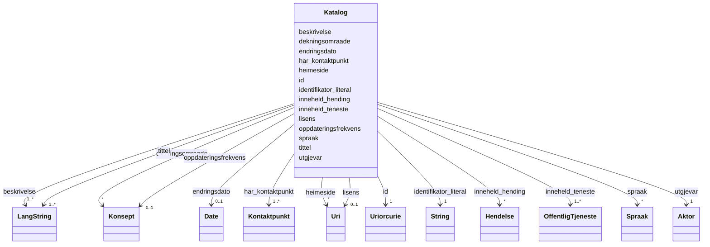

# Class: Katalog 


_Ein katalog over offentlege tenester og hendingar._


URI: [dcat:Catalog](http://www.w3.org/ns/dcat#Catalog)





<!-- no inheritance hierarchy -->

## Class Properties

| Property | Value |
| --- | --- |
| Class URI | [dcat:Catalog](http://www.w3.org/ns/dcat#Catalog) |


## Eigenskapar


  
  

  
  
    
  

  
  
    
  

  
  
    
  

  
  
    
  

  
  
    
  

  
  
    
  

  
  

  
  

  
  

  
  

  
  

  
  

  
  


### Obligatorisk

| Namn | Kardinalitet og domene | Beskriving |
| --- | --- | --- |
| [tittel](tittel.md) | 1..* <br/> [LangString](langstring.md) | Namn/tittel på ressursen (dct:title) |
| [beskrivelse](beskrivelse.md) | 1..* <br/> [LangString](langstring.md) | Fritekstbeskrivelse av ressursen (dct:description) |
| [identifikator_literal](identifikator_literal.md) | 1 <br/> [xsd:string](http://www.w3.org/2001/XMLSchema#string) | Tekstleg identifikator for ressursen (dct:identifier) |
| [inneheld_teneste](inneheld_teneste.md) | 1..* <br/> [OffentligTjeneste](offentligtjeneste.md) | Offentlege tenester i katalogen |
| [har_kontaktpunkt](har_kontaktpunkt.md) | 1..* <br/> [Kontaktpunkt](kontaktpunkt.md) | Kontaktpunkt for tenesta eller organisasjonen |
| [utgjevar](utgjevar.md) | 1 <br/> [Aktor](aktor.md) | Utgjevar av katalogen |


  
  

  
  

  
  

  
  

  
  

  
  

  
  

  
  
    
  

  
  
    
  

  
  
    
  

  
  
    
  

  
  
    
  

  
  
    
  

  
  
    
  


### Anbefalt

| Namn | Kardinalitet og domene | Beskriving |
| --- | --- | --- |
| [dekningsomraade](dekningsomraade.md) | * <br/> [Konsept](konsept.md) | Geografisk dekningsområde (dct:spatial) |
| [endringsdato](endringsdato.md) | 0..1 <br/> [xsd:date](http://www.w3.org/2001/XMLSchema#date) | Dato for siste endring av ressursen (dct:modified) |
| [oppdateringsfrekvens](oppdateringsfrekvens.md) | 0..1 <br/> [Konsept](konsept.md) | Kor ofte katalogen vert oppdatert |
| [heimeside](heimeside.md) | * <br/> [xsd:anyURI](http://www.w3.org/2001/XMLSchema#anyURI) | Heimeside for ressursen eller organisasjonen (foaf:homepage) |
| [inneheld_hending](inneheld_hending.md) | * <br/> [Hendelse](hendelse.md) | Hendingar i katalogen |
| [lisens](lisens.md) | 0..1 <br/> [xsd:anyURI](http://www.w3.org/2001/XMLSchema#anyURI) | Lisens for katalogen |
| [spraak](spraak.md) | * <br/> [Spraak](spraak.md) | Språk brukt i ressursen (dct:language) |


  
  

  
  

  
  

  
  

  
  

  
  

  
  

  
  

  
  

  
  

  
  

  
  

  
  

  
  


  
  
  
  
    
  

  
  
  
    
      
    
      
    
      
    
  
  

  
  
  
    
      
    
      
    
      
    
  
  

  
  
  
    
      
    
      
    
      
    
  
  

  
  
  
    
      
    
      
    
      
    
  
  

  
  
  
    
      
    
      
    
      
    
  
  

  
  
  
    
      
    
      
    
      
    
  
  

  
  
  
    
      
    
      
    
      
    
  
  

  
  
  
    
      
    
      
    
      
    
  
  

  
  
  
    
      
    
      
    
      
    
  
  

  
  
  
    
      
    
      
    
      
    
  
  

  
  
  
    
      
    
      
    
      
    
  
  

  
  
  
    
      
    
      
    
      
    
  
  

  
  
  
    
      
    
      
    
      
    
  
  


### Andre

| Namn | Kardinalitet og domene | Beskriving |
| --- | --- | --- |
| [id](id.md) | 1 <br/> [xsd:anyURI](http://www.w3.org/2001/XMLSchema#anyURI) | URI-identifikator for ressursen |


## Identifier and Mapping Information


### Schema Source


* from schema: https://data.norge.no/linkml/cpsv-ap-no


## Mappings

| Mapping Type | Mapped Value |
| ---  | ---  |
| self | dcat:Catalog |
| native | https://data.norge.no/linkml/cpsv-ap-no/Katalog |


## LinkML Source

<!-- TODO: investigate https://stackoverflow.com/questions/37606292/how-to-create-tabbed-code-blocks-in-mkdocs-or-sphinx -->

### Direct

<details>
```yaml
name: Katalog
description: Ein katalog over offentlege tenester og hendingar.
from_schema: https://data.norge.no/linkml/cpsv-ap-no
rank: 1000
slots:
- id
- tittel
- beskrivelse
- identifikator_literal
- inneheld_teneste
- har_kontaktpunkt
- utgjevar
- dekningsomraade
- endringsdato
- oppdateringsfrekvens
- heimeside
- inneheld_hending
- lisens
- spraak
slot_usage:
  tittel:
    name: tittel
    in_subset:
    - Obligatorisk
    required: true
  beskrivelse:
    name: beskrivelse
    in_subset:
    - Obligatorisk
    required: true
  identifikator_literal:
    name: identifikator_literal
    in_subset:
    - Obligatorisk
    required: true
  inneheld_teneste:
    name: inneheld_teneste
    in_subset:
    - Obligatorisk
    required: true
  har_kontaktpunkt:
    name: har_kontaktpunkt
    in_subset:
    - Obligatorisk
    required: true
  utgjevar:
    name: utgjevar
    in_subset:
    - Obligatorisk
    required: true
  dekningsomraade:
    name: dekningsomraade
    in_subset:
    - Anbefalt
  endringsdato:
    name: endringsdato
    in_subset:
    - Anbefalt
  oppdateringsfrekvens:
    name: oppdateringsfrekvens
    in_subset:
    - Anbefalt
  heimeside:
    name: heimeside
    in_subset:
    - Anbefalt
  inneheld_hending:
    name: inneheld_hending
    in_subset:
    - Anbefalt
  lisens:
    name: lisens
    in_subset:
    - Anbefalt
  spraak:
    name: spraak
    in_subset:
    - Anbefalt
class_uri: dcat:Catalog

```
</details>

### Induced

<details>
```yaml
name: Katalog
description: Ein katalog over offentlege tenester og hendingar.
from_schema: https://data.norge.no/linkml/cpsv-ap-no
rank: 1000
slot_usage:
  tittel:
    name: tittel
    in_subset:
    - Obligatorisk
    required: true
  beskrivelse:
    name: beskrivelse
    in_subset:
    - Obligatorisk
    required: true
  identifikator_literal:
    name: identifikator_literal
    in_subset:
    - Obligatorisk
    required: true
  inneheld_teneste:
    name: inneheld_teneste
    in_subset:
    - Obligatorisk
    required: true
  har_kontaktpunkt:
    name: har_kontaktpunkt
    in_subset:
    - Obligatorisk
    required: true
  utgjevar:
    name: utgjevar
    in_subset:
    - Obligatorisk
    required: true
  dekningsomraade:
    name: dekningsomraade
    in_subset:
    - Anbefalt
  endringsdato:
    name: endringsdato
    in_subset:
    - Anbefalt
  oppdateringsfrekvens:
    name: oppdateringsfrekvens
    in_subset:
    - Anbefalt
  heimeside:
    name: heimeside
    in_subset:
    - Anbefalt
  inneheld_hending:
    name: inneheld_hending
    in_subset:
    - Anbefalt
  lisens:
    name: lisens
    in_subset:
    - Anbefalt
  spraak:
    name: spraak
    in_subset:
    - Anbefalt
attributes:
  id:
    name: id
    description: URI-identifikator for ressursen.
    from_schema: https://data.norge.no/linkml/common-ap-no
    identifier: true
    owner: Katalog
    domain_of:
    - Mediatype
    - Konsept
    - Begrepssamling
    - OffentligTjeneste
    - Tjeneste
    - Hendelse
    - Aktor
    - Kontaktpunkt
    - Tjenestekanal
    - Dokumentasjonstype
    - Tjenesteresultattype
    - Tjenesteresultattypeliste
    - Gebyr
    - Regel
    - RegulativRessurs
    - Deltagelse
    - Adresse
    - Katalog
    range: uriorcurie
    required: true
  tittel:
    name: tittel
    description: Namn/tittel på ressursen (dct:title).
    in_subset:
    - Obligatorisk
    from_schema: https://data.norge.no/linkml/common-ap-no
    slot_uri: dct:title
    owner: Katalog
    domain_of:
    - OffentligTjeneste
    - Tjeneste
    - Hendelse
    - Aktor
    - Dokumentasjonstype
    - Tjenesteresultattype
    - Tjenesteresultattypeliste
    - Regel
    - RegulativRessurs
    - Katalog
    range: LangString
    required: true
    multivalued: true
  beskrivelse:
    name: beskrivelse
    description: Fritekstbeskrivelse av ressursen (dct:description).
    in_subset:
    - Obligatorisk
    from_schema: https://data.norge.no/linkml/common-ap-no
    slot_uri: dct:description
    owner: Katalog
    domain_of:
    - OffentligTjeneste
    - Tjeneste
    - Hendelse
    - Tjenestekanal
    - Dokumentasjonstype
    - Tjenesteresultattype
    - Tjenesteresultattypeliste
    - Gebyr
    - Regel
    - Katalog
    range: LangString
    required: true
    multivalued: true
  identifikator_literal:
    name: identifikator_literal
    description: Tekstleg identifikator for ressursen (dct:identifier).
    in_subset:
    - Obligatorisk
    from_schema: https://data.norge.no/linkml/common-ap-no
    slot_uri: dct:identifier
    owner: Katalog
    domain_of:
    - OffentligTjeneste
    - Tjeneste
    - Hendelse
    - Aktor
    - Tjenestekanal
    - Dokumentasjonstype
    - Tjenesteresultattype
    - Gebyr
    - Regel
    - RegulativRessurs
    - Katalog
    range: string
    required: true
  inneheld_teneste:
    name: inneheld_teneste
    description: Offentlege tenester i katalogen.
    in_subset:
    - Obligatorisk
    from_schema: https://data.norge.no/linkml/cpsv-ap-no
    rank: 1000
    slot_uri: dcatno:containsService
    owner: Katalog
    domain_of:
    - Katalog
    range: OffentligTjeneste
    required: true
    multivalued: true
  har_kontaktpunkt:
    name: har_kontaktpunkt
    description: Kontaktpunkt for tenesta eller organisasjonen.
    in_subset:
    - Obligatorisk
    from_schema: https://data.norge.no/linkml/cpsv-ap-no
    rank: 1000
    slot_uri: cv:contactPoint
    owner: Katalog
    domain_of:
    - OffentligTjeneste
    - Tjeneste
    - Hendelse
    - Katalog
    range: Kontaktpunkt
    required: true
    multivalued: true
  utgjevar:
    name: utgjevar
    description: Utgjevar av katalogen.
    in_subset:
    - Obligatorisk
    from_schema: https://data.norge.no/linkml/cpsv-ap-no
    rank: 1000
    slot_uri: dct:publisher
    owner: Katalog
    domain_of:
    - Katalog
    range: Aktor
    required: true
  dekningsomraade:
    name: dekningsomraade
    description: Geografisk dekningsområde (dct:spatial).
    in_subset:
    - Anbefalt
    from_schema: https://data.norge.no/linkml/common-ap-no
    slot_uri: dct:spatial
    owner: Katalog
    domain_of:
    - OffentligTjeneste
    - Tjeneste
    - OffentligOrganisasjon
    - Katalog
    range: Konsept
    multivalued: true
  endringsdato:
    name: endringsdato
    description: Dato for siste endring av ressursen (dct:modified).
    in_subset:
    - Anbefalt
    from_schema: https://data.norge.no/linkml/common-ap-no
    slot_uri: dct:modified
    owner: Katalog
    domain_of:
    - Katalog
    range: date
  oppdateringsfrekvens:
    name: oppdateringsfrekvens
    description: Kor ofte katalogen vert oppdatert.
    in_subset:
    - Anbefalt
    from_schema: https://data.norge.no/linkml/cpsv-ap-no
    rank: 1000
    slot_uri: dct:accrualPeriodicity
    owner: Katalog
    domain_of:
    - Katalog
    range: Konsept
  heimeside:
    name: heimeside
    description: Heimeside for ressursen eller organisasjonen (foaf:homepage).
    in_subset:
    - Anbefalt
    from_schema: https://data.norge.no/linkml/common-ap-no
    slot_uri: foaf:homepage
    owner: Katalog
    domain_of:
    - OffentligTjeneste
    - Tjeneste
    - OffentligOrganisasjon
    - Katalog
    range: uri
    multivalued: true
  inneheld_hending:
    name: inneheld_hending
    description: Hendingar i katalogen.
    in_subset:
    - Anbefalt
    from_schema: https://data.norge.no/linkml/cpsv-ap-no
    rank: 1000
    slot_uri: dcatno:containsEvent
    owner: Katalog
    domain_of:
    - Katalog
    range: Hendelse
    multivalued: true
  lisens:
    name: lisens
    description: Lisens for katalogen.
    in_subset:
    - Anbefalt
    from_schema: https://data.norge.no/linkml/cpsv-ap-no
    rank: 1000
    slot_uri: dct:license
    owner: Katalog
    domain_of:
    - Katalog
    range: uri
  spraak:
    name: spraak
    description: Språk brukt i ressursen (dct:language).
    in_subset:
    - Anbefalt
    from_schema: https://data.norge.no/linkml/common-ap-no
    slot_uri: dct:language
    owner: Katalog
    domain_of:
    - OffentligTjeneste
    - Tjeneste
    - Kontaktpunkt
    - Regel
    - Katalog
    range: Spraak
    multivalued: true
class_uri: dcat:Catalog

```
</details>