# Class: OffentligTjeneste 


_Ei konkret offentleg teneste levert av ein offentleg organisasjon._


URI: [cpsv:PublicService](http://purl.org/vocab/cpsv#PublicService)

```mermaid
 classDiagram
    class OffentligTjeneste
    click OffentligTjeneste href "../OffentligTjeneste/"
      OffentligTjeneste : behandlingstid
        
          
    
        
        
        OffentligTjeneste --> "0..1" Duration : behandlingstid
        click Duration href "../Duration/"
    

        
      OffentligTjeneste : beskrivelse
        
          
    
        
        
        OffentligTjeneste --> "1..*" LangString : beskrivelse
        click LangString href "../LangString/"
    

        
      OffentligTjeneste : dekningsomraade
        
          
    
        
        
        OffentligTjeneste --> "*" Konsept : dekningsomraade
        click Konsept href "../Konsept/"
    

        
      OffentligTjeneste : er_beskrive_av
        
          
    
        
        
        OffentligTjeneste --> "*" Uri : er_beskrive_av
        click Uri href "../http://www.w3.org/2001/XMLSchema#anyURI/"
    

        
      OffentligTjeneste : er_del_av
        
          
    
        
        
        OffentligTjeneste --> "0..1" Uriorcurie : er_del_av
        click Uriorcurie href "../http://www.w3.org/2001/XMLSchema#anyURI/"
    

        
      OffentligTjeneste : er_gruppert_av
        
          
    
        
        
        OffentligTjeneste --> "*" Hendelse : er_gruppert_av
        click Hendelse href "../Hendelse/"
    

        
      OffentligTjeneste : er_klassifisert_av
        
          
    
        
        
        OffentligTjeneste --> "*" Konsept : er_klassifisert_av
        click Konsept href "../Konsept/"
    

        
      OffentligTjeneste : folger
        
          
    
        
        
        OffentligTjeneste --> "*" Regel : folger
        click Regel href "../Regel/"
    

        
      OffentligTjeneste : har_ansvarleg_styremakt
        
          
    
        
        
        OffentligTjeneste --> "1..*" OffentligOrganisasjon : har_ansvarleg_styremakt
        click OffentligOrganisasjon href "../OffentligOrganisasjon/"
    

        
      OffentligTjeneste : har_del
        
          
    
        
        
        OffentligTjeneste --> "*" Uriorcurie : har_del
        click Uriorcurie href "../http://www.w3.org/2001/XMLSchema#anyURI/"
    

        
      OffentligTjeneste : har_deltaking
        
          
    
        
        
        OffentligTjeneste --> "*" Deltagelse : har_deltaking
        click Deltagelse href "../Deltagelse/"
    

        
      OffentligTjeneste : har_dokumentasjonstype
        
          
    
        
        
        OffentligTjeneste --> "*" Dokumentasjonstype : har_dokumentasjonstype
        click Dokumentasjonstype href "../Dokumentasjonstype/"
    

        
      OffentligTjeneste : har_gebyr
        
          
    
        
        
        OffentligTjeneste --> "*" Gebyr : har_gebyr
        click Gebyr href "../Gebyr/"
    

        
      OffentligTjeneste : har_kontaktpunkt
        
          
    
        
        
        OffentligTjeneste --> "1..*" Kontaktpunkt : har_kontaktpunkt
        click Kontaktpunkt href "../Kontaktpunkt/"
    

        
      OffentligTjeneste : har_regulativ_ressurs
        
          
    
        
        
        OffentligTjeneste --> "*" RegulativRessurs : har_regulativ_ressurs
        click RegulativRessurs href "../RegulativRessurs/"
    

        
      OffentligTjeneste : har_tenestekanal
        
          
    
        
        
        OffentligTjeneste --> "*" Tjenestekanal : har_tenestekanal
        click Tjenestekanal href "../Tjenestekanal/"
    

        
      OffentligTjeneste : har_tenesteresultattype
        
          
    
        
        
        OffentligTjeneste --> "1..*" Tjenesteresultattype : har_tenesteresultattype
        click Tjenesteresultattype href "../Tjenesteresultattype/"
    

        
      OffentligTjeneste : heimeside
        
          
    
        
        
        OffentligTjeneste --> "*" Uri : heimeside
        click Uri href "../http://www.w3.org/2001/XMLSchema#anyURI/"
    

        
      OffentligTjeneste : id
        
          
    
        
        
        OffentligTjeneste --> "1" Uriorcurie : id
        click Uriorcurie href "../http://www.w3.org/2001/XMLSchema#anyURI/"
    

        
      OffentligTjeneste : identifikator_literal
        
          
    
        
        
        OffentligTjeneste --> "1" String : identifikator_literal
        click String href "../http://www.w3.org/2001/XMLSchema#string/"
    

        
      OffentligTjeneste : krev
        
          
    
        
        
        OffentligTjeneste --> "*" Uriorcurie : krev
        click Uriorcurie href "../http://www.w3.org/2001/XMLSchema#anyURI/"
    

        
      OffentligTjeneste : malgruppe
        
          
    
        
        
        OffentligTjeneste --> "*" Konsept : malgruppe
        click Konsept href "../Konsept/"
    

        
      OffentligTjeneste : nokkelord
        
          
    
        
        
        OffentligTjeneste --> "*" LangString : nokkelord
        click LangString href "../LangString/"
    

        
      OffentligTjeneste : relatert_teneste
        
          
    
        
        
        OffentligTjeneste --> "*" Uriorcurie : relatert_teneste
        click Uriorcurie href "../http://www.w3.org/2001/XMLSchema#anyURI/"
    

        
      OffentligTjeneste : sektor
        
          
    
        
        
        OffentligTjeneste --> "*" Konsept : sektor
        click Konsept href "../Konsept/"
    

        
      OffentligTjeneste : spraak
        
          
    
        
        
        OffentligTjeneste --> "*" Spraak : spraak
        click Spraak href "../Spraak/"
    

        
      OffentligTjeneste : status
        
          
    
        
        
        OffentligTjeneste --> "0..1" Konsept : status
        click Konsept href "../Konsept/"
    

        
      OffentligTjeneste : tema
        
          
    
        
        
        OffentligTjeneste --> "*" Konsept : tema
        click Konsept href "../Konsept/"
    

        
      OffentligTjeneste : temaomrade
        
          
    
        
        
        OffentligTjeneste --> "*" Konsept : temaomrade
        click Konsept href "../Konsept/"
    

        
      OffentligTjeneste : tittel
        
          
    
        
        
        OffentligTjeneste --> "1..*" LangString : tittel
        click LangString href "../LangString/"
    

        
      OffentligTjeneste : type_concept
        
          
    
        
        
        OffentligTjeneste --> "0..1" Konsept : type_concept
        click Konsept href "../Konsept/"
    

        
      
```





<!-- no inheritance hierarchy -->

## Class Properties

| Property | Value |
| --- | --- |
| Class URI | [cpsv:PublicService](http://purl.org/vocab/cpsv#PublicService) |


## Eigenskapar


  
  

  
  
    
  

  
  
    
  

  
  
    
  

  
  
    
  

  
  
    
  

  
  
    
  

  
  

  
  

  
  

  
  

  
  

  
  

  
  

  
  

  
  

  
  

  
  

  
  

  
  

  
  

  
  

  
  

  
  

  
  

  
  

  
  

  
  

  
  

  
  

  
  


### Obligatorisk

| Namn | Kardinalitet og domene | Beskriving |
| --- | --- | --- |
| [tittel](tittel.md) | 1..* <br/> [LangString](langstring.md) | Namn/tittel på ressursen (dct:title) |
| [beskrivelse](beskrivelse.md) | 1..* <br/> [LangString](langstring.md) | Fritekstbeskrivelse av ressursen (dct:description) |
| [identifikator_literal](identifikator_literal.md) | 1 <br/> [xsd:string](http://www.w3.org/2001/XMLSchema#string) | Tekstleg identifikator for ressursen (dct:identifier) |
| [har_kontaktpunkt](har_kontaktpunkt.md) | 1..* <br/> [Kontaktpunkt](kontaktpunkt.md) | Kontaktpunkt for tenesta eller organisasjonen |
| [har_tenesteresultattype](har_tenesteresultattype.md) | 1..* <br/> [Tjenesteresultattype](tjenesteresultattype.md) | Typen resultat tenesta kan produsere |
| [har_ansvarleg_styremakt](har_ansvarleg_styremakt.md) | 1..* <br/> [OffentligOrganisasjon](offentligorganisasjon.md) | Offentleg organisasjon ansvarleg for tenesta |


  
  

  
  

  
  

  
  

  
  

  
  

  
  

  
  
    
  

  
  
    
  

  
  
    
  

  
  
    
  

  
  
    
  

  
  
    
  

  
  
    
  

  
  

  
  

  
  

  
  

  
  

  
  

  
  

  
  

  
  

  
  

  
  

  
  

  
  

  
  

  
  

  
  

  
  


### Anbefalt

| Namn | Kardinalitet og domene | Beskriving |
| --- | --- | --- |
| [tema](tema.md) | * <br/> [Konsept](konsept.md) | Emne/tema tenesta handlar om |
| [dekningsomraade](dekningsomraade.md) | * <br/> [Konsept](konsept.md) | Geografisk dekningsområde (dct:spatial) |
| [har_dokumentasjonstype](har_dokumentasjonstype.md) | * <br/> [Dokumentasjonstype](dokumentasjonstype.md) | Dokumentasjon som krevst for tenesta |
| [heimeside](heimeside.md) | * <br/> [xsd:anyURI](http://www.w3.org/2001/XMLSchema#anyURI) | Heimeside for ressursen eller organisasjonen (foaf:homepage) |
| [type_concept](type_concept.md) | 0..1 <br/> [Konsept](konsept.md) | Type ressurs frå eit kontrollert vokabular (dct:type) |
| [status](status.md) | 0..1 <br/> [Konsept](konsept.md) | Status for ressursen frå eit kontrollert vokabular (adms:status) |
| [temaomrade](temaomrade.md) | * <br/> [Konsept](konsept.md) | Tematisk område for tenesta |


  
  

  
  

  
  

  
  

  
  

  
  

  
  

  
  

  
  

  
  

  
  

  
  

  
  

  
  

  
  
    
  

  
  
    
  

  
  
    
  

  
  
    
  

  
  
    
  

  
  
    
  

  
  
    
  

  
  
    
  

  
  
    
  

  
  
    
  

  
  
    
  

  
  
    
  

  
  
    
  

  
  
    
  

  
  
    
  

  
  
    
  

  
  
    
  


### Valgfri

| Namn | Kardinalitet og domene | Beskriving |
| --- | --- | --- |
| [behandlingstid](behandlingstid.md) | 0..1 <br/> [Duration](duration.md) | Forventa behandlingstid for tenesta eller kanalen (ISO 8601) |
| [er_beskrive_av](er_beskrive_av.md) | * <br/> [xsd:anyURI](http://www.w3.org/2001/XMLSchema#anyURI) | Datasett som beskriv ressursen |
| [er_del_av](er_del_av.md) | 0..1 <br/> [xsd:anyURI](http://www.w3.org/2001/XMLSchema#anyURI) | Tenesta er del av ei anna teneste |
| [har_del](har_del.md) | * <br/> [xsd:anyURI](http://www.w3.org/2001/XMLSchema#anyURI) | Deltenester som inngår i denne tenesta |
| [har_tenestekanal](har_tenestekanal.md) | * <br/> [Tjenestekanal](tjenestekanal.md) | Kanal for tilgang til tenesta |
| [har_deltaking](har_deltaking.md) | * <br/> [Deltagelse](deltagelse.md) | Deltakarar med spesifikke roller i levering av tenesta |
| [spraak](spraak.md) | * <br/> [Spraak](spraak.md) | Språk brukt i ressursen (dct:language) |
| [relatert_teneste](relatert_teneste.md) | * <br/> [xsd:anyURI](http://www.w3.org/2001/XMLSchema#anyURI) | Relatert teneste |
| [er_gruppert_av](er_gruppert_av.md) | * <br/> [Hendelse](hendelse.md) | Hending(ar) som grupperer tenesta |
| [er_klassifisert_av](er_klassifisert_av.md) | * <br/> [Konsept](konsept.md) | Omgrep tenesta er klassifisert med |
| [folger](folger.md) | * <br/> [Regel](regel.md) | Regelverk tenesta følgjer |
| [har_gebyr](har_gebyr.md) | * <br/> [Gebyr](gebyr.md) | Gebyr knytt til tenesta |
| [har_regulativ_ressurs](har_regulativ_ressurs.md) | * <br/> [RegulativRessurs](regulativressurs.md) | Regulativ ressurs (lov, forskrift) knytt til tenesta |
| [krev](krev.md) | * <br/> [xsd:anyURI](http://www.w3.org/2001/XMLSchema#anyURI) | Teneste eller ressurs denne tenesta krev |
| [malgruppe](malgruppe.md) | * <br/> [Konsept](konsept.md) | Målgruppe for tenesta |
| [nokkelord](nokkelord.md) | * <br/> [LangString](langstring.md) | Nøkkelord som beskriv ressursen (dcat:keyword) |
| [sektor](sektor.md) | * <br/> [Konsept](konsept.md) | Industri/sektor tenesta tilhøyrer |


  
  
  
  
    
  

  
  
  
    
      
    
      
    
      
    
  
  

  
  
  
    
      
    
      
    
      
    
  
  

  
  
  
    
      
    
      
    
      
    
  
  

  
  
  
    
      
    
      
    
      
    
  
  

  
  
  
    
      
    
      
    
      
    
  
  

  
  
  
    
      
    
      
    
      
    
  
  

  
  
  
    
      
    
      
    
      
    
  
  

  
  
  
    
      
    
      
    
      
    
  
  

  
  
  
    
      
    
      
    
      
    
  
  

  
  
  
    
      
    
      
    
      
    
  
  

  
  
  
    
      
    
      
    
      
    
  
  

  
  
  
    
      
    
      
    
      
    
  
  

  
  
  
    
      
    
      
    
      
    
  
  

  
  
  
    
      
    
      
    
      
    
  
  

  
  
  
    
      
    
      
    
      
    
  
  

  
  
  
    
      
    
      
    
      
    
  
  

  
  
  
    
      
    
      
    
      
    
  
  

  
  
  
    
      
    
      
    
      
    
  
  

  
  
  
    
      
    
      
    
      
    
  
  

  
  
  
    
      
    
      
    
      
    
  
  

  
  
  
    
      
    
      
    
      
    
  
  

  
  
  
    
      
    
      
    
      
    
  
  

  
  
  
    
      
    
      
    
      
    
  
  

  
  
  
    
      
    
      
    
      
    
  
  

  
  
  
    
      
    
      
    
      
    
  
  

  
  
  
    
      
    
      
    
      
    
  
  

  
  
  
    
      
    
      
    
      
    
  
  

  
  
  
    
      
    
      
    
      
    
  
  

  
  
  
    
      
    
      
    
      
    
  
  

  
  
  
    
      
    
      
    
      
    
  
  


### Andre

| Namn | Kardinalitet og domene | Beskriving |
| --- | --- | --- |
| [id](id.md) | 1 <br/> [xsd:anyURI](http://www.w3.org/2001/XMLSchema#anyURI) | URI-identifikator for ressursen |


## Usages

| used by | used in | type | used |
| ---  | --- | --- | --- |
| [Hendelse](hendelse.md) | [kan_utlose](kan_utlose.md) | range | [OffentligTjeneste](offentligtjeneste.md) |
| [Livshendelse](livshendelse.md) | [kan_utlose](kan_utlose.md) | range | [OffentligTjeneste](offentligtjeneste.md) |
| [Virksomhetshendelse](virksomhetshendelse.md) | [kan_utlose](kan_utlose.md) | range | [OffentligTjeneste](offentligtjeneste.md) |
| [Katalog](katalog.md) | [inneheld_teneste](inneheld_teneste.md) | range | [OffentligTjeneste](offentligtjeneste.md) |


## Identifier and Mapping Information


### Schema Source


* from schema: https://data.norge.no/linkml/cpsv-ap-no


## Mappings

| Mapping Type | Mapped Value |
| ---  | ---  |
| self | cpsv:PublicService |
| native | https://data.norge.no/linkml/cpsv-ap-no/OffentligTjeneste |


## LinkML Source

<!-- TODO: investigate https://stackoverflow.com/questions/37606292/how-to-create-tabbed-code-blocks-in-mkdocs-or-sphinx -->

### Direct

<details>
```yaml
name: OffentligTjeneste
description: Ei konkret offentleg teneste levert av ein offentleg organisasjon.
from_schema: https://data.norge.no/linkml/cpsv-ap-no
rank: 1000
slots:
- id
- tittel
- beskrivelse
- identifikator_literal
- har_kontaktpunkt
- har_tenesteresultattype
- har_ansvarleg_styremakt
- tema
- dekningsomraade
- har_dokumentasjonstype
- heimeside
- type_concept
- status
- temaomrade
- behandlingstid
- er_beskrive_av
- er_del_av
- har_del
- har_tenestekanal
- har_deltaking
- spraak
- relatert_teneste
- er_gruppert_av
- er_klassifisert_av
- folger
- har_gebyr
- har_regulativ_ressurs
- krev
- malgruppe
- nokkelord
- sektor
slot_usage:
  tittel:
    name: tittel
    in_subset:
    - Obligatorisk
    required: true
  beskrivelse:
    name: beskrivelse
    in_subset:
    - Obligatorisk
    required: true
  identifikator_literal:
    name: identifikator_literal
    in_subset:
    - Obligatorisk
    required: true
  har_kontaktpunkt:
    name: har_kontaktpunkt
    in_subset:
    - Obligatorisk
    required: true
  har_tenesteresultattype:
    name: har_tenesteresultattype
    in_subset:
    - Obligatorisk
    required: true
  har_ansvarleg_styremakt:
    name: har_ansvarleg_styremakt
    in_subset:
    - Obligatorisk
    required: true
  tema:
    name: tema
    in_subset:
    - Anbefalt
  dekningsomraade:
    name: dekningsomraade
    in_subset:
    - Anbefalt
  har_dokumentasjonstype:
    name: har_dokumentasjonstype
    in_subset:
    - Anbefalt
  heimeside:
    name: heimeside
    in_subset:
    - Anbefalt
  type_concept:
    name: type_concept
    in_subset:
    - Anbefalt
  status:
    name: status
    in_subset:
    - Anbefalt
  temaomrade:
    name: temaomrade
    in_subset:
    - Anbefalt
  behandlingstid:
    name: behandlingstid
    in_subset:
    - Valgfri
  er_beskrive_av:
    name: er_beskrive_av
    in_subset:
    - Valgfri
  er_del_av:
    name: er_del_av
    in_subset:
    - Valgfri
  har_del:
    name: har_del
    in_subset:
    - Valgfri
  har_tenestekanal:
    name: har_tenestekanal
    in_subset:
    - Valgfri
  har_deltaking:
    name: har_deltaking
    in_subset:
    - Valgfri
  spraak:
    name: spraak
    in_subset:
    - Valgfri
  relatert_teneste:
    name: relatert_teneste
    in_subset:
    - Valgfri
  er_gruppert_av:
    name: er_gruppert_av
    in_subset:
    - Valgfri
  er_klassifisert_av:
    name: er_klassifisert_av
    in_subset:
    - Valgfri
  folger:
    name: folger
    in_subset:
    - Valgfri
  har_gebyr:
    name: har_gebyr
    in_subset:
    - Valgfri
  har_regulativ_ressurs:
    name: har_regulativ_ressurs
    in_subset:
    - Valgfri
  krev:
    name: krev
    in_subset:
    - Valgfri
  malgruppe:
    name: malgruppe
    in_subset:
    - Valgfri
  nokkelord:
    name: nokkelord
    in_subset:
    - Valgfri
  sektor:
    name: sektor
    in_subset:
    - Valgfri
class_uri: cpsv:PublicService

```
</details>

### Induced

<details>
```yaml
name: OffentligTjeneste
description: Ei konkret offentleg teneste levert av ein offentleg organisasjon.
from_schema: https://data.norge.no/linkml/cpsv-ap-no
rank: 1000
slot_usage:
  tittel:
    name: tittel
    in_subset:
    - Obligatorisk
    required: true
  beskrivelse:
    name: beskrivelse
    in_subset:
    - Obligatorisk
    required: true
  identifikator_literal:
    name: identifikator_literal
    in_subset:
    - Obligatorisk
    required: true
  har_kontaktpunkt:
    name: har_kontaktpunkt
    in_subset:
    - Obligatorisk
    required: true
  har_tenesteresultattype:
    name: har_tenesteresultattype
    in_subset:
    - Obligatorisk
    required: true
  har_ansvarleg_styremakt:
    name: har_ansvarleg_styremakt
    in_subset:
    - Obligatorisk
    required: true
  tema:
    name: tema
    in_subset:
    - Anbefalt
  dekningsomraade:
    name: dekningsomraade
    in_subset:
    - Anbefalt
  har_dokumentasjonstype:
    name: har_dokumentasjonstype
    in_subset:
    - Anbefalt
  heimeside:
    name: heimeside
    in_subset:
    - Anbefalt
  type_concept:
    name: type_concept
    in_subset:
    - Anbefalt
  status:
    name: status
    in_subset:
    - Anbefalt
  temaomrade:
    name: temaomrade
    in_subset:
    - Anbefalt
  behandlingstid:
    name: behandlingstid
    in_subset:
    - Valgfri
  er_beskrive_av:
    name: er_beskrive_av
    in_subset:
    - Valgfri
  er_del_av:
    name: er_del_av
    in_subset:
    - Valgfri
  har_del:
    name: har_del
    in_subset:
    - Valgfri
  har_tenestekanal:
    name: har_tenestekanal
    in_subset:
    - Valgfri
  har_deltaking:
    name: har_deltaking
    in_subset:
    - Valgfri
  spraak:
    name: spraak
    in_subset:
    - Valgfri
  relatert_teneste:
    name: relatert_teneste
    in_subset:
    - Valgfri
  er_gruppert_av:
    name: er_gruppert_av
    in_subset:
    - Valgfri
  er_klassifisert_av:
    name: er_klassifisert_av
    in_subset:
    - Valgfri
  folger:
    name: folger
    in_subset:
    - Valgfri
  har_gebyr:
    name: har_gebyr
    in_subset:
    - Valgfri
  har_regulativ_ressurs:
    name: har_regulativ_ressurs
    in_subset:
    - Valgfri
  krev:
    name: krev
    in_subset:
    - Valgfri
  malgruppe:
    name: malgruppe
    in_subset:
    - Valgfri
  nokkelord:
    name: nokkelord
    in_subset:
    - Valgfri
  sektor:
    name: sektor
    in_subset:
    - Valgfri
attributes:
  id:
    name: id
    description: URI-identifikator for ressursen.
    from_schema: https://data.norge.no/linkml/common-ap-no
    identifier: true
    owner: OffentligTjeneste
    domain_of:
    - Mediatype
    - Konsept
    - Begrepssamling
    - OffentligTjeneste
    - Tjeneste
    - Hendelse
    - Aktor
    - Kontaktpunkt
    - Tjenestekanal
    - Dokumentasjonstype
    - Tjenesteresultattype
    - Tjenesteresultattypeliste
    - Gebyr
    - Regel
    - RegulativRessurs
    - Deltagelse
    - Adresse
    - Katalog
    range: uriorcurie
    required: true
  tittel:
    name: tittel
    description: Namn/tittel på ressursen (dct:title).
    in_subset:
    - Obligatorisk
    from_schema: https://data.norge.no/linkml/common-ap-no
    slot_uri: dct:title
    owner: OffentligTjeneste
    domain_of:
    - OffentligTjeneste
    - Tjeneste
    - Hendelse
    - Aktor
    - Dokumentasjonstype
    - Tjenesteresultattype
    - Tjenesteresultattypeliste
    - Regel
    - RegulativRessurs
    - Katalog
    range: LangString
    required: true
    multivalued: true
  beskrivelse:
    name: beskrivelse
    description: Fritekstbeskrivelse av ressursen (dct:description).
    in_subset:
    - Obligatorisk
    from_schema: https://data.norge.no/linkml/common-ap-no
    slot_uri: dct:description
    owner: OffentligTjeneste
    domain_of:
    - OffentligTjeneste
    - Tjeneste
    - Hendelse
    - Tjenestekanal
    - Dokumentasjonstype
    - Tjenesteresultattype
    - Tjenesteresultattypeliste
    - Gebyr
    - Regel
    - Katalog
    range: LangString
    required: true
    multivalued: true
  identifikator_literal:
    name: identifikator_literal
    description: Tekstleg identifikator for ressursen (dct:identifier).
    in_subset:
    - Obligatorisk
    from_schema: https://data.norge.no/linkml/common-ap-no
    slot_uri: dct:identifier
    owner: OffentligTjeneste
    domain_of:
    - OffentligTjeneste
    - Tjeneste
    - Hendelse
    - Aktor
    - Tjenestekanal
    - Dokumentasjonstype
    - Tjenesteresultattype
    - Gebyr
    - Regel
    - RegulativRessurs
    - Katalog
    range: string
    required: true
  har_kontaktpunkt:
    name: har_kontaktpunkt
    description: Kontaktpunkt for tenesta eller organisasjonen.
    in_subset:
    - Obligatorisk
    from_schema: https://data.norge.no/linkml/cpsv-ap-no
    rank: 1000
    slot_uri: cv:contactPoint
    owner: OffentligTjeneste
    domain_of:
    - OffentligTjeneste
    - Tjeneste
    - Hendelse
    - Katalog
    range: Kontaktpunkt
    required: true
    multivalued: true
  har_tenesteresultattype:
    name: har_tenesteresultattype
    description: Typen resultat tenesta kan produsere.
    in_subset:
    - Obligatorisk
    from_schema: https://data.norge.no/linkml/cpsv-ap-no
    rank: 1000
    slot_uri: cpsvno:hasOutputType
    owner: OffentligTjeneste
    domain_of:
    - OffentligTjeneste
    - Tjeneste
    range: Tjenesteresultattype
    required: true
    multivalued: true
  har_ansvarleg_styremakt:
    name: har_ansvarleg_styremakt
    description: Offentleg organisasjon ansvarleg for tenesta.
    in_subset:
    - Obligatorisk
    from_schema: https://data.norge.no/linkml/cpsv-ap-no
    rank: 1000
    slot_uri: cv:hasCompetentAuthority
    owner: OffentligTjeneste
    domain_of:
    - OffentligTjeneste
    range: OffentligOrganisasjon
    required: true
    multivalued: true
  tema:
    name: tema
    description: Emne/tema tenesta handlar om.
    in_subset:
    - Anbefalt
    from_schema: https://data.norge.no/linkml/cpsv-ap-no
    rank: 1000
    slot_uri: dct:subject
    owner: OffentligTjeneste
    domain_of:
    - OffentligTjeneste
    - Tjeneste
    - Hendelse
    range: Konsept
    multivalued: true
  dekningsomraade:
    name: dekningsomraade
    description: Geografisk dekningsområde (dct:spatial).
    in_subset:
    - Anbefalt
    from_schema: https://data.norge.no/linkml/common-ap-no
    slot_uri: dct:spatial
    owner: OffentligTjeneste
    domain_of:
    - OffentligTjeneste
    - Tjeneste
    - OffentligOrganisasjon
    - Katalog
    range: Konsept
    multivalued: true
  har_dokumentasjonstype:
    name: har_dokumentasjonstype
    description: Dokumentasjon som krevst for tenesta.
    in_subset:
    - Anbefalt
    from_schema: https://data.norge.no/linkml/cpsv-ap-no
    rank: 1000
    slot_uri: cv:hasInputType
    owner: OffentligTjeneste
    domain_of:
    - OffentligTjeneste
    - Tjeneste
    range: Dokumentasjonstype
    multivalued: true
  heimeside:
    name: heimeside
    description: Heimeside for ressursen eller organisasjonen (foaf:homepage).
    in_subset:
    - Anbefalt
    from_schema: https://data.norge.no/linkml/common-ap-no
    slot_uri: foaf:homepage
    owner: OffentligTjeneste
    domain_of:
    - OffentligTjeneste
    - Tjeneste
    - OffentligOrganisasjon
    - Katalog
    range: uri
    multivalued: true
  type_concept:
    name: type_concept
    description: Type ressurs frå eit kontrollert vokabular (dct:type).
    in_subset:
    - Anbefalt
    from_schema: https://data.norge.no/linkml/common-ap-no
    slot_uri: dct:type
    owner: OffentligTjeneste
    domain_of:
    - OffentligTjeneste
    - Tjeneste
    - Hendelse
    - OffentligOrganisasjon
    - Tjenestekanal
    - Tjenesteresultattype
    - Regel
    - RegulativRessurs
    range: Konsept
  status:
    name: status
    description: Status for ressursen frå eit kontrollert vokabular (adms:status).
    in_subset:
    - Anbefalt
    from_schema: https://data.norge.no/linkml/common-ap-no
    slot_uri: adms:status
    owner: OffentligTjeneste
    domain_of:
    - OffentligTjeneste
    - Tjeneste
    range: Konsept
  temaomrade:
    name: temaomrade
    description: Tematisk område for tenesta.
    in_subset:
    - Anbefalt
    from_schema: https://data.norge.no/linkml/cpsv-ap-no
    rank: 1000
    slot_uri: cv:thematicArea
    owner: OffentligTjeneste
    domain_of:
    - OffentligTjeneste
    - Tjeneste
    range: Konsept
    multivalued: true
  behandlingstid:
    name: behandlingstid
    description: Forventa behandlingstid for tenesta eller kanalen (ISO 8601).
    in_subset:
    - Valgfri
    from_schema: https://data.norge.no/linkml/cpsv-ap-no
    rank: 1000
    slot_uri: cv:processingTime
    owner: OffentligTjeneste
    domain_of:
    - OffentligTjeneste
    - Tjeneste
    - Tjenestekanal
    range: Duration
  er_beskrive_av:
    name: er_beskrive_av
    description: Datasett som beskriv ressursen.
    in_subset:
    - Valgfri
    from_schema: https://data.norge.no/linkml/cpsv-ap-no
    rank: 1000
    slot_uri: cccevno:isDescribedBy
    owner: OffentligTjeneste
    domain_of:
    - OffentligTjeneste
    - Tjeneste
    - Hendelse
    - Dokumentasjonstype
    - Tjenesteresultattype
    range: uri
    multivalued: true
  er_del_av:
    name: er_del_av
    description: Tenesta er del av ei anna teneste.
    in_subset:
    - Valgfri
    from_schema: https://data.norge.no/linkml/cpsv-ap-no
    rank: 1000
    slot_uri: dct:isPartOf
    owner: OffentligTjeneste
    domain_of:
    - OffentligTjeneste
    - Tjeneste
    range: uriorcurie
  har_del:
    name: har_del
    description: Deltenester som inngår i denne tenesta.
    in_subset:
    - Valgfri
    from_schema: https://data.norge.no/linkml/cpsv-ap-no
    rank: 1000
    slot_uri: dct:hasPart
    owner: OffentligTjeneste
    domain_of:
    - OffentligTjeneste
    - Tjeneste
    range: uriorcurie
    multivalued: true
  har_tenestekanal:
    name: har_tenestekanal
    description: Kanal for tilgang til tenesta.
    in_subset:
    - Valgfri
    from_schema: https://data.norge.no/linkml/cpsv-ap-no
    rank: 1000
    slot_uri: cv:hasChannel
    owner: OffentligTjeneste
    domain_of:
    - OffentligTjeneste
    - Tjeneste
    range: Tjenestekanal
    multivalued: true
  har_deltaking:
    name: har_deltaking
    description: Deltakarar med spesifikke roller i levering av tenesta.
    in_subset:
    - Valgfri
    from_schema: https://data.norge.no/linkml/cpsv-ap-no
    rank: 1000
    slot_uri: cv:hasParticipation
    owner: OffentligTjeneste
    domain_of:
    - OffentligTjeneste
    - Tjeneste
    range: Deltagelse
    multivalued: true
  spraak:
    name: spraak
    description: Språk brukt i ressursen (dct:language).
    in_subset:
    - Valgfri
    from_schema: https://data.norge.no/linkml/common-ap-no
    slot_uri: dct:language
    owner: OffentligTjeneste
    domain_of:
    - OffentligTjeneste
    - Tjeneste
    - Kontaktpunkt
    - Regel
    - Katalog
    range: Spraak
    multivalued: true
  relatert_teneste:
    name: relatert_teneste
    description: Relatert teneste.
    in_subset:
    - Valgfri
    from_schema: https://data.norge.no/linkml/cpsv-ap-no
    rank: 1000
    slot_uri: cv:relatedService
    owner: OffentligTjeneste
    domain_of:
    - OffentligTjeneste
    - Tjeneste
    range: uriorcurie
    multivalued: true
  er_gruppert_av:
    name: er_gruppert_av
    description: Hending(ar) som grupperer tenesta.
    in_subset:
    - Valgfri
    from_schema: https://data.norge.no/linkml/cpsv-ap-no
    rank: 1000
    slot_uri: cv:isGroupedBy
    owner: OffentligTjeneste
    domain_of:
    - OffentligTjeneste
    - Tjeneste
    range: Hendelse
    multivalued: true
  er_klassifisert_av:
    name: er_klassifisert_av
    description: Omgrep tenesta er klassifisert med.
    in_subset:
    - Valgfri
    from_schema: https://data.norge.no/linkml/cpsv-ap-no
    rank: 1000
    slot_uri: cv:isClassifiedBy
    owner: OffentligTjeneste
    domain_of:
    - OffentligTjeneste
    - Tjeneste
    range: Konsept
    multivalued: true
  folger:
    name: folger
    description: Regelverk tenesta følgjer.
    in_subset:
    - Valgfri
    from_schema: https://data.norge.no/linkml/cpsv-ap-no
    rank: 1000
    slot_uri: cpsv:follows
    owner: OffentligTjeneste
    domain_of:
    - OffentligTjeneste
    - Tjeneste
    range: Regel
    multivalued: true
  har_gebyr:
    name: har_gebyr
    description: Gebyr knytt til tenesta.
    in_subset:
    - Valgfri
    from_schema: https://data.norge.no/linkml/cpsv-ap-no
    rank: 1000
    slot_uri: cv:hasCost
    owner: OffentligTjeneste
    domain_of:
    - OffentligTjeneste
    - Tjeneste
    range: Gebyr
    multivalued: true
  har_regulativ_ressurs:
    name: har_regulativ_ressurs
    description: Regulativ ressurs (lov, forskrift) knytt til tenesta.
    in_subset:
    - Valgfri
    from_schema: https://data.norge.no/linkml/cpsv-ap-no
    rank: 1000
    slot_uri: cv:hasLegalResource
    owner: OffentligTjeneste
    domain_of:
    - OffentligTjeneste
    - Tjeneste
    range: RegulativRessurs
    multivalued: true
  krev:
    name: krev
    description: Teneste eller ressurs denne tenesta krev.
    in_subset:
    - Valgfri
    from_schema: https://data.norge.no/linkml/cpsv-ap-no
    rank: 1000
    slot_uri: dct:requires
    owner: OffentligTjeneste
    domain_of:
    - OffentligTjeneste
    - Tjeneste
    range: uriorcurie
    multivalued: true
  malgruppe:
    name: malgruppe
    description: Målgruppe for tenesta.
    in_subset:
    - Valgfri
    from_schema: https://data.norge.no/linkml/cpsv-ap-no
    rank: 1000
    slot_uri: dct:audience
    owner: OffentligTjeneste
    domain_of:
    - OffentligTjeneste
    - Tjeneste
    range: Konsept
    multivalued: true
  nokkelord:
    name: nokkelord
    description: Nøkkelord som beskriv ressursen (dcat:keyword).
    in_subset:
    - Valgfri
    from_schema: https://data.norge.no/linkml/common-ap-no
    slot_uri: dcat:keyword
    owner: OffentligTjeneste
    domain_of:
    - OffentligTjeneste
    - Tjeneste
    range: LangString
    multivalued: true
  sektor:
    name: sektor
    description: Industri/sektor tenesta tilhøyrer.
    in_subset:
    - Valgfri
    from_schema: https://data.norge.no/linkml/cpsv-ap-no
    rank: 1000
    slot_uri: cv:sector
    owner: OffentligTjeneste
    domain_of:
    - OffentligTjeneste
    - Tjeneste
    range: Konsept
    multivalued: true
class_uri: cpsv:PublicService

```
</details>