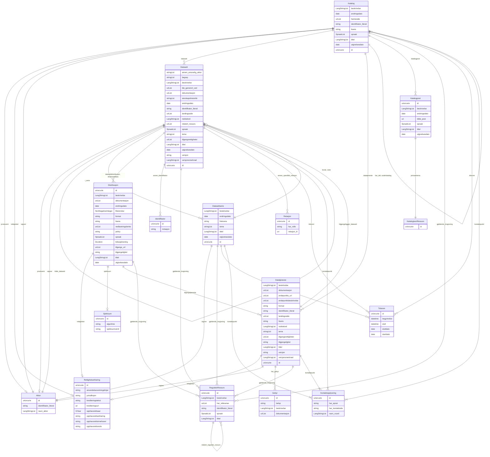

# dcat-ap-no

Norsk applikasjonsprofil av DCAT-AP, modellert i LinkML med lenking framfor inlining. Basert på https://informasjonsforvaltning.github.io/dcat-ap-no/

URI: https://data.norge.no/linkml/dcat-ap-no

Name: dcat-ap-no

## Classes

### Obligatorisk

| Class | Description |
| --- | --- |
| [Aktor](klasser/aktor.md) | Ein aktør (person, organisasjon eller system) med ansvar for ein ressurs |
| [Datasett](klasser/datasett.md) | Ei samling av data utgjeven eller kuratert av éin aktør |
| [Datasettserie](klasser/datasettserie.md) | Ei serie av relaterte datasett publisert separat men med felles metadata |
| [Datatjeneste](klasser/datatjeneste.md) | Ei samling operasjonar tilgjengeleg via eit API-grensesnitt |
| [Distribusjon](klasser/distribusjon.md) | Ein spesifikk representasjon/nedlastbar form av eit datasett |
| [Identifikator](klasser/identifikator.md) | Ein alternativ identifikator for ein ressurs |
| [Katalog](klasser/katalog.md) | Ei kuratert samling av metadata om datasett, datatenestar og/eller andre kata... |
| [Katalogpost](klasser/katalogpost.md) | Ein katalogpost som beskriv ein ressurs i katalogen |
| [Kontaktopplysning](klasser/kontaktopplysning.md) | Kontaktinformasjon for ein aktør |
| [Relasjon](klasser/relasjon.md) | Ein kvalifisert relasjon mellom to ressursar |
| [Sjekksum](klasser/sjekksum.md) | Ein sjekksum for ein distribusjon |

### Andre

| Class | Description |
| --- | --- |
| [Gebyr](klasser/gebyr.md) | Eit gebyr knytt til bruk av ein datatjeneste |
| [KatalogisertRessurs](klasser/katalogisertressurs.md) | Basisklasse for ressursar som kan katalogiserast |
| [RegulativRessurs](klasser/regulativressurs.md) | Ein regulativ ressurs (lov, forskrift o |
| [Rettighetserklaring](klasser/rettighetserklaring.md) | Ei erklæring om rettar til ein ressurs (ODRS) |
| [Tidsrom](klasser/tidsrom.md) | Eit tidsintervall med start- og sluttdato |

## Slots

| Slot | Description |
| --- | --- |
| [algoritme](klasser/algoritme.md) | Hash-algoritme brukt for sjekksummen |
| [annen_ansvarlig_aktor](klasser/annen_ansvarlig_aktor.md) | Kvalifisert attributering til ansvarleg aktør |
| [annen_identifikator](klasser/annen_identifikator.md) | Alternativ identifikator frå eit anna system |
| [annen_spesifikk_relasjon](klasser/annen_spesifikk_relasjon.md) | Kvalifisert relasjon til ein annan ressurs |
| [anvendelsesretningslinjer](klasser/anvendelsesretningslinjer.md) | Retningslinjer for gjenbruk av data |
| [begrep](klasser/begrep.md) | Fagomgrep som datasettet handlar om |
| [begynnelse](klasser/begynnelse.md) | Starttidspunkt for eit tidsrom |
| [belop](klasser/belop.md) | Beløp for gebyret |
| [ble_generert_ved](klasser/ble_generert_ved.md) | Brukes til å referere til en aktivitet som genererte datasettet, eller som gi... |
| [datasett](klasser/datasett.md) | Datasett som er del av katalogen |
| [datasettdistribusjon](klasser/datasettdistribusjon.md) | Tilgjengelege distribusjonar av datasettet |
| [datatjeneste](klasser/datatjeneste.md) | Datatjeneste som er del av katalogen |
| [dokumentasjon](klasser/dokumentasjon.md) | Lenke til dokumentasjon om ressursen |
| [eierskapshistorikk](klasser/eierskapshistorikk.md) | Opphav og eigarskapshistorikk for ressursen |
| [eksempeldata](klasser/eksempeldata.md) | Eksempeldata som distribusjon |
| [endepunkts_url](klasser/endepunkts_url.md) | URL til datatjenestens endepunkt |
| [endepunktsbeskrivelse](klasser/endepunktsbeskrivelse.md) | URL til beskriving av endepunktet (t |
| [filstorrelse](klasser/filstorrelse.md) | Filstørrelse i bytes |
| [forste](klasser/forste.md) | Første datasett i ei datasettserie |
| [frekvens](klasser/frekvens.md) | Oppdateringsfrekvens for datasettet |
| [gjeldende_lovgivning](klasser/gjeldende_lovgivning.md) | Lovgjeving som gjeld for ressursen |
| [har_del](klasser/har_del.md) | Delkatalog inkludert i denne katalogen |
| [har_epost](klasser/har_epost.md) | E-postadresse til kontaktpunktet |
| [har_gebyr](klasser/har_gebyr.md) | Gebyr knytt til bruk av datatjenesten |
| [har_kontaktside](klasser/har_kontaktside.md) | Nettside for kontakt |
| [har_kvalitetsmerknad](klasser/har_kvalitetsmerknad.md) | Kvalitetsmerknad knytt til datasettet |
| [har_rolle](klasser/har_rolle.md) | Rolle ein aktør eller ressurs har i ein relasjon |
| [i_samsvar_med](klasser/i_samsvar_med.md) | Standard ressursen er i samsvar med |
| [i_serie](klasser/i_serie.md) | Datasettserie dette datasettet er ein del av |
| [jurisdiksjon](klasser/jurisdiksjon.md) | Jurisdiksjon for rettigheitserklæringa |
| [katalogpost](klasser/katalogpost.md) | Katalogpostar i katalogen |
| [kilde_datasett](klasser/kilde_datasett.md) | Datasett dette datasettet er avleidd frå |
| [kilde_post](klasser/kilde_post.md) | Kjelde for katalogposten (ekstern oppføring) |
| [komprimeringsformat](klasser/komprimeringsformat.md) | Komprimeringsformat brukt i distribusjonen |
| [kontaktpunkt](klasser/kontaktpunkt.md) | Kontaktinformasjon for hendvendelsar om ressursen |
| [krediteringstekst](klasser/krediteringstekst.md) | Tekst som skal brukast ved kreditering |
| [krediteringsurl](klasser/krediteringsurl.md) | URL for kreditering av rettshavar |
| [landingsside](klasser/landingsside.md) | Nettside med informasjon om ressursen |
| [lisens](klasser/lisens.md) | Lisens for bruk av ressursen |
| [medietype](klasser/medietype.md) | Medietype i samsvar med IANA-registeret |
| [navn_aktor](klasser/navn_aktor.md) | Namn på aktøren |
| [navn_vcard](klasser/navn_vcard.md) | Formatert namn (vCard) |
| [nedlastningslenke](klasser/nedlastningslenke.md) | Direkte nedlastingslenke for distribusjonsfila |
| [notasjon](klasser/notasjon.md) | Notasjon/kode for identifikatoren |
| [opphavsrettsaar](klasser/opphavsrettsaar.md) | Årstal for opphavsrett |
| [opphavsrettserklaring](klasser/opphavsrettserklaring.md) | Opphavsrettserklæring |
| [opphavsrettsinnehaver](klasser/opphavsrettsinnehaver.md) | Namn på opphavsrettsinnehavar |
| [opphavsrettsnotis](klasser/opphavsrettsnotis.md) | Opphavsrettsnotis |
| [pakkeformat](klasser/pakkeformat.md) | Pakkeformat brukt i distribusjonen |
| [policy](klasser/policy.md) | ODRL-policy som regulerer bruk av ressursen |
| [primaertema](klasser/primaertema.md) | Ressursen katalogposten primært beskriv |
| [produsent](klasser/produsent.md) | Aktøren som primært har skapt ressursen |
| [referanse](klasser/referanse.md) | Referanse til ekstern ressurs |
| [relasjon_til](klasser/relasjon_til.md) | Den relaterte ressursen i ein kvalifisert relasjon |
| [relatert_regulativ_ressurs](klasser/relatert_regulativ_ressurs.md) | Relatert regulativ ressurs |
| [relatert_ressurs](klasser/relatert_ressurs.md) | Generisk relasjon til ein annan ressurs |
| [rettigheter](klasser/rettigheter.md) | Rettar knytte til ressursen |
| [siste](klasser/siste.md) | Siste datasett i ei datasettserie |
| [sjekksum](klasser/sjekksum.md) | Sjekksum for distribusjonsfila |
| [sjekksumverdi](klasser/sjekksumverdi.md) | Sjekksumverdi som heksadesimal streng |
| [slutt](klasser/slutt.md) | Sluttidspunkt for eit tidsrom |
| [sluttdato](klasser/sluttdato.md) | Sluttdato for tidsrommet |
| [startdato](klasser/startdato.md) | Startdato for tidsrommet |
| [tema](klasser/tema.md) | Tema frå eit kontrollert vokabular |
| [temaer](klasser/temaer.md) | Temavokabular som vert brukt i katalogen |
| [tidsopplosning](klasser/tidsopplosning.md) | Minste tidsoppløysing i datasettet |
| [tidsrom](klasser/tidsrom.md) | Tidsperiode ressursen dekkar |
| [tilgangs_url](klasser/tilgangs_url.md) | URL for tilgang til distribusjonen |
| [tilgangsrettigheter](klasser/tilgangsrettigheter.md) | Egenskapen brukes til å angi om det er allmenn tilgang, betinget tilgang elle... |
| [tilgangstjeneste](klasser/tilgangstjeneste.md) | Datatjeneste som gjev tilgang til distribusjonen |
| [tilgjengeliggjor_datasett](klasser/tilgjengeliggjor_datasett.md) | Datasett som datatjenesten tilgjengeleggjer |
| [tilgjengelighet](klasser/tilgjengelighet.md) | Planlagt tilgjengelegheit for ressursen |
| [tittel_literal](klasser/tittel_literal.md) | Namn/tittel utan språktag |
| [underkatalog](klasser/underkatalog.md) | Katalog som er ein del av denne katalogen |
| [utgiver](klasser/utgiver.md) | Aktøren som er ansvarleg for å tilgjengeleggjere ressursen |
| [versjon](klasser/versjon.md) | Versjonsnummer |

## Enumerations

| Enumeration | Description |
| --- | --- |

## Types

| Type | Description |
| --- | --- |

## Subsets

| Subset | Description |
| --- | --- |
| [Anbefalt](klasser/anbefalt.md) | Anbefalte eigenskapar i ein AP-NO-profil |
| [Obligatorisk](klasser/obligatorisk.md) | Obligatoriske eigenskapar i ein AP-NO-profil |
| [Valgfri](klasser/valgfri.md) | Valfrie eigenskapar i ein AP-NO-profil |

## Generated artifacts

| Artefakt | Fil |
|----------|-----|
| SHACL shapes | [dcat-ap-no-shapes.ttl](dcat-ap-no-shapes.ttl) |
| JSON-LD kontekst | [dcat-ap-no-context.jsonld](dcat-ap-no-context.jsonld) |
| JSON Schema | [dcat-ap-no-schema.json](dcat-ap-no-schema.json) |
| OWL ontologi | [dcat-ap-no-ontology.ttl](dcat-ap-no-ontology.ttl) |
| RDF/Turtle skjema | [dcat-ap-no-schema.ttl](dcat-ap-no-schema.ttl) |
| Python-klasser | [dcat-ap-no-model.py](dcat-ap-no-model.py) |
| ER-diagram (Mermaid) | [dcat-ap-no-erdiagram.md](dcat-ap-no-erdiagram.md) |
| Eksempeldata (Turtle) | [dcat-ap-no-eksempel.ttl](dcat-ap-no-eksempel.ttl) |
