# dcat-ap-no

```mermaid
erDiagram
Aktor {
    uriorcurie id  
    string identifikator_literal  
    LangStringList navn_aktor  
}
Begrepssamling {
    uriorcurie id  
}
Brukartilbakemelding {
    uriorcurie id  
    uriorcurie er_motivert_av  
    uri har_maal  
    LangStringList har_merknad  
}
Datasett {
    stringList annen_ansvarlig_aktor  
    stringList begrep  
    LangStringList beskrivelse  
    uriList ble_generert_ved  
    uriList dokumentasjon  
    stringList eierskapshistorikk  
    date endringsdato  
    string identifikator_literal  
    uriList landingsside  
    LangStringList nokkelord  
    uriList relatert_ressurs  
    SpraakList spraak  
    stringList tema  
    uriList tilgangsrettigheter  
    LangStringList tittel  
    date utgivelsesdato  
    string versjon  
    LangStringList versjonsmerknad  
    uriorcurie id  
}
Datasettserie {
    LangStringList beskrivelse  
    date endringsdato  
    string frekvens  
    stringList tema  
    LangStringList tittel  
    date utgivelsesdato  
    uriorcurie id  
}
Datatjeneste {
    LangStringList beskrivelse  
    uriList dokumentasjon  
    uriList endepunkts_url  
    uriList endepunktsbeskrivelse  
    string format  
    string identifikator_literal  
    uriList landingsside  
    string lisens  
    LangStringList nokkelord  
    stringList tema  
    uriList tilgangsrettigheter  
    string tilgjengelighet  
    LangStringList tittel  
    string versjon  
    LangStringList versjonsmerknad  
    uriorcurie id  
}
Distribusjon {
    uriorcurie id  
    LangStringList beskrivelse  
    uriList dokumentasjon  
    date endringsdato  
    NonNegativeInteger filstorrelse  
    string format  
    string lisens  
    uriList nedlastningslenke  
    string policy  
    SpraakList spraak  
    Duration tidsopplosning  
    uriList tilgangs_url  
    string tilgjengelighet  
    LangStringList tittel  
    date utgivelsesdato  
}
Gebyr {
    uriorcurie id  
    string belop  
    LangStringList beskrivelse  
    uriList dokumentasjon  
}
Identifikator {
    uriorcurie id  
    string notasjon  
}
Katalog {
    LangStringList beskrivelse  
    date endringsdato  
    uriList heimeside  
    string identifikator_literal  
    string lisens  
    SpraakList spraak  
    LangStringList tittel  
    date utgivelsesdato  
    uriorcurie id  
}
KatalogisertRessurs {
    uriorcurie id  
}
Katalogpost {
    uriorcurie id  
    LangStringList beskrivelse  
    date endringsdato  
    uri kilde_post  
    SpraakList spraak  
    LangStringList tittel  
    date utgivelsesdato  
}
Konsept {
    uriorcurie id  
}
Kontaktopplysning {
    uriorcurie id  
    string har_epost  
    string har_kontaktside  
    LangStringList navn_vcard  
}
Kvalitetsdeldimensjon {
    LangStringList har_anbefalt_term  
    LangStringList har_definisjon  
    uriorcurie id  
}
Kvalitetsdimensjon {
    uriorcurie id  
    LangStringList har_anbefalt_term  
    LangStringList har_definisjon  
}
Kvalitetsmaal {
    uriorcurie id  
    LangStringList har_anbefalt_term  
    LangStringList har_definisjon  
    uriorcurie har_forventet_datatype  
}
Kvalitetsmaaling {
    uriorcurie id  
    LangStringList har_merknad  
    string har_verdi  
}
Kvalitetsmerknad {
    uriorcurie id  
    uriorcurie er_motivert_av  
    uri har_maal  
    LangStringList har_merknad  
}
Kvalitetssertifikat {
    uriorcurie id  
    uriorcurie er_motivert_av  
    uri har_maal  
    LangStringList har_merknad  
}
Mediatype {
    uriorcurie id  
}
RegulativRessurs {
    uriorcurie id  
    LangStringList beskrivelse  
    uriList har_referanse  
    string identifikator_literal  
    SpraakList spraak  
    LangStringList tittel  
}
Relasjon {
    uriorcurie id  
    string har_rolle  
    uri relasjon_til  
}
Rettighetserklaring {
    uriorcurie id  
    string anvendelsesretningslinjer  
    string jurisdiksjon  
    string krediteringstekst  
    uri krediteringsurl  
    GYear opphavsrettsaar  
    string opphavsrettserklaring  
    string opphavsrettsinnehaver  
    string opphavsrettsnotis  
}
Sjekksum {
    uriorcurie id  
    string algoritme  
    string sjekksumverdi  
}
Standard {
    uriorcurie id  
    LangStringList har_merknad  
    uriList har_referanse  
    string har_versjonsnummer  
    LangStringList tittel  
}
Tekstdel {
    uriorcurie id  
    string format  
    string har_verdi_tekstdel  
    SpraakList spraak  
}
Tidsrom {
    uriorcurie id  
    datetime begynnelse  
    datetime slutt  
    date sluttdato  
    date startdato  
}

Aktor ||--|o Konsept : "type_concept"
Brukartilbakemelding ||--|o Tekstdel : "har_tekstdel"
Brukartilbakemelding ||--}o Kvalitetsdimensjon : "er_i_kvalitetsdimensjon"
Datasett ||--|o Aktor : "produsent"
Datasett ||--|o Konsept : "type_concept"
Datasett ||--|| Aktor : "utgiver"
Datasett ||--}o Datasett : "kilde_datasett"
Datasett ||--}o Datasettserie : "i_serie"
Datasett ||--}o Distribusjon : "datasettdistribusjon, eksempeldata"
Datasett ||--}o Identifikator : "annen_identifikator"
Datasett ||--}o Konsept : "dekningsomraade"
Datasett ||--}o Kvalitetsmaaling : "har_kvalitetsmaaling"
Datasett ||--}o Kvalitetsmerknad : "har_kvalitetsmerknad"
Datasett ||--}o RegulativRessurs : "gjeldende_lovgivning"
Datasett ||--}o Relasjon : "annen_spesifikk_relasjon"
Datasett ||--}o Standard : "i_samsvar_med"
Datasett ||--}o Tidsrom : "tidsrom"
Datasett ||--}| Kontaktopplysning : "kontaktpunkt"
Datasettserie ||--|o Datasett : "forste, siste"
Datasettserie ||--|| Aktor : "utgiver"
Datasettserie ||--}o Konsept : "dekningsomraade"
Datasettserie ||--}o RegulativRessurs : "gjeldende_lovgivning"
Datasettserie ||--}o Tidsrom : "tidsrom"
Datasettserie ||--}| Kontaktopplysning : "kontaktpunkt"
Datatjeneste ||--|o Konsept : "status"
Datatjeneste ||--|o Rettighetserklaring : "rettigheter"
Datatjeneste ||--|| Aktor : "utgiver"
Datatjeneste ||--}o Datasett : "tilgjengeliggjor_datasett"
Datatjeneste ||--}o Gebyr : "har_gebyr"
Datatjeneste ||--}o RegulativRessurs : "gjeldende_lovgivning"
Datatjeneste ||--}o Standard : "i_samsvar_med"
Datatjeneste ||--}| Kontaktopplysning : "kontaktpunkt"
Distribusjon ||--|o Konsept : "status"
Distribusjon ||--|o Mediatype : "komprimeringsformat, medietype, pakkeformat"
Distribusjon ||--|o Rettighetserklaring : "rettigheter"
Distribusjon ||--|o Sjekksum : "sjekksum"
Distribusjon ||--}o Datatjeneste : "tilgangstjeneste"
Distribusjon ||--}o RegulativRessurs : "gjeldende_lovgivning"
Distribusjon ||--}o Standard : "i_samsvar_med"
Gebyr ||--|o Konsept : "valuta"
Katalog ||--|o Aktor : "produsent"
Katalog ||--|o Rettighetserklaring : "rettigheter"
Katalog ||--|| Aktor : "utgiver"
Katalog ||--}o Begrepssamling : "temaer"
Katalog ||--}o Datasett : "datasett"
Katalog ||--}o Datatjeneste : "datatjeneste"
Katalog ||--}o Katalog : "har_del, underkatalog"
Katalog ||--}o Katalogpost : "katalogpost"
Katalog ||--}o Konsept : "dekningsomraade"
Katalog ||--}o RegulativRessurs : "gjeldende_lovgivning"
Katalog ||--}o Tidsrom : "tidsrom"
Katalog ||--}| Kontaktopplysning : "kontaktpunkt"
Katalogpost ||--|o Konsept : "status"
Katalogpost ||--|| KatalogisertRessurs : "primaertema"
Katalogpost ||--}o Standard : "i_samsvar_med"
Kvalitetsdeldimensjon ||--|| Kvalitetsdimensjon : "er_deldimensjon_av"
Kvalitetsmaal ||--|| Kvalitetsdeldimensjon : "er_i_kvalitetsdeldimensjon"
Kvalitetsmaaling ||--|| Kvalitetsmaal : "er_kvalitetsmaaling_av"
Kvalitetsmerknad ||--|o Tekstdel : "har_tekstdel"
Kvalitetsmerknad ||--}o Kvalitetsdimensjon : "er_i_kvalitetsdimensjon"
Kvalitetssertifikat ||--|o Tekstdel : "har_tekstdel"
Kvalitetssertifikat ||--}o Kvalitetsdimensjon : "er_i_kvalitetsdimensjon"
RegulativRessurs ||--|o Konsept : "type_concept"
RegulativRessurs ||--}o RegulativRessurs : "relatert_regulativ_ressurs"
Standard ||--}o Kvalitetsdimensjon : "er_i_kvalitetsdimensjon"

```

Norsk applikasjonsprofil av DCAT-AP, modellert i LinkML med lenking framfor inlining. Basert på https://informasjonsforvaltning.github.io/dcat-ap-no/

URI: https://data.norge.no/linkml/dcat-ap-no

Name: dcat-ap-no

## Classes

| Class | Description |
| --- | --- |
| [Aktor](klasser/aktor.md) | Ein aktør (person, organisasjon eller system) med ansvar for ein ressurs |
| [Begrepssamling](klasser/begrepssamling.md) | Ei SKOS-omgrepssamling (temavokabular) |
| [Distribusjon](klasser/distribusjon.md) | Ein spesifikk representasjon/nedlastbar form av eit datasett |
| [Gebyr](klasser/gebyr.md) | Eit gebyr knytt til bruk av ein datatjeneste |
| [Identifikator](klasser/identifikator.md) | Ein alternativ identifikator for ein ressurs |
| [KatalogisertRessurs](klasser/katalogisertressurs.md) | Basisklasse for ressursar som kan katalogiserast |
| &nbsp;&nbsp;&nbsp;&nbsp;&nbsp;&nbsp;&nbsp;&nbsp;[Datasett](klasser/datasett.md) | Ei samling av data utgjeven eller kuratert av éin aktør |
| &nbsp;&nbsp;&nbsp;&nbsp;&nbsp;&nbsp;&nbsp;&nbsp;[Datasettserie](klasser/datasettserie.md) | Ei serie av relaterte datasett publisert separat men med felles metadata |
| &nbsp;&nbsp;&nbsp;&nbsp;&nbsp;&nbsp;&nbsp;&nbsp;[Datatjeneste](klasser/datatjeneste.md) | Ei samling operasjonar tilgjengeleg via eit API-grensesnitt |
| &nbsp;&nbsp;&nbsp;&nbsp;&nbsp;&nbsp;&nbsp;&nbsp;[Katalog](klasser/katalog.md) | Ei kuratert samling av metadata om datasett, datatenestar og/eller andre kata... |
| [Katalogpost](klasser/katalogpost.md) | Ein katalogpost som beskriv ein ressurs i katalogen |
| [Konsept](klasser/konsept.md) | Referanse til eit SKOS-omgrep frå eit kontrollert vokabular |
| [Kontaktopplysning](klasser/kontaktopplysning.md) | Kontaktinformasjon for ein aktør |
| [Kvalitetsdimensjon](klasser/kvalitetsdimensjon.md) | Ein kvalitetsdimensjon som grupperer relaterte kvalitetsmål |
| &nbsp;&nbsp;&nbsp;&nbsp;&nbsp;&nbsp;&nbsp;&nbsp;[Kvalitetsdeldimensjon](klasser/kvalitetsdeldimensjon.md) | Ein deldimensjon av ein kvalitetsdimensjon |
| [Kvalitetsmaal](klasser/kvalitetsmaal.md) | Eit kvalitetsmål som operasjonaliserer ein kvalitetsdeldimensjon |
| [Kvalitetsmaaling](klasser/kvalitetsmaaling.md) | Ei konkret måling av eit kvalitetsmål for eit datasett |
| [Kvalitetsmerknad](klasser/kvalitetsmerknad.md) | Ein merknad om kvaliteten til eit datasett |
| &nbsp;&nbsp;&nbsp;&nbsp;&nbsp;&nbsp;&nbsp;&nbsp;[Brukartilbakemelding](klasser/brukartilbakemelding.md) | Tilbakemelding frå ein brukar om kvaliteten til eit datasett |
| &nbsp;&nbsp;&nbsp;&nbsp;&nbsp;&nbsp;&nbsp;&nbsp;[Kvalitetssertifikat](klasser/kvalitetssertifikat.md) | Eit sertifikat som stadfester kvaliteten til eit datasett |
| [Mediatype](klasser/mediatype.md) | Ein medietype eller filformat (dct:MediaTypeOrExtent) |
| [RegulativRessurs](klasser/regulativressurs.md) | Ein regulativ ressurs (lov, forskrift o |
| [Relasjon](klasser/relasjon.md) | Ein kvalifisert relasjon mellom to ressursar |
| [Rettighetserklaring](klasser/rettighetserklaring.md) | Ei erklæring om rettar til ein ressurs (ODRS) |
| [Sjekksum](klasser/sjekksum.md) | Ein sjekksum for ein distribusjon |
| [Standard](klasser/standard.md) | Ein standard eller spesifikasjon som eit datasett er i samsvar med |
| [Tekstdel](klasser/tekstdel.md) | Ein tekstleg del av ein kvalitetsmerknad (Web Annotation) |
| [Tidsrom](klasser/tidsrom.md) | Eit tidsintervall med start- og sluttdato |

## Slots

| Slot | Description |
| --- | --- |
| [algoritme](klasser/algoritme.md) | Hash-algoritme brukt for sjekksummen |
| [anbefalt_term](klasser/anbefalt_term.md) | Føretrukke term/namn for ressursen (skos:prefLabel) |
| [annen_ansvarlig_aktor](klasser/annen_ansvarlig_aktor.md) | Kvalifisert attributering til ansvarleg aktør |
| [annen_identifikator](klasser/annen_identifikator.md) | Alternativ identifikator frå eit anna system |
| [annen_spesifikk_relasjon](klasser/annen_spesifikk_relasjon.md) | Kvalifisert relasjon til ein annan ressurs |
| [anvendelsesretningslinjer](klasser/anvendelsesretningslinjer.md) | Retningslinjer for gjenbruk av data |
| [begrep](klasser/begrep.md) | Fagomgrep som datasettet handlar om |
| [begynnelse](klasser/begynnelse.md) | Starttidspunkt for eit tidsrom |
| [belop](klasser/belop.md) | Beløp for gebyret |
| [beskrivelse](klasser/beskrivelse.md) | Fritekstbeskrivelse av ressursen (dct:description) |
| [ble_generert_ved](klasser/ble_generert_ved.md) | Brukes til å referere til en aktivitet som genererte datasettet, eller som gi... |
| [datasett](klasser/datasett.md) | Datasett som er del av katalogen |
| [datasettdistribusjon](klasser/datasettdistribusjon.md) | Tilgjengelege distribusjonar av datasettet |
| [datatjeneste](klasser/datatjeneste.md) | Datatjeneste som er del av katalogen |
| [dekningsomraade](klasser/dekningsomraade.md) | Geografisk dekningsområde (dct:spatial) |
| [dokumentasjon](klasser/dokumentasjon.md) | Lenke til dokumentasjon om ressursen |
| [eierskapshistorikk](klasser/eierskapshistorikk.md) | Opphav og eigarskapshistorikk for ressursen |
| [eksempeldata](klasser/eksempeldata.md) | Eksempeldata som distribusjon |
| [endepunkts_url](klasser/endepunkts_url.md) | URL til datatjenestens endepunkt |
| [endepunktsbeskrivelse](klasser/endepunktsbeskrivelse.md) | URL til beskriving av endepunktet (t |
| [endringsdato](klasser/endringsdato.md) | Dato for siste endring av ressursen (dct:modified) |
| [er_deldimensjon_av](klasser/er_deldimensjon_av.md) | Overordna kvalitetsdimensjon denne deldimensjonen høyrer til |
| [er_i_kvalitetsdeldimensjon](klasser/er_i_kvalitetsdeldimensjon.md) | Kvalitetsdeldimensjonen dette målet operasjonaliserer |
| [er_i_kvalitetsdimensjon](klasser/er_i_kvalitetsdimensjon.md) | Refererer til kvalitetsdimensjon(ar) som kvalitetsmerknaden gjeld |
| [er_kvalitetsmaaling_av](klasser/er_kvalitetsmaaling_av.md) | Kvalitetsmålet denne målinga er ei måling av |
| [er_motivert_av](klasser/er_motivert_av.md) | Motivasjonen bak kvalitetsmerknaden (t |
| [filstorrelse](klasser/filstorrelse.md) | Filstørrelse i bytes |
| [format](klasser/format.md) | Filformat eller medietype (dct:format) |
| [forste](klasser/forste.md) | Første datasett i ei datasettserie |
| [frekvens](klasser/frekvens.md) | Oppdateringsfrekvens for datasettet |
| [gjeldende_lovgivning](klasser/gjeldende_lovgivning.md) | Lovgjeving som gjeld for ressursen |
| [har_anbefalt_term](klasser/har_anbefalt_term.md) | Føretrekt term/namn for dimensjonen eller målet |
| [har_definisjon](klasser/har_definisjon.md) | Definisjon av dimensjonen eller målet |
| [har_del](klasser/har_del.md) | Delkatalog inkludert i denne katalogen |
| [har_epost](klasser/har_epost.md) | E-postadresse til kontaktpunktet |
| [har_forventet_datatype](klasser/har_forventet_datatype.md) | Forventa XSD-datatype for verdien av ei kvalitetsmåling |
| [har_gebyr](klasser/har_gebyr.md) | Gebyr knytt til bruk av datatjenesten |
| [har_kontaktside](klasser/har_kontaktside.md) | Nettside for kontakt |
| [har_kvalitetsmaaling](klasser/har_kvalitetsmaaling.md) | Kvalitetsmåling knytt til datasettet |
| [har_kvalitetsmerknad](klasser/har_kvalitetsmerknad.md) | Kvalitetsmerknad knytt til datasettet |
| [har_maal](klasser/har_maal.md) | Ressursen merknaden gjeld |
| [har_merknad](klasser/har_merknad.md) | Fritekstmerknad (rdfs:comment) |
| [har_referanse](klasser/har_referanse.md) | Referanse til ekstern ressurs (rdfs:seeAlso) |
| [har_rolle](klasser/har_rolle.md) | Rolle ein aktør eller ressurs har i ein relasjon |
| [har_tekstdel](klasser/har_tekstdel.md) | Tekstleg innhald i merknaden |
| [har_verdi](klasser/har_verdi.md) | Målt verdi (xsd:boolean, xsd:double, xsd:nonNegativeInteger eller rdfs:Litera... |
| [har_verdi_tekstdel](klasser/har_verdi_tekstdel.md) | Tekstinnhaldet i tekstdelen |
| [har_versjonsnummer](klasser/har_versjonsnummer.md) | Versjonsnummer for ressursen (owl:versionInfo) |
| [heimeside](klasser/heimeside.md) | Heimeside for ressursen eller organisasjonen (foaf:homepage) |
| [i_samsvar_med](klasser/i_samsvar_med.md) | Standard ressursen er i samsvar med |
| [i_serie](klasser/i_serie.md) | Datasettserie dette datasettet er ein del av |
| [id](klasser/id.md) | URI-identifikator for ressursen |
| [identifikator_literal](klasser/identifikator_literal.md) | Tekstleg identifikator for ressursen (dct:identifier) |
| [jurisdiksjon](klasser/jurisdiksjon.md) | Jurisdiksjon for rettigheitserklæringa |
| [katalogpost](klasser/katalogpost.md) | Katalogpostar i katalogen |
| [kilde_datasett](klasser/kilde_datasett.md) | Datasett dette datasettet er avleidd frå |
| [kilde_post](klasser/kilde_post.md) | Kjelde for katalogposten (ekstern oppføring) |
| [komprimeringsformat](klasser/komprimeringsformat.md) | Komprimeringsformat brukt i distribusjonen |
| [kontaktpunkt](klasser/kontaktpunkt.md) | Kontaktinformasjon for hendvendelsar om ressursen |
| [krediteringstekst](klasser/krediteringstekst.md) | Tekst som skal brukast ved kreditering |
| [krediteringsurl](klasser/krediteringsurl.md) | URL for kreditering av rettshavar |
| [landingsside](klasser/landingsside.md) | Nettside med informasjon om ressursen |
| [lisens](klasser/lisens.md) | Lisens for bruk av ressursen |
| [medietype](klasser/medietype.md) | Medietype i samsvar med IANA-registeret |
| [navn_aktor](klasser/navn_aktor.md) | Namn på aktøren |
| [navn_vcard](klasser/navn_vcard.md) | Formatert namn (vCard) |
| [nedlastningslenke](klasser/nedlastningslenke.md) | Direkte nedlastingslenke for distribusjonsfila |
| [nokkelord](klasser/nokkelord.md) | Nøkkelord som beskriv ressursen (dcat:keyword) |
| [notasjon](klasser/notasjon.md) | Notasjon/kode for identifikatoren |
| [opphavsrettsaar](klasser/opphavsrettsaar.md) | Årstal for opphavsrett |
| [opphavsrettserklaring](klasser/opphavsrettserklaring.md) | Opphavsrettserklæring |
| [opphavsrettsinnehaver](klasser/opphavsrettsinnehaver.md) | Namn på opphavsrettsinnehavar |
| [opphavsrettsnotis](klasser/opphavsrettsnotis.md) | Opphavsrettsnotis |
| [pakkeformat](klasser/pakkeformat.md) | Pakkeformat brukt i distribusjonen |
| [policy](klasser/policy.md) | ODRL-policy som regulerer bruk av ressursen |
| [primaertema](klasser/primaertema.md) | Ressursen katalogposten primært beskriv |
| [produsent](klasser/produsent.md) | Aktøren som primært har skapt ressursen |
| [referanse](klasser/referanse.md) | Referanse til ekstern ressurs |
| [relasjon_til](klasser/relasjon_til.md) | Den relaterte ressursen i ein kvalifisert relasjon |
| [relatert_regulativ_ressurs](klasser/relatert_regulativ_ressurs.md) | Relatert regulativ ressurs |
| [relatert_ressurs](klasser/relatert_ressurs.md) | Generisk relasjon til ein annan ressurs |
| [rettigheter](klasser/rettigheter.md) | Rettar knytte til ressursen |
| [siste](klasser/siste.md) | Siste datasett i ei datasettserie |
| [sjekksum](klasser/sjekksum.md) | Sjekksum for distribusjonsfila |
| [sjekksumverdi](klasser/sjekksumverdi.md) | Sjekksumverdi som heksadesimal streng |
| [slutt](klasser/slutt.md) | Sluttidspunkt for eit tidsrom |
| [sluttdato](klasser/sluttdato.md) | Sluttdato for tidsrommet |
| [spraak](klasser/spraak.md) | Språk brukt i ressursen (dct:language) |
| [startdato](klasser/startdato.md) | Startdato for tidsrommet |
| [status](klasser/status.md) | Status for ressursen frå eit kontrollert vokabular (adms:status) |
| [tema](klasser/tema.md) | Tema frå eit kontrollert vokabular |
| [temaer](klasser/temaer.md) | Temavokabular som vert brukt i katalogen |
| [tidsopplosning](klasser/tidsopplosning.md) | Minste tidsoppløysing i datasettet |
| [tidsrom](klasser/tidsrom.md) | Tidsperiode ressursen dekkar |
| [tilgangs_url](klasser/tilgangs_url.md) | URL for tilgang til distribusjonen |
| [tilgangsrettigheter](klasser/tilgangsrettigheter.md) | Egenskapen brukes til å angi om det er allmenn tilgang, betinget tilgang elle... |
| [tilgangstjeneste](klasser/tilgangstjeneste.md) | Datatjeneste som gjev tilgang til distribusjonen |
| [tilgjengeliggjor_datasett](klasser/tilgjengeliggjor_datasett.md) | Datasett som datatjenesten tilgjengeleggjer |
| [tilgjengelighet](klasser/tilgjengelighet.md) | Planlagt tilgjengelegheit for ressursen |
| [tittel](klasser/tittel.md) | Namn/tittel på ressursen (dct:title) |
| [tittel_literal](klasser/tittel_literal.md) | Namn/tittel utan språktag |
| [type_concept](klasser/type_concept.md) | Type ressurs frå eit kontrollert vokabular (dct:type) |
| [underkatalog](klasser/underkatalog.md) | Katalog som er ein del av denne katalogen |
| [utgivelsesdato](klasser/utgivelsesdato.md) | Dato ressursen vart første gong publisert (dct:issued) |
| [utgiver](klasser/utgiver.md) | Aktøren som er ansvarleg for å tilgjengeleggjere ressursen |
| [valuta](klasser/valuta.md) | Valuta (cv:currency) |
| [versjon](klasser/versjon.md) | Versjonsnummer |
| [versjonsmerknad](klasser/versjonsmerknad.md) | Merknad om endringar i denne versjonen (adms:versionNotes) |

## Enumerations

| Enumeration | Description |
| --- | --- |

## Types

| Type | Description |
| --- | --- |
| [Boolean](klasser/boolean.md) | A binary (true or false) value |
| [Curie](klasser/curie.md) | a compact URI |
| [Date](klasser/date.md) | a date (year, month and day) in an idealized calendar |
| [DateOrDatetime](klasser/dateordatetime.md) | Either a date or a datetime |
| [Datetime](klasser/datetime.md) | The combination of a date and time |
| [Decimal](klasser/decimal.md) | A real number with arbitrary precision that conforms to the xsd:decimal speci... |
| [Double](klasser/double.md) | A real number that conforms to the xsd:double specification |
| [Duration](klasser/duration.md) | ISO 8601-varigheit (xsd:duration), t |
| [Float](klasser/float.md) | A real number that conforms to the xsd:float specification |
| [GYear](klasser/gyear.md) | Gregorisk årstal (xsd:gYear), t |
| [Integer](klasser/integer.md) | An integer |
| [Jsonpath](klasser/jsonpath.md) | A string encoding a JSON Path |
| [Jsonpointer](klasser/jsonpointer.md) | A string encoding a JSON Pointer |
| [LangString](klasser/langstring.md) | Språktagget streng (rdf:langString) |
| [Ncname](klasser/ncname.md) | Prefix part of CURIE |
| [Nodeidentifier](klasser/nodeidentifier.md) | A URI, CURIE or BNODE that represents a node in a model |
| [NonNegativeInteger](klasser/nonnegativeinteger.md) | Ikkje-negativ heltalsverdi (xsd:nonNegativeInteger) |
| [Objectidentifier](klasser/objectidentifier.md) | A URI or CURIE that represents an object in the model |
| [Sparqlpath](klasser/sparqlpath.md) | A string encoding a SPARQL Property Path |
| [Spraak](klasser/spraak.md) | Språk |
| [String](klasser/string.md) | A character string |
| [Time](klasser/time.md) | A time object represents a (local) time of day, independent of any particular... |
| [Uri](klasser/uri.md) | a complete URI |
| [Uriorcurie](klasser/uriorcurie.md) | a URI or a CURIE |

## Subsets

| Subset | Description |
| --- | --- |
| [Anbefalt](klasser/anbefalt.md) | Anbefalte eigenskapar i ein AP-NO-profil |
| [Obligatorisk](klasser/obligatorisk.md) | Obligatoriske eigenskapar i ein AP-NO-profil |
| [Valgfri](klasser/valgfri.md) | Valfrie eigenskapar i ein AP-NO-profil |

## Artifacts

| Artefakt | Fil |
|----------|-----|
| SHACL shapes | [dcat-ap-no-shapes.ttl](dcat-ap-no-shapes.ttl) |
| JSON-LD kontekst | [dcat-ap-no-context.jsonld](dcat-ap-no-context.jsonld) |
| JSON Schema | [dcat-ap-no-schema.json](dcat-ap-no-schema.json) |
| OWL ontologi | [dcat-ap-no-ontology.ttl](dcat-ap-no-ontology.ttl) |
| RDF/Turtle skjema | [dcat-ap-no-schema.ttl](dcat-ap-no-schema.ttl) |
| Python-klasser | [dcat-ap-no-model.py](dcat-ap-no-model.py) |
| ER-diagram (Mermaid) | [dcat-ap-no-erdiagram.md](dcat-ap-no-erdiagram.md) |
| Eksempeldata (Turtle) | [dcat-ap-no-eksempel.ttl](dcat-ap-no-eksempel.ttl) |
