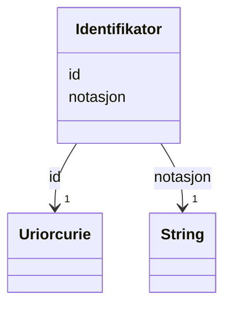

# Class: Identifikator 


_Ein alternativ identifikator for ein ressurs._


URI: [adms:Identifier](http://www.w3.org/ns/adms#Identifier)





<!-- no inheritance hierarchy -->

## Class Properties

| Property | Value |
| --- | --- |
| Class URI | [adms:Identifier](http://www.w3.org/ns/adms#Identifier) |


## Eigenskapar


  
  

  
  
    
  


### Obligatorisk

| Namn | Kardinalitet og domene | Beskriving |
| --- | --- | --- |
| [notasjon](notasjon.md) | 1 <br/> [xsd:string](http://www.w3.org/2001/XMLSchema#string) | Notasjon/kode for identifikatoren |


  
  

  
  


  
  

  
  


  
  
  
  
    
  

  
  
  
    
      
    
      
    
      
    
  
  


### Andre

| Namn | Kardinalitet og domene | Beskriving |
| --- | --- | --- |
| [id](id.md) | 1 <br/> [xsd:anyURI](http://www.w3.org/2001/XMLSchema#anyURI) | URI-identifikator for ressursen |


## Usages

| used by | used in | type | used |
| ---  | --- | --- | --- |
| [Datasett](datasett.md) | [annen_identifikator](annen_identifikator.md) | range | [Identifikator](identifikator.md) |


## See Also

* [https://data.norge.no/concepts/806b0e3a-38ab-3a3a-88d6-ddc7f8669f4a](https://data.norge.no/concepts/806b0e3a-38ab-3a3a-88d6-ddc7f8669f4a)


## Identifier and Mapping Information


### Schema Source


* from schema: https://data.norge.no/linkml/dcat-ap-no


## Mappings

| Mapping Type | Mapped Value |
| ---  | ---  |
| self | adms:Identifier |
| native | https://data.norge.no/linkml/dcat-ap-no/Identifikator |


## LinkML Source

<!-- TODO: investigate https://stackoverflow.com/questions/37606292/how-to-create-tabbed-code-blocks-in-mkdocs-or-sphinx -->

### Direct

<details>
```yaml
name: Identifikator
description: Ein alternativ identifikator for ein ressurs.
from_schema: https://data.norge.no/linkml/dcat-ap-no
see_also:
- https://data.norge.no/concepts/806b0e3a-38ab-3a3a-88d6-ddc7f8669f4a
rank: 1000
slots:
- id
- notasjon
slot_usage:
  notasjon:
    name: notasjon
    in_subset:
    - Obligatorisk
    required: true
class_uri: adms:Identifier

```
</details>

### Induced

<details>
```yaml
name: Identifikator
description: Ein alternativ identifikator for ein ressurs.
from_schema: https://data.norge.no/linkml/dcat-ap-no
see_also:
- https://data.norge.no/concepts/806b0e3a-38ab-3a3a-88d6-ddc7f8669f4a
rank: 1000
slot_usage:
  notasjon:
    name: notasjon
    in_subset:
    - Obligatorisk
    required: true
attributes:
  id:
    name: id
    description: URI-identifikator for ressursen.
    from_schema: https://data.norge.no/linkml/common-ap-no
    identifier: true
    owner: Identifikator
    domain_of:
    - Mediatype
    - Konsept
    - Begrepssamling
    - Kvalitetsdimensjon
    - Kvalitetsmaal
    - Kvalitetsmerknad
    - Kvalitetsmaaling
    - Standard
    - Tekstdel
    - KatalogisertRessurs
    - Aktor
    - Kontaktopplysning
    - Tidsrom
    - RegulativRessurs
    - Identifikator
    - Rettighetserklaring
    - Sjekksum
    - Gebyr
    - Relasjon
    - Distribusjon
    - Datasett
    - Katalogpost
    range: uriorcurie
    required: true
  notasjon:
    name: notasjon
    description: Notasjon/kode for identifikatoren.
    in_subset:
    - Obligatorisk
    from_schema: https://data.norge.no/linkml/dcat-ap-no
    rank: 1000
    slot_uri: skos:notation
    owner: Identifikator
    domain_of:
    - Identifikator
    range: string
    required: true
class_uri: adms:Identifier

```
</details>