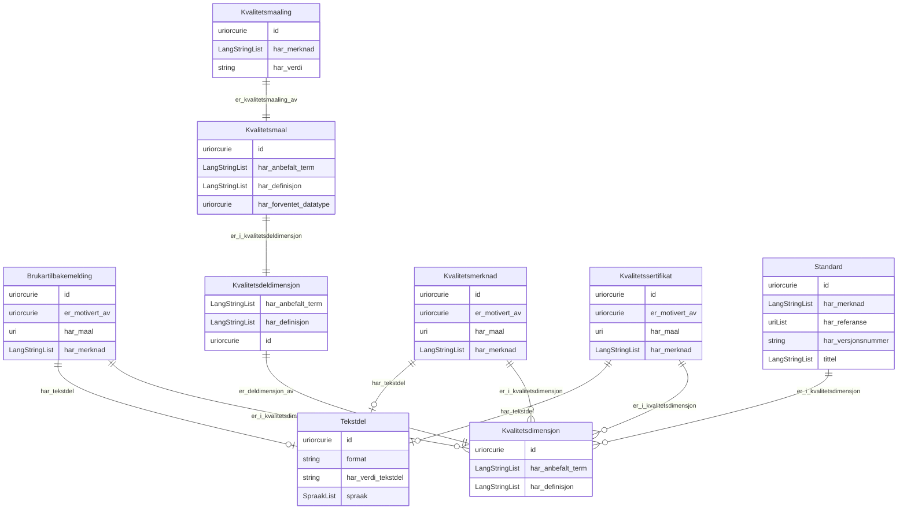

```mermaid
erDiagram
Brukartilbakemelding {
    uriorcurie id  
    uriorcurie er_motivert_av  
    uri har_maal  
    LangStringList har_merknad  
}
Kvalitetsdeldimensjon {
    LangStringList har_anbefalt_term  
    LangStringList har_definisjon  
    uriorcurie id  
}
Kvalitetsdimensjon {
    uriorcurie id  
    LangStringList har_anbefalt_term  
    LangStringList har_definisjon  
}
Kvalitetsmaal {
    uriorcurie id  
    LangStringList har_anbefalt_term  
    LangStringList har_definisjon  
    uriorcurie har_forventet_datatype  
}
Kvalitetsmaaling {
    uriorcurie id  
    LangStringList har_merknad  
    string har_verdi  
}
Kvalitetsmerknad {
    uriorcurie id  
    uriorcurie er_motivert_av  
    uri har_maal  
    LangStringList har_merknad  
}
Kvalitetssertifikat {
    uriorcurie id  
    uriorcurie er_motivert_av  
    uri har_maal  
    LangStringList har_merknad  
}
Standard {
    uriorcurie id  
    LangStringList har_merknad  
    uriList har_referanse  
    string har_versjonsnummer  
    LangStringList tittel  
}
Tekstdel {
    uriorcurie id  
    string format  
    string har_verdi_tekstdel  
    SpraakList spraak  
}

Brukartilbakemelding ||--|o Tekstdel : "har_tekstdel"
Brukartilbakemelding ||--}o Kvalitetsdimensjon : "er_i_kvalitetsdimensjon"
Kvalitetsdeldimensjon ||--|| Kvalitetsdimensjon : "er_deldimensjon_av"
Kvalitetsmaal ||--|| Kvalitetsdeldimensjon : "er_i_kvalitetsdeldimensjon"
Kvalitetsmaaling ||--|| Kvalitetsmaal : "er_kvalitetsmaaling_av"
Kvalitetsmerknad ||--|o Tekstdel : "har_tekstdel"
Kvalitetsmerknad ||--}o Kvalitetsdimensjon : "er_i_kvalitetsdimensjon"
Kvalitetssertifikat ||--|o Tekstdel : "har_tekstdel"
Kvalitetssertifikat ||--}o Kvalitetsdimensjon : "er_i_kvalitetsdimensjon"
Standard ||--}o Kvalitetsdimensjon : "er_i_kvalitetsdimensjon"


```
