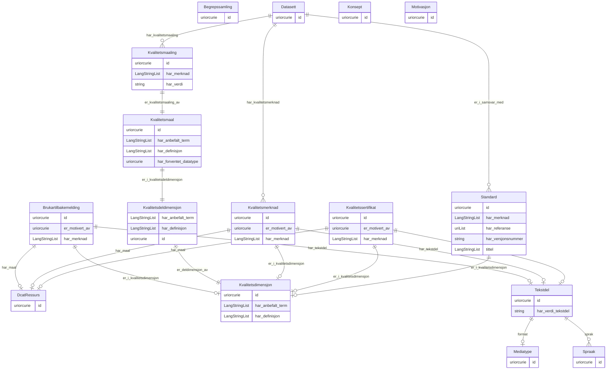

# dqv-ap-no

Norsk applikasjonsprofil av DQV (Data Quality Vocabulary), modellert i LinkML med lenking framfor inlining. Basert på https://informasjonsforvaltning.github.io/dqv-ap-no/

URI: https://data.norge.no/linkml/dqv-ap-no

Name: dqv-ap-no

## Classes

| Class | Description |
| --- | --- |
| [Begrepssamling](klasser/begrepssamling.md) | Ei SKOS-omgrepssamling (temavokabular) |
| [Datasett](klasser/datasett.md) | Eit datasett (dcat:Dataset) utvida med DQV-AP-NO-eigenskapar for kvalitetsinf... |
| [DcatRessurs](klasser/dcatressurs.md) | Ein katalogisert ressurs (brukt som målklasse for oa:hasTarget) |
| [Konsept](klasser/konsept.md) | Referanse til eit SKOS-omgrep frå eit kontrollert vokabular |
| [Kvalitetsdimensjon](klasser/kvalitetsdimensjon.md) | Ein kvalitetsdimensjon som grupperer relaterte kvalitetsmål |
| &nbsp;&nbsp;&nbsp;&nbsp;&nbsp;&nbsp;&nbsp;&nbsp;[Kvalitetsdeldimensjon](klasser/kvalitetsdeldimensjon.md) | Ein deldimensjon av ein kvalitetsdimensjon |
| [Kvalitetsmaal](klasser/kvalitetsmaal.md) | Eit kvalitetsmål som operasjonaliserer ein kvalitetsdeldimensjon |
| [Kvalitetsmaaling](klasser/kvalitetsmaaling.md) | Ei konkret måling av eit kvalitetsmål for eit datasett |
| [Kvalitetsmerknad](klasser/kvalitetsmerknad.md) | Ein merknad om kvaliteten til eit datasett |
| &nbsp;&nbsp;&nbsp;&nbsp;&nbsp;&nbsp;&nbsp;&nbsp;[Brukartilbakemelding](klasser/brukartilbakemelding.md) | Tilbakemelding frå ein brukar om kvaliteten til eit datasett |
| &nbsp;&nbsp;&nbsp;&nbsp;&nbsp;&nbsp;&nbsp;&nbsp;[Kvalitetssertifikat](klasser/kvalitetssertifikat.md) | Eit sertifikat som stadfester kvaliteten til eit datasett |
| [Mediatype](klasser/mediatype.md) | Ein medietype eller filformat (dct:MediaTypeOrExtent) |
| [Motivasjon](klasser/motivasjon.md) | Motivasjonen bak ein kvalitetsmerknad (Web Annotation) |
| [Spraak](klasser/spraak.md) | Ein språkreferanse (dct:LinguisticSystem) |
| [Standard](klasser/standard.md) | Ein standard eller spesifikasjon som eit datasett er i samsvar med |
| [Tekstdel](klasser/tekstdel.md) | Ein tekstleg del av ein kvalitetsmerknad (Web Annotation) |

## Slots

| Slot | Description |
| --- | --- |
| [anbefalt_term](klasser/anbefalt_term.md) | Føretrukke term/namn for ressursen (skos:prefLabel) |
| [beskrivelse](klasser/beskrivelse.md) | Fritekstbeskrivelse av ressursen (dct:description) |
| [dekningsomrade](klasser/dekningsomrade.md) | Geografisk dekningsområde (dct:spatial) |
| [endringsdato](klasser/endringsdato.md) | Dato for siste endring av ressursen (dct:modified) |
| [er_deldimensjon_av](klasser/er_deldimensjon_av.md) | Overordna kvalitetsdimensjon denne deldimensjonen høyrer til |
| [er_i_kvalitetsdeldimensjon](klasser/er_i_kvalitetsdeldimensjon.md) | Kvalitetsdeldimensjonen dette målet operasjonaliserer |
| [er_i_kvalitetsdimensjon](klasser/er_i_kvalitetsdimensjon.md) | Kvalitetsdimensjonen denne merknaden eller standarden gjeld |
| [er_i_samsvar_med](klasser/er_i_samsvar_med.md) | Standard eller spesifikasjon datasettet er i samsvar med |
| [er_kvalitetsmaaling_av](klasser/er_kvalitetsmaaling_av.md) | Kvalitetsmålet denne målinga er ei måling av |
| [er_motivert_av](klasser/er_motivert_av.md) | Motivasjonen bak kvalitetsmerknaden (t |
| [format](klasser/format.md) | Filformat eller medietype (dct:format) |
| [har_anbefalt_term](klasser/har_anbefalt_term.md) | Føretrekt term/namn for dimensjonen eller målet |
| [har_definisjon](klasser/har_definisjon.md) | Definisjon av dimensjonen eller målet |
| [har_forventet_datatype](klasser/har_forventet_datatype.md) | Forventa XSD-datatype for verdien av ei kvalitetsmåling |
| [har_kvalitetsmaaling](klasser/har_kvalitetsmaaling.md) | Kvalitetsmåling knytt til datasettet |
| [har_kvalitetsmerknad](klasser/har_kvalitetsmerknad.md) | Kvalitetsmerknad knytt til datasettet |
| [har_maal](klasser/har_maal.md) | Ressursen merknaden gjeld |
| [har_merknad](klasser/har_merknad.md) | Fritekstmerknad (rdfs:comment) |
| [har_referanse](klasser/har_referanse.md) | Referanse til ekstern ressurs (rdfs:seeAlso) |
| [har_tekstdel](klasser/har_tekstdel.md) | Tekstleg innhald i merknaden |
| [har_verdi](klasser/har_verdi.md) | Målt verdi (xsd:boolean, xsd:double, xsd:nonNegativeInteger eller rdfs:Litera... |
| [har_verdi_tekstdel](klasser/har_verdi_tekstdel.md) | Tekstinnhaldet i tekstdelen |
| [har_versjonsnummer](klasser/har_versjonsnummer.md) | Versjonsnummer for ressursen (owl:versionInfo) |
| [heimeside](klasser/heimeside.md) | Heimeside for ressursen eller organisasjonen (foaf:homepage) |
| [id](klasser/id.md) | URI-identifikator for ressursen |
| [identifikator_literal](klasser/identifikator_literal.md) | Tekstleg identifikator for ressursen (dct:identifier) |
| [nokkelord](klasser/nokkelord.md) | Nøkkelord som beskriv ressursen (dcat:keyword) |
| [sprak](klasser/sprak.md) | Språk brukt i ressursen (dct:language) |
| [status](klasser/status.md) | Status for ressursen frå eit kontrollert vokabular (adms:status) |
| [tittel](klasser/tittel.md) | Namn/tittel på ressursen (dct:title) |
| [type_concept](klasser/type_concept.md) | Type ressurs frå eit kontrollert vokabular (dct:type) |
| [utgivelsesdato](klasser/utgivelsesdato.md) | Dato ressursen vart første gong publisert (dct:issued) |
| [valuta](klasser/valuta.md) | Valuta (cv:currency) |
| [versjonsmerknad](klasser/versjonsmerknad.md) | Merknad om endringar i denne versjonen (adms:versionNotes) |

## Enumerations

| Enumeration | Description |
| --- | --- |

## Types

| Type | Description |
| --- | --- |
| [Boolean](klasser/boolean.md) | A binary (true or false) value |
| [Curie](klasser/curie.md) | a compact URI |
| [Date](klasser/date.md) | a date (year, month and day) in an idealized calendar |
| [DateOrDatetime](klasser/dateordatetime.md) | Either a date or a datetime |
| [Datetime](klasser/datetime.md) | The combination of a date and time |
| [Decimal](klasser/decimal.md) | A real number with arbitrary precision that conforms to the xsd:decimal speci... |
| [Double](klasser/double.md) | A real number that conforms to the xsd:double specification |
| [Duration](klasser/duration.md) | ISO 8601-varigheit (xsd:duration), t |
| [Float](klasser/float.md) | A real number that conforms to the xsd:float specification |
| [GYear](klasser/gyear.md) | Gregorisk årstal (xsd:gYear), t |
| [Integer](klasser/integer.md) | An integer |
| [Jsonpath](klasser/jsonpath.md) | A string encoding a JSON Path |
| [Jsonpointer](klasser/jsonpointer.md) | A string encoding a JSON Pointer |
| [LangString](klasser/langstring.md) | Språktagget streng (rdf:langString) |
| [Ncname](klasser/ncname.md) | Prefix part of CURIE |
| [Nodeidentifier](klasser/nodeidentifier.md) | A URI, CURIE or BNODE that represents a node in a model |
| [NonNegativeInteger](klasser/nonnegativeinteger.md) | Ikkje-negativ heltalsverdi (xsd:nonNegativeInteger) |
| [Objectidentifier](klasser/objectidentifier.md) | A URI or CURIE that represents an object in the model |
| [Sparqlpath](klasser/sparqlpath.md) | A string encoding a SPARQL Property Path |
| [String](klasser/string.md) | A character string |
| [Time](klasser/time.md) | A time object represents a (local) time of day, independent of any particular... |
| [Uri](klasser/uri.md) | a complete URI |
| [Uriorcurie](klasser/uriorcurie.md) | a URI or a CURIE |

## Subsets

| Subset | Description |
| --- | --- |
| [Anbefalt](klasser/anbefalt.md) | Anbefalte eigenskapar i ein AP-NO-profil |
| [Obligatorisk](klasser/obligatorisk.md) | Obligatoriske eigenskapar i ein AP-NO-profil |
| [Valgfri](klasser/valgfri.md) | Valfrie eigenskapar i ein AP-NO-profil |

## Artifacts

| Artefakt | Fil |
|----------|-----|
| SHACL shapes | [dqv-ap-no-shapes.ttl](dqv-ap-no-shapes.ttl) |
| JSON-LD kontekst | [dqv-ap-no-context.jsonld](dqv-ap-no-context.jsonld) |
| JSON Schema | [dqv-ap-no-schema.json](dqv-ap-no-schema.json) |
| OWL ontologi | [dqv-ap-no-ontology.ttl](dqv-ap-no-ontology.ttl) |
| RDF/Turtle skjema | [dqv-ap-no-schema.ttl](dqv-ap-no-schema.ttl) |
| Python-klasser | [dqv-ap-no-model.py](dqv-ap-no-model.py) |
| ER-diagram (Mermaid) | [dqv-ap-no-erdiagram.md](dqv-ap-no-erdiagram.md) |
| Eksempeldata (Turtle) | [dqv-ap-no-eksempel.ttl](dqv-ap-no-eksempel.ttl) |
