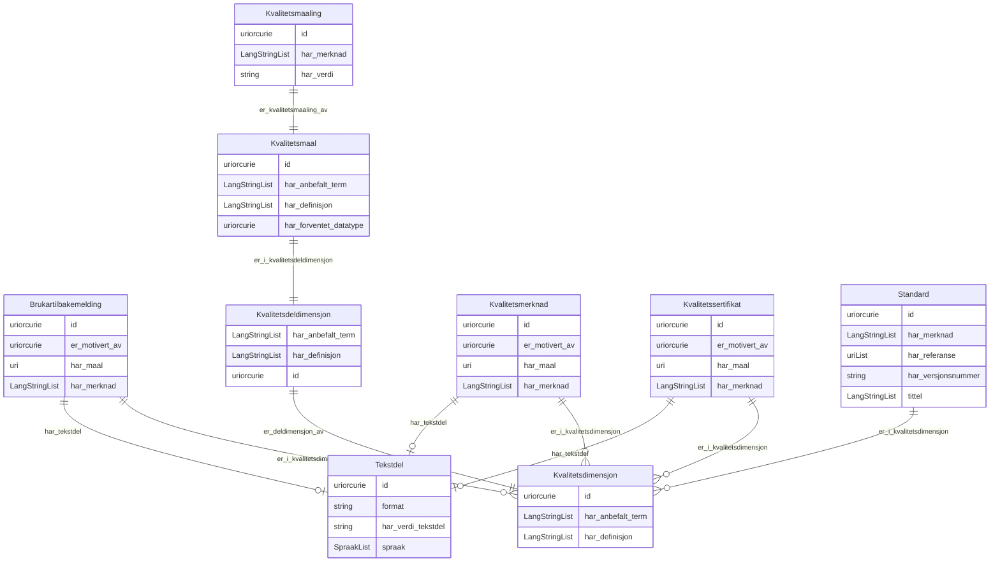

# dqv-ap-no

Norsk applikasjonsprofil av DQV (Data Quality Vocabulary), modellert i LinkML med lenking framfor inlining. Basert på https://informasjonsforvaltning.github.io/dqv-ap-no/

URI: https://data.norge.no/linkml/dqv-ap-no

Name: dqv-ap-no

## Classes

### Obligatorisk

| Class | Description |
| --- | --- |
| [Kvalitetsdeldimensjon](klasser/kvalitetsdeldimensjon.md) | Ein deldimensjon av ein kvalitetsdimensjon |
| [Kvalitetsmaal](klasser/kvalitetsmaal.md) | Eit kvalitetsmål som operasjonaliserer ein kvalitetsdeldimensjon |
| [Kvalitetsmaaling](klasser/kvalitetsmaaling.md) | Ei konkret måling av eit kvalitetsmål for eit datasett |
| [Kvalitetsmerknad](klasser/kvalitetsmerknad.md) | Ein merknad om kvaliteten til eit datasett |
| [Standard](klasser/standard.md) | Ein standard eller spesifikasjon som eit datasett er i samsvar med |
| [Tekstdel](klasser/tekstdel.md) | Ein tekstleg del av ein kvalitetsmerknad (Web Annotation) |

### Anbefalt

| Class | Description |
| --- | --- |
| [Kvalitetsdimensjon](klasser/kvalitetsdimensjon.md) | Ein kvalitetsdimensjon som grupperer relaterte kvalitetsmål |

### Andre

| Class | Description |
| --- | --- |
| [Brukartilbakemelding](klasser/brukartilbakemelding.md) | Tilbakemelding frå ein brukar om kvaliteten til eit datasett |
| [Kvalitetssertifikat](klasser/kvalitetssertifikat.md) | Eit sertifikat som stadfester kvaliteten til eit datasett |

## Slots

| Slot | Description |
| --- | --- |
| [er_deldimensjon_av](klasser/er_deldimensjon_av.md) | Overordna kvalitetsdimensjon denne deldimensjonen høyrer til |
| [er_i_kvalitetsdeldimensjon](klasser/er_i_kvalitetsdeldimensjon.md) | Kvalitetsdeldimensjonen dette målet operasjonaliserer |
| [er_i_kvalitetsdimensjon](klasser/er_i_kvalitetsdimensjon.md) | Refererer til kvalitetsdimensjon(ar) som kvalitetsmerknaden gjeld |
| [er_kvalitetsmaaling_av](klasser/er_kvalitetsmaaling_av.md) | Kvalitetsmålet denne målinga er ei måling av |
| [er_motivert_av](klasser/er_motivert_av.md) | Motivasjonen bak kvalitetsmerknaden (t |
| [har_anbefalt_term](klasser/har_anbefalt_term.md) | Føretrekt term/namn for dimensjonen eller målet |
| [har_definisjon](klasser/har_definisjon.md) | Definisjon av dimensjonen eller målet |
| [har_forventet_datatype](klasser/har_forventet_datatype.md) | Forventa XSD-datatype for verdien av ei kvalitetsmåling |
| [har_kvalitetsmaaling](klasser/har_kvalitetsmaaling.md) | Kvalitetsmåling knytt til datasettet |
| [har_maal](klasser/har_maal.md) | Ressursen merknaden gjeld |
| [har_tekstdel](klasser/har_tekstdel.md) | Tekstleg innhald i merknaden |
| [har_verdi](klasser/har_verdi.md) | Målt verdi (xsd:boolean, xsd:double, xsd:nonNegativeInteger eller rdfs:Litera... |
| [har_verdi_tekstdel](klasser/har_verdi_tekstdel.md) | Tekstinnhaldet i tekstdelen |

## Enumerations

| Enumeration | Description |
| --- | --- |

## Types

| Type | Description |
| --- | --- |

## Subsets

| Subset | Description |
| --- | --- |
| [Anbefalt](klasser/anbefalt.md) | Anbefalte eigenskapar i ein AP-NO-profil |
| [Obligatorisk](klasser/obligatorisk.md) | Obligatoriske eigenskapar i ein AP-NO-profil |
| [Valgfri](klasser/valgfri.md) | Valfrie eigenskapar i ein AP-NO-profil |

## Generated artifacts

| Artefakt | Fil |
|----------|-----|
| SHACL shapes | [dqv-ap-no-shapes.ttl](dqv-ap-no-shapes.ttl) |
| JSON-LD kontekst | [dqv-ap-no-context.jsonld](dqv-ap-no-context.jsonld) |
| JSON Schema | [dqv-ap-no-schema.json](dqv-ap-no-schema.json) |
| OWL ontologi | [dqv-ap-no-ontology.ttl](dqv-ap-no-ontology.ttl) |
| RDF/Turtle skjema | [dqv-ap-no-schema.ttl](dqv-ap-no-schema.ttl) |
| Python-klasser | [dqv-ap-no-model.py](dqv-ap-no-model.py) |
| ER-diagram (Mermaid) | [dqv-ap-no-erdiagram.md](dqv-ap-no-erdiagram.md) |
| Eksempeldata (Turtle) | [dqv-ap-no-eksempel.ttl](dqv-ap-no-eksempel.ttl) |
