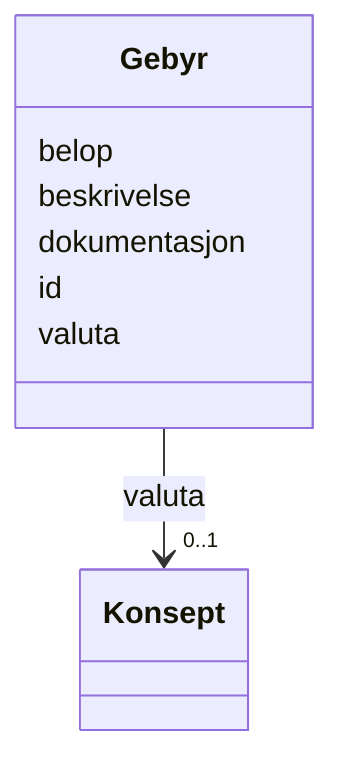

# Class: Gebyr 


_Eit gebyr knytt til bruk av ein datatjeneste._


URI: [cv:Cost](http://data.europa.eu/m8g/Cost)





<!-- no inheritance hierarchy -->

## Class Properties

| Property | Value |
| --- | --- |
| Class URI | [cv:Cost](http://data.europa.eu/m8g/Cost) |


## Eigenskapar


  
  

  
  

  
  

  
  

  
  


  
  

  
  

  
  

  
  

  
  


  
  

  
  

  
  

  
  

  
  


  
  
  
  
    
  

  
  
  
  
    
  

  
  
  
  
    
  

  
  
  
  
    
  

  
  
  
  
    
  


### Andre

| Namn | Kardinalitet og domene | Beskriving |
| --- | --- | --- |
| [id](id.md) | 1 <br/> [Uriorcurie](uriorcurie.md) | URI-identifikator for ressursen |
| [belop](belop.md) | 0..1 <br/> [String](string.md) | Beløp for gebyret |
| [beskrivelse](beskrivelse.md) | * <br/> [LangString](langstring.md) | Fritekstbeskrivelse av ressursen (dct:description) |
| [dokumentasjon](dokumentasjon.md) | * <br/> [Uri](uri.md) | Lenke til dokumentasjon om ressursen |
| [valuta](valuta.md) | 0..1 <br/> [Konsept](konsept.md) | Valuta (cv:currency) |


## Usages

| used by | used in | type | used |
| ---  | --- | --- | --- |
| [Datatjeneste](datatjeneste.md) | [har_gebyr](har_gebyr.md) | range | [Gebyr](gebyr.md) |


## Identifier and Mapping Information


### Schema Source


* from schema: https://data.norge.no/linkml/dqv-ap-no


## Mappings

| Mapping Type | Mapped Value |
| ---  | ---  |
| self | cv:Cost |
| native | https://data.norge.no/linkml/dqv-ap-no/Gebyr |


## LinkML Source

<!-- TODO: investigate https://stackoverflow.com/questions/37606292/how-to-create-tabbed-code-blocks-in-mkdocs-or-sphinx -->

### Direct

<details>
```yaml
name: Gebyr
description: Eit gebyr knytt til bruk av ein datatjeneste.
from_schema: https://data.norge.no/linkml/dqv-ap-no
slots:
- id
- belop
- beskrivelse
- dokumentasjon
- valuta
class_uri: cv:Cost

```
</details>

### Induced

<details>
```yaml
name: Gebyr
description: Eit gebyr knytt til bruk av ein datatjeneste.
from_schema: https://data.norge.no/linkml/dqv-ap-no
attributes:
  id:
    name: id
    description: URI-identifikator for ressursen.
    from_schema: https://data.norge.no/linkml/dqv-ap-no
    rank: 1000
    identifier: true
    alias: id
    owner: Gebyr
    domain_of:
    - Kvalitetsdimensjon
    - Kvalitetsmaal
    - Kvalitetsmerknad
    - Kvalitetsmaaling
    - Standard
    - Tekstdel
    - Mediatype
    - Konsept
    - Begrepssamling
    - KatalogisertRessurs
    - Aktor
    - Kontaktopplysning
    - Tidsrom
    - RegulativRessurs
    - Identifikator
    - Rettighetserklaring
    - Sjekksum
    - Gebyr
    - Relasjon
    - Distribusjon
    - Datasett
    - Katalogpost
    range: uriorcurie
    required: true
  belop:
    name: belop
    description: Beløp for gebyret.
    from_schema: https://data.norge.no/linkml/dqv-ap-no
    rank: 1000
    slot_uri: cv:hasValue
    alias: belop
    owner: Gebyr
    domain_of:
    - Gebyr
    range: string
  beskrivelse:
    name: beskrivelse
    description: Fritekstbeskrivelse av ressursen (dct:description).
    from_schema: https://data.norge.no/linkml/dqv-ap-no
    rank: 1000
    slot_uri: dct:description
    alias: beskrivelse
    owner: Gebyr
    domain_of:
    - RegulativRessurs
    - Gebyr
    - Distribusjon
    - Datasett
    - Datasettserie
    - Datatjeneste
    - Katalogpost
    - Katalog
    range: LangString
    multivalued: true
  dokumentasjon:
    name: dokumentasjon
    description: Lenke til dokumentasjon om ressursen.
    from_schema: https://data.norge.no/linkml/dqv-ap-no
    rank: 1000
    slot_uri: foaf:page
    alias: dokumentasjon
    owner: Gebyr
    domain_of:
    - Gebyr
    - Distribusjon
    - Datasett
    - Datatjeneste
    range: uri
    multivalued: true
  valuta:
    name: valuta
    description: Valuta (cv:currency).
    from_schema: https://data.norge.no/linkml/dqv-ap-no
    rank: 1000
    slot_uri: cv:currency
    alias: valuta
    owner: Gebyr
    domain_of:
    - Gebyr
    range: Konsept
class_uri: cv:Cost

```
</details>