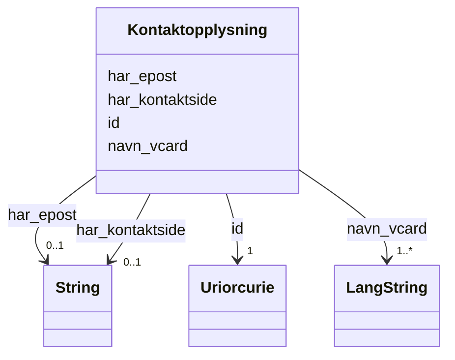

# Class: Kontaktopplysning 


_Kontaktinformasjon for ein aktør._


URI: [vcard:Kind](http://www.w3.org/2006/vcard/ns#Kind)





<!-- no inheritance hierarchy -->

## Class Properties

| Property | Value |
| --- | --- |
| Class URI | [vcard:Kind](http://www.w3.org/2006/vcard/ns#Kind) |


## Eigenskapar


  
  

  
  
    
  

  
  

  
  


### Obligatorisk

| Namn | Kardinalitet og domene | Beskriving |
| --- | --- | --- |
| [navn_vcard](navn_vcard.md) | 1..* <br/> [LangString](langstring.md) | Formatert namn (vCard) |


  
  

  
  

  
  

  
  


  
  

  
  

  
  

  
  


  
  
  
  
    
  

  
  
  
    
      
    
      
    
      
    
  
  

  
  
  
  
    
  

  
  
  
  
    
  


### Andre

| Namn | Kardinalitet og domene | Beskriving |
| --- | --- | --- |
| [id](id.md) | 1 <br/> [xsd:anyURI](http://www.w3.org/2001/XMLSchema#anyURI) | URI-identifikator for ressursen |
| [har_epost](har_epost.md) | 0..1 <br/> [xsd:string](http://www.w3.org/2001/XMLSchema#string) | E-postadresse til kontaktpunktet |
| [har_kontaktside](har_kontaktside.md) | 0..1 <br/> [xsd:string](http://www.w3.org/2001/XMLSchema#string) | Nettside for kontakt |


## Usages

| used by | used in | type | used |
| ---  | --- | --- | --- |
| [Datasett](datasett.md) | [kontaktpunkt](kontaktpunkt.md) | range | [Kontaktopplysning](kontaktopplysning.md) |
| [Datasettserie](datasettserie.md) | [kontaktpunkt](kontaktpunkt.md) | range | [Kontaktopplysning](kontaktopplysning.md) |
| [Datatjeneste](datatjeneste.md) | [kontaktpunkt](kontaktpunkt.md) | range | [Kontaktopplysning](kontaktopplysning.md) |
| [Katalog](katalog.md) | [kontaktpunkt](kontaktpunkt.md) | range | [Kontaktopplysning](kontaktopplysning.md) |


## See Also

* [https://data.norge.no/concepts/9c17b5e3-6763-3650-a741-b879e7bbdecc](https://data.norge.no/concepts/9c17b5e3-6763-3650-a741-b879e7bbdecc)


## Identifier and Mapping Information


### Schema Source


* from schema: https://data.norge.no/ap-no/dcat-ap-no


## Mappings

| Mapping Type | Mapped Value |
| ---  | ---  |
| self | vcard:Kind |
| native | https://data.norge.no/ap-no/dcat-ap-no/Kontaktopplysning |


## LinkML Source

<!-- TODO: investigate https://stackoverflow.com/questions/37606292/how-to-create-tabbed-code-blocks-in-mkdocs-or-sphinx -->

### Direct

<details>
```yaml
name: Kontaktopplysning
description: Kontaktinformasjon for ein aktør.
from_schema: https://data.norge.no/ap-no/dcat-ap-no
see_also:
- https://data.norge.no/concepts/9c17b5e3-6763-3650-a741-b879e7bbdecc
slots:
- id
- navn_vcard
- har_epost
- har_kontaktside
slot_usage:
  navn_vcard:
    name: navn_vcard
    in_subset:
    - Obligatorisk
    required: true
class_uri: vcard:Kind

```
</details>

### Induced

<details>
```yaml
name: Kontaktopplysning
description: Kontaktinformasjon for ein aktør.
from_schema: https://data.norge.no/ap-no/dcat-ap-no
see_also:
- https://data.norge.no/concepts/9c17b5e3-6763-3650-a741-b879e7bbdecc
slot_usage:
  navn_vcard:
    name: navn_vcard
    in_subset:
    - Obligatorisk
    required: true
attributes:
  id:
    name: id
    description: URI-identifikator for ressursen.
    from_schema: https://data.norge.no/ap-no/common-ap-no
    identifier: true
    owner: Kontaktopplysning
    domain_of:
    - Mediatype
    - Konsept
    - Begrepssamling
    - KatalogisertRessurs
    - Aktor
    - Kontaktopplysning
    - Tidsrom
    - RegulativRessurs
    - Identifikator
    - Rettighetserklaring
    - Sjekksum
    - Gebyr
    - Relasjon
    - Distribusjon
    - Datasett
    - Katalogpost
    - Kvalitetsdimensjon
    - Kvalitetsmaal
    - Kvalitetsmerknad
    - Kvalitetsmaaling
    - Standard
    - Tekstdel
    range: uriorcurie
    required: true
  navn_vcard:
    name: navn_vcard
    description: Formatert namn (vCard).
    in_subset:
    - Obligatorisk
    from_schema: https://data.norge.no/ap-no/dcat-ap-no
    slot_uri: vcard:fn
    owner: Kontaktopplysning
    domain_of:
    - Kontaktopplysning
    range: LangString
    required: true
    multivalued: true
  har_epost:
    name: har_epost
    description: E-postadresse til kontaktpunktet.
    from_schema: https://data.norge.no/ap-no/dcat-ap-no
    slot_uri: vcard:hasEmail
    owner: Kontaktopplysning
    domain_of:
    - Kontaktopplysning
    range: string
  har_kontaktside:
    name: har_kontaktside
    description: Nettside for kontakt.
    from_schema: https://data.norge.no/ap-no/dcat-ap-no
    slot_uri: vcard:hasURL
    owner: Kontaktopplysning
    domain_of:
    - Kontaktopplysning
    range: string
class_uri: vcard:Kind

```
</details>