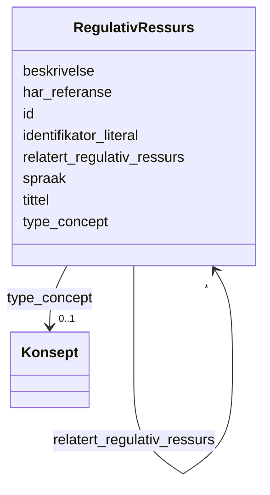

# Class: RegulativRessurs 


_Ein regulativ ressurs (lov, forskrift o.l.) som gjeld for ein ressurs._


URI: [eli:LegalResource](http://data.europa.eu/eli/ontology#LegalResource)





<!-- no inheritance hierarchy -->

## Class Properties

| Property | Value |
| --- | --- |
| Class URI | [eli:LegalResource](http://data.europa.eu/eli/ontology#LegalResource) |


## Eigenskapar


  
  

  
  

  
  

  
  

  
  

  
  

  
  

  
  


  
  

  
  

  
  

  
  

  
  

  
  

  
  

  
  


  
  

  
  

  
  

  
  

  
  

  
  

  
  

  
  


  
  
  
  
    
  

  
  
  
  
    
  

  
  
  
  
    
  

  
  
  
  
    
  

  
  
  
  
    
  

  
  
  
  
    
  

  
  
  
  
    
  

  
  
  
  
    
  


### Andre

| Namn | Kardinalitet og domene | Beskriving |
| --- | --- | --- |
| [id](id.md) | 1 <br/> [Uriorcurie](uriorcurie.md) | URI-identifikator for ressursen |
| [beskrivelse](beskrivelse.md) | * <br/> [LangString](langstring.md) | Fritekstbeskrivelse av ressursen (dct:description) |
| [identifikator_literal](identifikator_literal.md) | 0..1 <br/> [String](string.md) | Tekstleg identifikator for ressursen (dct:identifier) |
| [har_referanse](har_referanse.md) | * <br/> [Uri](uri.md) | Referanse til ekstern ressurs (rdfs:seeAlso) |
| [spraak](spraak.md) | * <br/> [Spraak](spraak.md) | Språk brukt i ressursen (dct:language) |
| [tittel](tittel.md) | * <br/> [LangString](langstring.md) | Namn/tittel på ressursen (dct:title) |
| [type_concept](type_concept.md) | 0..1 <br/> [Konsept](konsept.md) | Type ressurs frå eit kontrollert vokabular (dct:type) |
| [relatert_regulativ_ressurs](relatert_regulativ_ressurs.md) | * <br/> [RegulativRessurs](regulativressurs.md) | Relatert regulativ ressurs |


## Usages

| used by | used in | type | used |
| ---  | --- | --- | --- |
| [RegulativRessurs](regulativressurs.md) | [relatert_regulativ_ressurs](relatert_regulativ_ressurs.md) | range | [RegulativRessurs](regulativressurs.md) |
| [Distribusjon](distribusjon.md) | [gjeldende_lovgivning](gjeldende_lovgivning.md) | range | [RegulativRessurs](regulativressurs.md) |
| [Datasett](datasett.md) | [gjeldende_lovgivning](gjeldende_lovgivning.md) | range | [RegulativRessurs](regulativressurs.md) |
| [Datasettserie](datasettserie.md) | [gjeldende_lovgivning](gjeldende_lovgivning.md) | range | [RegulativRessurs](regulativressurs.md) |
| [Datatjeneste](datatjeneste.md) | [gjeldende_lovgivning](gjeldende_lovgivning.md) | range | [RegulativRessurs](regulativressurs.md) |
| [Katalog](katalog.md) | [gjeldende_lovgivning](gjeldende_lovgivning.md) | range | [RegulativRessurs](regulativressurs.md) |


## Identifier and Mapping Information


### Schema Source


* from schema: https://data.norge.no/linkml/dqv-ap-no


## Mappings

| Mapping Type | Mapped Value |
| ---  | ---  |
| self | eli:LegalResource |
| native | https://data.norge.no/linkml/dqv-ap-no/RegulativRessurs |


## LinkML Source

<!-- TODO: investigate https://stackoverflow.com/questions/37606292/how-to-create-tabbed-code-blocks-in-mkdocs-or-sphinx -->

### Direct

<details>
```yaml
name: RegulativRessurs
description: Ein regulativ ressurs (lov, forskrift o.l.) som gjeld for ein ressurs.
from_schema: https://data.norge.no/linkml/dqv-ap-no
slots:
- id
- beskrivelse
- identifikator_literal
- har_referanse
- spraak
- tittel
- type_concept
- relatert_regulativ_ressurs
class_uri: eli:LegalResource

```
</details>

### Induced

<details>
```yaml
name: RegulativRessurs
description: Ein regulativ ressurs (lov, forskrift o.l.) som gjeld for ein ressurs.
from_schema: https://data.norge.no/linkml/dqv-ap-no
attributes:
  id:
    name: id
    description: URI-identifikator for ressursen.
    from_schema: https://data.norge.no/linkml/dqv-ap-no
    rank: 1000
    identifier: true
    alias: id
    owner: RegulativRessurs
    domain_of:
    - Kvalitetsdimensjon
    - Kvalitetsmaal
    - Kvalitetsmerknad
    - Kvalitetsmaaling
    - Standard
    - Tekstdel
    - Mediatype
    - Konsept
    - Begrepssamling
    - KatalogisertRessurs
    - Aktor
    - Kontaktopplysning
    - Tidsrom
    - RegulativRessurs
    - Identifikator
    - Rettighetserklaring
    - Sjekksum
    - Gebyr
    - Relasjon
    - Distribusjon
    - Datasett
    - Katalogpost
    range: uriorcurie
    required: true
  beskrivelse:
    name: beskrivelse
    description: Fritekstbeskrivelse av ressursen (dct:description).
    from_schema: https://data.norge.no/linkml/dqv-ap-no
    rank: 1000
    slot_uri: dct:description
    alias: beskrivelse
    owner: RegulativRessurs
    domain_of:
    - RegulativRessurs
    - Gebyr
    - Distribusjon
    - Datasett
    - Datasettserie
    - Datatjeneste
    - Katalogpost
    - Katalog
    range: LangString
    multivalued: true
  identifikator_literal:
    name: identifikator_literal
    description: Tekstleg identifikator for ressursen (dct:identifier).
    from_schema: https://data.norge.no/linkml/dqv-ap-no
    rank: 1000
    slot_uri: dct:identifier
    alias: identifikator_literal
    owner: RegulativRessurs
    domain_of:
    - Aktor
    - RegulativRessurs
    - Datasett
    - Datatjeneste
    - Katalog
    range: string
  har_referanse:
    name: har_referanse
    description: Referanse til ekstern ressurs (rdfs:seeAlso).
    from_schema: https://data.norge.no/linkml/dqv-ap-no
    rank: 1000
    slot_uri: rdfs:seeAlso
    alias: har_referanse
    owner: RegulativRessurs
    domain_of:
    - Standard
    - RegulativRessurs
    range: uri
    multivalued: true
  spraak:
    name: spraak
    description: Språk brukt i ressursen (dct:language).
    from_schema: https://data.norge.no/linkml/dqv-ap-no
    rank: 1000
    slot_uri: dct:language
    alias: spraak
    owner: RegulativRessurs
    domain_of:
    - Tekstdel
    - RegulativRessurs
    - Distribusjon
    - Datasett
    - Katalogpost
    - Katalog
    range: Spraak
    multivalued: true
  tittel:
    name: tittel
    description: Namn/tittel på ressursen (dct:title).
    from_schema: https://data.norge.no/linkml/dqv-ap-no
    rank: 1000
    slot_uri: dct:title
    alias: tittel
    owner: RegulativRessurs
    domain_of:
    - Standard
    - RegulativRessurs
    - Distribusjon
    - Datasett
    - Datasettserie
    - Datatjeneste
    - Katalogpost
    - Katalog
    range: LangString
    multivalued: true
  type_concept:
    name: type_concept
    description: Type ressurs frå eit kontrollert vokabular (dct:type).
    from_schema: https://data.norge.no/linkml/dqv-ap-no
    rank: 1000
    slot_uri: dct:type
    alias: type_concept
    owner: RegulativRessurs
    domain_of:
    - Aktor
    - RegulativRessurs
    - Datasett
    range: Konsept
  relatert_regulativ_ressurs:
    name: relatert_regulativ_ressurs
    description: Relatert regulativ ressurs.
    from_schema: https://data.norge.no/linkml/dqv-ap-no
    rank: 1000
    slot_uri: dct:relation
    alias: relatert_regulativ_ressurs
    owner: RegulativRessurs
    domain_of:
    - RegulativRessurs
    range: RegulativRessurs
    multivalued: true
class_uri: eli:LegalResource

```
</details>