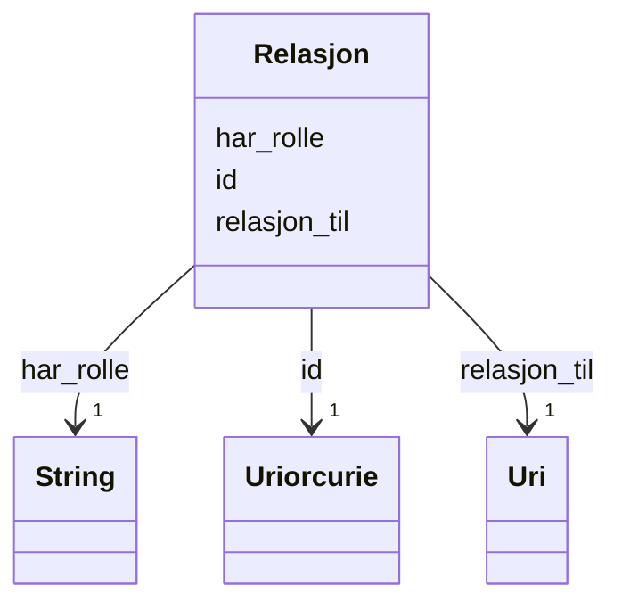

# Class: Relasjon 


_Ein kvalifisert relasjon mellom to ressursar._


URI: [dcat:Relationship](http://www.w3.org/ns/dcat#Relationship)





<!-- no inheritance hierarchy -->

## Class Properties

| Property | Value |
| --- | --- |
| Class URI | [dcat:Relationship](http://www.w3.org/ns/dcat#Relationship) |


## Eigenskapar


  
  

  
  
    
  

  
  
    
  


### Obligatorisk

| Namn | Kardinalitet og domene | Beskriving |
| --- | --- | --- |
| [har_rolle](har_rolle.md) | 1 <br/> [xsd:string](http://www.w3.org/2001/XMLSchema#string) | Rolle ein aktør eller ressurs har i ein relasjon |
| [relasjon_til](relasjon_til.md) | 1 <br/> [xsd:anyURI](http://www.w3.org/2001/XMLSchema#anyURI) | Den relaterte ressursen i ein kvalifisert relasjon |


  
  

  
  

  
  


  
  

  
  

  
  


  
  
  
  
    
  

  
  
  
    
      
    
      
    
      
    
  
  

  
  
  
    
      
    
      
    
      
    
  
  


### Andre

| Namn | Kardinalitet og domene | Beskriving |
| --- | --- | --- |
| [id](id.md) | 1 <br/> [xsd:anyURI](http://www.w3.org/2001/XMLSchema#anyURI) | URI-identifikator for ressursen |


## Usages

| used by | used in | type | used |
| ---  | --- | --- | --- |
| [Datasett](datasett.md) | [annen_spesifikk_relasjon](annen_spesifikk_relasjon.md) | range | [Relasjon](relasjon.md) |


## Identifier and Mapping Information


### Schema Source


* from schema: https://data.norge.no/ap-no/dcat-ap-no


## Mappings

| Mapping Type | Mapped Value |
| ---  | ---  |
| self | dcat:Relationship |
| native | https://data.norge.no/ap-no/dcat-ap-no/Relasjon |


## LinkML Source

<!-- TODO: investigate https://stackoverflow.com/questions/37606292/how-to-create-tabbed-code-blocks-in-mkdocs-or-sphinx -->

### Direct

<details>
```yaml
name: Relasjon
description: Ein kvalifisert relasjon mellom to ressursar.
from_schema: https://data.norge.no/ap-no/dcat-ap-no
slots:
- id
- har_rolle
- relasjon_til
slot_usage:
  har_rolle:
    name: har_rolle
    in_subset:
    - Obligatorisk
    required: true
  relasjon_til:
    name: relasjon_til
    in_subset:
    - Obligatorisk
    required: true
class_uri: dcat:Relationship

```
</details>

### Induced

<details>
```yaml
name: Relasjon
description: Ein kvalifisert relasjon mellom to ressursar.
from_schema: https://data.norge.no/ap-no/dcat-ap-no
slot_usage:
  har_rolle:
    name: har_rolle
    in_subset:
    - Obligatorisk
    required: true
  relasjon_til:
    name: relasjon_til
    in_subset:
    - Obligatorisk
    required: true
attributes:
  id:
    name: id
    description: URI-identifikator for ressursen.
    from_schema: https://data.norge.no/ap-no/common-ap-no
    identifier: true
    owner: Relasjon
    domain_of:
    - Mediatype
    - Konsept
    - Begrepssamling
    - KatalogisertRessurs
    - Aktor
    - Kontaktopplysning
    - Tidsrom
    - RegulativRessurs
    - Identifikator
    - Rettighetserklaring
    - Sjekksum
    - Gebyr
    - Relasjon
    - Distribusjon
    - Datasett
    - Katalogpost
    - Kvalitetsdimensjon
    - Kvalitetsmaal
    - Kvalitetsmerknad
    - Kvalitetsmaaling
    - Standard
    - Tekstdel
    range: uriorcurie
    required: true
  har_rolle:
    name: har_rolle
    description: Rolle ein aktør eller ressurs har i ein relasjon.
    in_subset:
    - Obligatorisk
    from_schema: https://data.norge.no/ap-no/dcat-ap-no
    slot_uri: dcat:hadRole
    owner: Relasjon
    domain_of:
    - Relasjon
    range: string
    required: true
  relasjon_til:
    name: relasjon_til
    description: Den relaterte ressursen i ein kvalifisert relasjon.
    in_subset:
    - Obligatorisk
    from_schema: https://data.norge.no/ap-no/dcat-ap-no
    slot_uri: dct:relation
    owner: Relasjon
    domain_of:
    - Relasjon
    range: uri
    required: true
class_uri: dcat:Relationship

```
</details>