# modelldcat-ap-no

```mermaid
erDiagram
Abstraksjon {
    uriorcurie id  
    LangStringList beskrivelse  
    string identifikator_literal  
    string maks_multiplisitet  
    NonNegativeInteger min_multiplisitet  
    boolean navigerbar  
    LangStringList relasjonsegenskapetikett  
    NonNegativeInteger sekvensnummer  
    LangStringList tittel  
}
Aktor {
    uriorcurie id  
    string identifikator_literal  
    LangStringList namn_aktor  
}
AlleAv {
    uriorcurie id  
    LangStringList beskrivelse  
    string identifikator_literal  
    string maks_multiplisitet  
    NonNegativeInteger min_multiplisitet  
    boolean navigerbar  
    LangStringList relasjonsegenskapetikett  
    NonNegativeInteger sekvensnummer  
    LangStringList tittel  
}
Assosiasjon {
    uriorcurie id  
    LangStringList beskrivelse  
    string identifikator_literal  
    string maks_multiplisitet  
    NonNegativeInteger min_multiplisitet  
    boolean navigerbar  
    LangStringList relasjonsegenskapetikett  
    NonNegativeInteger sekvensnummer  
    LangStringList tittel  
}
Attributt {
    uriorcurie id  
    LangStringList beskrivelse  
    string identifikator_literal  
    string maks_multiplisitet  
    NonNegativeInteger min_multiplisitet  
    boolean navigerbar  
    LangStringList relasjonsegenskapetikett  
    NonNegativeInteger sekvensnummer  
    LangStringList tittel  
}
Avhengighet {
    uriorcurie id  
    LangStringList beskrivelse  
    string identifikator_literal  
    string maks_multiplisitet  
    NonNegativeInteger min_multiplisitet  
    boolean navigerbar  
    LangStringList relasjonsegenskapetikett  
    NonNegativeInteger sekvensnummer  
    LangStringList tittel  
}
Betingelsesregel {
    LangStringList betingelsesuttrykk  
    uriorcurie id  
    LangStringList eigenskapsmerknad  
    string identifikator_literal  
    LangStringList tittel  
}
Datatype {
    uriorcurie id  
    LangStringList beskrivelse  
    string identifikator_literal  
    LangStringList tittel  
}
Dokument {
    uriorcurie id  
    string format  
    SpraakList spraak  
    LangStringList tittel  
}
Eigenskap {
    uriorcurie id  
    LangStringList beskrivelse  
    string identifikator_literal  
    string maks_multiplisitet  
    NonNegativeInteger min_multiplisitet  
    boolean navigerbar  
    LangStringList relasjonsegenskapetikett  
    NonNegativeInteger sekvensnummer  
    LangStringList tittel  
}
Eller {
    uriorcurie id  
    LangStringList betingelsesuttrykk  
    LangStringList eigenskapsmerknad  
    string identifikator_literal  
    LangStringList tittel  
}
EnkelType {
    NonNegativeInteger fraksjonssifre  
    NonNegativeInteger lengde  
    string maks_eksklusiv  
    string maks_inklusiv  
    NonNegativeInteger maks_lengde  
    string min_eksklusiv  
    string min_inklusiv  
    NonNegativeInteger min_lengde  
    string monster  
    NonNegativeInteger totalt_sifre  
    uri typedefinisjon_referanse  
    uriorcurie id  
    LangStringList beskrivelse  
    string identifikator_literal  
    LangStringList tittel  
}
Ikke {
    uriorcurie id  
    LangStringList betingelsesuttrykk  
    LangStringList eigenskapsmerknad  
    string identifikator_literal  
    LangStringList tittel  
}
Informasjonsmodell {
    uriorcurie id  
    LangStringList beskrivelse  
    date endringsdato  
    string har_versjonsnummer  
    uriList heimeside  
    string identifikator_literal  
    string informasjonsmodellidentifikator  
    LangStringList nokkelord  
    SpraakList spraak  
    LangStringList tittel  
    date utgivelsesdato  
    LangStringList versjonsmerknad  
}
KatalogisertRessurs {
    uriorcurie id  
}
Kodeelement {
    uriorcurie id  
    LangStringList alternativ_term  
    LangStringList anbefalt_term  
    LangStringList definisjon  
    LangStringList eksempel_kode  
    LangStringList eksklusjonsnotat  
    string identifikator_literal  
    LangStringList inklusjonsnotat  
    string notasjon  
    LangStringList notat  
    LangStringList omfangsnotat  
    LangStringList skjult_term  
}
Kodeliste {
    uriList har_referanse  
    uriorcurie id  
    LangStringList beskrivelse  
    string identifikator_literal  
    LangStringList tittel  
}
Kontaktopplysning {
    uriorcurie id  
}
Lisensdokument {
    uriorcurie id  
}
Lokasjon {
    uriorcurie id  
}
Merknad {
    uriorcurie id  
    LangStringList eigenskapsmerknad  
    string identifikator_literal  
    LangStringList tittel  
}
Modellelement {
    uriorcurie id  
    LangStringList beskrivelse  
    string identifikator_literal  
    LangStringList tittel  
}
Modellkatalog {
    uriorcurie id  
    LangStringList beskrivelse  
    date endringsdato  
    uriList heimeside  
    string identifikator_literal  
    SpraakList spraak  
    LangStringList tittel  
    date utgivelsesdato  
}
Modul {
    uriorcurie id  
    LangStringList beskrivelse  
    string identifikator_literal  
    LangStringList tittel  
}
NoenAv {
    uriorcurie id  
    LangStringList beskrivelse  
    string identifikator_literal  
    string maks_multiplisitet  
    NonNegativeInteger min_multiplisitet  
    boolean navigerbar  
    LangStringList relasjonsegenskapetikett  
    NonNegativeInteger sekvensnummer  
    LangStringList tittel  
}
Objekttype {
    uriorcurie id  
    LangStringList beskrivelse  
    string identifikator_literal  
    LangStringList tittel  
}
Og {
    uriorcurie id  
    LangStringList betingelsesuttrykk  
    LangStringList eigenskapsmerknad  
    string identifikator_literal  
    LangStringList tittel  
}
Realisering {
    uriorcurie id  
    LangStringList beskrivelse  
    string identifikator_literal  
    string maks_multiplisitet  
    NonNegativeInteger min_multiplisitet  
    boolean navigerbar  
    LangStringList relasjonsegenskapetikett  
    NonNegativeInteger sekvensnummer  
    LangStringList tittel  
}
Rolle {
    uriorcurie id  
    LangStringList beskrivelse  
    string identifikator_literal  
    string maks_multiplisitet  
    NonNegativeInteger min_multiplisitet  
    boolean navigerbar  
    LangStringList relasjonsegenskapetikett  
    NonNegativeInteger sekvensnummer  
    LangStringList tittel  
}
RootObjekttype {
    uriorcurie id  
    LangStringList beskrivelse  
    string identifikator_literal  
    LangStringList tittel  
}
Samling {
    uriorcurie id  
    LangStringList beskrivelse  
    string identifikator_literal  
    string maks_multiplisitet  
    NonNegativeInteger min_multiplisitet  
    boolean navigerbar  
    LangStringList relasjonsegenskapetikett  
    NonNegativeInteger sekvensnummer  
    LangStringList tittel  
}
Sammensetning {
    uriorcurie id  
    LangStringList beskrivelse  
    string identifikator_literal  
    string maks_multiplisitet  
    NonNegativeInteger min_multiplisitet  
    boolean navigerbar  
    LangStringList relasjonsegenskapetikett  
    NonNegativeInteger sekvensnummer  
    LangStringList tittel  
}
Spesialisering {
    uriorcurie id  
    LangStringList beskrivelse  
    string identifikator_literal  
    string maks_multiplisitet  
    NonNegativeInteger min_multiplisitet  
    boolean navigerbar  
    LangStringList relasjonsegenskapetikett  
    NonNegativeInteger sekvensnummer  
    LangStringList tittel  
}
Standard {
    uriorcurie id  
    uriList har_referanse  
    string har_versjonsnummer  
    LangStringList tittel  
}
Tidsperiode {
    uriorcurie id  
    date sluttdato  
    date startdato  
}
Valg {
    uriorcurie id  
    LangStringList beskrivelse  
    string identifikator_literal  
    string maks_multiplisitet  
    NonNegativeInteger min_multiplisitet  
    boolean navigerbar  
    LangStringList relasjonsegenskapetikett  
    NonNegativeInteger sekvensnummer  
    LangStringList tittel  
}
XEllerY {
    uriorcurie id  
    LangStringList betingelsesuttrykk  
    LangStringList eigenskapsmerknad  
    string identifikator_literal  
    LangStringList tittel  
}

Abstraksjon ||--|o Eigenskap : "danner_symmetri_med"
Abstraksjon ||--|o Modellelement : "er_abstraksjon_av"
Abstraksjon ||--}o Modellelement : "har_type"
Abstraksjon ||--}o Modul : "tilhorer_modul"
AlleAv ||--|o Eigenskap : "danner_symmetri_med"
AlleAv ||--}o Modellelement : "har_noe, har_type"
AlleAv ||--}o Modul : "tilhorer_modul"
Assosiasjon ||--|o Eigenskap : "danner_symmetri_med"
Assosiasjon ||--|o Modellelement : "refererer_til"
Assosiasjon ||--}o Modellelement : "har_type"
Assosiasjon ||--}o Modul : "tilhorer_modul"
Attributt ||--|o Eigenskap : "danner_symmetri_med"
Attributt ||--}o Datatype : "har_datatype"
Attributt ||--}o EnkelType : "har_enkel_type"
Attributt ||--}o Kodeliste : "har_verdi_fra"
Attributt ||--}o Modellelement : "har_type"
Attributt ||--}o Modul : "tilhorer_modul"
Attributt ||--}o Objekttype : "inneholder_objekttype"
Avhengighet ||--|o Eigenskap : "danner_symmetri_med"
Avhengighet ||--|o Modellelement : "avhengig_av"
Avhengighet ||--}o Modellelement : "har_type"
Avhengighet ||--}o Modul : "tilhorer_modul"
Betingelsesregel ||--}o Modellelement : "annoterer"
Betingelsesregel ||--}o Modul : "tilhorer_modul"
Betingelsesregel ||--}| Modellelement : "betinger"
Datatype ||--}o Eigenskap : "har_eigenskap"
Datatype ||--}o Modul : "tilhorer_modul"
Eigenskap ||--|o Eigenskap : "danner_symmetri_med"
Eigenskap ||--}o Modellelement : "har_type"
Eigenskap ||--}o Modul : "tilhorer_modul"
Eller ||--}o Modellelement : "annoterer"
Eller ||--}o Modul : "tilhorer_modul"
Eller ||--}| Modellelement : "betinger"
EnkelType ||--}o Eigenskap : "har_eigenskap"
EnkelType ||--}o Modul : "tilhorer_modul"
Ikke ||--}o Modellelement : "annoterer"
Ikke ||--}o Modul : "tilhorer_modul"
Ikke ||--}| Modellelement : "betinger"
Informasjonsmodell ||--|o Aktor : "skapar"
Informasjonsmodell ||--|o Lisensdokument : "lisens"
Informasjonsmodell ||--|| Aktor : "utgiver"
Informasjonsmodell ||--}o Dokument : "har_format"
Informasjonsmodell ||--}o Informasjonsmodell : "er_del_av_modell, er_erstatta_av, erstatter, har_del_modell"
Informasjonsmodell ||--}o Kontaktopplysning : "kontaktpunkt"
Informasjonsmodell ||--}o Modellelement : "inneholder_modellelement"
Informasjonsmodell ||--}o Standard : "er_i_samsvar_med, er_profil_av"
Informasjonsmodell ||--}o Tidsperiode : "tidsperiode"
Kodeelement ||--|o Kodeelement : "forrige, neste"
Kodeelement ||--}o Kodeliste : "topp_begrep_av"
Kodeelement ||--}| Kodeliste : "i_skjema"
Kodeliste ||--}o Eigenskap : "har_eigenskap"
Kodeliste ||--}o Modul : "tilhorer_modul"
Merknad ||--}o Modellelement : "annoterer"
Merknad ||--}o Modul : "tilhorer_modul"
Modellelement ||--}o Eigenskap : "har_eigenskap"
Modellelement ||--}o Modul : "tilhorer_modul"
Modellkatalog ||--|o Lisensdokument : "lisens"
Modellkatalog ||--|o Modellkatalog : "er_del_av_katalog"
Modellkatalog ||--|| Aktor : "utgiver"
Modellkatalog ||--}o Informasjonsmodell : "modell"
Modellkatalog ||--}| KatalogisertRessurs : "har_del"
Modellkatalog ||--}| Kontaktopplysning : "kontaktpunkt"
Modul ||--}o Eigenskap : "har_eigenskap"
Modul ||--}o Modul : "tilhorer_modul"
NoenAv ||--|o Eigenskap : "danner_symmetri_med"
NoenAv ||--}o Modellelement : "har_noe, har_type"
NoenAv ||--}o Modul : "tilhorer_modul"
Objekttype ||--}o Eigenskap : "har_eigenskap"
Objekttype ||--}o Modul : "tilhorer_modul"
Og ||--}o Modellelement : "annoterer"
Og ||--}o Modul : "tilhorer_modul"
Og ||--}| Modellelement : "betinger"
Realisering ||--|o Eigenskap : "danner_symmetri_med"
Realisering ||--|o Modellelement : "har_leverandor"
Realisering ||--}o Modellelement : "har_type"
Realisering ||--}o Modul : "tilhorer_modul"
Rolle ||--|o Eigenskap : "danner_symmetri_med"
Rolle ||--|o Objekttype : "har_objekttype"
Rolle ||--}o Modellelement : "har_type"
Rolle ||--}o Modul : "tilhorer_modul"
RootObjekttype ||--}o Eigenskap : "har_eigenskap"
RootObjekttype ||--}o Modul : "tilhorer_modul"
Samling ||--|o Eigenskap : "danner_symmetri_med"
Samling ||--}o Modellelement : "har_type"
Samling ||--}o Modul : "tilhorer_modul"
Sammensetning ||--|o Eigenskap : "danner_symmetri_med"
Sammensetning ||--|o Modellelement : "inneholder"
Sammensetning ||--}o Modellelement : "har_type"
Sammensetning ||--}o Modul : "tilhorer_modul"
Spesialisering ||--|o Eigenskap : "danner_symmetri_med"
Spesialisering ||--|o Modellelement : "har_generelt_begrep"
Spesialisering ||--}o Modellelement : "har_type"
Spesialisering ||--}o Modul : "tilhorer_modul"
Valg ||--|o Eigenskap : "danner_symmetri_med"
Valg ||--}o Modellelement : "har_noe, har_type"
Valg ||--}o Modul : "tilhorer_modul"
XEllerY ||--}o Modellelement : "annoterer"
XEllerY ||--}o Modul : "tilhorer_modul"
XEllerY ||--}| Modellelement : "betinger"


```

Norsk applikasjonsprofil for beskriving av informasjonsmodellar i DCAT-format, modellert i LinkML. Basert på https://data.norge.no/specification/modelldcat-ap-no

URI: https://data.norge.no/ap-no/modelldcat-ap-no

Name: modelldcat-ap-no

## Classes

### Obligatorisk

| Class | Description |
| --- | --- |
| [Aktor](klasser/aktor.md) | Ein aktør (person, organisasjon eller system) med ansvar for ein ressurs |
| [Betingelsesregel](klasser/betingelsesregel.md) | Ein betingelsesregel — ei formell avgrensing på modellelement eller eigenskap... |
| [Informasjonsmodell](klasser/informasjonsmodell.md) | Ein informasjonsmodell som er katalogisert i ein modellkatalog (modelldcatno:... |
| [Kodeelement](klasser/kodeelement.md) | Eit element i ei kodeliste (modelldcatno:CodeElement) |
| [Modellelement](klasser/modellelement.md) | Abstrakt basisklasse for alle modellelement i ein informasjonsmodell |
| [Modellkatalog](klasser/modellkatalog.md) | Ei kuratert samling av metadata om informasjonsmodellar (dcat:Catalog) |
| [Standard](klasser/standard.md) | Ein standard (dct:Standard) |

### Anbefalt

| Class | Description |
| --- | --- |
| [Abstraksjon](klasser/abstraksjon.md) | Ein abstraksjon — ein forenkling som representerer eit modellelement |
| [Assosiasjon](klasser/assosiasjon.md) | Ein assosiasjon — ein eigenskap som refererer til eit anna modellelement |
| [Attributt](klasser/attributt.md) | Ein attributt — ein eigenskap med ein datatype eller enkel type som verdi |
| [Avhengighet](klasser/avhengighet.md) | Ein avhengighet — ein relasjon der det eine modellelementet avheng av det and... |
| [Eigenskap](klasser/eigenskap.md) | Abstrakt basisklasse for eigenskapar knytt til eit modellelement |
| [EnkelType](klasser/enkeltype.md) | Ein enkel type med restriksjonar (xsd-fasettar) |
| [Merknad](klasser/merknad.md) | Ei merknad knytt til eit modellelement eller eigenskap |
| [Realisering](klasser/realisering.md) | Ein realisering — ein implementasjonsrelasjon mellom modellelement |
| [Rolle](klasser/rolle.md) | Ein rolle — ein eigenskap som knyter ein objekttype til ein assosiasjon |
| [Sammensetning](klasser/sammensetning.md) | Ein sammensetning — ein sterk eigarelskapsrelasjon mellom modellelement |
| [Spesialisering](klasser/spesialisering.md) | Ein spesialisering — eit arveforhold frå eit spesielt til eit generelt modell... |
| [Valg](klasser/valg.md) | Eit val — ein eigenskap som representerer eit val mellom modellelement |

### Andre

| Class | Description |
| --- | --- |
| [AlleAv](klasser/alleav.md) | Alle av — alle modellelementa i lista må gjelde (logisk OG-mengd) |
| [Datatype](klasser/datatype.md) | Ein datatype — ein strukturert samansett type |
| [Dokument](klasser/dokument.md) | Eit dokument (foaf:Document) |
| [Eller](klasser/eller.md) | Eller — logisk ELLER-betingelse; minst eitt modellelement må gjelde |
| [Ikke](klasser/ikke.md) | Ikkje — negasjon; modellelementet det refererer til må ikkje gjelde |
| [KatalogisertRessurs](klasser/katalogisertressurs.md) | Basisklasse for ressursar som kan katalogiserast (dcat:Resource) |
| [Kodeliste](klasser/kodeliste.md) | Ei kodeliste — eit kontrollert vokabular av tillate verdiar |
| [Kontaktopplysning](klasser/kontaktopplysning.md) | Kontaktinformasjon (vcard:Organization) |
| [Lisensdokument](klasser/lisensdokument.md) | Eit lisensdokument (dct:LicenseDocument) |
| [Lokasjon](klasser/lokasjon.md) | Eit geografisk område (dct:Location) |
| [Modul](klasser/modul.md) | Ein modul som grupperer modellelement i informasjonsmodellen |
| [NoenAv](klasser/noenav.md) | Nokon av — minst eitt modellelement i lista må gjelde (logisk ELLER-mengd) |
| [Objekttype](klasser/objekttype.md) | Ein objekttype — ein klasse med eigenskapar i informasjonsmodellen |
| [Og](klasser/og.md) | Og — logisk OG-betingelse; alle deltakande modellelement må gjelde |
| [RootObjekttype](klasser/rootobjekttype.md) | Ein rotobjekttype — toppnivå-klasse i informasjonsmodellen |
| [Samling](klasser/samling.md) | Ein samling — ein eigenskap som representerer ei uordna mengd av modellelemen... |
| [Tidsperiode](klasser/tidsperiode.md) | Eit tidsintervall med start- og sluttdato |
| [XEllerY](klasser/xellery.md) | Xor — eksklusiv ELLER-betingelse; nøyaktig eitt modellelement må gjelde |

## Slots

| Slot | Description |
| --- | --- |
| [alternativ_term](klasser/alternativ_term.md) | Alternativ term for kodeelementet (skos:altLabel) |
| [annoterer](klasser/annoterer.md) | Modellelement denne merknaden gjeld (modelldcatno:annotates) |
| [avhengig_av](klasser/avhengig_av.md) | Modellelement dette elementet avheng av (modelldcatno:dependentOn) |
| [begrep](klasser/begrep.md) | Fagomgrep ressursen handlar om (dct:subject) |
| [betingelsesuttrykk](klasser/betingelsesuttrykk.md) | Formelt uttrykk for betingelsesregelen (modelldcatno:constraintExpression) |
| [betinger](klasser/betinger.md) | Modellelement betingelsesregelen avgrensar (modelldcatno:constrains) |
| [danner_symmetri_med](klasser/danner_symmetri_med.md) | Eigenskap som denne eigenskapen dannar symmetri med (modelldcatno:formsSymmet... |
| [definisjon](klasser/definisjon.md) | Definisjon av kodeelementet (skos:definition) |
| [eigenskapsmerknad](klasser/eigenskapsmerknad.md) | Fritekstmerknad om ein eigenskap (modelldcatno:propertyNote) |
| [eksempel_kode](klasser/eksempel_kode.md) | Eksempel på bruk av kodeelementet (skos:example) |
| [eksklusjonsnotat](klasser/eksklusjonsnotat.md) | Notat om kva som er ekskludert frå kodeelementet (xkos:exclusionNote) |
| [er_abstraksjon_av](klasser/er_abstraksjon_av.md) | Modellelement denne abstraksjonen representerer (modelldcatno:isAbstractionOf... |
| [er_del_av_katalog](klasser/er_del_av_katalog.md) | Overordna modellkatalog (dct:isPartOf) |
| [er_del_av_modell](klasser/er_del_av_modell.md) | Overordna informasjonsmodell (dct:isPartOf) |
| [er_erstatta_av](klasser/er_erstatta_av.md) | Informasjonsmodell som erstattar denne (dct:isReplacedBy) |
| [er_i_samsvar_med](klasser/er_i_samsvar_med.md) | Standard ressursen er i samsvar med (dct:conformsTo) |
| [er_profil_av](klasser/er_profil_av.md) | Standard denne informasjonsmodellen er ein profil av (prof:isProfileOf) |
| [erstatter](klasser/erstatter.md) | Informasjonsmodell som denne erstattar (dct:replaces) |
| [forrige](klasser/forrige.md) | Førre kodeelement i ein ordna kodeliste (xkos:previous) |
| [fraksjonssifre](klasser/fraksjonssifre.md) | Maks tal på desimalsiffer (xsd:fractionDigits) |
| [har_datatype](klasser/har_datatype.md) | Datatype for attributten (modelldcatno:hasDataType) |
| [har_del](klasser/har_del.md) | Del-ressurs inkludert i denne katalogen (dct:hasPart) |
| [har_del_modell](klasser/har_del_modell.md) | Del-informasjonsmodell av denne modellen (dct:hasPart) |
| [har_eigenskap](klasser/har_eigenskap.md) | Eigenskapar modellelementet har (modelldcatno:hasProperty) |
| [har_enkel_type](klasser/har_enkel_type.md) | Enkel type for attributten (modelldcatno:hasSimpleType) |
| [har_format](klasser/har_format.md) | Dokument som representerer ein annan form av modellen (dct:hasFormat) |
| [har_generelt_begrep](klasser/har_generelt_begrep.md) | Det generelle modellelementet i ei spesialisering (modelldcatno:hasGeneralCon... |
| [har_leverandor](klasser/har_leverandor.md) | Leverandør-modellelement i realiseringa (modelldcatno:hasSupplier) |
| [har_noe](klasser/har_noe.md) | Modellelement som inngår i valet (modelldcatno:hasSome) |
| [har_objekttype](klasser/har_objekttype.md) | Objekttype knytt til rolla (modelldcatno:hasObjectType) |
| [har_type](klasser/har_type.md) | Type modellelement for eigenskapen (modelldcatno:hasType) |
| [har_verdi_fra](klasser/har_verdi_fra.md) | Kodeliste for tillate verdiar til attributten (modelldcatno:hasValueFrom) |
| [i_skjema](klasser/i_skjema.md) | Kodeliste dette kodeelementet tilhøyrer (skos:inScheme) |
| [informasjonsmodellidentifikator](klasser/informasjonsmodellidentifikator.md) | Identifikator for informasjonsmodellen i domenet (modelldcatno:informationMod... |
| [inklusjonsnotat](klasser/inklusjonsnotat.md) | Notat om kva som er inkludert i kodeelementet (xkos:inclusionNote) |
| [inneholder](klasser/inneholder.md) | Modellelement som er del av samansetjinga (modelldcatno:contains) |
| [inneholder_modellelement](klasser/inneholder_modellelement.md) | Modellelement som er del av informasjonsmodellen (modelldcatno:containsModelE... |
| [inneholder_objekttype](klasser/inneholder_objekttype.md) | Objekttype som attributten inneheld (modelldcatno:containsObjectType) |
| [kontaktpunkt](klasser/kontaktpunkt.md) | Kontaktinformasjon for ressursen (dcat:contactPoint) |
| [lengde](klasser/lengde.md) | Nøyaktig lengd av strengen (xsd:length) |
| [lisens](klasser/lisens.md) | Lisens for bruk av ressursen (dct:license) |
| [maks_eksklusiv](klasser/maks_eksklusiv.md) | Eksklusiv maksimumsverdi (xsd:maxExclusive) |
| [maks_inklusiv](klasser/maks_inklusiv.md) | Inklusiv maksimumsverdi (xsd:maxInclusive) |
| [maks_lengde](klasser/maks_lengde.md) | Maksimal lengd av strengen (xsd:maxLength) |
| [maks_multiplisitet](klasser/maks_multiplisitet.md) | Høgste multiplisitet — heltalstal, "n" eller "*" (modelldcatno:maxOccurs) |
| [min_eksklusiv](klasser/min_eksklusiv.md) | Eksklusiv minimumsverdi (xsd:minExclusive) |
| [min_inklusiv](klasser/min_inklusiv.md) | Inklusiv minimumsverdi (xsd:minInclusive) |
| [min_lengde](klasser/min_lengde.md) | Minimal lengd av strengen (xsd:minLength) |
| [min_multiplisitet](klasser/min_multiplisitet.md) | Minste multiplisitet for eigenskapen (modelldcatno:minOccurs) |
| [modell](klasser/modell.md) | Informasjonsmodellar i modellkatalogen (modelldcatno:model) |
| [monster](klasser/monster.md) | Regulært uttrykk for tillate strengverdiar (xsd:pattern) |
| [namn_aktor](klasser/namn_aktor.md) | Namn på aktøren (foaf:name) |
| [navigerbar](klasser/navigerbar.md) | Om eigenskapen er navigerbar i begge retningar (modelldcatno:navigable) |
| [neste](klasser/neste.md) | Neste kodeelement i ein ordna kodeliste (xkos:next) |
| [notasjon](klasser/notasjon.md) | Kode/notasjon for kodeelementet (skos:notation) |
| [notat](klasser/notat.md) | Generelt notat om kodeelementet (skos:note) |
| [omfangsnotat](klasser/omfangsnotat.md) | Notat om omfanget til kodeelementet (skos:scopeNote) |
| [refererer_til](klasser/refererer_til.md) | Modellelement som eigenskapen refererer til (modelldcatno:refersTo) |
| [relasjonsegenskapetikett](klasser/relasjonsegenskapetikett.md) | Lesetekst for eigenskapen i ein relasjon (modelldcatno:relationPropertyLabel) |
| [sekvensnummer](klasser/sekvensnummer.md) | Sekvensnummer for eigenskapen i modellelementet (modelldcatno:sequenceNumber) |
| [skapar](klasser/skapar.md) | Aktøren som primært har skapt ressursen (dct:creator) |
| [skjult_term](klasser/skjult_term.md) | Skjult term for kodeelementet (skos:hiddenLabel) |
| [sluttdato](klasser/sluttdato.md) | Sluttdato for tidsperioden (dcat:endDate) |
| [startdato](klasser/startdato.md) | Startdato for tidsperioden (dcat:startDate) |
| [tema](klasser/tema.md) | Tema frå eit kontrollert vokabular (dcat:theme) |
| [temaer](klasser/temaer.md) | Temavokabular brukt i katalogen (dcat:themeTaxonomy) |
| [tidsperiode](klasser/tidsperiode.md) | Tidsperiode ressursen dekkar (dct:temporal) |
| [tilhorer_modul](klasser/tilhorer_modul.md) | Modul dette elementet tilhøyrer (modelldcatno:belongsToModule) |
| [topp_begrep_av](klasser/topp_begrep_av.md) | Kodeliste dette kodeelementet er eit toppomgrep av (skos:topConceptOf) |
| [totalt_sifre](klasser/totalt_sifre.md) | Maks totalt tal på siffer (xsd:totalDigits) |
| [typedefinisjon_referanse](klasser/typedefinisjon_referanse.md) | Referanse til typedefinisjon (modelldcatno:typeDefinitionReference) |
| [utgiver](klasser/utgiver.md) | Aktøren ansvarleg for å tilgjengeleggjere ressursen (dct:publisher) |

## Enumerations

| Enumeration | Description |
| --- | --- |

## Types

| Type | Description |
| --- | --- |

## Subsets

| Subset | Description |
| --- | --- |
| [Anbefalt](klasser/anbefalt.md) | Anbefalte eigenskapar i ein AP-NO-profil |
| [Obligatorisk](klasser/obligatorisk.md) | Obligatoriske eigenskapar i ein AP-NO-profil |
| [Valgfri](klasser/valgfri.md) | Valfrie eigenskapar i ein AP-NO-profil |

## Generated artifacts

| Artefakt | Fil |
|----------|-----|
| SHACL shapes | [modelldcat-ap-no-shapes.ttl](modelldcat-ap-no-shapes.ttl) |
| JSON-LD kontekst | [modelldcat-ap-no-context.jsonld](modelldcat-ap-no-context.jsonld) |
| JSON Schema | [modelldcat-ap-no-schema.json](modelldcat-ap-no-schema.json) |
| OWL ontologi | [modelldcat-ap-no-ontology.ttl](modelldcat-ap-no-ontology.ttl) |
| RDF/Turtle skjema | [modelldcat-ap-no-schema.ttl](modelldcat-ap-no-schema.ttl) |
| Python-klasser | [modelldcat-ap-no-model.py](modelldcat-ap-no-model.py) |
| Protobuf-skjema | [modelldcat-ap-no-schema.proto](modelldcat-ap-no-schema.proto) |
| ER-diagram (Mermaid) | [modelldcat-ap-no-erdiagram.md](modelldcat-ap-no-erdiagram.md) |
| PlantUML-diagram | [modelldcat-ap-no.svg](diagrams/modelldcat-ap-no.svg) · [modelldcat-ap-no.puml](diagrams/modelldcat-ap-no.puml) |
