# Class: AlleAv 


_Alle av — alle modellelementa i lista må gjelde (logisk OG-mengd)._


URI: [modelldcatno:AllOf](https://data.norge.no/vocabulary/modelldcatno#AllOf)

```mermaid
 classDiagram
    class AlleAv
    click AlleAv href "../AlleAv/"
      Valg <|-- AlleAv
        click Valg href "../Valg/"
      
      AlleAv : begrep
        
          
    
        
        
        AlleAv --> "*" Konsept : begrep
        click Konsept href "../Konsept/"
    

        
      AlleAv : beskrivelse
        
      AlleAv : danner_symmetri_med
        
          
    
        
        
        AlleAv --> "0..1" Eigenskap : danner_symmetri_med
        click Eigenskap href "../Eigenskap/"
    

        
      AlleAv : har_noe
        
          
    
        
        
        AlleAv --> "*" Modellelement : har_noe
        click Modellelement href "../Modellelement/"
    

        
      AlleAv : har_type
        
          
    
        
        
        AlleAv --> "*" Modellelement : har_type
        click Modellelement href "../Modellelement/"
    

        
      AlleAv : id
        
      AlleAv : identifikator_literal
        
      AlleAv : maks_multiplisitet
        
      AlleAv : min_multiplisitet
        
      AlleAv : navigerbar
        
      AlleAv : relasjonsegenskapetikett
        
      AlleAv : sekvensnummer
        
      AlleAv : tilhorer_modul
        
          
    
        
        
        AlleAv --> "*" Modul : tilhorer_modul
        click Modul href "../Modul/"
    

        
      AlleAv : tittel
        
      
```





## Inheritance
* [Eigenskap](eigenskap.md)
    * [Valg](valg.md)
        * **AlleAv**


## Class Properties

| Property | Value |
| --- | --- |
| Class URI | [modelldcatno:AllOf](https://data.norge.no/vocabulary/modelldcatno#AllOf) |


## Eigenskapar


### Arva

| Namn | Kardinalitet og domene | Beskriving | Frå |
| --- | --- | --- | --- || [har_noe](har_noe.md) | * <br/> [Modellelement](modellelement.md) | Modellelement som inngår i valet (modelldcatno:hasSome) | [Valg](valg.md) |
| [id](id.md) | 1 <br/> [Uriorcurie](uriorcurie.md) | URI-identifikator for ressursen | [Eigenskap](eigenskap.md) |
| [begrep](begrep.md) | * <br/> [Konsept](konsept.md) | Fagomgrep ressursen handlar om (dct:subject) | [Eigenskap](eigenskap.md) |
| [identifikator_literal](identifikator_literal.md) | 0..1 <br/> [String](string.md) | Tekstleg identifikator for ressursen (dct:identifier) | [Eigenskap](eigenskap.md) |
| [navigerbar](navigerbar.md) | 0..1 <br/> [Boolean](boolean.md) | Om eigenskapen er navigerbar i begge retningar (modelldcatno:navigable) | [Eigenskap](eigenskap.md) |
| [min_multiplisitet](min_multiplisitet.md) | 0..1 <br/> [NonNegativeInteger](nonnegativeinteger.md) | Minste multiplisitet for eigenskapen (modelldcatno:minOccurs) | [Eigenskap](eigenskap.md) |
| [tittel](tittel.md) | * <br/> [LangString](langstring.md) | Namn/tittel på ressursen (dct:title) | [Eigenskap](eigenskap.md) |
| [maks_multiplisitet](maks_multiplisitet.md) | 0..1 <br/> [String](string.md) | Høgste multiplisitet — heltalstal, "n" eller "*" (modelldcatno:maxOccurs) | [Eigenskap](eigenskap.md) |
| [beskrivelse](beskrivelse.md) | * <br/> [LangString](langstring.md) | Fritekstbeskrivelse av ressursen (dct:description) | [Eigenskap](eigenskap.md) |
| [har_type](har_type.md) | * <br/> [Modellelement](modellelement.md) | Type modellelement for eigenskapen (modelldcatno:hasType) | [Eigenskap](eigenskap.md) |
| [relasjonsegenskapetikett](relasjonsegenskapetikett.md) | * <br/> [LangString](langstring.md) | Lesetekst for eigenskapen i ein relasjon (modelldcatno:relationPropertyLabel) | [Eigenskap](eigenskap.md) |
| [sekvensnummer](sekvensnummer.md) | 0..1 <br/> [NonNegativeInteger](nonnegativeinteger.md) | Sekvensnummer for eigenskapen i modellelementet (modelldcatno:sequenceNumber) | [Eigenskap](eigenskap.md) |
| [tilhorer_modul](tilhorer_modul.md) | * <br/> [Modul](modul.md) | Modul dette elementet tilhøyrer (modelldcatno:belongsToModule) | [Eigenskap](eigenskap.md) |
| [danner_symmetri_med](danner_symmetri_med.md) | 0..1 <br/> [Eigenskap](eigenskap.md) | Eigenskap som denne eigenskapen dannar symmetri med (modelldcatno:formsSymmet... | [Eigenskap](eigenskap.md) |


## Identifier and Mapping Information


### Schema Source


* from schema: https://data.norge.no/linkml/modelldcat-ap-no


## Mappings

| Mapping Type | Mapped Value |
| ---  | ---  |
| self | modelldcatno:AllOf |
| native | https://data.norge.no/linkml/modelldcat-ap-no/AlleAv |


## LinkML Source

<!-- TODO: investigate https://stackoverflow.com/questions/37606292/how-to-create-tabbed-code-blocks-in-mkdocs-or-sphinx -->

### Direct

<details>
```yaml
name: AlleAv
description: Alle av — alle modellelementa i lista må gjelde (logisk OG-mengd).
from_schema: https://data.norge.no/linkml/modelldcat-ap-no
is_a: Valg
class_uri: modelldcatno:AllOf

```
</details>

### Induced

<details>
```yaml
name: AlleAv
description: Alle av — alle modellelementa i lista må gjelde (logisk OG-mengd).
from_schema: https://data.norge.no/linkml/modelldcat-ap-no
is_a: Valg
attributes:
  har_noe:
    name: har_noe
    description: Modellelement som inngår i valet (modelldcatno:hasSome).
    in_subset:
    - Anbefalt
    from_schema: https://data.norge.no/linkml/modelldcat-ap-no
    rank: 1000
    slot_uri: modelldcatno:hasSome
    alias: har_noe
    owner: AlleAv
    domain_of:
    - Valg
    range: Modellelement
    multivalued: true
  id:
    name: id
    description: URI-identifikator for ressursen.
    from_schema: https://data.norge.no/linkml/modelldcat-ap-no
    rank: 1000
    identifier: true
    alias: id
    owner: AlleAv
    domain_of:
    - KatalogisertRessurs
    - Aktor
    - Kontaktopplysning
    - Standard
    - Lisensdokument
    - Lokasjon
    - Tidsperiode
    - Dokument
    - Modelkatalog
    - Informasjonsmodell
    - Modellelement
    - Eigenskap
    - Merknad
    - Kodeelement
    - Mediatype
    - Konsept
    - Begrepssamling
    range: uriorcurie
    required: true
  begrep:
    name: begrep
    description: Fagomgrep ressursen handlar om (dct:subject).
    in_subset:
    - Anbefalt
    from_schema: https://data.norge.no/linkml/modelldcat-ap-no
    rank: 1000
    slot_uri: dct:subject
    alias: begrep
    owner: AlleAv
    domain_of:
    - Informasjonsmodell
    - Modellelement
    - Eigenskap
    - Kodeelement
    range: Konsept
    multivalued: true
  identifikator_literal:
    name: identifikator_literal
    description: Tekstleg identifikator for ressursen (dct:identifier).
    in_subset:
    - Anbefalt
    from_schema: https://data.norge.no/linkml/modelldcat-ap-no
    rank: 1000
    slot_uri: dct:identifier
    alias: identifikator_literal
    owner: AlleAv
    domain_of:
    - Aktor
    - Modelkatalog
    - Informasjonsmodell
    - Modellelement
    - Eigenskap
    - Merknad
    - Kodeelement
    range: string
  navigerbar:
    name: navigerbar
    description: Om eigenskapen er navigerbar i begge retningar (modelldcatno:navigable).
    in_subset:
    - Anbefalt
    from_schema: https://data.norge.no/linkml/modelldcat-ap-no
    rank: 1000
    slot_uri: modelldcatno:navigable
    alias: navigerbar
    owner: AlleAv
    domain_of:
    - Eigenskap
    range: boolean
  min_multiplisitet:
    name: min_multiplisitet
    description: Minste multiplisitet for eigenskapen (modelldcatno:minOccurs).
    in_subset:
    - Anbefalt
    from_schema: https://data.norge.no/linkml/modelldcat-ap-no
    rank: 1000
    slot_uri: modelldcatno:minOccurs
    alias: min_multiplisitet
    owner: AlleAv
    domain_of:
    - Eigenskap
    range: NonNegativeInteger
  tittel:
    name: tittel
    description: Namn/tittel på ressursen (dct:title).
    in_subset:
    - Anbefalt
    from_schema: https://data.norge.no/linkml/modelldcat-ap-no
    rank: 1000
    slot_uri: dct:title
    alias: tittel
    owner: AlleAv
    domain_of:
    - Standard
    - Dokument
    - Modelkatalog
    - Informasjonsmodell
    - Modellelement
    - Eigenskap
    - Merknad
    range: LangString
    multivalued: true
  maks_multiplisitet:
    name: maks_multiplisitet
    description: Høgste multiplisitet — heltalstal, "n" eller "*" (modelldcatno:maxOccurs).
    in_subset:
    - Anbefalt
    from_schema: https://data.norge.no/linkml/modelldcat-ap-no
    rank: 1000
    slot_uri: modelldcatno:maxOccurs
    alias: maks_multiplisitet
    owner: AlleAv
    domain_of:
    - Eigenskap
    range: string
  beskrivelse:
    name: beskrivelse
    description: Fritekstbeskrivelse av ressursen (dct:description).
    in_subset:
    - Valgfri
    from_schema: https://data.norge.no/linkml/modelldcat-ap-no
    rank: 1000
    slot_uri: dct:description
    alias: beskrivelse
    owner: AlleAv
    domain_of:
    - Modelkatalog
    - Informasjonsmodell
    - Modellelement
    - Eigenskap
    range: LangString
    multivalued: true
  har_type:
    name: har_type
    description: Type modellelement for eigenskapen (modelldcatno:hasType).
    in_subset:
    - Valgfri
    from_schema: https://data.norge.no/linkml/modelldcat-ap-no
    rank: 1000
    slot_uri: modelldcatno:hasType
    alias: har_type
    owner: AlleAv
    domain_of:
    - Eigenskap
    range: Modellelement
    multivalued: true
  relasjonsegenskapetikett:
    name: relasjonsegenskapetikett
    description: Lesetekst for eigenskapen i ein relasjon (modelldcatno:relationPropertyLabel).
    in_subset:
    - Valgfri
    from_schema: https://data.norge.no/linkml/modelldcat-ap-no
    rank: 1000
    slot_uri: modelldcatno:relationPropertyLabel
    alias: relasjonsegenskapetikett
    owner: AlleAv
    domain_of:
    - Eigenskap
    range: LangString
    multivalued: true
  sekvensnummer:
    name: sekvensnummer
    description: Sekvensnummer for eigenskapen i modellelementet (modelldcatno:sequenceNumber).
    in_subset:
    - Valgfri
    from_schema: https://data.norge.no/linkml/modelldcat-ap-no
    rank: 1000
    slot_uri: modelldcatno:sequenceNumber
    alias: sekvensnummer
    owner: AlleAv
    domain_of:
    - Eigenskap
    range: NonNegativeInteger
  tilhorer_modul:
    name: tilhorer_modul
    description: Modul dette elementet tilhøyrer (modelldcatno:belongsToModule).
    in_subset:
    - Valgfri
    from_schema: https://data.norge.no/linkml/modelldcat-ap-no
    rank: 1000
    slot_uri: modelldcatno:belongsToModule
    alias: tilhorer_modul
    owner: AlleAv
    domain_of:
    - Modellelement
    - Eigenskap
    - Merknad
    range: Modul
    multivalued: true
  danner_symmetri_med:
    name: danner_symmetri_med
    description: Eigenskap som denne eigenskapen dannar symmetri med (modelldcatno:formsSymmetryWith).
    in_subset:
    - Valgfri
    from_schema: https://data.norge.no/linkml/modelldcat-ap-no
    rank: 1000
    slot_uri: modelldcatno:formsSymmetryWith
    alias: danner_symmetri_med
    owner: AlleAv
    domain_of:
    - Eigenskap
    range: Eigenskap
class_uri: modelldcatno:AllOf

```
</details>