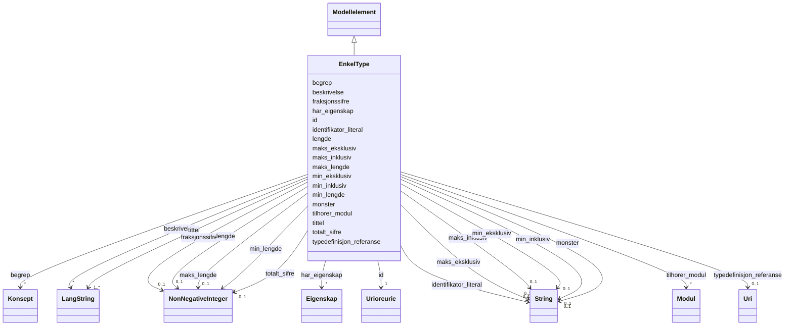

# Class: EnkelType 


_Ein enkel type med restriksjonar (xsd-fasettar)._


URI: [modelldcatno:SimpleType](https://data.norge.no/vocabulary/modelldcatno#SimpleType)





## Inheritance
* [Modellelement](modellelement.md)
    * **EnkelType**


## Class Properties

| Property | Value |
| --- | --- |
| Class URI | [modelldcatno:SimpleType](https://data.norge.no/vocabulary/modelldcatno#SimpleType) |


## Eigenskapar


  
  

  
  

  
  

  
  

  
  

  
  

  
  

  
  

  
  

  
  

  
  


  
  
    
  

  
  

  
  

  
  

  
  

  
  

  
  

  
  

  
  

  
  

  
  


### Anbefalt

| Namn | Kardinalitet og domene | Beskriving |
| --- | --- | --- |
| [typedefinisjon_referanse](typedefinisjon_referanse.md) | 0..1 <br/> [xsd:anyURI](http://www.w3.org/2001/XMLSchema#anyURI) | Referanse til typedefinisjon (modelldcatno:typeDefinitionReference) |


  
  

  
  

  
  

  
  

  
  

  
  

  
  

  
  

  
  

  
  

  
  


  
  
  
    
      
    
      
    
      
    
  
  

  
  
  
  
    
  

  
  
  
  
    
  

  
  
  
  
    
  

  
  
  
  
    
  

  
  
  
  
    
  

  
  
  
  
    
  

  
  
  
  
    
  

  
  
  
  
    
  

  
  
  
  
    
  

  
  
  
  
    
  


### Andre

| Namn | Kardinalitet og domene | Beskriving |
| --- | --- | --- |
| [fraksjonssifre](fraksjonssifre.md) | 0..1 <br/> [NonNegativeInteger](nonnegativeinteger.md) | Maks tal på desimalsiffer (xsd:fractionDigits) |
| [lengde](lengde.md) | 0..1 <br/> [NonNegativeInteger](nonnegativeinteger.md) | Nøyaktig lengd av strengen (xsd:length) |
| [maks_eksklusiv](maks_eksklusiv.md) | 0..1 <br/> [xsd:string](http://www.w3.org/2001/XMLSchema#string) | Eksklusiv maksimumsverdi (xsd:maxExclusive) |
| [maks_inklusiv](maks_inklusiv.md) | 0..1 <br/> [xsd:string](http://www.w3.org/2001/XMLSchema#string) | Inklusiv maksimumsverdi (xsd:maxInclusive) |
| [maks_lengde](maks_lengde.md) | 0..1 <br/> [NonNegativeInteger](nonnegativeinteger.md) | Maksimal lengd av strengen (xsd:maxLength) |
| [min_eksklusiv](min_eksklusiv.md) | 0..1 <br/> [xsd:string](http://www.w3.org/2001/XMLSchema#string) | Eksklusiv minimumsverdi (xsd:minExclusive) |
| [min_inklusiv](min_inklusiv.md) | 0..1 <br/> [xsd:string](http://www.w3.org/2001/XMLSchema#string) | Inklusiv minimumsverdi (xsd:minInclusive) |
| [min_lengde](min_lengde.md) | 0..1 <br/> [NonNegativeInteger](nonnegativeinteger.md) | Minimal lengd av strengen (xsd:minLength) |
| [monster](monster.md) | 0..1 <br/> [xsd:string](http://www.w3.org/2001/XMLSchema#string) | Regulært uttrykk for tillate strengverdiar (xsd:pattern) |
| [totalt_sifre](totalt_sifre.md) | 0..1 <br/> [NonNegativeInteger](nonnegativeinteger.md) | Maks totalt tal på siffer (xsd:totalDigits) |


### Arva

| Namn | Kardinalitet og domene | Beskriving | Frå |
| --- | --- | --- | --- || [id](id.md) | 1 <br/> [xsd:anyURI](http://www.w3.org/2001/XMLSchema#anyURI) | URI-identifikator for ressursen | [Modellelement](modellelement.md) |
| [tittel](tittel.md) | 1..* <br/> [LangString](langstring.md) | Namn/tittel på ressursen (dct:title) | [Modellelement](modellelement.md) |
| [begrep](begrep.md) | * <br/> [Konsept](konsept.md) | Fagomgrep ressursen handlar om (dct:subject) | [Modellelement](modellelement.md) |
| [identifikator_literal](identifikator_literal.md) | 0..1 <br/> [xsd:string](http://www.w3.org/2001/XMLSchema#string) | Tekstleg identifikator for ressursen (dct:identifier) | [Modellelement](modellelement.md) |
| [har_eigenskap](har_eigenskap.md) | * <br/> [Eigenskap](eigenskap.md) | Eigenskapar modellelementet har (modelldcatno:hasProperty) | [Modellelement](modellelement.md) |
| [beskrivelse](beskrivelse.md) | * <br/> [LangString](langstring.md) | Fritekstbeskrivelse av ressursen (dct:description) | [Modellelement](modellelement.md) |
| [tilhorer_modul](tilhorer_modul.md) | * <br/> [Modul](modul.md) | Modul dette elementet tilhøyrer (modelldcatno:belongsToModule) | [Modellelement](modellelement.md) |


## Usages

| used by | used in | type | used |
| ---  | --- | --- | --- |
| [Attributt](attributt.md) | [har_enkel_type](har_enkel_type.md) | range | [EnkelType](enkeltype.md) |


## Identifier and Mapping Information


### Schema Source


* from schema: https://data.norge.no/linkml/modelldcat-ap-no


## Mappings

| Mapping Type | Mapped Value |
| ---  | ---  |
| self | modelldcatno:SimpleType |
| native | https://data.norge.no/linkml/modelldcat-ap-no/EnkelType |


## LinkML Source

<!-- TODO: investigate https://stackoverflow.com/questions/37606292/how-to-create-tabbed-code-blocks-in-mkdocs-or-sphinx -->

### Direct

<details>
```yaml
name: EnkelType
description: Ein enkel type med restriksjonar (xsd-fasettar).
from_schema: https://data.norge.no/linkml/modelldcat-ap-no
rank: 1000
is_a: Modellelement
slots:
- typedefinisjon_referanse
- fraksjonssifre
- lengde
- maks_eksklusiv
- maks_inklusiv
- maks_lengde
- min_eksklusiv
- min_inklusiv
- min_lengde
- monster
- totalt_sifre
slot_usage:
  typedefinisjon_referanse:
    name: typedefinisjon_referanse
    in_subset:
    - Anbefalt
class_uri: modelldcatno:SimpleType

```
</details>

### Induced

<details>
```yaml
name: EnkelType
description: Ein enkel type med restriksjonar (xsd-fasettar).
from_schema: https://data.norge.no/linkml/modelldcat-ap-no
rank: 1000
is_a: Modellelement
slot_usage:
  typedefinisjon_referanse:
    name: typedefinisjon_referanse
    in_subset:
    - Anbefalt
attributes:
  typedefinisjon_referanse:
    name: typedefinisjon_referanse
    description: Referanse til typedefinisjon (modelldcatno:typeDefinitionReference).
    in_subset:
    - Anbefalt
    from_schema: https://data.norge.no/linkml/modelldcat-ap-no
    rank: 1000
    slot_uri: modelldcatno:typeDefinitionReference
    alias: typedefinisjon_referanse
    owner: EnkelType
    domain_of:
    - EnkelType
    range: uri
  fraksjonssifre:
    name: fraksjonssifre
    description: Maks tal på desimalsiffer (xsd:fractionDigits).
    from_schema: https://data.norge.no/linkml/modelldcat-ap-no
    rank: 1000
    slot_uri: xsd:fractionDigits
    alias: fraksjonssifre
    owner: EnkelType
    domain_of:
    - EnkelType
    range: NonNegativeInteger
  lengde:
    name: lengde
    description: Nøyaktig lengd av strengen (xsd:length).
    from_schema: https://data.norge.no/linkml/modelldcat-ap-no
    rank: 1000
    slot_uri: xsd:length
    alias: lengde
    owner: EnkelType
    domain_of:
    - EnkelType
    range: NonNegativeInteger
  maks_eksklusiv:
    name: maks_eksklusiv
    description: Eksklusiv maksimumsverdi (xsd:maxExclusive).
    from_schema: https://data.norge.no/linkml/modelldcat-ap-no
    rank: 1000
    slot_uri: xsd:maxExclusive
    alias: maks_eksklusiv
    owner: EnkelType
    domain_of:
    - EnkelType
    range: string
  maks_inklusiv:
    name: maks_inklusiv
    description: Inklusiv maksimumsverdi (xsd:maxInclusive).
    from_schema: https://data.norge.no/linkml/modelldcat-ap-no
    rank: 1000
    slot_uri: xsd:maxInclusive
    alias: maks_inklusiv
    owner: EnkelType
    domain_of:
    - EnkelType
    range: string
  maks_lengde:
    name: maks_lengde
    description: Maksimal lengd av strengen (xsd:maxLength).
    from_schema: https://data.norge.no/linkml/modelldcat-ap-no
    rank: 1000
    slot_uri: xsd:maxLength
    alias: maks_lengde
    owner: EnkelType
    domain_of:
    - EnkelType
    range: NonNegativeInteger
  min_eksklusiv:
    name: min_eksklusiv
    description: Eksklusiv minimumsverdi (xsd:minExclusive).
    from_schema: https://data.norge.no/linkml/modelldcat-ap-no
    rank: 1000
    slot_uri: xsd:minExclusive
    alias: min_eksklusiv
    owner: EnkelType
    domain_of:
    - EnkelType
    range: string
  min_inklusiv:
    name: min_inklusiv
    description: Inklusiv minimumsverdi (xsd:minInclusive).
    from_schema: https://data.norge.no/linkml/modelldcat-ap-no
    rank: 1000
    slot_uri: xsd:minInclusive
    alias: min_inklusiv
    owner: EnkelType
    domain_of:
    - EnkelType
    range: string
  min_lengde:
    name: min_lengde
    description: Minimal lengd av strengen (xsd:minLength).
    from_schema: https://data.norge.no/linkml/modelldcat-ap-no
    rank: 1000
    slot_uri: xsd:minLength
    alias: min_lengde
    owner: EnkelType
    domain_of:
    - EnkelType
    range: NonNegativeInteger
  monster:
    name: monster
    description: Regulært uttrykk for tillate strengverdiar (xsd:pattern).
    from_schema: https://data.norge.no/linkml/modelldcat-ap-no
    rank: 1000
    slot_uri: xsd:pattern
    alias: monster
    owner: EnkelType
    domain_of:
    - EnkelType
    range: string
  totalt_sifre:
    name: totalt_sifre
    description: Maks totalt tal på siffer (xsd:totalDigits).
    from_schema: https://data.norge.no/linkml/modelldcat-ap-no
    rank: 1000
    slot_uri: xsd:totalDigits
    alias: totalt_sifre
    owner: EnkelType
    domain_of:
    - EnkelType
    range: NonNegativeInteger
  id:
    name: id
    description: URI-identifikator for ressursen.
    from_schema: https://data.norge.no/linkml/common-ap-no
    identifier: true
    alias: id
    owner: EnkelType
    domain_of:
    - Mediatype
    - Konsept
    - Begrepssamling
    - KatalogisertRessurs
    - Aktor
    - Kontaktopplysning
    - Standard
    - Lisensdokument
    - Lokasjon
    - Tidsperiode
    - Dokument
    - Modelkatalog
    - Informasjonsmodell
    - Modellelement
    - Eigenskap
    - Merknad
    - Kodeelement
    range: uriorcurie
    required: true
  tittel:
    name: tittel
    description: Namn/tittel på ressursen (dct:title).
    in_subset:
    - Obligatorisk
    from_schema: https://data.norge.no/linkml/common-ap-no
    slot_uri: dct:title
    alias: tittel
    owner: EnkelType
    domain_of:
    - Standard
    - Dokument
    - Modelkatalog
    - Informasjonsmodell
    - Modellelement
    - Eigenskap
    - Merknad
    range: LangString
    required: true
    multivalued: true
  begrep:
    name: begrep
    description: Fagomgrep ressursen handlar om (dct:subject).
    in_subset:
    - Anbefalt
    from_schema: https://data.norge.no/linkml/modelldcat-ap-no
    rank: 1000
    slot_uri: dct:subject
    alias: begrep
    owner: EnkelType
    domain_of:
    - Informasjonsmodell
    - Modellelement
    - Eigenskap
    - Kodeelement
    range: Konsept
    multivalued: true
  identifikator_literal:
    name: identifikator_literal
    description: Tekstleg identifikator for ressursen (dct:identifier).
    in_subset:
    - Anbefalt
    from_schema: https://data.norge.no/linkml/common-ap-no
    slot_uri: dct:identifier
    alias: identifikator_literal
    owner: EnkelType
    domain_of:
    - Aktor
    - Modelkatalog
    - Informasjonsmodell
    - Modellelement
    - Eigenskap
    - Merknad
    - Kodeelement
    range: string
  har_eigenskap:
    name: har_eigenskap
    description: Eigenskapar modellelementet har (modelldcatno:hasProperty).
    in_subset:
    - Anbefalt
    from_schema: https://data.norge.no/linkml/modelldcat-ap-no
    rank: 1000
    slot_uri: modelldcatno:hasProperty
    alias: har_eigenskap
    owner: EnkelType
    domain_of:
    - Modellelement
    range: Eigenskap
    multivalued: true
  beskrivelse:
    name: beskrivelse
    description: Fritekstbeskrivelse av ressursen (dct:description).
    in_subset:
    - Valgfri
    from_schema: https://data.norge.no/linkml/common-ap-no
    slot_uri: dct:description
    alias: beskrivelse
    owner: EnkelType
    domain_of:
    - Modelkatalog
    - Informasjonsmodell
    - Modellelement
    - Eigenskap
    range: LangString
    multivalued: true
  tilhorer_modul:
    name: tilhorer_modul
    description: Modul dette elementet tilhøyrer (modelldcatno:belongsToModule).
    in_subset:
    - Valgfri
    from_schema: https://data.norge.no/linkml/modelldcat-ap-no
    rank: 1000
    slot_uri: modelldcatno:belongsToModule
    alias: tilhorer_modul
    owner: EnkelType
    domain_of:
    - Modellelement
    - Eigenskap
    - Merknad
    range: Modul
    multivalued: true
class_uri: modelldcatno:SimpleType

```
</details>