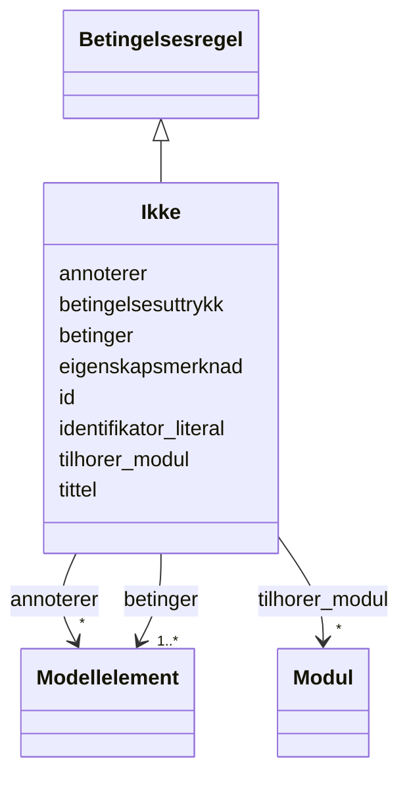

# Class: Ikke 


_Ikkje — negasjon; modellelementet det refererer til må ikkje gjelde._


URI: [modelldcatno:Not](https://data.norge.no/vocabulary/modelldcatno#Not)





## Inheritance
* [Merknad](merknad.md)
    * [Betingelsesregel](betingelsesregel.md)
        * **Ikke**


## Class Properties

| Property | Value |
| --- | --- |
| Class URI | [modelldcatno:Not](https://data.norge.no/vocabulary/modelldcatno#Not) |


## Eigenskapar


### Arva

| Namn | Kardinalitet og domene | Beskriving | Frå |
| --- | --- | --- | --- || [betinger](betinger.md) | 1..* <br/> [Modellelement](modellelement.md) | Modellelement betingelsesregelen avgrensar (modelldcatno:constrains) | [Betingelsesregel](betingelsesregel.md) |
| [betingelsesuttrykk](betingelsesuttrykk.md) | * <br/> [LangString](langstring.md) | Formelt uttrykk for betingelsesregelen (modelldcatno:constraintExpression) | [Betingelsesregel](betingelsesregel.md) |
| [id](id.md) | 1 <br/> [Uriorcurie](uriorcurie.md) | URI-identifikator for ressursen | [Merknad](merknad.md) |
| [annoterer](annoterer.md) | * <br/> [Modellelement](modellelement.md) | Modellelement denne merknaden gjeld (modelldcatno:annotates) | [Merknad](merknad.md) |
| [eigenskapsmerknad](eigenskapsmerknad.md) | * <br/> [LangString](langstring.md) | Fritekstmerknad om ein eigenskap (modelldcatno:propertyNote) | [Merknad](merknad.md) |
| [identifikator_literal](identifikator_literal.md) | 0..1 <br/> [String](string.md) | Tekstleg identifikator for ressursen (dct:identifier) | [Merknad](merknad.md) |
| [tittel](tittel.md) | * <br/> [LangString](langstring.md) | Namn/tittel på ressursen (dct:title) | [Merknad](merknad.md) |
| [tilhorer_modul](tilhorer_modul.md) | * <br/> [Modul](modul.md) | Modul dette elementet tilhøyrer (modelldcatno:belongsToModule) | [Merknad](merknad.md) |


## Identifier and Mapping Information


### Schema Source


* from schema: https://data.norge.no/linkml/modelldcat-ap-no


## Mappings

| Mapping Type | Mapped Value |
| ---  | ---  |
| self | modelldcatno:Not |
| native | https://data.norge.no/linkml/modelldcat-ap-no/Ikke |


## LinkML Source

<!-- TODO: investigate https://stackoverflow.com/questions/37606292/how-to-create-tabbed-code-blocks-in-mkdocs-or-sphinx -->

### Direct

<details>
```yaml
name: Ikke
description: Ikkje — negasjon; modellelementet det refererer til må ikkje gjelde.
from_schema: https://data.norge.no/linkml/modelldcat-ap-no
is_a: Betingelsesregel
class_uri: modelldcatno:Not

```
</details>

### Induced

<details>
```yaml
name: Ikke
description: Ikkje — negasjon; modellelementet det refererer til må ikkje gjelde.
from_schema: https://data.norge.no/linkml/modelldcat-ap-no
is_a: Betingelsesregel
attributes:
  betinger:
    name: betinger
    description: Modellelement betingelsesregelen avgrensar (modelldcatno:constrains).
    in_subset:
    - Obligatorisk
    from_schema: https://data.norge.no/linkml/modelldcat-ap-no
    rank: 1000
    slot_uri: modelldcatno:constrains
    alias: betinger
    owner: Ikke
    domain_of:
    - Betingelsesregel
    range: Modellelement
    required: true
    multivalued: true
  betingelsesuttrykk:
    name: betingelsesuttrykk
    description: Formelt uttrykk for betingelsesregelen (modelldcatno:constraintExpression).
    in_subset:
    - Anbefalt
    from_schema: https://data.norge.no/linkml/modelldcat-ap-no
    rank: 1000
    slot_uri: modelldcatno:constraintExpression
    alias: betingelsesuttrykk
    owner: Ikke
    domain_of:
    - Betingelsesregel
    range: LangString
    multivalued: true
  id:
    name: id
    description: URI-identifikator for ressursen.
    from_schema: https://data.norge.no/linkml/modelldcat-ap-no
    rank: 1000
    identifier: true
    alias: id
    owner: Ikke
    domain_of:
    - KatalogisertRessurs
    - Aktor
    - Kontaktopplysning
    - Standard
    - Lisensdokument
    - Lokasjon
    - Tidsperiode
    - Dokument
    - Modelkatalog
    - Informasjonsmodell
    - Modellelement
    - Eigenskap
    - Merknad
    - Kodeelement
    - Mediatype
    - Konsept
    - Begrepssamling
    range: uriorcurie
    required: true
  annoterer:
    name: annoterer
    description: Modellelement denne merknaden gjeld (modelldcatno:annotates).
    in_subset:
    - Anbefalt
    from_schema: https://data.norge.no/linkml/modelldcat-ap-no
    rank: 1000
    slot_uri: modelldcatno:annotates
    alias: annoterer
    owner: Ikke
    domain_of:
    - Merknad
    range: Modellelement
    multivalued: true
  eigenskapsmerknad:
    name: eigenskapsmerknad
    description: Fritekstmerknad om ein eigenskap (modelldcatno:propertyNote).
    in_subset:
    - Anbefalt
    from_schema: https://data.norge.no/linkml/modelldcat-ap-no
    rank: 1000
    slot_uri: modelldcatno:propertyNote
    alias: eigenskapsmerknad
    owner: Ikke
    domain_of:
    - Merknad
    range: LangString
    multivalued: true
  identifikator_literal:
    name: identifikator_literal
    description: Tekstleg identifikator for ressursen (dct:identifier).
    in_subset:
    - Anbefalt
    from_schema: https://data.norge.no/linkml/modelldcat-ap-no
    rank: 1000
    slot_uri: dct:identifier
    alias: identifikator_literal
    owner: Ikke
    domain_of:
    - Aktor
    - Modelkatalog
    - Informasjonsmodell
    - Modellelement
    - Eigenskap
    - Merknad
    - Kodeelement
    range: string
  tittel:
    name: tittel
    description: Namn/tittel på ressursen (dct:title).
    in_subset:
    - Anbefalt
    from_schema: https://data.norge.no/linkml/modelldcat-ap-no
    rank: 1000
    slot_uri: dct:title
    alias: tittel
    owner: Ikke
    domain_of:
    - Standard
    - Dokument
    - Modelkatalog
    - Informasjonsmodell
    - Modellelement
    - Eigenskap
    - Merknad
    range: LangString
    multivalued: true
  tilhorer_modul:
    name: tilhorer_modul
    description: Modul dette elementet tilhøyrer (modelldcatno:belongsToModule).
    in_subset:
    - Valgfri
    from_schema: https://data.norge.no/linkml/modelldcat-ap-no
    rank: 1000
    slot_uri: modelldcatno:belongsToModule
    alias: tilhorer_modul
    owner: Ikke
    domain_of:
    - Modellelement
    - Eigenskap
    - Merknad
    range: Modul
    multivalued: true
class_uri: modelldcatno:Not

```
</details>