# Class: Informasjonsmodell 


_Ein informasjonsmodell som er katalogisert i ein modelkatalog (modelldcatno:InformationModel)._


URI: [modelldcatno:InformationModel](https://data.norge.no/vocabulary/modelldcatno#InformationModel)

```mermaid
 classDiagram
    class Informasjonsmodell
    click Informasjonsmodell href "../Informasjonsmodell/"
      Informasjonsmodell : begrep
        
          
    
        
        
        Informasjonsmodell --> "*" Konsept : begrep
        click Konsept href "../Konsept/"
    

        
      Informasjonsmodell : beskrivelse
        
          
    
        
        
        Informasjonsmodell --> "*" LangString : beskrivelse
        click LangString href "../LangString/"
    

        
      Informasjonsmodell : dekningsomraade
        
          
    
        
        
        Informasjonsmodell --> "*" Konsept : dekningsomraade
        click Konsept href "../Konsept/"
    

        
      Informasjonsmodell : endringsdato
        
          
    
        
        
        Informasjonsmodell --> "0..1" Date : endringsdato
        click Date href "../http://www.w3.org/2001/XMLSchema#date/"
    

        
      Informasjonsmodell : er_del_av_modell
        
          
    
        
        
        Informasjonsmodell --> "*" Informasjonsmodell : er_del_av_modell
        click Informasjonsmodell href "../Informasjonsmodell/"
    

        
      Informasjonsmodell : er_erstatta_av
        
          
    
        
        
        Informasjonsmodell --> "*" Informasjonsmodell : er_erstatta_av
        click Informasjonsmodell href "../Informasjonsmodell/"
    

        
      Informasjonsmodell : er_i_samsvar_med
        
          
    
        
        
        Informasjonsmodell --> "*" Standard : er_i_samsvar_med
        click Standard href "../Standard/"
    

        
      Informasjonsmodell : er_profil_av
        
          
    
        
        
        Informasjonsmodell --> "*" Standard : er_profil_av
        click Standard href "../Standard/"
    

        
      Informasjonsmodell : erstatter
        
          
    
        
        
        Informasjonsmodell --> "*" Informasjonsmodell : erstatter
        click Informasjonsmodell href "../Informasjonsmodell/"
    

        
      Informasjonsmodell : har_del_modell
        
          
    
        
        
        Informasjonsmodell --> "*" Informasjonsmodell : har_del_modell
        click Informasjonsmodell href "../Informasjonsmodell/"
    

        
      Informasjonsmodell : har_format
        
          
    
        
        
        Informasjonsmodell --> "*" Dokument : har_format
        click Dokument href "../Dokument/"
    

        
      Informasjonsmodell : har_versjonsnummer
        
          
    
        
        
        Informasjonsmodell --> "0..1" String : har_versjonsnummer
        click String href "../http://www.w3.org/2001/XMLSchema#string/"
    

        
      Informasjonsmodell : heimeside
        
          
    
        
        
        Informasjonsmodell --> "*" Uri : heimeside
        click Uri href "../http://www.w3.org/2001/XMLSchema#anyURI/"
    

        
      Informasjonsmodell : id
        
          
    
        
        
        Informasjonsmodell --> "1" Uriorcurie : id
        click Uriorcurie href "../http://www.w3.org/2001/XMLSchema#anyURI/"
    

        
      Informasjonsmodell : identifikator_literal
        
          
    
        
        
        Informasjonsmodell --> "0..1" String : identifikator_literal
        click String href "../http://www.w3.org/2001/XMLSchema#string/"
    

        
      Informasjonsmodell : informasjonsmodellidentifikator
        
          
    
        
        
        Informasjonsmodell --> "0..1" String : informasjonsmodellidentifikator
        click String href "../http://www.w3.org/2001/XMLSchema#string/"
    

        
      Informasjonsmodell : inneholder_modellelement
        
          
    
        
        
        Informasjonsmodell --> "*" Modellelement : inneholder_modellelement
        click Modellelement href "../Modellelement/"
    

        
      Informasjonsmodell : kontaktpunkt
        
          
    
        
        
        Informasjonsmodell --> "*" Kontaktopplysning : kontaktpunkt
        click Kontaktopplysning href "../Kontaktopplysning/"
    

        
      Informasjonsmodell : lisens
        
          
    
        
        
        Informasjonsmodell --> "0..1" Lisensdokument : lisens
        click Lisensdokument href "../Lisensdokument/"
    

        
      Informasjonsmodell : nokkelord
        
          
    
        
        
        Informasjonsmodell --> "*" LangString : nokkelord
        click LangString href "../LangString/"
    

        
      Informasjonsmodell : skapar
        
          
    
        
        
        Informasjonsmodell --> "0..1" Aktor : skapar
        click Aktor href "../Aktor/"
    

        
      Informasjonsmodell : spraak
        
          
    
        
        
        Informasjonsmodell --> "*" Spraak : spraak
        click Spraak href "../Spraak/"
    

        
      Informasjonsmodell : status
        
          
    
        
        
        Informasjonsmodell --> "0..1" Konsept : status
        click Konsept href "../Konsept/"
    

        
      Informasjonsmodell : tema
        
          
    
        
        
        Informasjonsmodell --> "*" Konsept : tema
        click Konsept href "../Konsept/"
    

        
      Informasjonsmodell : tidsperiode
        
          
    
        
        
        Informasjonsmodell --> "*" Tidsperiode : tidsperiode
        click Tidsperiode href "../Tidsperiode/"
    

        
      Informasjonsmodell : tittel
        
          
    
        
        
        Informasjonsmodell --> "1..*" LangString : tittel
        click LangString href "../LangString/"
    

        
      Informasjonsmodell : type_concept
        
          
    
        
        
        Informasjonsmodell --> "0..1" Konsept : type_concept
        click Konsept href "../Konsept/"
    

        
      Informasjonsmodell : utgivelsesdato
        
          
    
        
        
        Informasjonsmodell --> "0..1" Date : utgivelsesdato
        click Date href "../http://www.w3.org/2001/XMLSchema#date/"
    

        
      Informasjonsmodell : utgiver
        
          
    
        
        
        Informasjonsmodell --> "1" Aktor : utgiver
        click Aktor href "../Aktor/"
    

        
      Informasjonsmodell : versjonsmerknad
        
          
    
        
        
        Informasjonsmodell --> "*" LangString : versjonsmerknad
        click LangString href "../LangString/"
    

        
      
```





<!-- no inheritance hierarchy -->

## Class Properties

| Property | Value |
| --- | --- |
| Class URI | [modelldcatno:InformationModel](https://data.norge.no/vocabulary/modelldcatno#InformationModel) |


## Eigenskapar


  
  

  
  
    
  

  
  
    
  

  
  

  
  

  
  

  
  

  
  

  
  

  
  

  
  

  
  

  
  

  
  

  
  

  
  

  
  

  
  

  
  

  
  

  
  

  
  

  
  

  
  

  
  

  
  

  
  

  
  

  
  

  
  


### Obligatorisk

| Namn | Kardinalitet og domene | Beskriving |
| --- | --- | --- |
| [tittel](tittel.md) | 1..* <br/> [LangString](langstring.md) | Namn/tittel på ressursen (dct:title) |
| [utgiver](utgiver.md) | 1 <br/> [Aktor](aktor.md) | Aktøren ansvarleg for å tilgjengeleggjere ressursen (dct:publisher) |


  
  

  
  

  
  

  
  
    
  

  
  
    
  

  
  
    
  

  
  
    
  

  
  
    
  

  
  
    
  

  
  
    
  

  
  
    
  

  
  

  
  

  
  

  
  

  
  

  
  

  
  

  
  

  
  

  
  

  
  

  
  

  
  

  
  

  
  

  
  

  
  

  
  

  
  


### Anbefalt

| Namn | Kardinalitet og domene | Beskriving |
| --- | --- | --- |
| [begrep](begrep.md) | * <br/> [Konsept](konsept.md) | Fagomgrep ressursen handlar om (dct:subject) |
| [beskrivelse](beskrivelse.md) | * <br/> [LangString](langstring.md) | Fritekstbeskrivelse av ressursen (dct:description) |
| [identifikator_literal](identifikator_literal.md) | 0..1 <br/> [xsd:string](http://www.w3.org/2001/XMLSchema#string) | Tekstleg identifikator for ressursen (dct:identifier) |
| [informasjonsmodellidentifikator](informasjonsmodellidentifikator.md) | 0..1 <br/> [xsd:string](http://www.w3.org/2001/XMLSchema#string) | Identifikator for informasjonsmodellen i domenet (modelldcatno:informationMod... |
| [inneholder_modellelement](inneholder_modellelement.md) | * <br/> [Modellelement](modellelement.md) | Modellelement som er del av informasjonsmodellen (modelldcatno:containsModelE... |
| [kontaktpunkt](kontaktpunkt.md) | * <br/> [Kontaktopplysning](kontaktopplysning.md) | Kontaktinformasjon for ressursen (dcat:contactPoint) |
| [lisens](lisens.md) | 0..1 <br/> [Lisensdokument](lisensdokument.md) | Lisens for bruk av ressursen (dct:license) |
| [tema](tema.md) | * <br/> [Konsept](konsept.md) | Tema frå eit kontrollert vokabular (dcat:theme) |


  
  

  
  

  
  

  
  

  
  

  
  

  
  

  
  

  
  

  
  

  
  

  
  
    
  

  
  
    
  

  
  
    
  

  
  
    
  

  
  
    
  

  
  
    
  

  
  
    
  

  
  
    
  

  
  
    
  

  
  
    
  

  
  
    
  

  
  
    
  

  
  
    
  

  
  
    
  

  
  
    
  

  
  
    
  

  
  
    
  

  
  
    
  

  
  
    
  


### Valgfri

| Namn | Kardinalitet og domene | Beskriving |
| --- | --- | --- |
| [dekningsomraade](dekningsomraade.md) | * <br/> [Konsept](konsept.md) | Geografisk dekningsområde (dct:spatial) |
| [endringsdato](endringsdato.md) | 0..1 <br/> [xsd:date](http://www.w3.org/2001/XMLSchema#date) | Dato for siste endring av ressursen (dct:modified) |
| [er_del_av_modell](er_del_av_modell.md) | * <br/> [Informasjonsmodell](informasjonsmodell.md) | Overordna informasjonsmodell (dct:isPartOf) |
| [er_profil_av](er_profil_av.md) | * <br/> [Standard](standard.md) | Standard denne informasjonsmodellen er ein profil av (prof:isProfileOf) |
| [er_erstatta_av](er_erstatta_av.md) | * <br/> [Informasjonsmodell](informasjonsmodell.md) | Informasjonsmodell som erstattar denne (dct:isReplacedBy) |
| [erstatter](erstatter.md) | * <br/> [Informasjonsmodell](informasjonsmodell.md) | Informasjonsmodell som denne erstattar (dct:replaces) |
| [har_del_modell](har_del_modell.md) | * <br/> [Informasjonsmodell](informasjonsmodell.md) | Del-informasjonsmodell av denne modellen (dct:hasPart) |
| [har_format](har_format.md) | * <br/> [Dokument](dokument.md) | Dokument som representerer ein annan form av modellen (dct:hasFormat) |
| [tidsperiode](tidsperiode.md) | * <br/> [Tidsperiode](tidsperiode.md) | Tidsperiode ressursen dekkar (dct:temporal) |
| [heimeside](heimeside.md) | * <br/> [xsd:anyURI](http://www.w3.org/2001/XMLSchema#anyURI) | Heimeside for ressursen eller organisasjonen (foaf:homepage) |
| [er_i_samsvar_med](er_i_samsvar_med.md) | * <br/> [Standard](standard.md) | Standard ressursen er i samsvar med (dct:conformsTo) |
| [status](status.md) | 0..1 <br/> [Konsept](konsept.md) | Status for ressursen frå eit kontrollert vokabular (adms:status) |
| [nokkelord](nokkelord.md) | * <br/> [LangString](langstring.md) | Nøkkelord som beskriv ressursen (dcat:keyword) |
| [skapar](skapar.md) | 0..1 <br/> [Aktor](aktor.md) | Aktøren som primært har skapt ressursen (dct:creator) |
| [spraak](spraak.md) | * <br/> [Spraak](spraak.md) | Språk brukt i ressursen (dct:language) |
| [type_concept](type_concept.md) | 0..1 <br/> [Konsept](konsept.md) | Type ressurs frå eit kontrollert vokabular (dct:type) |
| [utgivelsesdato](utgivelsesdato.md) | 0..1 <br/> [xsd:date](http://www.w3.org/2001/XMLSchema#date) | Dato ressursen vart første gong publisert (dct:issued) |
| [har_versjonsnummer](har_versjonsnummer.md) | 0..1 <br/> [xsd:string](http://www.w3.org/2001/XMLSchema#string) | Versjonsnummer for ressursen (owl:versionInfo) |
| [versjonsmerknad](versjonsmerknad.md) | * <br/> [LangString](langstring.md) | Merknad om endringar i denne versjonen (adms:versionNotes) |


  
  
  
  
    
  

  
  
  
    
      
    
      
    
      
    
  
  

  
  
  
    
      
    
      
    
      
    
  
  

  
  
  
    
      
    
      
    
      
    
  
  

  
  
  
    
      
    
      
    
      
    
  
  

  
  
  
    
      
    
      
    
      
    
  
  

  
  
  
    
      
    
      
    
      
    
  
  

  
  
  
    
      
    
      
    
      
    
  
  

  
  
  
    
      
    
      
    
      
    
  
  

  
  
  
    
      
    
      
    
      
    
  
  

  
  
  
    
      
    
      
    
      
    
  
  

  
  
  
    
      
    
      
    
      
    
  
  

  
  
  
    
      
    
      
    
      
    
  
  

  
  
  
    
      
    
      
    
      
    
  
  

  
  
  
    
      
    
      
    
      
    
  
  

  
  
  
    
      
    
      
    
      
    
  
  

  
  
  
    
      
    
      
    
      
    
  
  

  
  
  
    
      
    
      
    
      
    
  
  

  
  
  
    
      
    
      
    
      
    
  
  

  
  
  
    
      
    
      
    
      
    
  
  

  
  
  
    
      
    
      
    
      
    
  
  

  
  
  
    
      
    
      
    
      
    
  
  

  
  
  
    
      
    
      
    
      
    
  
  

  
  
  
    
      
    
      
    
      
    
  
  

  
  
  
    
      
    
      
    
      
    
  
  

  
  
  
    
      
    
      
    
      
    
  
  

  
  
  
    
      
    
      
    
      
    
  
  

  
  
  
    
      
    
      
    
      
    
  
  

  
  
  
    
      
    
      
    
      
    
  
  

  
  
  
    
      
    
      
    
      
    
  
  


### Andre

| Namn | Kardinalitet og domene | Beskriving |
| --- | --- | --- |
| [id](id.md) | 1 <br/> [xsd:anyURI](http://www.w3.org/2001/XMLSchema#anyURI) | URI-identifikator for ressursen |


## Usages

| used by | used in | type | used |
| ---  | --- | --- | --- |
| [Modelkatalog](modelkatalog.md) | [modell](modell.md) | range | [Informasjonsmodell](informasjonsmodell.md) |
| [Informasjonsmodell](informasjonsmodell.md) | [er_del_av_modell](er_del_av_modell.md) | range | [Informasjonsmodell](informasjonsmodell.md) |
| [Informasjonsmodell](informasjonsmodell.md) | [er_erstatta_av](er_erstatta_av.md) | range | [Informasjonsmodell](informasjonsmodell.md) |
| [Informasjonsmodell](informasjonsmodell.md) | [erstatter](erstatter.md) | range | [Informasjonsmodell](informasjonsmodell.md) |
| [Informasjonsmodell](informasjonsmodell.md) | [har_del_modell](har_del_modell.md) | range | [Informasjonsmodell](informasjonsmodell.md) |


## Identifier and Mapping Information


### Schema Source


* from schema: https://data.norge.no/linkml/modelldcat-ap-no


## Mappings

| Mapping Type | Mapped Value |
| ---  | ---  |
| self | modelldcatno:InformationModel |
| native | https://data.norge.no/linkml/modelldcat-ap-no/Informasjonsmodell |


## LinkML Source

<!-- TODO: investigate https://stackoverflow.com/questions/37606292/how-to-create-tabbed-code-blocks-in-mkdocs-or-sphinx -->

### Direct

<details>
```yaml
name: Informasjonsmodell
description: Ein informasjonsmodell som er katalogisert i ein modelkatalog (modelldcatno:InformationModel).
from_schema: https://data.norge.no/linkml/modelldcat-ap-no
rank: 1000
slots:
- id
- tittel
- utgiver
- begrep
- beskrivelse
- identifikator_literal
- informasjonsmodellidentifikator
- inneholder_modellelement
- kontaktpunkt
- lisens
- tema
- dekningsomraade
- endringsdato
- er_del_av_modell
- er_profil_av
- er_erstatta_av
- erstatter
- har_del_modell
- har_format
- tidsperiode
- heimeside
- er_i_samsvar_med
- status
- nokkelord
- skapar
- spraak
- type_concept
- utgivelsesdato
- har_versjonsnummer
- versjonsmerknad
slot_usage:
  tittel:
    name: tittel
    in_subset:
    - Obligatorisk
    required: true
  utgiver:
    name: utgiver
    in_subset:
    - Obligatorisk
    required: true
  begrep:
    name: begrep
    in_subset:
    - Anbefalt
  beskrivelse:
    name: beskrivelse
    in_subset:
    - Anbefalt
  identifikator_literal:
    name: identifikator_literal
    in_subset:
    - Anbefalt
  informasjonsmodellidentifikator:
    name: informasjonsmodellidentifikator
    in_subset:
    - Anbefalt
  inneholder_modellelement:
    name: inneholder_modellelement
    in_subset:
    - Anbefalt
  kontaktpunkt:
    name: kontaktpunkt
    in_subset:
    - Anbefalt
  lisens:
    name: lisens
    in_subset:
    - Anbefalt
  tema:
    name: tema
    in_subset:
    - Anbefalt
  dekningsomraade:
    name: dekningsomraade
    in_subset:
    - Valgfri
  endringsdato:
    name: endringsdato
    in_subset:
    - Valgfri
  er_del_av_modell:
    name: er_del_av_modell
    in_subset:
    - Valgfri
  er_profil_av:
    name: er_profil_av
    in_subset:
    - Valgfri
  er_erstatta_av:
    name: er_erstatta_av
    in_subset:
    - Valgfri
  erstatter:
    name: erstatter
    in_subset:
    - Valgfri
  har_del_modell:
    name: har_del_modell
    in_subset:
    - Valgfri
  har_format:
    name: har_format
    in_subset:
    - Valgfri
  tidsperiode:
    name: tidsperiode
    in_subset:
    - Valgfri
  heimeside:
    name: heimeside
    in_subset:
    - Valgfri
  er_i_samsvar_med:
    name: er_i_samsvar_med
    in_subset:
    - Valgfri
  status:
    name: status
    in_subset:
    - Valgfri
  nokkelord:
    name: nokkelord
    in_subset:
    - Valgfri
  skapar:
    name: skapar
    in_subset:
    - Valgfri
  spraak:
    name: spraak
    in_subset:
    - Valgfri
  type_concept:
    name: type_concept
    in_subset:
    - Valgfri
  utgivelsesdato:
    name: utgivelsesdato
    in_subset:
    - Valgfri
  har_versjonsnummer:
    name: har_versjonsnummer
    in_subset:
    - Valgfri
  versjonsmerknad:
    name: versjonsmerknad
    in_subset:
    - Valgfri
class_uri: modelldcatno:InformationModel

```
</details>

### Induced

<details>
```yaml
name: Informasjonsmodell
description: Ein informasjonsmodell som er katalogisert i ein modelkatalog (modelldcatno:InformationModel).
from_schema: https://data.norge.no/linkml/modelldcat-ap-no
rank: 1000
slot_usage:
  tittel:
    name: tittel
    in_subset:
    - Obligatorisk
    required: true
  utgiver:
    name: utgiver
    in_subset:
    - Obligatorisk
    required: true
  begrep:
    name: begrep
    in_subset:
    - Anbefalt
  beskrivelse:
    name: beskrivelse
    in_subset:
    - Anbefalt
  identifikator_literal:
    name: identifikator_literal
    in_subset:
    - Anbefalt
  informasjonsmodellidentifikator:
    name: informasjonsmodellidentifikator
    in_subset:
    - Anbefalt
  inneholder_modellelement:
    name: inneholder_modellelement
    in_subset:
    - Anbefalt
  kontaktpunkt:
    name: kontaktpunkt
    in_subset:
    - Anbefalt
  lisens:
    name: lisens
    in_subset:
    - Anbefalt
  tema:
    name: tema
    in_subset:
    - Anbefalt
  dekningsomraade:
    name: dekningsomraade
    in_subset:
    - Valgfri
  endringsdato:
    name: endringsdato
    in_subset:
    - Valgfri
  er_del_av_modell:
    name: er_del_av_modell
    in_subset:
    - Valgfri
  er_profil_av:
    name: er_profil_av
    in_subset:
    - Valgfri
  er_erstatta_av:
    name: er_erstatta_av
    in_subset:
    - Valgfri
  erstatter:
    name: erstatter
    in_subset:
    - Valgfri
  har_del_modell:
    name: har_del_modell
    in_subset:
    - Valgfri
  har_format:
    name: har_format
    in_subset:
    - Valgfri
  tidsperiode:
    name: tidsperiode
    in_subset:
    - Valgfri
  heimeside:
    name: heimeside
    in_subset:
    - Valgfri
  er_i_samsvar_med:
    name: er_i_samsvar_med
    in_subset:
    - Valgfri
  status:
    name: status
    in_subset:
    - Valgfri
  nokkelord:
    name: nokkelord
    in_subset:
    - Valgfri
  skapar:
    name: skapar
    in_subset:
    - Valgfri
  spraak:
    name: spraak
    in_subset:
    - Valgfri
  type_concept:
    name: type_concept
    in_subset:
    - Valgfri
  utgivelsesdato:
    name: utgivelsesdato
    in_subset:
    - Valgfri
  har_versjonsnummer:
    name: har_versjonsnummer
    in_subset:
    - Valgfri
  versjonsmerknad:
    name: versjonsmerknad
    in_subset:
    - Valgfri
attributes:
  id:
    name: id
    description: URI-identifikator for ressursen.
    from_schema: https://data.norge.no/linkml/common-ap-no
    identifier: true
    alias: id
    owner: Informasjonsmodell
    domain_of:
    - Mediatype
    - Konsept
    - Begrepssamling
    - KatalogisertRessurs
    - Aktor
    - Kontaktopplysning
    - Standard
    - Lisensdokument
    - Lokasjon
    - Tidsperiode
    - Dokument
    - Modelkatalog
    - Informasjonsmodell
    - Modellelement
    - Eigenskap
    - Merknad
    - Kodeelement
    range: uriorcurie
    required: true
  tittel:
    name: tittel
    description: Namn/tittel på ressursen (dct:title).
    in_subset:
    - Obligatorisk
    from_schema: https://data.norge.no/linkml/common-ap-no
    slot_uri: dct:title
    alias: tittel
    owner: Informasjonsmodell
    domain_of:
    - Standard
    - Dokument
    - Modelkatalog
    - Informasjonsmodell
    - Modellelement
    - Eigenskap
    - Merknad
    range: LangString
    required: true
    multivalued: true
  utgiver:
    name: utgiver
    description: Aktøren ansvarleg for å tilgjengeleggjere ressursen (dct:publisher).
    in_subset:
    - Obligatorisk
    from_schema: https://data.norge.no/linkml/modelldcat-ap-no
    rank: 1000
    slot_uri: dct:publisher
    alias: utgiver
    owner: Informasjonsmodell
    domain_of:
    - Modelkatalog
    - Informasjonsmodell
    range: Aktor
    required: true
  begrep:
    name: begrep
    description: Fagomgrep ressursen handlar om (dct:subject).
    in_subset:
    - Anbefalt
    from_schema: https://data.norge.no/linkml/modelldcat-ap-no
    rank: 1000
    slot_uri: dct:subject
    alias: begrep
    owner: Informasjonsmodell
    domain_of:
    - Informasjonsmodell
    - Modellelement
    - Eigenskap
    - Kodeelement
    range: Konsept
    multivalued: true
  beskrivelse:
    name: beskrivelse
    description: Fritekstbeskrivelse av ressursen (dct:description).
    in_subset:
    - Anbefalt
    from_schema: https://data.norge.no/linkml/common-ap-no
    slot_uri: dct:description
    alias: beskrivelse
    owner: Informasjonsmodell
    domain_of:
    - Modelkatalog
    - Informasjonsmodell
    - Modellelement
    - Eigenskap
    range: LangString
    multivalued: true
  identifikator_literal:
    name: identifikator_literal
    description: Tekstleg identifikator for ressursen (dct:identifier).
    in_subset:
    - Anbefalt
    from_schema: https://data.norge.no/linkml/common-ap-no
    slot_uri: dct:identifier
    alias: identifikator_literal
    owner: Informasjonsmodell
    domain_of:
    - Aktor
    - Modelkatalog
    - Informasjonsmodell
    - Modellelement
    - Eigenskap
    - Merknad
    - Kodeelement
    range: string
  informasjonsmodellidentifikator:
    name: informasjonsmodellidentifikator
    description: Identifikator for informasjonsmodellen i domenet (modelldcatno:informationModelIdentifier).
    in_subset:
    - Anbefalt
    from_schema: https://data.norge.no/linkml/modelldcat-ap-no
    rank: 1000
    slot_uri: modelldcatno:informationModelIdentifier
    alias: informasjonsmodellidentifikator
    owner: Informasjonsmodell
    domain_of:
    - Informasjonsmodell
    range: string
  inneholder_modellelement:
    name: inneholder_modellelement
    description: Modellelement som er del av informasjonsmodellen (modelldcatno:containsModelElement).
    in_subset:
    - Anbefalt
    from_schema: https://data.norge.no/linkml/modelldcat-ap-no
    rank: 1000
    slot_uri: modelldcatno:containsModelElement
    alias: inneholder_modellelement
    owner: Informasjonsmodell
    domain_of:
    - Informasjonsmodell
    range: Modellelement
    multivalued: true
  kontaktpunkt:
    name: kontaktpunkt
    description: Kontaktinformasjon for ressursen (dcat:contactPoint).
    in_subset:
    - Anbefalt
    from_schema: https://data.norge.no/linkml/modelldcat-ap-no
    rank: 1000
    slot_uri: dcat:contactPoint
    alias: kontaktpunkt
    owner: Informasjonsmodell
    domain_of:
    - Modelkatalog
    - Informasjonsmodell
    range: Kontaktopplysning
    multivalued: true
  lisens:
    name: lisens
    description: Lisens for bruk av ressursen (dct:license).
    in_subset:
    - Anbefalt
    from_schema: https://data.norge.no/linkml/modelldcat-ap-no
    rank: 1000
    slot_uri: dct:license
    alias: lisens
    owner: Informasjonsmodell
    domain_of:
    - Modelkatalog
    - Informasjonsmodell
    range: Lisensdokument
  tema:
    name: tema
    description: Tema frå eit kontrollert vokabular (dcat:theme).
    in_subset:
    - Anbefalt
    from_schema: https://data.norge.no/linkml/modelldcat-ap-no
    rank: 1000
    slot_uri: dcat:theme
    alias: tema
    owner: Informasjonsmodell
    domain_of:
    - Modelkatalog
    - Informasjonsmodell
    range: Konsept
    multivalued: true
  dekningsomraade:
    name: dekningsomraade
    description: Geografisk dekningsområde (dct:spatial).
    in_subset:
    - Valgfri
    from_schema: https://data.norge.no/linkml/common-ap-no
    slot_uri: dct:spatial
    alias: dekningsomraade
    owner: Informasjonsmodell
    domain_of:
    - Informasjonsmodell
    range: Konsept
    multivalued: true
  endringsdato:
    name: endringsdato
    description: Dato for siste endring av ressursen (dct:modified).
    in_subset:
    - Valgfri
    from_schema: https://data.norge.no/linkml/common-ap-no
    slot_uri: dct:modified
    alias: endringsdato
    owner: Informasjonsmodell
    domain_of:
    - Modelkatalog
    - Informasjonsmodell
    range: date
  er_del_av_modell:
    name: er_del_av_modell
    description: Overordna informasjonsmodell (dct:isPartOf).
    in_subset:
    - Valgfri
    from_schema: https://data.norge.no/linkml/modelldcat-ap-no
    rank: 1000
    slot_uri: dct:isPartOf
    alias: er_del_av_modell
    owner: Informasjonsmodell
    domain_of:
    - Informasjonsmodell
    range: Informasjonsmodell
    multivalued: true
  er_profil_av:
    name: er_profil_av
    description: Standard denne informasjonsmodellen er ein profil av (prof:isProfileOf).
    in_subset:
    - Valgfri
    from_schema: https://data.norge.no/linkml/modelldcat-ap-no
    rank: 1000
    slot_uri: prof:isProfileOf
    alias: er_profil_av
    owner: Informasjonsmodell
    domain_of:
    - Informasjonsmodell
    range: Standard
    multivalued: true
  er_erstatta_av:
    name: er_erstatta_av
    description: Informasjonsmodell som erstattar denne (dct:isReplacedBy).
    in_subset:
    - Valgfri
    from_schema: https://data.norge.no/linkml/modelldcat-ap-no
    rank: 1000
    slot_uri: dct:isReplacedBy
    alias: er_erstatta_av
    owner: Informasjonsmodell
    domain_of:
    - Informasjonsmodell
    range: Informasjonsmodell
    multivalued: true
  erstatter:
    name: erstatter
    description: Informasjonsmodell som denne erstattar (dct:replaces).
    in_subset:
    - Valgfri
    from_schema: https://data.norge.no/linkml/modelldcat-ap-no
    rank: 1000
    slot_uri: dct:replaces
    alias: erstatter
    owner: Informasjonsmodell
    domain_of:
    - Informasjonsmodell
    range: Informasjonsmodell
    multivalued: true
  har_del_modell:
    name: har_del_modell
    description: Del-informasjonsmodell av denne modellen (dct:hasPart).
    in_subset:
    - Valgfri
    from_schema: https://data.norge.no/linkml/modelldcat-ap-no
    rank: 1000
    slot_uri: dct:hasPart
    alias: har_del_modell
    owner: Informasjonsmodell
    domain_of:
    - Informasjonsmodell
    range: Informasjonsmodell
    multivalued: true
  har_format:
    name: har_format
    description: Dokument som representerer ein annan form av modellen (dct:hasFormat).
    in_subset:
    - Valgfri
    from_schema: https://data.norge.no/linkml/modelldcat-ap-no
    rank: 1000
    slot_uri: dct:hasFormat
    alias: har_format
    owner: Informasjonsmodell
    domain_of:
    - Informasjonsmodell
    range: Dokument
    multivalued: true
  tidsperiode:
    name: tidsperiode
    description: Tidsperiode ressursen dekkar (dct:temporal).
    in_subset:
    - Valgfri
    from_schema: https://data.norge.no/linkml/modelldcat-ap-no
    rank: 1000
    slot_uri: dct:temporal
    alias: tidsperiode
    owner: Informasjonsmodell
    domain_of:
    - Informasjonsmodell
    range: Tidsperiode
    multivalued: true
  heimeside:
    name: heimeside
    description: Heimeside for ressursen eller organisasjonen (foaf:homepage).
    in_subset:
    - Valgfri
    from_schema: https://data.norge.no/linkml/common-ap-no
    slot_uri: foaf:homepage
    alias: heimeside
    owner: Informasjonsmodell
    domain_of:
    - Modelkatalog
    - Informasjonsmodell
    range: uri
    multivalued: true
  er_i_samsvar_med:
    name: er_i_samsvar_med
    description: Standard ressursen er i samsvar med (dct:conformsTo).
    in_subset:
    - Valgfri
    from_schema: https://data.norge.no/linkml/modelldcat-ap-no
    rank: 1000
    slot_uri: dct:conformsTo
    alias: er_i_samsvar_med
    owner: Informasjonsmodell
    domain_of:
    - Informasjonsmodell
    range: Standard
    multivalued: true
  status:
    name: status
    description: Status for ressursen frå eit kontrollert vokabular (adms:status).
    in_subset:
    - Valgfri
    from_schema: https://data.norge.no/linkml/common-ap-no
    slot_uri: adms:status
    alias: status
    owner: Informasjonsmodell
    domain_of:
    - Informasjonsmodell
    range: Konsept
  nokkelord:
    name: nokkelord
    description: Nøkkelord som beskriv ressursen (dcat:keyword).
    in_subset:
    - Valgfri
    from_schema: https://data.norge.no/linkml/common-ap-no
    slot_uri: dcat:keyword
    alias: nokkelord
    owner: Informasjonsmodell
    domain_of:
    - Informasjonsmodell
    range: LangString
    multivalued: true
  skapar:
    name: skapar
    description: Aktøren som primært har skapt ressursen (dct:creator).
    in_subset:
    - Valgfri
    from_schema: https://data.norge.no/linkml/modelldcat-ap-no
    rank: 1000
    slot_uri: dct:creator
    alias: skapar
    owner: Informasjonsmodell
    domain_of:
    - Informasjonsmodell
    range: Aktor
  spraak:
    name: spraak
    description: Språk brukt i ressursen (dct:language).
    in_subset:
    - Valgfri
    from_schema: https://data.norge.no/linkml/common-ap-no
    slot_uri: dct:language
    alias: spraak
    owner: Informasjonsmodell
    domain_of:
    - Dokument
    - Modelkatalog
    - Informasjonsmodell
    range: Spraak
    multivalued: true
  type_concept:
    name: type_concept
    description: Type ressurs frå eit kontrollert vokabular (dct:type).
    in_subset:
    - Valgfri
    from_schema: https://data.norge.no/linkml/common-ap-no
    slot_uri: dct:type
    alias: type_concept
    owner: Informasjonsmodell
    domain_of:
    - Aktor
    - Lisensdokument
    - Informasjonsmodell
    range: Konsept
  utgivelsesdato:
    name: utgivelsesdato
    description: Dato ressursen vart første gong publisert (dct:issued).
    in_subset:
    - Valgfri
    from_schema: https://data.norge.no/linkml/common-ap-no
    slot_uri: dct:issued
    alias: utgivelsesdato
    owner: Informasjonsmodell
    domain_of:
    - Modelkatalog
    - Informasjonsmodell
    range: date
  har_versjonsnummer:
    name: har_versjonsnummer
    description: Versjonsnummer for ressursen (owl:versionInfo).
    in_subset:
    - Valgfri
    from_schema: https://data.norge.no/linkml/common-ap-no
    slot_uri: owl:versionInfo
    alias: har_versjonsnummer
    owner: Informasjonsmodell
    domain_of:
    - Standard
    - Informasjonsmodell
    range: string
  versjonsmerknad:
    name: versjonsmerknad
    description: Merknad om endringar i denne versjonen (adms:versionNotes).
    in_subset:
    - Valgfri
    from_schema: https://data.norge.no/linkml/common-ap-no
    slot_uri: adms:versionNotes
    alias: versjonsmerknad
    owner: Informasjonsmodell
    domain_of:
    - Informasjonsmodell
    range: LangString
    multivalued: true
class_uri: modelldcatno:InformationModel

```
</details>