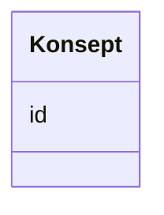

# Class: Konsept 


_Referanse til eit SKOS-omgrep frå eit kontrollert vokabular._


URI: [skos:Concept](http://www.w3.org/2004/02/skos/core#Concept)





<!-- no inheritance hierarchy -->

## Class Properties

| Property | Value |
| --- | --- |
| Class URI | [skos:Concept](http://www.w3.org/2004/02/skos/core#Concept) |


## Eigenskapar


  
  


  
  


  
  


  
  
  
  
    
  


### Andre

| Namn | Kardinalitet og domene | Beskriving |
| --- | --- | --- |
| [id](id.md) | 1 <br/> [Uriorcurie](uriorcurie.md) | URI-identifikator for ressursen |


## Usages

| used by | used in | type | used |
| ---  | --- | --- | --- |
| [Aktor](aktor.md) | [type_concept](type_concept.md) | range | [Konsept](konsept.md) |
| [Lisensdokument](lisensdokument.md) | [type_concept](type_concept.md) | range | [Konsept](konsept.md) |
| [Modelkatalog](modelkatalog.md) | [tema](tema.md) | range | [Konsept](konsept.md) |
| [Informasjonsmodell](informasjonsmodell.md) | [begrep](begrep.md) | range | [Konsept](konsept.md) |
| [Informasjonsmodell](informasjonsmodell.md) | [tema](tema.md) | range | [Konsept](konsept.md) |
| [Informasjonsmodell](informasjonsmodell.md) | [dekningsomraade](dekningsomraade.md) | range | [Konsept](konsept.md) |
| [Informasjonsmodell](informasjonsmodell.md) | [status](status.md) | range | [Konsept](konsept.md) |
| [Informasjonsmodell](informasjonsmodell.md) | [type_concept](type_concept.md) | range | [Konsept](konsept.md) |
| [Modellelement](modellelement.md) | [begrep](begrep.md) | range | [Konsept](konsept.md) |
| [Objekttype](objekttype.md) | [begrep](begrep.md) | range | [Konsept](konsept.md) |
| [RootObjekttype](rootobjekttype.md) | [begrep](begrep.md) | range | [Konsept](konsept.md) |
| [Datatype](datatype.md) | [begrep](begrep.md) | range | [Konsept](konsept.md) |
| [EnkelType](enkeltype.md) | [begrep](begrep.md) | range | [Konsept](konsept.md) |
| [Kodeliste](kodeliste.md) | [begrep](begrep.md) | range | [Konsept](konsept.md) |
| [Modul](modul.md) | [begrep](begrep.md) | range | [Konsept](konsept.md) |
| [Eigenskap](eigenskap.md) | [begrep](begrep.md) | range | [Konsept](konsept.md) |
| [Attributt](attributt.md) | [begrep](begrep.md) | range | [Konsept](konsept.md) |
| [Assosiasjon](assosiasjon.md) | [begrep](begrep.md) | range | [Konsept](konsept.md) |
| [Rolle](rolle.md) | [begrep](begrep.md) | range | [Konsept](konsept.md) |
| [Spesialisering](spesialisering.md) | [begrep](begrep.md) | range | [Konsept](konsept.md) |
| [Sammensetning](sammensetning.md) | [begrep](begrep.md) | range | [Konsept](konsept.md) |
| [Realisering](realisering.md) | [begrep](begrep.md) | range | [Konsept](konsept.md) |
| [Abstraksjon](abstraksjon.md) | [begrep](begrep.md) | range | [Konsept](konsept.md) |
| [Avhengighet](avhengighet.md) | [begrep](begrep.md) | range | [Konsept](konsept.md) |
| [Samling](samling.md) | [begrep](begrep.md) | range | [Konsept](konsept.md) |
| [Valg](valg.md) | [begrep](begrep.md) | range | [Konsept](konsept.md) |
| [AlleAv](alleav.md) | [begrep](begrep.md) | range | [Konsept](konsept.md) |
| [NoenAv](noenav.md) | [begrep](begrep.md) | range | [Konsept](konsept.md) |
| [Kodeelement](kodeelement.md) | [begrep](begrep.md) | range | [Konsept](konsept.md) |


## Identifier and Mapping Information


### Schema Source


* from schema: https://data.norge.no/linkml/modelldcat-ap-no


## Mappings

| Mapping Type | Mapped Value |
| ---  | ---  |
| self | skos:Concept |
| native | https://data.norge.no/linkml/modelldcat-ap-no/Konsept |


## LinkML Source

<!-- TODO: investigate https://stackoverflow.com/questions/37606292/how-to-create-tabbed-code-blocks-in-mkdocs-or-sphinx -->

### Direct

<details>
```yaml
name: Konsept
description: Referanse til eit SKOS-omgrep frå eit kontrollert vokabular.
from_schema: https://data.norge.no/linkml/modelldcat-ap-no
slots:
- id
class_uri: skos:Concept

```
</details>

### Induced

<details>
```yaml
name: Konsept
description: Referanse til eit SKOS-omgrep frå eit kontrollert vokabular.
from_schema: https://data.norge.no/linkml/modelldcat-ap-no
attributes:
  id:
    name: id
    description: URI-identifikator for ressursen.
    from_schema: https://data.norge.no/linkml/modelldcat-ap-no
    rank: 1000
    identifier: true
    alias: id
    owner: Konsept
    domain_of:
    - KatalogisertRessurs
    - Aktor
    - Kontaktopplysning
    - Standard
    - Lisensdokument
    - Lokasjon
    - Tidsperiode
    - Dokument
    - Modelkatalog
    - Informasjonsmodell
    - Modellelement
    - Eigenskap
    - Merknad
    - Kodeelement
    - Mediatype
    - Konsept
    - Begrepssamling
    range: uriorcurie
    required: true
class_uri: skos:Concept

```
</details>