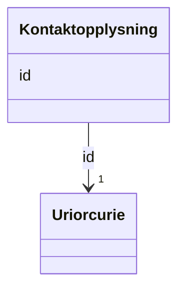

# Class: Kontaktopplysning 


_Kontaktinformasjon (vcard:Organization)._


URI: [vcard:Organization](http://www.w3.org/2006/vcard/ns#Organization)





<!-- no inheritance hierarchy -->

## Class Properties

| Property | Value |
| --- | --- |
| Class URI | [vcard:Organization](http://www.w3.org/2006/vcard/ns#Organization) |


## Eigenskapar


  
  


  
  


  
  


  
  
  
  
    
  


### Andre

| Namn | Kardinalitet og domene | Beskriving |
| --- | --- | --- |
| [id](id.md) | 1 <br/> [xsd:anyURI](http://www.w3.org/2001/XMLSchema#anyURI) | URI-identifikator for ressursen |


## Usages

| used by | used in | type | used |
| ---  | --- | --- | --- |
| [Modelkatalog](modelkatalog.md) | [kontaktpunkt](kontaktpunkt.md) | range | [Kontaktopplysning](kontaktopplysning.md) |
| [Informasjonsmodell](informasjonsmodell.md) | [kontaktpunkt](kontaktpunkt.md) | range | [Kontaktopplysning](kontaktopplysning.md) |


## Identifier and Mapping Information


### Schema Source


* from schema: https://data.norge.no/linkml/modelldcat-ap-no


## Mappings

| Mapping Type | Mapped Value |
| ---  | ---  |
| self | vcard:Organization |
| native | https://data.norge.no/linkml/modelldcat-ap-no/Kontaktopplysning |


## LinkML Source

<!-- TODO: investigate https://stackoverflow.com/questions/37606292/how-to-create-tabbed-code-blocks-in-mkdocs-or-sphinx -->

### Direct

<details>
```yaml
name: Kontaktopplysning
description: Kontaktinformasjon (vcard:Organization).
from_schema: https://data.norge.no/linkml/modelldcat-ap-no
rank: 1000
slots:
- id
class_uri: vcard:Organization

```
</details>

### Induced

<details>
```yaml
name: Kontaktopplysning
description: Kontaktinformasjon (vcard:Organization).
from_schema: https://data.norge.no/linkml/modelldcat-ap-no
rank: 1000
attributes:
  id:
    name: id
    description: URI-identifikator for ressursen.
    from_schema: https://data.norge.no/linkml/common-ap-no
    identifier: true
    alias: id
    owner: Kontaktopplysning
    domain_of:
    - Mediatype
    - Konsept
    - Begrepssamling
    - KatalogisertRessurs
    - Aktor
    - Kontaktopplysning
    - Standard
    - Lisensdokument
    - Lokasjon
    - Tidsperiode
    - Dokument
    - Modelkatalog
    - Informasjonsmodell
    - Modellelement
    - Eigenskap
    - Merknad
    - Kodeelement
    range: uriorcurie
    required: true
class_uri: vcard:Organization

```
</details>