# Class: Modelkatalog 


_Ei kuratert samling av metadata om informasjonsmodellar (dcat:Catalog)._


URI: [dcat:Catalog](http://www.w3.org/ns/dcat#Catalog)

```mermaid
 classDiagram
    class Modelkatalog
    click Modelkatalog href "../Modelkatalog/"
      Modelkatalog : beskrivelse
        
          
    
        
        
        Modelkatalog --> "1..*" LangString : beskrivelse
        click LangString href "../LangString/"
    

        
      Modelkatalog : endringsdato
        
          
    
        
        
        Modelkatalog --> "0..1" Date : endringsdato
        click Date href "../http://www.w3.org/2001/XMLSchema#date/"
    

        
      Modelkatalog : er_del_av_katalog
        
          
    
        
        
        Modelkatalog --> "0..1" Modelkatalog : er_del_av_katalog
        click Modelkatalog href "../Modelkatalog/"
    

        
      Modelkatalog : har_del
        
          
    
        
        
        Modelkatalog --> "1..*" KatalogisertRessurs : har_del
        click KatalogisertRessurs href "../KatalogisertRessurs/"
    

        
      Modelkatalog : heimeside
        
          
    
        
        
        Modelkatalog --> "*" Uri : heimeside
        click Uri href "../http://www.w3.org/2001/XMLSchema#anyURI/"
    

        
      Modelkatalog : id
        
          
    
        
        
        Modelkatalog --> "1" Uriorcurie : id
        click Uriorcurie href "../http://www.w3.org/2001/XMLSchema#anyURI/"
    

        
      Modelkatalog : identifikator_literal
        
          
    
        
        
        Modelkatalog --> "1" String : identifikator_literal
        click String href "../http://www.w3.org/2001/XMLSchema#string/"
    

        
      Modelkatalog : kontaktpunkt
        
          
    
        
        
        Modelkatalog --> "1..*" Kontaktopplysning : kontaktpunkt
        click Kontaktopplysning href "../Kontaktopplysning/"
    

        
      Modelkatalog : lisens
        
          
    
        
        
        Modelkatalog --> "0..1" Lisensdokument : lisens
        click Lisensdokument href "../Lisensdokument/"
    

        
      Modelkatalog : modell
        
          
    
        
        
        Modelkatalog --> "*" Informasjonsmodell : modell
        click Informasjonsmodell href "../Informasjonsmodell/"
    

        
      Modelkatalog : spraak
        
          
    
        
        
        Modelkatalog --> "*" Spraak : spraak
        click Spraak href "../Spraak/"
    

        
      Modelkatalog : tema
        
          
    
        
        
        Modelkatalog --> "*" Konsept : tema
        click Konsept href "../Konsept/"
    

        
      Modelkatalog : temaer
        
          
    
        
        
        Modelkatalog --> "*" Begrepssamling : temaer
        click Begrepssamling href "../Begrepssamling/"
    

        
      Modelkatalog : tittel
        
          
    
        
        
        Modelkatalog --> "1..*" LangString : tittel
        click LangString href "../LangString/"
    

        
      Modelkatalog : utgivelsesdato
        
          
    
        
        
        Modelkatalog --> "0..1" Date : utgivelsesdato
        click Date href "../http://www.w3.org/2001/XMLSchema#date/"
    

        
      Modelkatalog : utgiver
        
          
    
        
        
        Modelkatalog --> "1" Aktor : utgiver
        click Aktor href "../Aktor/"
    

        
      
```





<!-- no inheritance hierarchy -->

## Class Properties

| Property | Value |
| --- | --- |
| Class URI | [dcat:Catalog](http://www.w3.org/ns/dcat#Catalog) |


## Eigenskapar


  
  

  
  
    
  

  
  
    
  

  
  
    
  

  
  
    
  

  
  
    
  

  
  
    
  

  
  

  
  

  
  

  
  

  
  

  
  

  
  

  
  

  
  


### Obligatorisk

| Namn | Kardinalitet og domene | Beskriving |
| --- | --- | --- |
| [tittel](tittel.md) | 1..* <br/> [LangString](langstring.md) | Namn/tittel på ressursen (dct:title) |
| [beskrivelse](beskrivelse.md) | 1..* <br/> [LangString](langstring.md) | Fritekstbeskrivelse av ressursen (dct:description) |
| [har_del](har_del.md) | 1..* <br/> [KatalogisertRessurs](katalogisertressurs.md) | Del-ressurs inkludert i denne katalogen (dct:hasPart) |
| [identifikator_literal](identifikator_literal.md) | 1 <br/> [xsd:string](http://www.w3.org/2001/XMLSchema#string) | Tekstleg identifikator for ressursen (dct:identifier) |
| [kontaktpunkt](kontaktpunkt.md) | 1..* <br/> [Kontaktopplysning](kontaktopplysning.md) | Kontaktinformasjon for ressursen (dcat:contactPoint) |
| [utgiver](utgiver.md) | 1 <br/> [Aktor](aktor.md) | Aktøren ansvarleg for å tilgjengeleggjere ressursen (dct:publisher) |


  
  

  
  

  
  

  
  

  
  

  
  

  
  

  
  
    
  

  
  
    
  

  
  
    
  

  
  
    
  

  
  
    
  

  
  
    
  

  
  

  
  
    
  

  
  


### Anbefalt

| Namn | Kardinalitet og domene | Beskriving |
| --- | --- | --- |
| [endringsdato](endringsdato.md) | 0..1 <br/> [xsd:date](http://www.w3.org/2001/XMLSchema#date) | Dato for siste endring av ressursen (dct:modified) |
| [heimeside](heimeside.md) | * <br/> [xsd:anyURI](http://www.w3.org/2001/XMLSchema#anyURI) | Heimeside for ressursen eller organisasjonen (foaf:homepage) |
| [lisens](lisens.md) | 0..1 <br/> [Lisensdokument](lisensdokument.md) | Lisens for bruk av ressursen (dct:license) |
| [modell](modell.md) | * <br/> [Informasjonsmodell](informasjonsmodell.md) | Informasjonsmodellar i modelkatalogen (modelldcatno:model) |
| [spraak](spraak.md) | * <br/> [Spraak](spraak.md) | Språk brukt i ressursen (dct:language) |
| [tema](tema.md) | * <br/> [Konsept](konsept.md) | Tema frå eit kontrollert vokabular (dcat:theme) |
| [utgivelsesdato](utgivelsesdato.md) | 0..1 <br/> [xsd:date](http://www.w3.org/2001/XMLSchema#date) | Dato ressursen vart første gong publisert (dct:issued) |


  
  

  
  

  
  

  
  

  
  

  
  

  
  

  
  

  
  

  
  

  
  

  
  

  
  

  
  
    
  

  
  

  
  
    
  


### Valgfri

| Namn | Kardinalitet og domene | Beskriving |
| --- | --- | --- |
| [temaer](temaer.md) | * <br/> [Begrepssamling](begrepssamling.md) | Temavokabular brukt i katalogen (dcat:themeTaxonomy) |
| [er_del_av_katalog](er_del_av_katalog.md) | 0..1 <br/> [Modelkatalog](modelkatalog.md) | Overordna modelkatalog (dct:isPartOf) |


  
  
  
  
    
  

  
  
  
    
      
    
      
    
      
    
  
  

  
  
  
    
      
    
      
    
      
    
  
  

  
  
  
    
      
    
      
    
      
    
  
  

  
  
  
    
      
    
      
    
      
    
  
  

  
  
  
    
      
    
      
    
      
    
  
  

  
  
  
    
      
    
      
    
      
    
  
  

  
  
  
    
      
    
      
    
      
    
  
  

  
  
  
    
      
    
      
    
      
    
  
  

  
  
  
    
      
    
      
    
      
    
  
  

  
  
  
    
      
    
      
    
      
    
  
  

  
  
  
    
      
    
      
    
      
    
  
  

  
  
  
    
      
    
      
    
      
    
  
  

  
  
  
    
      
    
      
    
      
    
  
  

  
  
  
    
      
    
      
    
      
    
  
  

  
  
  
    
      
    
      
    
      
    
  
  


### Andre

| Namn | Kardinalitet og domene | Beskriving |
| --- | --- | --- |
| [id](id.md) | 1 <br/> [xsd:anyURI](http://www.w3.org/2001/XMLSchema#anyURI) | URI-identifikator for ressursen |


## Usages

| used by | used in | type | used |
| ---  | --- | --- | --- |
| [Modelkatalog](modelkatalog.md) | [er_del_av_katalog](er_del_av_katalog.md) | range | [Modelkatalog](modelkatalog.md) |


## Identifier and Mapping Information


### Schema Source


* from schema: https://data.norge.no/linkml/modelldcat-ap-no


## Mappings

| Mapping Type | Mapped Value |
| ---  | ---  |
| self | dcat:Catalog |
| native | https://data.norge.no/linkml/modelldcat-ap-no/Modelkatalog |


## LinkML Source

<!-- TODO: investigate https://stackoverflow.com/questions/37606292/how-to-create-tabbed-code-blocks-in-mkdocs-or-sphinx -->

### Direct

<details>
```yaml
name: Modelkatalog
description: Ei kuratert samling av metadata om informasjonsmodellar (dcat:Catalog).
from_schema: https://data.norge.no/linkml/modelldcat-ap-no
rank: 1000
slots:
- id
- tittel
- beskrivelse
- har_del
- identifikator_literal
- kontaktpunkt
- utgiver
- endringsdato
- heimeside
- lisens
- modell
- spraak
- tema
- temaer
- utgivelsesdato
- er_del_av_katalog
slot_usage:
  tittel:
    name: tittel
    in_subset:
    - Obligatorisk
    required: true
  beskrivelse:
    name: beskrivelse
    in_subset:
    - Obligatorisk
    required: true
  har_del:
    name: har_del
    in_subset:
    - Obligatorisk
    required: true
  identifikator_literal:
    name: identifikator_literal
    in_subset:
    - Obligatorisk
    required: true
  kontaktpunkt:
    name: kontaktpunkt
    in_subset:
    - Obligatorisk
    required: true
  utgiver:
    name: utgiver
    in_subset:
    - Obligatorisk
    required: true
  endringsdato:
    name: endringsdato
    in_subset:
    - Anbefalt
  heimeside:
    name: heimeside
    in_subset:
    - Anbefalt
  lisens:
    name: lisens
    in_subset:
    - Anbefalt
  modell:
    name: modell
    in_subset:
    - Anbefalt
  spraak:
    name: spraak
    in_subset:
    - Anbefalt
  tema:
    name: tema
    in_subset:
    - Anbefalt
  utgivelsesdato:
    name: utgivelsesdato
    in_subset:
    - Anbefalt
  temaer:
    name: temaer
    in_subset:
    - Valgfri
  er_del_av_katalog:
    name: er_del_av_katalog
    in_subset:
    - Valgfri
class_uri: dcat:Catalog

```
</details>

### Induced

<details>
```yaml
name: Modelkatalog
description: Ei kuratert samling av metadata om informasjonsmodellar (dcat:Catalog).
from_schema: https://data.norge.no/linkml/modelldcat-ap-no
rank: 1000
slot_usage:
  tittel:
    name: tittel
    in_subset:
    - Obligatorisk
    required: true
  beskrivelse:
    name: beskrivelse
    in_subset:
    - Obligatorisk
    required: true
  har_del:
    name: har_del
    in_subset:
    - Obligatorisk
    required: true
  identifikator_literal:
    name: identifikator_literal
    in_subset:
    - Obligatorisk
    required: true
  kontaktpunkt:
    name: kontaktpunkt
    in_subset:
    - Obligatorisk
    required: true
  utgiver:
    name: utgiver
    in_subset:
    - Obligatorisk
    required: true
  endringsdato:
    name: endringsdato
    in_subset:
    - Anbefalt
  heimeside:
    name: heimeside
    in_subset:
    - Anbefalt
  lisens:
    name: lisens
    in_subset:
    - Anbefalt
  modell:
    name: modell
    in_subset:
    - Anbefalt
  spraak:
    name: spraak
    in_subset:
    - Anbefalt
  tema:
    name: tema
    in_subset:
    - Anbefalt
  utgivelsesdato:
    name: utgivelsesdato
    in_subset:
    - Anbefalt
  temaer:
    name: temaer
    in_subset:
    - Valgfri
  er_del_av_katalog:
    name: er_del_av_katalog
    in_subset:
    - Valgfri
attributes:
  id:
    name: id
    description: URI-identifikator for ressursen.
    from_schema: https://data.norge.no/linkml/common-ap-no
    identifier: true
    alias: id
    owner: Modelkatalog
    domain_of:
    - Mediatype
    - Konsept
    - Begrepssamling
    - KatalogisertRessurs
    - Aktor
    - Kontaktopplysning
    - Standard
    - Lisensdokument
    - Lokasjon
    - Tidsperiode
    - Dokument
    - Modelkatalog
    - Informasjonsmodell
    - Modellelement
    - Eigenskap
    - Merknad
    - Kodeelement
    range: uriorcurie
    required: true
  tittel:
    name: tittel
    description: Namn/tittel på ressursen (dct:title).
    in_subset:
    - Obligatorisk
    from_schema: https://data.norge.no/linkml/common-ap-no
    slot_uri: dct:title
    alias: tittel
    owner: Modelkatalog
    domain_of:
    - Standard
    - Dokument
    - Modelkatalog
    - Informasjonsmodell
    - Modellelement
    - Eigenskap
    - Merknad
    range: LangString
    required: true
    multivalued: true
  beskrivelse:
    name: beskrivelse
    description: Fritekstbeskrivelse av ressursen (dct:description).
    in_subset:
    - Obligatorisk
    from_schema: https://data.norge.no/linkml/common-ap-no
    slot_uri: dct:description
    alias: beskrivelse
    owner: Modelkatalog
    domain_of:
    - Modelkatalog
    - Informasjonsmodell
    - Modellelement
    - Eigenskap
    range: LangString
    required: true
    multivalued: true
  har_del:
    name: har_del
    description: Del-ressurs inkludert i denne katalogen (dct:hasPart).
    in_subset:
    - Obligatorisk
    from_schema: https://data.norge.no/linkml/modelldcat-ap-no
    rank: 1000
    slot_uri: dct:hasPart
    alias: har_del
    owner: Modelkatalog
    domain_of:
    - Modelkatalog
    range: KatalogisertRessurs
    required: true
    multivalued: true
  identifikator_literal:
    name: identifikator_literal
    description: Tekstleg identifikator for ressursen (dct:identifier).
    in_subset:
    - Obligatorisk
    from_schema: https://data.norge.no/linkml/common-ap-no
    slot_uri: dct:identifier
    alias: identifikator_literal
    owner: Modelkatalog
    domain_of:
    - Aktor
    - Modelkatalog
    - Informasjonsmodell
    - Modellelement
    - Eigenskap
    - Merknad
    - Kodeelement
    range: string
    required: true
  kontaktpunkt:
    name: kontaktpunkt
    description: Kontaktinformasjon for ressursen (dcat:contactPoint).
    in_subset:
    - Obligatorisk
    from_schema: https://data.norge.no/linkml/modelldcat-ap-no
    rank: 1000
    slot_uri: dcat:contactPoint
    alias: kontaktpunkt
    owner: Modelkatalog
    domain_of:
    - Modelkatalog
    - Informasjonsmodell
    range: Kontaktopplysning
    required: true
    multivalued: true
  utgiver:
    name: utgiver
    description: Aktøren ansvarleg for å tilgjengeleggjere ressursen (dct:publisher).
    in_subset:
    - Obligatorisk
    from_schema: https://data.norge.no/linkml/modelldcat-ap-no
    rank: 1000
    slot_uri: dct:publisher
    alias: utgiver
    owner: Modelkatalog
    domain_of:
    - Modelkatalog
    - Informasjonsmodell
    range: Aktor
    required: true
  endringsdato:
    name: endringsdato
    description: Dato for siste endring av ressursen (dct:modified).
    in_subset:
    - Anbefalt
    from_schema: https://data.norge.no/linkml/common-ap-no
    slot_uri: dct:modified
    alias: endringsdato
    owner: Modelkatalog
    domain_of:
    - Modelkatalog
    - Informasjonsmodell
    range: date
  heimeside:
    name: heimeside
    description: Heimeside for ressursen eller organisasjonen (foaf:homepage).
    in_subset:
    - Anbefalt
    from_schema: https://data.norge.no/linkml/common-ap-no
    slot_uri: foaf:homepage
    alias: heimeside
    owner: Modelkatalog
    domain_of:
    - Modelkatalog
    - Informasjonsmodell
    range: uri
    multivalued: true
  lisens:
    name: lisens
    description: Lisens for bruk av ressursen (dct:license).
    in_subset:
    - Anbefalt
    from_schema: https://data.norge.no/linkml/modelldcat-ap-no
    rank: 1000
    slot_uri: dct:license
    alias: lisens
    owner: Modelkatalog
    domain_of:
    - Modelkatalog
    - Informasjonsmodell
    range: Lisensdokument
  modell:
    name: modell
    description: Informasjonsmodellar i modelkatalogen (modelldcatno:model).
    in_subset:
    - Anbefalt
    from_schema: https://data.norge.no/linkml/modelldcat-ap-no
    rank: 1000
    slot_uri: modelldcatno:model
    alias: modell
    owner: Modelkatalog
    domain_of:
    - Modelkatalog
    range: Informasjonsmodell
    multivalued: true
  spraak:
    name: spraak
    description: Språk brukt i ressursen (dct:language).
    in_subset:
    - Anbefalt
    from_schema: https://data.norge.no/linkml/common-ap-no
    slot_uri: dct:language
    alias: spraak
    owner: Modelkatalog
    domain_of:
    - Dokument
    - Modelkatalog
    - Informasjonsmodell
    range: Spraak
    multivalued: true
  tema:
    name: tema
    description: Tema frå eit kontrollert vokabular (dcat:theme).
    in_subset:
    - Anbefalt
    from_schema: https://data.norge.no/linkml/modelldcat-ap-no
    rank: 1000
    slot_uri: dcat:theme
    alias: tema
    owner: Modelkatalog
    domain_of:
    - Modelkatalog
    - Informasjonsmodell
    range: Konsept
    multivalued: true
  temaer:
    name: temaer
    description: Temavokabular brukt i katalogen (dcat:themeTaxonomy).
    in_subset:
    - Valgfri
    from_schema: https://data.norge.no/linkml/modelldcat-ap-no
    rank: 1000
    slot_uri: dcat:themeTaxonomy
    alias: temaer
    owner: Modelkatalog
    domain_of:
    - Modelkatalog
    range: Begrepssamling
    multivalued: true
  utgivelsesdato:
    name: utgivelsesdato
    description: Dato ressursen vart første gong publisert (dct:issued).
    in_subset:
    - Anbefalt
    from_schema: https://data.norge.no/linkml/common-ap-no
    slot_uri: dct:issued
    alias: utgivelsesdato
    owner: Modelkatalog
    domain_of:
    - Modelkatalog
    - Informasjonsmodell
    range: date
  er_del_av_katalog:
    name: er_del_av_katalog
    description: Overordna modelkatalog (dct:isPartOf).
    in_subset:
    - Valgfri
    from_schema: https://data.norge.no/linkml/modelldcat-ap-no
    rank: 1000
    slot_uri: dct:isPartOf
    alias: er_del_av_katalog
    owner: Modelkatalog
    domain_of:
    - Modelkatalog
    range: Modelkatalog
class_uri: dcat:Catalog

```
</details>