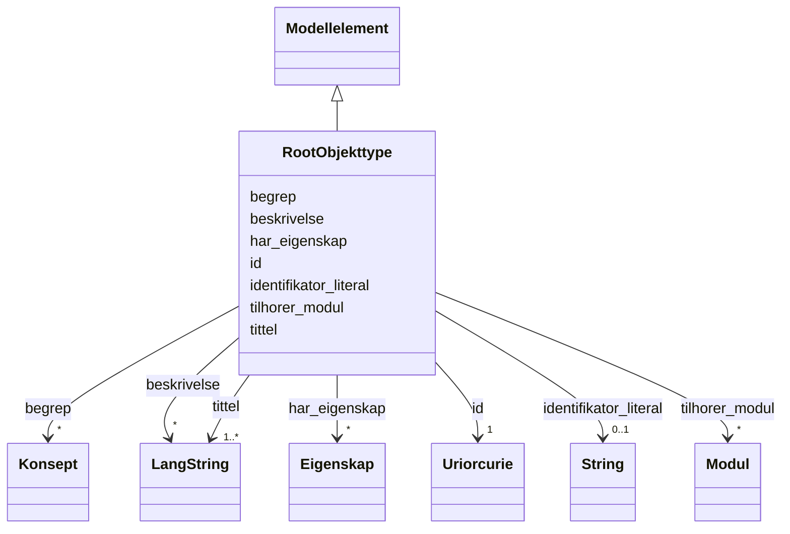

# Class: RootObjekttype 


_Ein rotobjekttype — toppnivå-klasse i informasjonsmodellen._


URI: [modelldcatno:RootObjectType](https://data.norge.no/vocabulary/modelldcatno#RootObjectType)





## Inheritance
* [Modellelement](modellelement.md)
    * **RootObjekttype**


## Class Properties

| Property | Value |
| --- | --- |
| Class URI | [modelldcatno:RootObjectType](https://data.norge.no/vocabulary/modelldcatno#RootObjectType) |


## Eigenskapar


### Arva

| Namn | Kardinalitet og domene | Beskriving | Frå |
| --- | --- | --- | --- || [id](id.md) | 1 <br/> [xsd:anyURI](http://www.w3.org/2001/XMLSchema#anyURI) | URI-identifikator for ressursen | [Modellelement](modellelement.md) |
| [tittel](tittel.md) | 1..* <br/> [LangString](langstring.md) | Namn/tittel på ressursen (dct:title) | [Modellelement](modellelement.md) |
| [begrep](begrep.md) | * <br/> [Konsept](konsept.md) | Fagomgrep ressursen handlar om (dct:subject) | [Modellelement](modellelement.md) |
| [identifikator_literal](identifikator_literal.md) | 0..1 <br/> [xsd:string](http://www.w3.org/2001/XMLSchema#string) | Tekstleg identifikator for ressursen (dct:identifier) | [Modellelement](modellelement.md) |
| [har_eigenskap](har_eigenskap.md) | * <br/> [Eigenskap](eigenskap.md) | Eigenskapar modellelementet har (modelldcatno:hasProperty) | [Modellelement](modellelement.md) |
| [beskrivelse](beskrivelse.md) | * <br/> [LangString](langstring.md) | Fritekstbeskrivelse av ressursen (dct:description) | [Modellelement](modellelement.md) |
| [tilhorer_modul](tilhorer_modul.md) | * <br/> [Modul](modul.md) | Modul dette elementet tilhøyrer (modelldcatno:belongsToModule) | [Modellelement](modellelement.md) |


## Identifier and Mapping Information


### Schema Source


* from schema: https://data.norge.no/linkml/modelldcat-ap-no


## Mappings

| Mapping Type | Mapped Value |
| ---  | ---  |
| self | modelldcatno:RootObjectType |
| native | https://data.norge.no/linkml/modelldcat-ap-no/RootObjekttype |


## LinkML Source

<!-- TODO: investigate https://stackoverflow.com/questions/37606292/how-to-create-tabbed-code-blocks-in-mkdocs-or-sphinx -->

### Direct

<details>
```yaml
name: RootObjekttype
description: Ein rotobjekttype — toppnivå-klasse i informasjonsmodellen.
from_schema: https://data.norge.no/linkml/modelldcat-ap-no
rank: 1000
is_a: Modellelement
class_uri: modelldcatno:RootObjectType

```
</details>

### Induced

<details>
```yaml
name: RootObjekttype
description: Ein rotobjekttype — toppnivå-klasse i informasjonsmodellen.
from_schema: https://data.norge.no/linkml/modelldcat-ap-no
rank: 1000
is_a: Modellelement
attributes:
  id:
    name: id
    description: URI-identifikator for ressursen.
    from_schema: https://data.norge.no/linkml/common-ap-no
    identifier: true
    alias: id
    owner: RootObjekttype
    domain_of:
    - Mediatype
    - Konsept
    - Begrepssamling
    - KatalogisertRessurs
    - Aktor
    - Kontaktopplysning
    - Standard
    - Lisensdokument
    - Lokasjon
    - Tidsperiode
    - Dokument
    - Modelkatalog
    - Informasjonsmodell
    - Modellelement
    - Eigenskap
    - Merknad
    - Kodeelement
    range: uriorcurie
    required: true
  tittel:
    name: tittel
    description: Namn/tittel på ressursen (dct:title).
    in_subset:
    - Obligatorisk
    from_schema: https://data.norge.no/linkml/common-ap-no
    slot_uri: dct:title
    alias: tittel
    owner: RootObjekttype
    domain_of:
    - Standard
    - Dokument
    - Modelkatalog
    - Informasjonsmodell
    - Modellelement
    - Eigenskap
    - Merknad
    range: LangString
    required: true
    multivalued: true
  begrep:
    name: begrep
    description: Fagomgrep ressursen handlar om (dct:subject).
    in_subset:
    - Anbefalt
    from_schema: https://data.norge.no/linkml/modelldcat-ap-no
    rank: 1000
    slot_uri: dct:subject
    alias: begrep
    owner: RootObjekttype
    domain_of:
    - Informasjonsmodell
    - Modellelement
    - Eigenskap
    - Kodeelement
    range: Konsept
    multivalued: true
  identifikator_literal:
    name: identifikator_literal
    description: Tekstleg identifikator for ressursen (dct:identifier).
    in_subset:
    - Anbefalt
    from_schema: https://data.norge.no/linkml/common-ap-no
    slot_uri: dct:identifier
    alias: identifikator_literal
    owner: RootObjekttype
    domain_of:
    - Aktor
    - Modelkatalog
    - Informasjonsmodell
    - Modellelement
    - Eigenskap
    - Merknad
    - Kodeelement
    range: string
  har_eigenskap:
    name: har_eigenskap
    description: Eigenskapar modellelementet har (modelldcatno:hasProperty).
    in_subset:
    - Anbefalt
    from_schema: https://data.norge.no/linkml/modelldcat-ap-no
    rank: 1000
    slot_uri: modelldcatno:hasProperty
    alias: har_eigenskap
    owner: RootObjekttype
    domain_of:
    - Modellelement
    range: Eigenskap
    multivalued: true
  beskrivelse:
    name: beskrivelse
    description: Fritekstbeskrivelse av ressursen (dct:description).
    in_subset:
    - Valgfri
    from_schema: https://data.norge.no/linkml/common-ap-no
    slot_uri: dct:description
    alias: beskrivelse
    owner: RootObjekttype
    domain_of:
    - Modelkatalog
    - Informasjonsmodell
    - Modellelement
    - Eigenskap
    range: LangString
    multivalued: true
  tilhorer_modul:
    name: tilhorer_modul
    description: Modul dette elementet tilhøyrer (modelldcatno:belongsToModule).
    in_subset:
    - Valgfri
    from_schema: https://data.norge.no/linkml/modelldcat-ap-no
    rank: 1000
    slot_uri: modelldcatno:belongsToModule
    alias: tilhorer_modul
    owner: RootObjekttype
    domain_of:
    - Modellelement
    - Eigenskap
    - Merknad
    range: Modul
    multivalued: true
class_uri: modelldcatno:RootObjectType

```
</details>