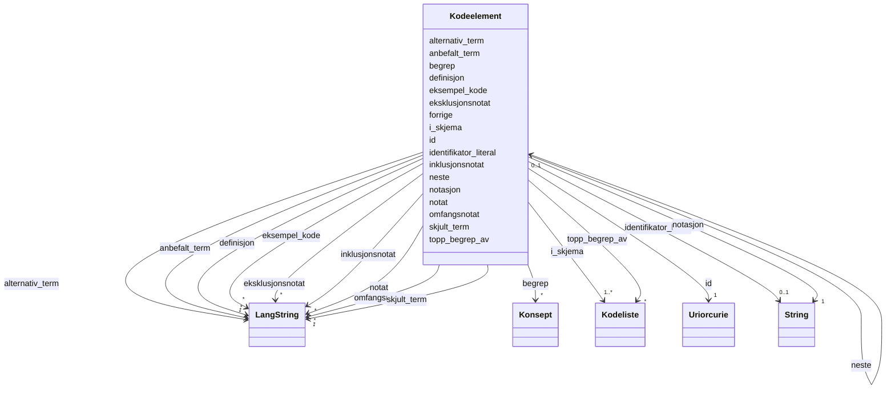

# Class: Kodeelement 


_Eit element i ei kodeliste (modelldcatno:CodeElement)._


URI: [modelldcatno:CodeElement](https://data.norge.no/vocabulary/modelldcatno#CodeElement)





<!-- no inheritance hierarchy -->

## Class Properties

| Property | Value |
| --- | --- |
| Class URI | [modelldcatno:CodeElement](https://data.norge.no/vocabulary/modelldcatno#CodeElement) |


## Eigenskapar


  
  

  
  
    
  

  
  
    
  

  
  

  
  

  
  

  
  

  
  

  
  

  
  

  
  

  
  

  
  

  
  

  
  

  
  

  
  


### Obligatorisk

| Namn | Kardinalitet og domene | Beskriving |
| --- | --- | --- |
| [i_skjema](i_skjema.md) | 1..* <br/> [Kodeliste](kodeliste.md) | Kodeliste dette kodeelementet tilhøyrer (skos:inScheme) |
| [notasjon](notasjon.md) | 1 <br/> [xsd:string](http://www.w3.org/2001/XMLSchema#string) | Kode/notasjon for kodeelementet (skos:notation) |


  
  

  
  

  
  

  
  
    
  

  
  
    
  

  
  
    
  

  
  
    
  

  
  

  
  

  
  

  
  

  
  

  
  

  
  

  
  

  
  

  
  


### Anbefalt

| Namn | Kardinalitet og domene | Beskriving |
| --- | --- | --- |
| [anbefalt_term](anbefalt_term.md) | * <br/> [LangString](langstring.md) | Føretrukke term/namn for ressursen (skos:prefLabel) |
| [begrep](begrep.md) | * <br/> [Konsept](konsept.md) | Fagomgrep ressursen handlar om (dct:subject) |
| [identifikator_literal](identifikator_literal.md) | 0..1 <br/> [xsd:string](http://www.w3.org/2001/XMLSchema#string) | Tekstleg identifikator for ressursen (dct:identifier) |
| [topp_begrep_av](topp_begrep_av.md) | * <br/> [Kodeliste](kodeliste.md) | Kodeliste dette kodeelementet er eit toppomgrep av (skos:topConceptOf) |


  
  

  
  

  
  

  
  

  
  

  
  

  
  

  
  

  
  

  
  

  
  

  
  

  
  

  
  

  
  

  
  

  
  


  
  
  
  
    
  

  
  
  
    
      
    
      
    
      
    
  
  

  
  
  
    
      
    
      
    
      
    
  
  

  
  
  
    
      
    
      
    
      
    
  
  

  
  
  
    
      
    
      
    
      
    
  
  

  
  
  
    
      
    
      
    
      
    
  
  

  
  
  
    
      
    
      
    
      
    
  
  

  
  
  
  
    
  

  
  
  
  
    
  

  
  
  
  
    
  

  
  
  
  
    
  

  
  
  
  
    
  

  
  
  
  
    
  

  
  
  
  
    
  

  
  
  
  
    
  

  
  
  
  
    
  

  
  
  
  
    
  


### Andre

| Namn | Kardinalitet og domene | Beskriving |
| --- | --- | --- |
| [id](id.md) | 1 <br/> [xsd:anyURI](http://www.w3.org/2001/XMLSchema#anyURI) | URI-identifikator for ressursen |
| [definisjon](definisjon.md) | * <br/> [LangString](langstring.md) | Definisjon av kodeelementet (skos:definition) |
| [eksempel_kode](eksempel_kode.md) | * <br/> [LangString](langstring.md) | Eksempel på bruk av kodeelementet (skos:example) |
| [eksklusjonsnotat](eksklusjonsnotat.md) | * <br/> [LangString](langstring.md) | Notat om kva som er ekskludert frå kodeelementet (xkos:exclusionNote) |
| [forrige](forrige.md) | 0..1 <br/> [Kodeelement](kodeelement.md) | Førre kodeelement i ein ordna kodeliste (xkos:previous) |
| [skjult_term](skjult_term.md) | * <br/> [LangString](langstring.md) | Skjult term for kodeelementet (skos:hiddenLabel) |
| [inklusjonsnotat](inklusjonsnotat.md) | * <br/> [LangString](langstring.md) | Notat om kva som er inkludert i kodeelementet (xkos:inclusionNote) |
| [notat](notat.md) | * <br/> [LangString](langstring.md) | Generelt notat om kodeelementet (skos:note) |
| [neste](neste.md) | 0..1 <br/> [Kodeelement](kodeelement.md) | Neste kodeelement i ein ordna kodeliste (xkos:next) |
| [omfangsnotat](omfangsnotat.md) | * <br/> [LangString](langstring.md) | Notat om omfanget til kodeelementet (skos:scopeNote) |
| [alternativ_term](alternativ_term.md) | * <br/> [LangString](langstring.md) | Alternativ term for kodeelementet (skos:altLabel) |


## Usages

| used by | used in | type | used |
| ---  | --- | --- | --- |
| [Kodeelement](kodeelement.md) | [forrige](forrige.md) | range | [Kodeelement](kodeelement.md) |
| [Kodeelement](kodeelement.md) | [neste](neste.md) | range | [Kodeelement](kodeelement.md) |


## Identifier and Mapping Information


### Schema Source


* from schema: https://data.norge.no/ap-no/modelldcat-ap-no


## Mappings

| Mapping Type | Mapped Value |
| ---  | ---  |
| self | modelldcatno:CodeElement |
| native | https://data.norge.no/ap-no/modelldcat-ap-no/Kodeelement |


## LinkML Source

<!-- TODO: investigate https://stackoverflow.com/questions/37606292/how-to-create-tabbed-code-blocks-in-mkdocs-or-sphinx -->

### Direct

<details>
```yaml
name: Kodeelement
description: Eit element i ei kodeliste (modelldcatno:CodeElement).
from_schema: https://data.norge.no/ap-no/modelldcat-ap-no
rank: 1000
slots:
- id
- i_skjema
- notasjon
- anbefalt_term
- begrep
- identifikator_literal
- topp_begrep_av
- definisjon
- eksempel_kode
- eksklusjonsnotat
- forrige
- skjult_term
- inklusjonsnotat
- notat
- neste
- omfangsnotat
- alternativ_term
slot_usage:
  i_skjema:
    name: i_skjema
    in_subset:
    - Obligatorisk
    required: true
  notasjon:
    name: notasjon
    in_subset:
    - Obligatorisk
    required: true
  anbefalt_term:
    name: anbefalt_term
    in_subset:
    - Anbefalt
  begrep:
    name: begrep
    in_subset:
    - Anbefalt
  identifikator_literal:
    name: identifikator_literal
    in_subset:
    - Anbefalt
  topp_begrep_av:
    name: topp_begrep_av
    in_subset:
    - Anbefalt
class_uri: modelldcatno:CodeElement

```
</details>

### Induced

<details>
```yaml
name: Kodeelement
description: Eit element i ei kodeliste (modelldcatno:CodeElement).
from_schema: https://data.norge.no/ap-no/modelldcat-ap-no
rank: 1000
slot_usage:
  i_skjema:
    name: i_skjema
    in_subset:
    - Obligatorisk
    required: true
  notasjon:
    name: notasjon
    in_subset:
    - Obligatorisk
    required: true
  anbefalt_term:
    name: anbefalt_term
    in_subset:
    - Anbefalt
  begrep:
    name: begrep
    in_subset:
    - Anbefalt
  identifikator_literal:
    name: identifikator_literal
    in_subset:
    - Anbefalt
  topp_begrep_av:
    name: topp_begrep_av
    in_subset:
    - Anbefalt
attributes:
  id:
    name: id
    description: URI-identifikator for ressursen.
    from_schema: https://data.norge.no/ap-no/common-ap-no
    identifier: true
    owner: Kodeelement
    domain_of:
    - Mediatype
    - Konsept
    - Begrepssamling
    - KatalogisertRessurs
    - Aktor
    - Kontaktopplysning
    - Standard
    - Lisensdokument
    - Lokasjon
    - Tidsperiode
    - Dokument
    - Modellkatalog
    - Informasjonsmodell
    - Modellelement
    - Eigenskap
    - Merknad
    - Kodeelement
    range: uriorcurie
    required: true
  i_skjema:
    name: i_skjema
    description: Kodeliste dette kodeelementet tilhøyrer (skos:inScheme).
    in_subset:
    - Obligatorisk
    from_schema: https://data.norge.no/ap-no/modelldcat-ap-no
    rank: 1000
    slot_uri: skos:inScheme
    owner: Kodeelement
    domain_of:
    - Kodeelement
    range: Kodeliste
    required: true
    multivalued: true
  notasjon:
    name: notasjon
    description: Kode/notasjon for kodeelementet (skos:notation).
    in_subset:
    - Obligatorisk
    from_schema: https://data.norge.no/ap-no/modelldcat-ap-no
    rank: 1000
    slot_uri: skos:notation
    owner: Kodeelement
    domain_of:
    - Kodeelement
    range: string
    required: true
  anbefalt_term:
    name: anbefalt_term
    description: Føretrukke term/namn for ressursen (skos:prefLabel).
    in_subset:
    - Anbefalt
    from_schema: https://data.norge.no/ap-no/common-ap-no
    slot_uri: skos:prefLabel
    owner: Kodeelement
    domain_of:
    - Kodeelement
    range: LangString
    multivalued: true
  begrep:
    name: begrep
    description: Fagomgrep ressursen handlar om (dct:subject).
    in_subset:
    - Anbefalt
    from_schema: https://data.norge.no/ap-no/modelldcat-ap-no
    rank: 1000
    slot_uri: dct:subject
    owner: Kodeelement
    domain_of:
    - Informasjonsmodell
    - Modellelement
    - Eigenskap
    - Kodeelement
    range: Konsept
    multivalued: true
  identifikator_literal:
    name: identifikator_literal
    description: Tekstleg identifikator for ressursen (dct:identifier).
    in_subset:
    - Anbefalt
    from_schema: https://data.norge.no/ap-no/common-ap-no
    slot_uri: dct:identifier
    owner: Kodeelement
    domain_of:
    - Aktor
    - Modellkatalog
    - Informasjonsmodell
    - Modellelement
    - Eigenskap
    - Merknad
    - Kodeelement
    range: string
  topp_begrep_av:
    name: topp_begrep_av
    description: Kodeliste dette kodeelementet er eit toppomgrep av (skos:topConceptOf).
    in_subset:
    - Anbefalt
    from_schema: https://data.norge.no/ap-no/modelldcat-ap-no
    rank: 1000
    slot_uri: skos:topConceptOf
    owner: Kodeelement
    domain_of:
    - Kodeelement
    range: Kodeliste
    multivalued: true
  definisjon:
    name: definisjon
    description: Definisjon av kodeelementet (skos:definition).
    from_schema: https://data.norge.no/ap-no/modelldcat-ap-no
    rank: 1000
    slot_uri: skos:definition
    owner: Kodeelement
    domain_of:
    - Kodeelement
    range: LangString
    multivalued: true
  eksempel_kode:
    name: eksempel_kode
    description: Eksempel på bruk av kodeelementet (skos:example).
    from_schema: https://data.norge.no/ap-no/modelldcat-ap-no
    rank: 1000
    slot_uri: skos:example
    owner: Kodeelement
    domain_of:
    - Kodeelement
    range: LangString
    multivalued: true
  eksklusjonsnotat:
    name: eksklusjonsnotat
    description: Notat om kva som er ekskludert frå kodeelementet (xkos:exclusionNote).
    from_schema: https://data.norge.no/ap-no/modelldcat-ap-no
    rank: 1000
    slot_uri: xkos:exclusionNote
    owner: Kodeelement
    domain_of:
    - Kodeelement
    range: LangString
    multivalued: true
  forrige:
    name: forrige
    description: Førre kodeelement i ein ordna kodeliste (xkos:previous).
    from_schema: https://data.norge.no/ap-no/modelldcat-ap-no
    rank: 1000
    slot_uri: xkos:previous
    owner: Kodeelement
    domain_of:
    - Kodeelement
    range: Kodeelement
  skjult_term:
    name: skjult_term
    description: Skjult term for kodeelementet (skos:hiddenLabel).
    from_schema: https://data.norge.no/ap-no/modelldcat-ap-no
    rank: 1000
    slot_uri: skos:hiddenLabel
    owner: Kodeelement
    domain_of:
    - Kodeelement
    range: LangString
    multivalued: true
  inklusjonsnotat:
    name: inklusjonsnotat
    description: Notat om kva som er inkludert i kodeelementet (xkos:inclusionNote).
    from_schema: https://data.norge.no/ap-no/modelldcat-ap-no
    rank: 1000
    slot_uri: xkos:inclusionNote
    owner: Kodeelement
    domain_of:
    - Kodeelement
    range: LangString
    multivalued: true
  notat:
    name: notat
    description: Generelt notat om kodeelementet (skos:note).
    from_schema: https://data.norge.no/ap-no/modelldcat-ap-no
    rank: 1000
    slot_uri: skos:note
    owner: Kodeelement
    domain_of:
    - Kodeelement
    range: LangString
    multivalued: true
  neste:
    name: neste
    description: Neste kodeelement i ein ordna kodeliste (xkos:next).
    from_schema: https://data.norge.no/ap-no/modelldcat-ap-no
    rank: 1000
    slot_uri: xkos:next
    owner: Kodeelement
    domain_of:
    - Kodeelement
    range: Kodeelement
  omfangsnotat:
    name: omfangsnotat
    description: Notat om omfanget til kodeelementet (skos:scopeNote).
    from_schema: https://data.norge.no/ap-no/modelldcat-ap-no
    rank: 1000
    slot_uri: skos:scopeNote
    owner: Kodeelement
    domain_of:
    - Kodeelement
    range: LangString
    multivalued: true
  alternativ_term:
    name: alternativ_term
    description: Alternativ term for kodeelementet (skos:altLabel).
    from_schema: https://data.norge.no/ap-no/modelldcat-ap-no
    rank: 1000
    slot_uri: skos:altLabel
    owner: Kodeelement
    domain_of:
    - Kodeelement
    range: LangString
    multivalued: true
class_uri: modelldcatno:CodeElement

```
</details>