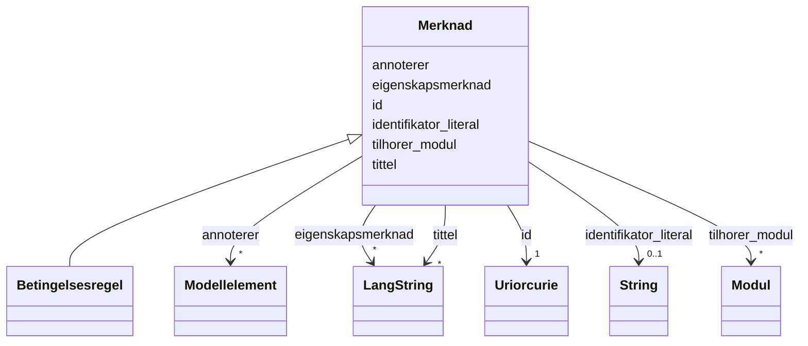

# Class: Merknad 


_Ei merknad knytt til eit modellelement eller eigenskap._


URI: [modelldcatno:Note](https://data.norge.no/vocabulary/modelldcatno#Note)





## Inheritance
* **Merknad**
    * [Betingelsesregel](betingelsesregel.md)


## Class Properties

| Property | Value |
| --- | --- |
| Class URI | [modelldcatno:Note](https://data.norge.no/vocabulary/modelldcatno#Note) |


## Eigenskapar


  
  

  
  

  
  

  
  

  
  

  
  


  
  

  
  
    
  

  
  
    
  

  
  
    
  

  
  
    
  

  
  


### Anbefalt

| Namn | Kardinalitet og domene | Beskriving |
| --- | --- | --- |
| [annoterer](annoterer.md) | * <br/> [Modellelement](modellelement.md) | Modellelement denne merknaden gjeld (modelldcatno:annotates) |
| [eigenskapsmerknad](eigenskapsmerknad.md) | * <br/> [LangString](langstring.md) | Fritekstmerknad om ein eigenskap (modelldcatno:propertyNote) |
| [identifikator_literal](identifikator_literal.md) | 0..1 <br/> [xsd:string](http://www.w3.org/2001/XMLSchema#string) | Tekstleg identifikator for ressursen (dct:identifier) |
| [tittel](tittel.md) | * <br/> [LangString](langstring.md) | Namn/tittel på ressursen (dct:title) |


  
  

  
  

  
  

  
  

  
  

  
  
    
  


### Valgfri

| Namn | Kardinalitet og domene | Beskriving |
| --- | --- | --- |
| [tilhorer_modul](tilhorer_modul.md) | * <br/> [Modul](modul.md) | Modul dette elementet tilhøyrer (modelldcatno:belongsToModule) |


  
  
  
  
    
  

  
  
  
    
      
    
      
    
      
    
  
  

  
  
  
    
      
    
      
    
      
    
  
  

  
  
  
    
      
    
      
    
      
    
  
  

  
  
  
    
      
    
      
    
      
    
  
  

  
  
  
    
      
    
      
    
      
    
  
  


### Andre

| Namn | Kardinalitet og domene | Beskriving |
| --- | --- | --- |
| [id](id.md) | 1 <br/> [xsd:anyURI](http://www.w3.org/2001/XMLSchema#anyURI) | URI-identifikator for ressursen |


## Identifier and Mapping Information


### Schema Source


* from schema: https://data.norge.no/ap-no/modelldcat-ap-no


## Mappings

| Mapping Type | Mapped Value |
| ---  | ---  |
| self | modelldcatno:Note |
| native | https://data.norge.no/ap-no/modelldcat-ap-no/Merknad |


## LinkML Source

<!-- TODO: investigate https://stackoverflow.com/questions/37606292/how-to-create-tabbed-code-blocks-in-mkdocs-or-sphinx -->

### Direct

<details>
```yaml
name: Merknad
description: Ei merknad knytt til eit modellelement eller eigenskap.
from_schema: https://data.norge.no/ap-no/modelldcat-ap-no
rank: 1000
slots:
- id
- annoterer
- eigenskapsmerknad
- identifikator_literal
- tittel
- tilhorer_modul
slot_usage:
  annoterer:
    name: annoterer
    in_subset:
    - Anbefalt
  eigenskapsmerknad:
    name: eigenskapsmerknad
    in_subset:
    - Anbefalt
  identifikator_literal:
    name: identifikator_literal
    in_subset:
    - Anbefalt
  tittel:
    name: tittel
    in_subset:
    - Anbefalt
  tilhorer_modul:
    name: tilhorer_modul
    in_subset:
    - Valgfri
class_uri: modelldcatno:Note

```
</details>

### Induced

<details>
```yaml
name: Merknad
description: Ei merknad knytt til eit modellelement eller eigenskap.
from_schema: https://data.norge.no/ap-no/modelldcat-ap-no
rank: 1000
slot_usage:
  annoterer:
    name: annoterer
    in_subset:
    - Anbefalt
  eigenskapsmerknad:
    name: eigenskapsmerknad
    in_subset:
    - Anbefalt
  identifikator_literal:
    name: identifikator_literal
    in_subset:
    - Anbefalt
  tittel:
    name: tittel
    in_subset:
    - Anbefalt
  tilhorer_modul:
    name: tilhorer_modul
    in_subset:
    - Valgfri
attributes:
  id:
    name: id
    description: URI-identifikator for ressursen.
    from_schema: https://data.norge.no/ap-no/common-ap-no
    identifier: true
    owner: Merknad
    domain_of:
    - Mediatype
    - Konsept
    - Begrepssamling
    - KatalogisertRessurs
    - Aktor
    - Kontaktopplysning
    - Standard
    - Lisensdokument
    - Lokasjon
    - Tidsperiode
    - Dokument
    - Modellkatalog
    - Informasjonsmodell
    - Modellelement
    - Eigenskap
    - Merknad
    - Kodeelement
    range: uriorcurie
    required: true
  annoterer:
    name: annoterer
    description: Modellelement denne merknaden gjeld (modelldcatno:annotates).
    in_subset:
    - Anbefalt
    from_schema: https://data.norge.no/ap-no/modelldcat-ap-no
    rank: 1000
    slot_uri: modelldcatno:annotates
    owner: Merknad
    domain_of:
    - Merknad
    range: Modellelement
    multivalued: true
  eigenskapsmerknad:
    name: eigenskapsmerknad
    description: Fritekstmerknad om ein eigenskap (modelldcatno:propertyNote).
    in_subset:
    - Anbefalt
    from_schema: https://data.norge.no/ap-no/modelldcat-ap-no
    rank: 1000
    slot_uri: modelldcatno:propertyNote
    owner: Merknad
    domain_of:
    - Merknad
    range: LangString
    multivalued: true
  identifikator_literal:
    name: identifikator_literal
    description: Tekstleg identifikator for ressursen (dct:identifier).
    in_subset:
    - Anbefalt
    from_schema: https://data.norge.no/ap-no/common-ap-no
    slot_uri: dct:identifier
    owner: Merknad
    domain_of:
    - Aktor
    - Modellkatalog
    - Informasjonsmodell
    - Modellelement
    - Eigenskap
    - Merknad
    - Kodeelement
    range: string
  tittel:
    name: tittel
    description: Namn/tittel på ressursen (dct:title).
    in_subset:
    - Anbefalt
    from_schema: https://data.norge.no/ap-no/common-ap-no
    slot_uri: dct:title
    owner: Merknad
    domain_of:
    - Standard
    - Dokument
    - Modellkatalog
    - Informasjonsmodell
    - Modellelement
    - Eigenskap
    - Merknad
    range: LangString
    multivalued: true
  tilhorer_modul:
    name: tilhorer_modul
    description: Modul dette elementet tilhøyrer (modelldcatno:belongsToModule).
    in_subset:
    - Valgfri
    from_schema: https://data.norge.no/ap-no/modelldcat-ap-no
    rank: 1000
    slot_uri: modelldcatno:belongsToModule
    owner: Merknad
    domain_of:
    - Modellelement
    - Eigenskap
    - Merknad
    range: Modul
    multivalued: true
class_uri: modelldcatno:Note

```
</details>