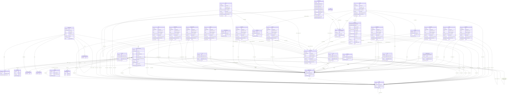

```mermaid
erDiagram
Abstraksjon {
    uriorcurie id  
    LangStringList beskrivelse  
    string identifikator_literal  
    string maks_multiplisitet  
    NonNegativeInteger min_multiplisitet  
    boolean navigerbar  
    LangStringList relasjonsegenskapetikett  
    NonNegativeInteger sekvensnummer  
    LangStringList tittel  
}
Aktor {
    uriorcurie id  
    string identifikator_literal  
    LangStringList namn_aktor  
}
AlleAv {
    uriorcurie id  
    LangStringList beskrivelse  
    string identifikator_literal  
    string maks_multiplisitet  
    NonNegativeInteger min_multiplisitet  
    boolean navigerbar  
    LangStringList relasjonsegenskapetikett  
    NonNegativeInteger sekvensnummer  
    LangStringList tittel  
}
Assosiasjon {
    uriorcurie id  
    LangStringList beskrivelse  
    string identifikator_literal  
    string maks_multiplisitet  
    NonNegativeInteger min_multiplisitet  
    boolean navigerbar  
    LangStringList relasjonsegenskapetikett  
    NonNegativeInteger sekvensnummer  
    LangStringList tittel  
}
Attributt {
    uriorcurie id  
    LangStringList beskrivelse  
    string identifikator_literal  
    string maks_multiplisitet  
    NonNegativeInteger min_multiplisitet  
    boolean navigerbar  
    LangStringList relasjonsegenskapetikett  
    NonNegativeInteger sekvensnummer  
    LangStringList tittel  
}
Avhengighet {
    uriorcurie id  
    LangStringList beskrivelse  
    string identifikator_literal  
    string maks_multiplisitet  
    NonNegativeInteger min_multiplisitet  
    boolean navigerbar  
    LangStringList relasjonsegenskapetikett  
    NonNegativeInteger sekvensnummer  
    LangStringList tittel  
}
Betingelsesregel {
    LangStringList betingelsesuttrykk  
    uriorcurie id  
    LangStringList eigenskapsmerknad  
    string identifikator_literal  
    LangStringList tittel  
}
Datatype {
    uriorcurie id  
    LangStringList beskrivelse  
    string identifikator_literal  
    LangStringList tittel  
}
Dokument {
    uriorcurie id  
    string format  
    SpraakList spraak  
    LangStringList tittel  
}
Eigenskap {
    uriorcurie id  
    LangStringList beskrivelse  
    string identifikator_literal  
    string maks_multiplisitet  
    NonNegativeInteger min_multiplisitet  
    boolean navigerbar  
    LangStringList relasjonsegenskapetikett  
    NonNegativeInteger sekvensnummer  
    LangStringList tittel  
}
Eller {
    uriorcurie id  
    LangStringList betingelsesuttrykk  
    LangStringList eigenskapsmerknad  
    string identifikator_literal  
    LangStringList tittel  
}
EnkelType {
    NonNegativeInteger fraksjonssifre  
    NonNegativeInteger lengde  
    string maks_eksklusiv  
    string maks_inklusiv  
    NonNegativeInteger maks_lengde  
    string min_eksklusiv  
    string min_inklusiv  
    NonNegativeInteger min_lengde  
    string monster  
    NonNegativeInteger totalt_sifre  
    uri typedefinisjon_referanse  
    uriorcurie id  
    LangStringList beskrivelse  
    string identifikator_literal  
    LangStringList tittel  
}
Ikke {
    uriorcurie id  
    LangStringList betingelsesuttrykk  
    LangStringList eigenskapsmerknad  
    string identifikator_literal  
    LangStringList tittel  
}
Informasjonsmodell {
    uriorcurie id  
    LangStringList beskrivelse  
    date endringsdato  
    string har_versjonsnummer  
    uriList heimeside  
    string identifikator_literal  
    string informasjonsmodellidentifikator  
    LangStringList nokkelord  
    SpraakList spraak  
    LangStringList tittel  
    date utgivelsesdato  
    LangStringList versjonsmerknad  
}
KatalogisertRessurs {
    uriorcurie id  
}
Kodeelement {
    uriorcurie id  
    LangStringList alternativ_term  
    LangStringList anbefalt_term  
    LangStringList definisjon  
    LangStringList eksempel_kode  
    LangStringList eksklusjonsnotat  
    string identifikator_literal  
    LangStringList inklusjonsnotat  
    string notasjon  
    LangStringList notat  
    LangStringList omfangsnotat  
    LangStringList skjult_term  
}
Kodeliste {
    uriList har_referanse  
    uriorcurie id  
    LangStringList beskrivelse  
    string identifikator_literal  
    LangStringList tittel  
}
Kontaktopplysning {
    uriorcurie id  
}
Lisensdokument {
    uriorcurie id  
}
Lokasjon {
    uriorcurie id  
}
Merknad {
    uriorcurie id  
    LangStringList eigenskapsmerknad  
    string identifikator_literal  
    LangStringList tittel  
}
Modellelement {
    uriorcurie id  
    LangStringList beskrivelse  
    string identifikator_literal  
    LangStringList tittel  
}
Modellkatalog {
    uriorcurie id  
    LangStringList beskrivelse  
    date endringsdato  
    uriList heimeside  
    string identifikator_literal  
    SpraakList spraak  
    LangStringList tittel  
    date utgivelsesdato  
}
Modul {
    uriorcurie id  
    LangStringList beskrivelse  
    string identifikator_literal  
    LangStringList tittel  
}
NoenAv {
    uriorcurie id  
    LangStringList beskrivelse  
    string identifikator_literal  
    string maks_multiplisitet  
    NonNegativeInteger min_multiplisitet  
    boolean navigerbar  
    LangStringList relasjonsegenskapetikett  
    NonNegativeInteger sekvensnummer  
    LangStringList tittel  
}
Objekttype {
    uriorcurie id  
    LangStringList beskrivelse  
    string identifikator_literal  
    LangStringList tittel  
}
Og {
    uriorcurie id  
    LangStringList betingelsesuttrykk  
    LangStringList eigenskapsmerknad  
    string identifikator_literal  
    LangStringList tittel  
}
Realisering {
    uriorcurie id  
    LangStringList beskrivelse  
    string identifikator_literal  
    string maks_multiplisitet  
    NonNegativeInteger min_multiplisitet  
    boolean navigerbar  
    LangStringList relasjonsegenskapetikett  
    NonNegativeInteger sekvensnummer  
    LangStringList tittel  
}
Rolle {
    uriorcurie id  
    LangStringList beskrivelse  
    string identifikator_literal  
    string maks_multiplisitet  
    NonNegativeInteger min_multiplisitet  
    boolean navigerbar  
    LangStringList relasjonsegenskapetikett  
    NonNegativeInteger sekvensnummer  
    LangStringList tittel  
}
RootObjekttype {
    uriorcurie id  
    LangStringList beskrivelse  
    string identifikator_literal  
    LangStringList tittel  
}
Samling {
    uriorcurie id  
    LangStringList beskrivelse  
    string identifikator_literal  
    string maks_multiplisitet  
    NonNegativeInteger min_multiplisitet  
    boolean navigerbar  
    LangStringList relasjonsegenskapetikett  
    NonNegativeInteger sekvensnummer  
    LangStringList tittel  
}
Sammensetning {
    uriorcurie id  
    LangStringList beskrivelse  
    string identifikator_literal  
    string maks_multiplisitet  
    NonNegativeInteger min_multiplisitet  
    boolean navigerbar  
    LangStringList relasjonsegenskapetikett  
    NonNegativeInteger sekvensnummer  
    LangStringList tittel  
}
Spesialisering {
    uriorcurie id  
    LangStringList beskrivelse  
    string identifikator_literal  
    string maks_multiplisitet  
    NonNegativeInteger min_multiplisitet  
    boolean navigerbar  
    LangStringList relasjonsegenskapetikett  
    NonNegativeInteger sekvensnummer  
    LangStringList tittel  
}
Standard {
    uriorcurie id  
    uriList har_referanse  
    string har_versjonsnummer  
    LangStringList tittel  
}
Tidsperiode {
    uriorcurie id  
    date sluttdato  
    date startdato  
}
Valg {
    uriorcurie id  
    LangStringList beskrivelse  
    string identifikator_literal  
    string maks_multiplisitet  
    NonNegativeInteger min_multiplisitet  
    boolean navigerbar  
    LangStringList relasjonsegenskapetikett  
    NonNegativeInteger sekvensnummer  
    LangStringList tittel  
}
XEllerY {
    uriorcurie id  
    LangStringList betingelsesuttrykk  
    LangStringList eigenskapsmerknad  
    string identifikator_literal  
    LangStringList tittel  
}

Abstraksjon ||--|o Eigenskap : "danner_symmetri_med"
Abstraksjon ||--|o Modellelement : "er_abstraksjon_av"
Abstraksjon ||--}o Modellelement : "har_type"
Abstraksjon ||--}o Modul : "tilhorer_modul"
AlleAv ||--|o Eigenskap : "danner_symmetri_med"
AlleAv ||--}o Modellelement : "har_noe, har_type"
AlleAv ||--}o Modul : "tilhorer_modul"
Assosiasjon ||--|o Eigenskap : "danner_symmetri_med"
Assosiasjon ||--|o Modellelement : "refererer_til"
Assosiasjon ||--}o Modellelement : "har_type"
Assosiasjon ||--}o Modul : "tilhorer_modul"
Attributt ||--|o Eigenskap : "danner_symmetri_med"
Attributt ||--}o Datatype : "har_datatype"
Attributt ||--}o EnkelType : "har_enkel_type"
Attributt ||--}o Kodeliste : "har_verdi_fra"
Attributt ||--}o Modellelement : "har_type"
Attributt ||--}o Modul : "tilhorer_modul"
Attributt ||--}o Objekttype : "inneholder_objekttype"
Avhengighet ||--|o Eigenskap : "danner_symmetri_med"
Avhengighet ||--|o Modellelement : "avhengig_av"
Avhengighet ||--}o Modellelement : "har_type"
Avhengighet ||--}o Modul : "tilhorer_modul"
Betingelsesregel ||--}o Modellelement : "annoterer"
Betingelsesregel ||--}o Modul : "tilhorer_modul"
Betingelsesregel ||--}| Modellelement : "betinger"
Datatype ||--}o Eigenskap : "har_eigenskap"
Datatype ||--}o Modul : "tilhorer_modul"
Eigenskap ||--|o Eigenskap : "danner_symmetri_med"
Eigenskap ||--}o Modellelement : "har_type"
Eigenskap ||--}o Modul : "tilhorer_modul"
Eller ||--}o Modellelement : "annoterer"
Eller ||--}o Modul : "tilhorer_modul"
Eller ||--}| Modellelement : "betinger"
EnkelType ||--}o Eigenskap : "har_eigenskap"
EnkelType ||--}o Modul : "tilhorer_modul"
Ikke ||--}o Modellelement : "annoterer"
Ikke ||--}o Modul : "tilhorer_modul"
Ikke ||--}| Modellelement : "betinger"
Informasjonsmodell ||--|o Aktor : "skapar"
Informasjonsmodell ||--|o Lisensdokument : "lisens"
Informasjonsmodell ||--|| Aktor : "utgiver"
Informasjonsmodell ||--}o Dokument : "har_format"
Informasjonsmodell ||--}o Informasjonsmodell : "er_del_av_modell, er_erstatta_av, erstatter, har_del_modell"
Informasjonsmodell ||--}o Kontaktopplysning : "kontaktpunkt"
Informasjonsmodell ||--}o Modellelement : "inneholder_modellelement"
Informasjonsmodell ||--}o Standard : "er_i_samsvar_med, er_profil_av"
Informasjonsmodell ||--}o Tidsperiode : "tidsperiode"
Kodeelement ||--|o Kodeelement : "forrige, neste"
Kodeelement ||--}o Kodeliste : "topp_begrep_av"
Kodeelement ||--}| Kodeliste : "i_skjema"
Kodeliste ||--}o Eigenskap : "har_eigenskap"
Kodeliste ||--}o Modul : "tilhorer_modul"
Merknad ||--}o Modellelement : "annoterer"
Merknad ||--}o Modul : "tilhorer_modul"
Modellelement ||--}o Eigenskap : "har_eigenskap"
Modellelement ||--}o Modul : "tilhorer_modul"
Modellkatalog ||--|o Lisensdokument : "lisens"
Modellkatalog ||--|o Modellkatalog : "er_del_av_katalog"
Modellkatalog ||--|| Aktor : "utgiver"
Modellkatalog ||--}o Informasjonsmodell : "modell"
Modellkatalog ||--}| KatalogisertRessurs : "har_del"
Modellkatalog ||--}| Kontaktopplysning : "kontaktpunkt"
Modul ||--}o Eigenskap : "har_eigenskap"
Modul ||--}o Modul : "tilhorer_modul"
NoenAv ||--|o Eigenskap : "danner_symmetri_med"
NoenAv ||--}o Modellelement : "har_noe, har_type"
NoenAv ||--}o Modul : "tilhorer_modul"
Objekttype ||--}o Eigenskap : "har_eigenskap"
Objekttype ||--}o Modul : "tilhorer_modul"
Og ||--}o Modellelement : "annoterer"
Og ||--}o Modul : "tilhorer_modul"
Og ||--}| Modellelement : "betinger"
Realisering ||--|o Eigenskap : "danner_symmetri_med"
Realisering ||--|o Modellelement : "har_leverandor"
Realisering ||--}o Modellelement : "har_type"
Realisering ||--}o Modul : "tilhorer_modul"
Rolle ||--|o Eigenskap : "danner_symmetri_med"
Rolle ||--|o Objekttype : "har_objekttype"
Rolle ||--}o Modellelement : "har_type"
Rolle ||--}o Modul : "tilhorer_modul"
RootObjekttype ||--}o Eigenskap : "har_eigenskap"
RootObjekttype ||--}o Modul : "tilhorer_modul"
Samling ||--|o Eigenskap : "danner_symmetri_med"
Samling ||--}o Modellelement : "har_type"
Samling ||--}o Modul : "tilhorer_modul"
Sammensetning ||--|o Eigenskap : "danner_symmetri_med"
Sammensetning ||--|o Modellelement : "inneholder"
Sammensetning ||--}o Modellelement : "har_type"
Sammensetning ||--}o Modul : "tilhorer_modul"
Spesialisering ||--|o Eigenskap : "danner_symmetri_med"
Spesialisering ||--|o Modellelement : "har_generelt_begrep"
Spesialisering ||--}o Modellelement : "har_type"
Spesialisering ||--}o Modul : "tilhorer_modul"
Valg ||--|o Eigenskap : "danner_symmetri_med"
Valg ||--}o Modellelement : "har_noe, har_type"
Valg ||--}o Modul : "tilhorer_modul"
XEllerY ||--}o Modellelement : "annoterer"
XEllerY ||--}o Modul : "tilhorer_modul"
XEllerY ||--}| Modellelement : "betinger"


```
