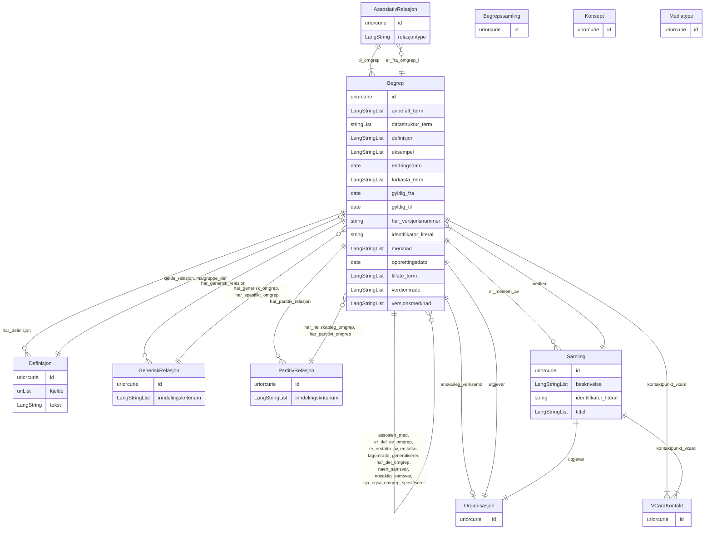

# skos-ap-no

Norsk applikasjonsprofil av SKOS for omgrep (begrep), modellert i LinkML med lenking framfor inlining. Basert på https://informasjonsforvaltning.github.io/skos-ap-no-begrep/

URI: https://data.norge.no/linkml/skos-ap-no

Name: skos-ap-no

## Classes

| Class | Description |
| --- | --- |
| [AssosiativRelasjon](klasser/assosiativrelasjon.md) | Ein assosiativ relasjon mellom to omgrep |
| [Begrep](klasser/begrep.md) | Eit omgrep med definisjon og tilhøyrande metadata (skos:Concept) |
| [Begrepssamling](klasser/begrepssamling.md) | Ei SKOS-omgrepssamling (temavokabular) |
| [Definisjon](klasser/definisjon.md) | Ein definisjon av eit omgrep via eit eige objekt (euvoc:XlNote) |
| [GeneriskRelasjon](klasser/generiskrelasjon.md) | Ein generisk relasjon mellom eit overomgrep og eit underomgrep |
| [Konsept](klasser/konsept.md) | Referanse til eit SKOS-omgrep frå eit kontrollert vokabular |
| [Mediatype](klasser/mediatype.md) | Ein medietype eller filformat (dct:MediaTypeOrExtent) |
| [Organisasjon](klasser/organisasjon.md) | Ein organisasjon som er utgjevar eller ansvarleg for eit omgrep |
| [PartitivRelasjon](klasser/partitivrelasjon.md) | Ein partitiv relasjon mellom eit heilskapleg og eit partitivt omgrep |
| [Samling](klasser/samling.md) | Ei namngitt samling av omgrep (skos:Collection) |
| [VCardKontakt](klasser/vcardkontakt.md) | Kontaktinformasjon (vCard) for omgrepseigaren |

## Slots

| Slot | Description |
| --- | --- |
| [anbefalt_term](klasser/anbefalt_term.md) | Føretrukke term/namn for ressursen (skos:prefLabel) |
| [ansvarleg_verksemd](klasser/ansvarleg_verksemd.md) | Fagleg ansvarleg organisasjon for omgrepet (dct:creator) |
| [assosiert_med](klasser/assosiert_med.md) | Omgrep dette omgrepet er assosiert med (skos:related) |
| [beskrivelse](klasser/beskrivelse.md) | Fritekstbeskrivelse av ressursen (dct:description) |
| [datastruktur_term](klasser/datastruktur_term.md) | Term brukt i datastrukturar (skosno:dataStructureLabel) |
| [definisjon](klasser/definisjon.md) | Direkte definisjon som fritekst (skos:definition) |
| [dekningsomraade](klasser/dekningsomraade.md) | Geografisk dekningsområde (dct:spatial) |
| [eksempel](klasser/eksempel.md) | Eksempel på bruk av omgrepet (skos:example) |
| [endringsdato](klasser/endringsdato.md) | Dato for siste endring av ressursen (dct:modified) |
| [er_del_av_omgrep](klasser/er_del_av_omgrep.md) | Omgrep dette omgrepet er ein del av (xkos:isPartOf) |
| [er_erstatta_av](klasser/er_erstatta_av.md) | Omgrep som erstattar dette omgrepet (dct:isReplacedBy) |
| [er_fra_omgrep_i](klasser/er_fra_omgrep_i.md) | Assosiativ relasjon der dette omgrepet er frå-omgrepet (skosno:isFromConceptI... |
| [er_medlem_av](klasser/er_medlem_av.md) | Samling dette omgrepet er medlem av (uneskos:memberOf) |
| [erstattar](klasser/erstattar.md) | Omgrep dette omgrepet erstattar (dct:replaces) |
| [euvoc_status](klasser/euvoc_status.md) | Status for omgrepet frå eit kontrollert vokabular (euvoc:status) |
| [fagomrade](klasser/fagomrade.md) | Fagområde omgrepet høyrer til (dct:subject) |
| [forkasta_term](klasser/forkasta_term.md) | Tidlegare brukt, no forkasta term (skos:hiddenLabel) |
| [format](klasser/format.md) | Filformat eller medietype (dct:format) |
| [generaliserer](klasser/generaliserer.md) | Omgrep dette omgrepet generaliserer (xkos:generalizes) |
| [gyldig_fra](klasser/gyldig_fra.md) | Dato omgrepet er gyldig frå (euvoc:startDate) |
| [gyldig_til](klasser/gyldig_til.md) | Dato omgrepet er gyldig til (euvoc:endDate) |
| [har_definisjon](klasser/har_definisjon.md) | Definisjon via eige objekt (euvoc:xlDefinition) |
| [har_del_omgrep](klasser/har_del_omgrep.md) | Omgrep som er ein del av dette omgrepet (xkos:hasPart) |
| [har_generisk_omgrep](klasser/har_generisk_omgrep.md) | Overomgrepet i ein generisk relasjon (skosno:hasGenericConcept) |
| [har_generisk_relasjon](klasser/har_generisk_relasjon.md) | Generisk relasjon dette omgrepet er del av (skosno:hasGenericConceptRelation) |
| [har_heilskapleg_omgrep](klasser/har_heilskapleg_omgrep.md) | Heilskapleg omgrep i ein partitiv relasjon (skosno:hasComprehensiveConcept) |
| [har_merknad](klasser/har_merknad.md) | Fritekstmerknad (rdfs:comment) |
| [har_partitiv_relasjon](klasser/har_partitiv_relasjon.md) | Partitiv relasjon dette omgrepet er del av (skosno:hasPartitiveConceptRelatio... |
| [har_partitivt_omgrep](klasser/har_partitivt_omgrep.md) | Delomgrepet i ein partitiv relasjon (skosno:hasPartitiveConcept) |
| [har_referanse](klasser/har_referanse.md) | Referanse til ekstern ressurs (rdfs:seeAlso) |
| [har_spesifikt_omgrep](klasser/har_spesifikt_omgrep.md) | Underomgrepet i ein generisk relasjon (skosno:hasSpecificConcept) |
| [har_versjonsnummer](klasser/har_versjonsnummer.md) | Versjonsnummer for ressursen (owl:versionInfo) |
| [heimeside](klasser/heimeside.md) | Heimeside for ressursen eller organisasjonen (foaf:homepage) |
| [id](klasser/id.md) | URI-identifikator for ressursen |
| [identifikator_literal](klasser/identifikator_literal.md) | Tekstleg identifikator for ressursen (dct:identifier) |
| [inndelingskriterium](klasser/inndelingskriterium.md) | Inndelingskriterium for ein generisk eller partitiv relasjon (dct:description... |
| [kjelde](klasser/kjelde.md) | Kjelde til definisjonen (dct:source) |
| [kjelde_relasjon](klasser/kjelde_relasjon.md) | Omgrep som beskriv forholdet mellom definisjonen og kjelda (skosno:relationsh... |
| [kontaktpunkt_vcard](klasser/kontaktpunkt_vcard.md) | Kontaktpunkt (vCard) for omgrepet eller samlinga (dcat:contactPoint) |
| [malgruppe_def](klasser/malgruppe_def.md) | Målgruppe definisjonen er retta mot (dct:audience) |
| [medlem](klasser/medlem.md) | Omgrep som er medlem av samlinga (skos:member) |
| [merknad](klasser/merknad.md) | Merknad om bruksomfanget for omgrepet (skos:scopeNote) |
| [naert_samsvar](klasser/naert_samsvar.md) | Omgrep med nær, men ikkje nøyaktig same meining (skos:closeMatch) |
| [nokkelord](klasser/nokkelord.md) | Nøkkelord som beskriv ressursen (dcat:keyword) |
| [noyaktig_samsvar](klasser/noyaktig_samsvar.md) | Omgrep med nøyaktig same meining i anna vokabular (skos:exactMatch) |
| [opprettingsdato](klasser/opprettingsdato.md) | Dato omgrepet vart oppretta (dct:created) |
| [relasjontype](klasser/relasjontype.md) | Rolle eller type av den assosiative relasjonen (skosno:relationRole) |
| [sja_ogsa_omgrep](klasser/sja_ogsa_omgrep.md) | Relatert omgrep (rdfs:seeAlso) |
| [spesifiserer](klasser/spesifiserer.md) | Omgrep dette omgrepet spesifiserer (xkos:specializes) |
| [spraak](klasser/spraak.md) | Språk brukt i ressursen (dct:language) |
| [status](klasser/status.md) | Status for ressursen frå eit kontrollert vokabular (adms:status) |
| [tekst](klasser/tekst.md) | Definissjonstekst (rdf:value) |
| [til_omgrep](klasser/til_omgrep.md) | Til-omgrepet i den assosiative relasjonen (skosno:hasToConcept) |
| [tillate_term](klasser/tillate_term.md) | Tillaten alternativ term for omgrepet (skos:altLabel) |
| [tittel](klasser/tittel.md) | Namn/tittel på ressursen (dct:title) |
| [type_concept](klasser/type_concept.md) | Type ressurs frå eit kontrollert vokabular (dct:type) |
| [utgivelsesdato](klasser/utgivelsesdato.md) | Dato ressursen vart første gong publisert (dct:issued) |
| [utgjevar](klasser/utgjevar.md) | Organisasjon ansvarleg for å publisere omgrepet (dct:publisher) |
| [valuta](klasser/valuta.md) | Valuta (cv:currency) |
| [verdiomrade](klasser/verdiomrade.md) | Verdiområde for omgrepet (skosno:valueRange) |
| [versjonsmerknad](klasser/versjonsmerknad.md) | Merknad om endringar i denne versjonen (adms:versionNotes) |

## Enumerations

| Enumeration | Description |
| --- | --- |

## Types

| Type | Description |
| --- | --- |
| [Boolean](klasser/boolean.md) | A binary (true or false) value |
| [Curie](klasser/curie.md) | a compact URI |
| [Date](klasser/date.md) | a date (year, month and day) in an idealized calendar |
| [DateOrDatetime](klasser/dateordatetime.md) | Either a date or a datetime |
| [Datetime](klasser/datetime.md) | The combination of a date and time |
| [Decimal](klasser/decimal.md) | A real number with arbitrary precision that conforms to the xsd:decimal speci... |
| [Double](klasser/double.md) | A real number that conforms to the xsd:double specification |
| [Duration](klasser/duration.md) | ISO 8601-varigheit (xsd:duration), t |
| [Float](klasser/float.md) | A real number that conforms to the xsd:float specification |
| [GYear](klasser/gyear.md) | Gregorisk årstal (xsd:gYear), t |
| [Integer](klasser/integer.md) | An integer |
| [Jsonpath](klasser/jsonpath.md) | A string encoding a JSON Path |
| [Jsonpointer](klasser/jsonpointer.md) | A string encoding a JSON Pointer |
| [LangString](klasser/langstring.md) | Språktagget streng (rdf:langString) |
| [Ncname](klasser/ncname.md) | Prefix part of CURIE |
| [Nodeidentifier](klasser/nodeidentifier.md) | A URI, CURIE or BNODE that represents a node in a model |
| [NonNegativeInteger](klasser/nonnegativeinteger.md) | Ikkje-negativ heltalsverdi (xsd:nonNegativeInteger) |
| [Objectidentifier](klasser/objectidentifier.md) | A URI or CURIE that represents an object in the model |
| [Sparqlpath](klasser/sparqlpath.md) | A string encoding a SPARQL Property Path |
| [Spraak](klasser/spraak.md) | Språk |
| [String](klasser/string.md) | A character string |
| [Time](klasser/time.md) | A time object represents a (local) time of day, independent of any particular... |
| [Uri](klasser/uri.md) | a complete URI |
| [Uriorcurie](klasser/uriorcurie.md) | a URI or a CURIE |

## Subsets

| Subset | Description |
| --- | --- |
| [Anbefalt](klasser/anbefalt.md) | Anbefalte eigenskapar i ein AP-NO-profil |
| [Obligatorisk](klasser/obligatorisk.md) | Obligatoriske eigenskapar i ein AP-NO-profil |
| [Valgfri](klasser/valgfri.md) | Valfrie eigenskapar i ein AP-NO-profil |

## Artifacts

| Artefakt | Fil |
|----------|-----|
| SHACL shapes | [skos-ap-no-shapes.ttl](skos-ap-no-shapes.ttl) |
| JSON-LD kontekst | [skos-ap-no-context.jsonld](skos-ap-no-context.jsonld) |
| JSON Schema | [skos-ap-no-schema.json](skos-ap-no-schema.json) |
| OWL ontologi | [skos-ap-no-ontology.ttl](skos-ap-no-ontology.ttl) |
| RDF/Turtle skjema | [skos-ap-no-schema.ttl](skos-ap-no-schema.ttl) |
| Python-klasser | [skos-ap-no-model.py](skos-ap-no-model.py) |
| ER-diagram (Mermaid) | [skos-ap-no-erdiagram.md](skos-ap-no-erdiagram.md) |
| Eksempeldata (Turtle) | [skos-ap-no-eksempel.ttl](skos-ap-no-eksempel.ttl) |
